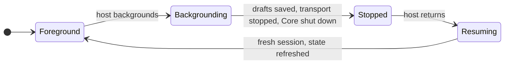

# 1.1 Mobile feasibility and supported profiles

This plan is done. It ran on 2026-09-30 on an iPhone 13 mini (iOS 27.0, 4 GB), the iOS Simulator and the Android emulator (API 37). The results live in `freenet-appkit`:

| Document | Contents |
| --- | --- |
| [Support matrix](https://github.com/glesage/freenet-appkit/blob/main/docs/support-matrix.md) | Routes, targets, Wasm backends, pinned revisions, operations per device, required adapters |
| [Device results](https://github.com/glesage/freenet-appkit/blob/main/docs/device-results.md) | Every measured value, generated from the stored runs |
| [Findings](https://github.com/glesage/freenet-appkit/blob/main/docs/findings.md) | What the runs turned up and which plan acts on each finding |
| [Distribution review](https://github.com/glesage/freenet-appkit/blob/main/docs/distribution-review.md) | The iOS and Android packages against App Store and Google Play policy |

## Repositories

| Repository | Role | Work in this plan |
| --- | --- | --- |
| `freenet-appkit` | Created | iOS and Android WebView demos, [measurement harness](https://github.com/glesage/freenet-appkit/tree/main/harness), support matrix and device results |
| [freenet-core](https://github.com/freenet/freenet-core) | Modified | New `crates/mobile` started from clean main (commit `576f5445`), Pulley backend and iOS Store limits (commit `f5d32b58`) |

## Purpose

Show that River and Atlas run on iOS and Android through an embedded Core node, and measure the workloads that set device limits for later plans.

## Supported profiles

| Profile | Supported |
| --- | --- |
| River and Atlas WebView on iOS | iOS 16 and later, arm64 devices, Pulley, with the iOS Store limits in [Device limits](#device-limits) |
| River and Atlas WebView on Android | Android 9 (API 28) and later, the first level with the node key setting in [Node encryption key in 1.5 Identity, keys and local protection](05-identity.md#node-encryption-key). Release builds run Pulley on arm64-v8a, armeabi-v7a and x86_64 ([Running Wasm in 1.2 Embedded node and mobile SDK](02-sdk.md#running-wasm)) |
| Custom Swift/Kotlin | Put, get, update and subscribe on the same targets. [1.2 Embedded node and mobile SDK](02-sdk.md) adds delegate calls and the per-contract request queue |
| Network | Network mode through the public gateway index or gateway overrides. Phones run as full peers until [1.8 Thin-peer role and cellular data budgets](08-thin-peer.md) lands |

River's and Atlas's web clients use freenet-stdlib 0.8.5 and run against Core 0.2.139 (freenet-stdlib 0.12.1) with no adapter ([protocol compatibility](https://github.com/glesage/freenet-appkit/blob/main/docs/support-matrix.md#protocol-compatibility)). The Atlas demos use Atlas main's web UI.

## Support matrix

Each operation matched the desktop fixtures on every device that ran it: the same bytes, the same typed errors, the same result after a timeout and callbacks in the same order ([operations](https://github.com/glesage/freenet-appkit/blob/main/docs/support-matrix.md#operations)).

| Check | iPhone 13 mini | iOS Simulator | Android emulator |
| --- | --- | --- | --- |
| Wasm backend conformance | 11/11 on Pulley, Cranelift refused | 11/11 on Pulley | 11/11 on Cranelift and on Pulley |
| Rust protocol fixtures | 20/20 | 20/20 | 20/20 |
| Swift/Kotlin route | 10/10 | 10/10 | 10/10 |
| Host-served bundle and JSON bridge | 5/5 | 5/5 | 5/5 |
| River and Atlas in the WebView | Offline and public network | Offline, test gateway and public network | Offline, test gateway and public network |

## Device limits

| Limit | Value | Evidence |
| --- | --- | --- |
| Memory per Wasm instance | 256 MiB. River's and Atlas's contracts use about 1 MiB | [Reservation finding](https://github.com/glesage/freenet-appkit/blob/main/docs/findings.md#the-iphone-refused-cores-wasm-memory-reservations). Core set the 256 MiB default in [#3990](https://github.com/freenet/freenet-core/pull/3990) after the same reservation failure on a 4 GB Raspberry Pi ([#3986](https://github.com/freenet/freenet-core/issues/3986)) |
| iOS Store limits | Replace each Store after 4 instances, 2 executors. With these, the iPhone stored 300 contracts | Same. Core's default replaces each Store after 500 instances ([#5268](https://github.com/freenet/freenet-core/issues/5268)) |
| Local updates | About 21 per second, 45 ms each, on every device | [Local update finding](https://github.com/glesage/freenet-appkit/blob/main/docs/findings.md#a-local-update-takes-about-45-ms) |
| Large records | 32 MiB records cross Core, the bindings and the UI intact. On the iPhone a 32 MiB put takes 292 ms and a get 77 ms | [Large-record copying](https://github.com/glesage/freenet-appkit/blob/main/docs/device-results.md#large-record-copying-split-by-layer) |
| Memory footprint | 24 to 27 MiB on the iPhone and 105 to 122 MiB on the emulator, with River open | [Memory and storage](https://github.com/glesage/freenet-appkit/blob/main/docs/device-results.md#memory-storage-and-address-space). Core tracks memory per hosted contract in [#5647](https://github.com/freenet/freenet-core/issues/5647) and per distinct Wasm module in [#5348](https://github.com/freenet/freenet-core/issues/5348) |
| Storage | Stores 6.1 MiB, unpacked web apps 8.3 MiB and logs 3.2 MiB on the iPhone | Same |
| Package size | iOS 41.8 MiB stripped (16.8 MiB zipped before App Store thinning). Android APK 40.9 MiB for arm64-v8a, 27.7 MiB for armeabi-v7a | [Package size](https://github.com/glesage/freenet-appkit/blob/main/docs/device-results.md#package-size) |
| River download | River's 1.06 MB archive downloads as 1.2 MiB from the public network | [River and Atlas in the WebView](https://github.com/glesage/freenet-appkit/blob/main/docs/device-results.md#river-and-atlas-in-the-webview) |

## Startup and network

| Measurement | iPhone 13 mini | Android emulator |
| --- | --- | --- |
| Process to first frame | 74 ms | 685 ms |
| Node start | 52 ms | 176 ms |
| Stored River shown, offline | 306 ms | 1.22 s |
| River shown after a fresh install, public network | 2.43 s | 2.02 s |
| River shown again after 20 s in another app | 678 ms | 576 ms |
| Full peer on Wi-Fi | 27 peers, about 60 KiB/s each way | 22 peers, about 22 KiB/s each way |
| Idle | Under 1 KiB/s each way | 1.4 KiB/s up and 1.1 KiB/s down, with 1 peer |
| Fresh start on cellular | First peer through the carrier NAT in 5.6 s | Not a real carrier |

These findings pass to later plans:

| Finding | Acts next |
| --- | --- |
| [The node cannot start offline in network mode](https://github.com/glesage/freenet-appkit/blob/main/docs/findings.md#the-node-cannot-start-offline-in-network-mode) | freenet-core, [1.2 Embedded node and mobile SDK](02-sdk.md) |
| [The node does not move to cellular on its own](https://github.com/glesage/freenet-appkit/blob/main/docs/findings.md#the-node-does-not-move-to-cellular-on-its-own) | [1.2 Embedded node and mobile SDK](02-sdk.md) |
| [The peer count stays up during an outage](https://github.com/glesage/freenet-appkit/blob/main/docs/findings.md#the-peer-count-stays-up-during-an-outage) | [1.2 Embedded node and mobile SDK](02-sdk.md) |
| [Callbacks run on the node's own threads](https://github.com/glesage/freenet-appkit/blob/main/docs/findings.md#callbacks-run-on-the-nodes-own-threads) | [1.2 Embedded node and mobile SDK](02-sdk.md) |
| [Phones are full peers on the public network](https://github.com/glesage/freenet-appkit/blob/main/docs/findings.md#phones-are-full-peers-on-the-public-network) | [1.8 Thin-peer role and cellular data budgets](08-thin-peer.md) |
| [Loading cached apps](https://github.com/glesage/freenet-appkit/blob/main/docs/findings.md#smaller-items) first saves about 0.5 s online | [1.3 Single-application host](03-host.md) |

## Foreground lifecycle

The first release runs Core only while the host is in the foreground. On every device, three stop-and-start cycles each gave a fresh session, and the node restarted in 50 ms on the iPhone and 58 ms on the emulator ([startup and lifecycle](https://github.com/glesage/freenet-appkit/blob/main/docs/device-results.md#startup-and-lifecycle)).

## Message alerts

Alerts cover updates that arrive while the host runs in the foreground. The host's setup and settings screens show this scope. On every device the alert tap reached the page, and the banner showed 25 ms after the page raised it on the iPhone and 12 ms on the emulator ([message alerts](https://github.com/glesage/freenet-appkit/blob/main/docs/device-results.md#message-alerts-and-the-bridge)).

| Situation | What happens |
| --- | --- |
| Bob's message arrives while Alice has River open on the members screen | River shows an alert |
| Alice taps the alert | The host refreshes verified "Skate club" state, then opens the conversation |

An alert is a hint to refresh. The screen always shows verified state. Background delivery becomes a product promise once a delivery service, its privacy policy, tested iOS and Android behavior and release approval are all in place.

## Distribution review

The [distribution review](https://github.com/glesage/freenet-appkit/blob/main/docs/distribution-review.md) assessed both packages against App Store and Google Play policy. [1.9 Testing and release](09-testing-and-release.md) takes these results into the store submissions:

| Item | Result |
| --- | --- |
| Interpreter use | Pulley maps no executable memory, which fits both stores |
| Downloaded website content and Wasm | Ship River with pinned website and contract keys |
| Local network | Release builds retry the first LAN send after the iOS local-network prompt and request `ACCESS_LOCAL_NETWORK` on Android |
| User-generated content | River provides reporting, blocking, a filter, terms and a support URL in its own UI |
| Encryption export and data safety | Declare the standard algorithms and the data sent to peers |

## Prototype learnings

The earlier local iOS prototype proved the behaviors below. This plan built them again from a clean Core main and re-tested them on iOS and Android. A community prototype also runs River on Android with an in-process node ([river#319](https://github.com/freenet/river/issues/319), [river#313](https://github.com/freenet/river/pull/313)). It stages fallback gateways for an offline first start and registers a synthetic auth token so River's chat delegate accepts the app's messages.

| Learning | Apply in |
| --- | --- |
| Run Wasm through the Pulley interpreter on iOS and every Android ABI. Run the conformance suite (contract round trips, out-of-bounds traps, backend refusal) on every backend. | [runtime in 1.2 Embedded node and mobile SDK](02-sdk.md#runtime-packaging-and-lifecycle) |
| Own one process-wide async runtime in the mobile crate and build the node inside it. Install no process-global signal or abort handlers. Stop is an explicit call. | [1.2 Embedded node and mobile SDK](02-sdk.md#runtime-packaging-and-lifecycle) |
| Use the node's loopback WebSocket as the client API. At start the node tries the port from its last run, so the web origin and its web storage stay the same, and picks a free loopback port only when that port is taken. The node reports the port it got to the host, and the host passes that port explicitly so a persisted config never replaces it. Stop waits until the port is free again. | [owned API in 1.2 Embedded node and mobile SDK](02-sdk.md#owned-api), [1.3 Single-application host](03-host.md#browser-and-native-hosts) |
| Take data, config and log directories from the host. Keep local-mode and network-mode stores apart and discard a persisted config whose data directory, mode or gateway source differs. | [storage paths in 1.2 Embedded node and mobile SDK](02-sdk.md#runtime-packaging-and-lifecycle) |
| Pass each gateway override to Core's `--gateway` option as `ip:port,hex-public-key`, with an IP address so the override needs no DNS lookup. Fetch the public gateway index when network mode has no overrides. | [1.2 Embedded node and mobile SDK](02-sdk.md) |
| Wait for at least one connected peer before the first network request, then retry reads for a bounded window. | [events in 1.2 Embedded node and mobile SDK](02-sdk.md#owned-api) |
| Keep the WebView bridge to JSON commands and events. The Wasm client opens its own WebSocket to the loopback API. The host serves only a fixed set of bundle files, verified through a per-file SHA-256 manifest that carries a protocol version, and ignores unknown manifest keys. The bridge's message handling lives in `crates/mobile`, so iOS and Android handle every message the same way. | [1.3 Single-application host](03-host.md#browser-and-native-hosts), [archive in 1.4 Application bundles](04-bundles.md#the-archive-and-its-definition) |
| Test concurrent requests through one node actor, a two-peer contract exchange, leak thresholds tuned to measured noise, the update key-learning fallback and binding generation in CI. | [acceptance in 1.2 Embedded node and mobile SDK](02-sdk.md#acceptance) |

## Runs still to do

The harness runs these when the equipment is available ([not run yet](https://github.com/glesage/freenet-appkit/blob/main/docs/findings.md#not-run-yet)):

| Run | Needs |
| --- | --- |
| Every scenario on an Android phone | An Android phone with USB debugging |
| Battery over a long session | An unplugged iPhone and Android phone |
| UDP-filtering network | A network that blocks UDP |
| LAN test gateway on the iPhone | The phone and Mac on one Wi-Fi |
| Cold start after a reboot | A phone reboot before the `startup` run |
| Wasm backend conformance on wasmtime 48 | Core merging the wasmtime 48 update ([#5694](https://github.com/freenet/freenet-core/pull/5694)) |
