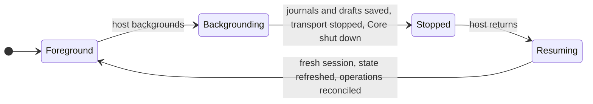

# 1.1 Mobile feasibility and supported profiles

## Repositories

| Repository | Role | Work in this plan |
| --- | --- | --- |
| `freenet-appkit` | Created | iOS and Android WebView demos, measurement harness, support matrix and device results |
| [freenet-core](https://github.com/freenet/freenet-core) | Modified | New `crates/mobile` started from clean main, with Pulley conformance runs on iOS and Android |
| [freenet-stdlib](https://github.com/freenet/freenet-stdlib) | Used | Rust client API transports and the TypeScript SDK as the protocol comparison baseline |
| [freenet-migrate](https://github.com/freenet/freenet-migrate) | Used | Pinned compatible version or tested adapter before measurement |
| [river](https://github.com/freenet/river) | Used | Pinned browser UI and CLI builds for the WebView route |
| [atlas](https://github.com/freenet/atlas) | Used | Browser Wasm client behind the WebView demos |

## Purpose

Establish supported River WebView and custom Swift/Kotlin profiles from pinned builds and reproducible real-device evidence. Measure the workloads that set mobile limits and release budgets.

## Recorded evidence

Source versions, local-build notes and issue states here are recorded planning evidence. This plan rechecks them against pinned revisions and real-device results.

| Evidence | What to verify |
| --- | --- |
| [Rust client API](https://github.com/freenet/freenet-stdlib/blob/main/rust/src/client_api.rs), [River browser](https://github.com/freenet/river/blob/main/ui/Cargo.toml) and [CLI](https://github.com/freenet/river/blob/main/cli/Cargo.toml) dependencies | Rust stdlib has browser and native transports. Exercise their request encodings and errors with shared fixtures. |
| Existing [TypeScript SDK](https://github.com/freenet/freenet-stdlib/tree/main/typescript) | Preserve its supported web path and use it as a protocol comparison baseline. |
| Earlier local iOS prototype (Core `ios` branch) | Build the mobile crate again from a clean Core main with [UniFFI](https://mozilla.github.io/uniffi-rs/latest/) Swift and Kotlin bindings, iOS and Android packaging and equal device coverage. Carry forward the [prototype learnings](#prototype-learnings). |
| Atlas browser client in a WebView | Build fresh iOS and Android WebView demos on Atlas's browser Wasm client for browser-client evidence. Define the WebView host to Wasm client protocol in the new crate from the [prototype learnings](#prototype-learnings). Verify native application behavior separately. |
| Recorded Core stdlib 0.12.0 and [migration library status](https://github.com/freenet/freenet-migrate#status) targeting 0.8.x with unreleased APIs | Pin compatible Core, stdlib, bindings and migration-library versions or a tested adapter before measurement. [Atlas fixtures in 1.8 Reference apps and compatibility fixtures](08-reference-apps.md#atlas-recorded-evidence-and-pinned-identity) record their own compatibility constraints. |

## Prototype learnings

The earlier local iOS prototype proved the behaviors below. The fresh build starts from a clean Core main, applies each one on iOS and Android and re-tests it on real devices.

| Learning | Apply in |
| --- | --- |
| Run Wasm through the Pulley interpreter on JIT-less targets. Run the conformance suite (contract round trips, out-of-bounds traps, backend refusal) on every backend. | [runtime in 1.2 Embedded node and mobile SDK](02-sdk.md#runtime-packaging-and-lifecycle) |
| Own one process-wide async runtime in the mobile crate and build the node inside it. Install no process-global signal or abort handlers. Stop is an explicit call. | [1.2 Embedded node and mobile SDK](02-sdk.md#runtime-packaging-and-lifecycle) |
| Use the node's loopback WebSocket as the client API. Let the node pick a free loopback port at start, report it to the host and pass the resolved port explicitly so a persisted config never replaces it. | [owned API in 1.2 Embedded node and mobile SDK](02-sdk.md#owned-api), [1.3 Single-application host](03-host.md#browser-and-native-hosts) |
| Take data, config and log directories from the host. Keep local-mode and network-mode stores apart and discard a persisted config whose data directory or mode differs. | [storage paths in 1.2 Embedded node and mobile SDK](02-sdk.md#runtime-packaging-and-lifecycle) |
| Pass gateway overrides in Core's `--gateway` JSON shape. Fetch the public gateway index when network mode has no overrides. | [1.2 Embedded node and mobile SDK](02-sdk.md), [1.10 Thin-peer role and cellular data budgets](10-thin-peer.md#scope-and-trust-boundary) |
| Wait for at least one connected peer before the first network request, then retry reads for a bounded window. | [events in 1.2 Embedded node and mobile SDK](02-sdk.md#owned-api), [1.10 Thin-peer role and cellular data budgets](10-thin-peer.md) |
| Keep the WebView bridge to JSON commands and events. The Wasm client opens its own WebSocket to the loopback API. The host serves only a fixed set of bundle files, verified through a per-file SHA-256 manifest that carries a protocol version, and ignores unknown manifest keys. The bridge's message handling lives in `crates/mobile`, so iOS and Android handle every message the same way. | [1.3 Single-application host](03-host.md#browser-and-native-hosts), [archive in 1.4 Application bundles](04-bundles.md#the-archive-and-its-definition) |
| Test concurrent requests through one node actor, a two-peer contract exchange, leak thresholds tuned to measured noise, the update key-learning fallback and binding generation in CI. | [acceptance in 1.2 Embedded node and mobile SDK](02-sdk.md#acceptance), [fixtures in 1.8 Reference apps and compatibility fixtures](08-reference-apps.md#atlas-fixture-scope-and-acceptance) |

## Scope

#### Support matrix

Publish a support matrix for the River WebView route and custom Swift/Kotlin route. Record device models, OS versions, Android ABIs, compiler and dependency revisions, required adapters and unsupported operations.

Run each operation on real iOS and Android devices. Compare each run against the shared protocol fixtures:

- The same canonical bytes as desktop.
- The same result after cancellation.
- The same typed errors.
- Callbacks in the same order.

#### Device measurements

| Measurement | River example |
| --- | --- |
| Cold and warm startup | Alice opens River after a reboot, then again after switching apps |
| Time to show cached data | Time until Alice sees her last "Skate club" messages |
| Package size | Installed size of the iOS and Android demos |
| Memory, CPU and battery | A long session in the "Skate club" conversation |
| Storage | Store size as the room history grows |
| Large-record copying | A large room state crossing Core, the bindings and the UI |
| Subscription throughput | Messages per second Alice's phone handles while subscribed |

Split each cost by layer:

| Layer | Includes |
| --- | --- |
| SDK and bindings | UniFFI calls and copies between Rust and Swift or Kotlin |
| Core execution | Contract and delegate Wasm runs, the store and the network |
| UI | WebView, SwiftUI or Compose rendering |

These measurements set:

- device limits and test durations
- the mobile Wasm limits in [running Wasm in 1.2 Embedded node and mobile SDK](02-sdk.md#running-wasm)
- the workloads for [1.10 Thin-peer role and cellular data budgets](10-thin-peer.md#cellular-budget-contract)

#### Network tests

Run these tests together with 1.10 Thin-peer role and cellular data budgets.

| Test | River example |
| --- | --- |
| Carrier NAT | Alice's phone joins "Skate club" on cellular behind a carrier NAT |
| UDP filtering | Alice's phone joins on a network that filters UDP |
| Wi-Fi/cellular transition | Alice leaves home Wi-Fi mid-conversation |
| Resume | Alice returns to River after time in another app |

Publish upload and download bytes separately for each workload, next to the limit approved for that workload.

#### Foreground lifecycle

The first release runs Core only while the host is in the foreground.

For example, Bob taps Send and switches to his camera before the message reaches the network:

1. River saves the pending send in the journal.
2. The host stops transport work and shuts down Core.
3. Bob returns. The host opens a fresh session and refreshes "Skate club".
4. River reconciles the pending send. It keeps its [operation ID](06-data-and-operations.md#operation-identity-and-journal), so the message posts once.

[1.2 Embedded node and mobile SDK](02-sdk.md#start-stop-and-reconnect) owns start and stop. [1.3 Single-application host](03-host.md#saving-work-and-reopening-an-app) owns saving work and reopening.

#### Message alerts

Alerts cover updates that arrive while the host runs in the foreground. The host's setup and settings screens show this scope.

| Situation | What happens |
| --- | --- |
| Bob's message arrives while Alice has River open on the members screen | River shows an alert |
| Alice taps the alert | The host refreshes verified "Skate club" state, then opens the conversation |

An alert is a hint to refresh. The screen always shows verified state. Background delivery becomes a product promise once a delivery service, its privacy policy, tested iOS and Android behavior and release approval are all in place.

#### Distribution review

Review the complete iOS and Android packages.

| Item | What the review covers |
| --- | --- |
| Downloaded website content | River's web container, fetched after install |
| Contract and delegate Wasm | River's room contract and chat delegate, run on the phone |
| Interpreter use | Pulley on iOS and the chosen backend on each Android ABI |
| Signing | App signing on both platforms |
| Entitlements and permissions | iOS entitlements and Android manifest permissions |
| Lifecycle | The foreground lifecycle and message alerts above |

For each distribution channel, such as the App Store and Google Play, record the policy sources, the review result and any required changes.

## Acceptance

Acceptance requires reproducible device results for both platforms and an explicit supported-profile decision. Compilation establishes build coverage. Device runs establish usable behavior, and [1.9 Developer package and release acceptance](09-release.md) applies the release gates.
