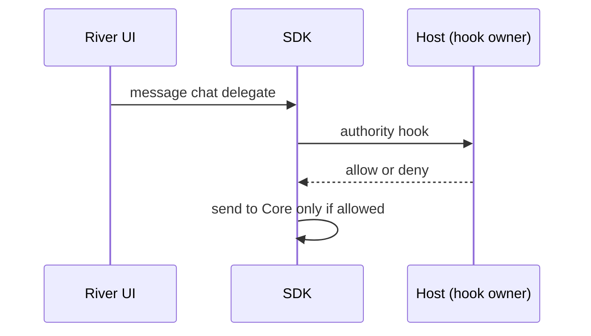
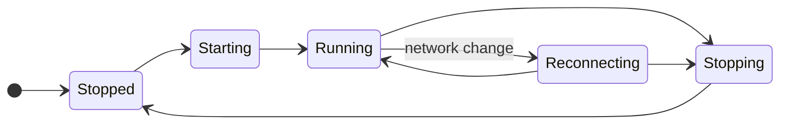

# 1.2 Embedded node and mobile SDK

## Repositories

| Repository | Role | Work in this plan |
| --- | --- | --- |
| [freenet-core](https://github.com/freenet/freenet-core) | Modified | `crates/mobile` delivers the owned API, UniFFI Swift and Kotlin bindings, Keychain and Keystore key backends, per-platform Wasm profiles and build scripts |
| `freenet-appkit` | Modified | Swift package and Kotlin library that wrap the bindings, package the XCFramework and AAR builds |

## Purpose

Manage embedded Core, transport, lifecycle and platform bindings. The app supplies storage paths. Core verifies contract state and executes delegates on the device.

## Owned API

| Operation | Required behavior |
| --- | --- |
| Start, stop and status | Serialize lifecycle transitions and define repeated-call results. |
| Get and put | Validate code, original parameter bytes and returned instance identity. |
| Update by delta or full state | Correlate the result and preserve an uncertain outcome after timeout. |
| Subscribe and release | Return owned handles, count them per session and contract, and close the subscription when the last handle is released. |
| Register, unregister and message delegates | Authenticate the app/user/session and call the [authority hook](#caller-hooks) before each delegate call. |
| Delegate startup and prompts | Call the [policy hook](#caller-hooks) for installation and permission decisions, including approved foreground startup. |
| Permission requests | Pass the app's request for a declared permission to the [policy hook](#caller-hooks) and return granted, denied or unavailable, under the [permission rules in 1.3 Single-application host](03-host.md#asking-for-a-permission). |
| Events and cancellation | Include SDK request and session identity, typed errors and submission uncertainty. Deliver callbacks on the platform's expected executor and reject expired-session callbacks. |

#### Build

Build the mobile crate fresh from Core main. [UniFFI](https://mozilla.github.io/uniffi-rs/latest/) generates the Swift and Kotlin bindings from it. Deliver every operation in the table above, plus build scripts for iOS and Android. Apply the [prototype learnings in 1.1 Mobile feasibility and supported profiles](01-feasibility.md#prototype-learnings).

#### Matching replies to requests

A stdlib reply carries its type and contract key, and nothing more. Alice's room list and her conversation screen might both read the "Skate club" room at the same moment. Both replies then arrive as "read result for Skate club", and the SDK sees them as identical.

So the SDK sends one request of each type per contract at a time and queues the rest. The next reply of that type and contract then belongs to the request in flight.

| Step | "Skate club" read in flight | Queue | What the SDK does |
| --- | --- | --- | --- |
| The room list reads the room | Room list | Empty | Sends the read |
| The conversation screen reads the room | Room list | Conversation | Holds the second read |
| A read result for "Skate club" arrives | Conversation | Empty | Hands the result to the room list and sends the queued read |
| A second read result arrives | None | Empty | Hands the result to the conversation screen |

Requests of other types, or for other contracts, go out in parallel. For example, Alice's new message to "Skate club" goes out as an update while her room list's read of the room is still in flight.

When a request times out, the SDK tells the app its outcome is uncertain, and the request keeps its place in flight. The queue moves on when the late reply arrives or the connection resets, so a late reply never reaches the next request.

#### Ending subscriptions

Subscribe returns a handle. The SDK counts handles per session and contract, and it ends the subscription when the last handle is released.

| Alice's action | Open handles on "Skate club" | What the SDK does |
| --- | --- | --- |
| Opens the room list | 1 | Subscribes |
| Opens the conversation | 2 | Reuses the subscription |
| Closes the conversation | 1 | Keeps the subscription |
| Leaves the room list | 0 | Ends the subscription |

Releasing handles in one session leaves other sessions' subscriptions open.

Freenet stdlib plans a client Unsubscribe request ([stdlib wire-format pins #95](https://github.com/freenet/freenet-stdlib/pull/95)). Until the pinned stdlib has it, a subscription lasts as long as its client connection ([disconnect unsubscribe test #4691](https://github.com/freenet/freenet-core/issues/4691)). So the SDK ends a subscription by closing that connection. Once the pinned stdlib has Unsubscribe, the SDK sends it instead.

#### Caller hooks

The code that embeds the SDK supplies two hooks. The SDK calls each one and acts on its answer.

| Hook | When the SDK calls it | What the SDK does with the answer |
| --- | --- | --- |
| Authority | Before each delegate call | Sends the call only when the hook allows it |
| Policy | Before delegate installation, startup, prompts and permission requests | Applies the installation and permission decision the hook returns |

## Runtime, packaging and lifecycle

#### Packaging

- **iOS**: XCFramework in the Swift package
- **Android**: AAR in the Kotlin library, for each selected processor type (ABI)

#### Running Wasm

The node runs standard contract and delegate Wasm on the phone. iOS uses the [Pulley interpreter](https://docs.wasmtime.dev/examples-pulley.html) because iOS blocks just-in-time compilation. [1.1 Mobile feasibility and supported profiles](01-feasibility.md) picks the Android backend for each ABI. Both platforms run the same test fixtures.

| Limit | Core default | Mobile |
| --- | --- | --- |
| Memory per Wasm instance | 256 MiB | Set from [1.1 Mobile feasibility and supported profiles](01-feasibility.md) measurements |
| State per contract | 50 MiB | Set from [1.1 Mobile feasibility and supported profiles](01-feasibility.md) measurements |
| Compiled module cache | Sized from Linux cgroup limits | Explicit size, because iOS has no cgroups that could cap memory, CPU and disk access |
| Wasm execution time | 5 seconds of wall-clock time | Set from [1.1 Mobile feasibility and supported profiles](01-feasibility.md) measurements |

Set limits for concurrent requests, response size and delegate event frequency from [1.1 Mobile feasibility and supported profiles](01-feasibility.md) measurements. The host enforces them for each app.

Keep compiled modules on the phone and key them by engine version, so an engine update recompiles them. Check that timeouts, memory limits, cancellation and shutdown return the same bytes and errors on phones as on desktop.

#### Storage

The host supplies the storage paths. The SDK keeps those paths through restarts, reinstalls and moves of the app's data folder by iOS or Android. Test fixtures use their own store, separate from the network store.

#### Start, stop and reconnect

One coordinator runs every start, reconnect and stop, so two never overlap.

On stop, the SDK drops callbacks and releases the port, runtime and store locks. Test killing the app in every state.

When Alice's phone moves from Wi-Fi to cellular, the SDK:

1. Rejoins the network.
2. Restores her subscription to "Skate club".
3. Fetches the latest room state.
4. Hands control back to River. Core sends the room's peers any messages Alice sent while offline.

#### Keys

The SDK packages the iOS Keychain and Android Keystore backends, plus any signing adapter. [1.5 Identity, keys and local protection](05-identity.md) owns what they protect and when keys may leave the device. Test these cases on real iOS and Android devices against [Apple key protection](https://developer.apple.com/documentation/security/protecting-keys-with-the-secure-enclave) and [Android Keystore](https://developer.android.com/privacy-and-security/keystore):

- The device is locked.
- A key was invalidated, for example after the user enrolls a new fingerprint or face.
- The device lacks support for the key's algorithm.

## Acceptance

- Concurrent requests stay isolated: two screens reading the same contract each get their own result, and a late reply after a timeout never reaches a queued request. Real delegate calls succeed, cancellation is safe, releasing a local subscription preserves other sessions' handles, and repeated start/stop/reconnect passes on iOS and Android.
- A test policy supplies the authority and policy hooks. Delegate calls run only when the test policy allows them.
- CI runs a two-peer contract exchange, leak checks with thresholds tuned to measured noise, the update key-learning fallback and binding generation.

Regression sources: [response correlation #5048](https://github.com/freenet/freenet-core/issues/5048), [streaming PUT #5458](https://github.com/freenet/freenet-core/issues/5458), [UPDATE lookup #5475](https://github.com/freenet/freenet-core/pull/5475), [timeout uncertainty #3465](https://github.com/freenet/freenet-core/issues/3465), [wake recovery #4951](https://github.com/freenet/freenet-core/issues/4951), [missed updates #4681](https://github.com/freenet/freenet-core/issues/4681) and [delegate unsubscribe #5600](https://github.com/freenet/freenet-core/issues/5600). Record the pinned revision and outcome when testing each behavior.
