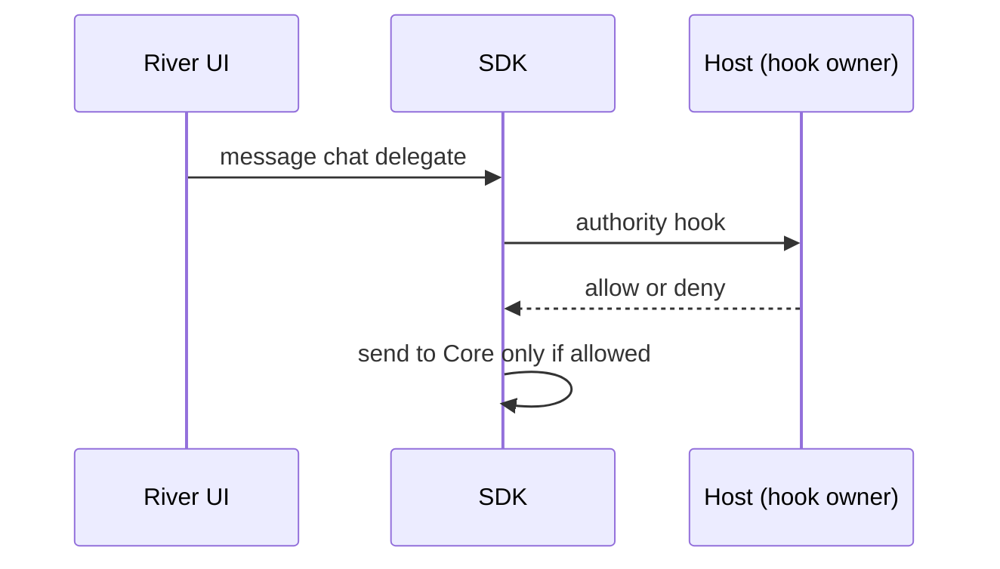
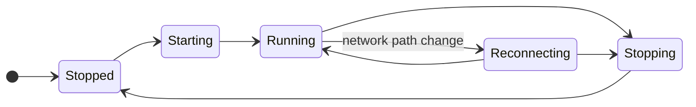
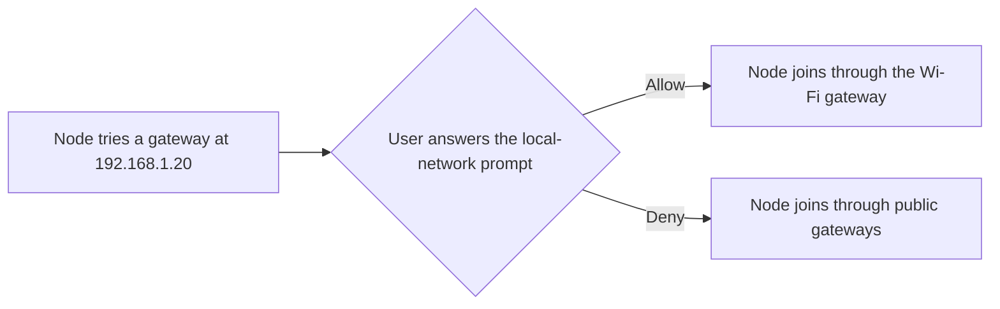

# 1.2 Embedded node and mobile SDK

## Repositories

| Repository | Role | Work in this plan |
| --- | --- | --- |
| [freenet-core](https://github.com/freenet/freenet-core) | Modified | Mobile API, bindings, key stores and Wasm profiles |
| [freenet-appkit](https://github.com/glesage/freenet-appkit) | Modified | Swift and Kotlin SDK packages |
| [freenet-stdlib](https://github.com/freenet/freenet-stdlib) | Used | Client API wire format |

## Purpose

Manage embedded Core, transport, lifecycle and platform bindings. The app supplies storage paths while core verifies contract state and executes delegates on the device.

## Owned API

| Operation | Required behavior |
| --- | --- |
| Start, stop and status | Serialize lifecycle transitions and define repeated-call results. |
| Get and put | Validate code, original parameter bytes and returned instance identity. |
| Update by delta or full state | Correlate the result and preserve an uncertain outcome after timeout. |
| Subscribe and release | Return owned handles, count them per session and contract, and close the subscription when the last handle is released. |
| Register, unregister and message delegates | Authenticate the app/user/session and call the [authority hook](#caller-hooks) before each delegate call. |
| Delegate startup and prompts | Call the [policy hook](#caller-hooks) for installation and permission decisions, including approved foreground startup. |
| Permission requests | Pass the app's request for a declared permission to the [policy hook](#caller-hooks) and return granted, denied or unavailable, under the [permission rules in 1.3 Single-application host](03-host.md#asking-for-a-permission). |
| Events and cancellation | Include SDK request and session identity, [typed errors](#typed-errors) and submission uncertainty. Hand every callback from the node runtime's threads to the platform's expected executor ([callback threads finding](https://github.com/glesage/freenet-appkit/blob/main/docs/findings.md#callbacks-run-on-the-nodes-own-threads)), and reject expired-session callbacks. |

#### Build

Build the mobile crate fresh from Core main. [UniFFI](https://mozilla.github.io/uniffi-rs/latest/) generates the Swift and Kotlin bindings from it. Deliver every operation in the table above, plus build scripts for iOS and Android. Apply the [prototype learnings in 1.1 Mobile feasibility and supported profiles](01-feasibility.md#prototype-learnings).

Core sends telemetry by default ([#2466](https://github.com/freenet/freenet-core/pull/2466)). The SDK sets `telemetry-enabled = false` and keeps `otel-telemetry-enabled` off. Core saves both in `config.toml` ([#5512](https://github.com/freenet/freenet-core/pull/5512)), so the SDK sets them on every start.

#### Matching replies to requests

A stdlib reply carries its type and contract key, and nothing more. Alice's room list and her conversation screen might both read the "Skate club" room at the same moment. Both replies then arrive as "read result for Skate club", and the SDK sees them as identical.

So the SDK sends one request of each type per contract at a time and queues the rest. The next reply of that type and contract then belongs to the request in flight.

| Step | "Skate club" read in flight | Queue | What the SDK does |
| --- | --- | --- | --- |
| The room list reads the room | Room list | Empty | Sends the read |
| The conversation screen reads the room | Room list | Conversation | Holds the second read |
| A read result for "Skate club" arrives | Conversation | Empty | Hands the result to the room list and sends the queued read |
| A second read result arrives | None | Empty | Hands the result to the conversation screen |

Requests of other types, or for other contracts, go out in parallel. For example, Alice's new message to "Skate club" goes out as an update while her room list's read of the room is still in flight.

Core merges byte-identical concurrent updates into one transaction and sends one reply ([stdlib #94](https://github.com/freenet/freenet-stdlib/pull/94)). The queue never has two updates for one contract in flight on a connection, so each update gets its own reply.

When a request times out, the SDK tells the app its outcome is uncertain, and the request keeps its place in flight. Core sends a timeout error after 60 seconds ([#3442](https://github.com/freenet/freenet-core/pull/3442)). The queue moves on when the late reply or Core's timeout error arrives, or when the connection resets, so a late reply never reaches the next request.

A reply can also never arrive, for example when Core drops a result under load ([stdlib #105](https://github.com/freenet/freenet-stdlib/pull/105)). So when neither a reply nor Core's timeout error arrives within a window longer than Core's 60 seconds, the SDK resets the connection. It reports every request in flight on that connection as uncertain and restores the connection's subscriptions.

After a timeout, the SDK cannot tell a late reply from the reply to a retry until replies carry request IDs ([stdlib #106](https://github.com/freenet/freenet-stdlib/issues/106)). Until stdlib carries the ID, the SDK queues a retry behind the timed-out request.

#### Ending subscriptions

Subscribe returns a handle. The SDK counts handles per session and contract, and it ends the subscription when the last handle is released.

| Alice's action | Open handles on "Skate club" | What the SDK does |
| --- | --- | --- |
| Opens the room list | 1 | Subscribes |
| Opens the conversation | 2 | Reuses the subscription |
| Closes the conversation | 1 | Keeps the subscription |
| Leaves the room list | 0 | Ends the subscription |

Releasing handles in one session leaves other sessions' subscriptions open. Core allows 500 subscriptions per client connection and returns a typed error past that ([#5391](https://github.com/freenet/freenet-core/pull/5391)). The SDK subscribes once per contract on each connection, however many handles it holds.

Freenet stdlib plans a client Unsubscribe request ([stdlib wire-format pins #95](https://github.com/freenet/freenet-stdlib/pull/95)). Until the pinned stdlib has it, a subscription lasts as long as its client connection ([disconnect unsubscribe test #4691](https://github.com/freenet/freenet-core/issues/4691)). So the SDK ends a subscription by closing that connection. Once the pinned stdlib has Unsubscribe, the SDK sends it instead.

When the connection closes, Core sends Unsubscribe upstream ([#3143](https://github.com/freenet/freenet-core/pull/3143)). A GET or PUT on the contract in the previous 8 minutes keeps the network subscription alive until that lease ends, so updates can keep reaching the phone for up to 8 minutes ([#4738](https://github.com/freenet/freenet-core/issues/4738)).

#### Typed errors

The SDK returns each Core failure as a typed error that the app can act on.

| Failure | What Core returns | What the SDK returns |
| --- | --- | --- |
| The delegate is not registered | `DelegateError::Missing`, in local and network mode ([#5729](https://github.com/freenet/freenet-core/pull/5729)) | Missing delegate |
| The delegate fails | An error ([#5287](https://github.com/freenet/freenet-core/pull/5287)). One path still returns an empty `DelegateResponse` ([#5590](https://github.com/freenet/freenet-core/issues/5590)) | Delegate failure. After a timeout, an empty reply counts as a possible failure |
| The connection holds 500 subscriptions | A typed error ([#5391](https://github.com/freenet/freenet-core/pull/5391)) | Subscription limit |
| The node lacks a request type, such as Unsubscribe on an older node | An error ([#5392](https://github.com/freenet/freenet-core/pull/5392)) | Unsupported request |
| The contract refuses a PUT | `OperationError` text without the contract key. [#5746](https://github.com/freenet/freenet-core/issues/5746) proposes a typed error | Refused, not to be retried. The SDK maps the typed error once the pinned Core has it |
| An UPDATE reaches a node that lacks the contract | A retry error without the contract key or a request ID ([#5724](https://github.com/freenet/freenet-core/issues/5724)) | Uncertain, for the update in flight on that contract |
| The node has not joined yet | `PeerNotJoined` for UPDATE, PUT and Subscribe ([#2385](https://github.com/freenet/freenet-core/pull/2385)) | Not yet joined. See [Start, stop and reconnect](#start-stop-and-reconnect) |
| Peers require a newer Core than the app ships | The handshake fails with "too old for remote's min_compatible", and Core sets its public version-mismatch flag (`freenet::transport::has_version_mismatch`) | Update the app. The app tells the user to install the new store build |

Desktop Core binaries exit with code 42 to update themselves. The SDK never exits the process.

#### Caller hooks

The code that embeds the SDK supplies two hooks. The SDK calls each one and acts on its answer.

| Hook | When the SDK calls it | What the SDK does with the answer |
| --- | --- | --- |
| Authority | Before each delegate call | Sends the call only when the hook allows it |
| Policy | Before delegate installation, startup, prompts and permission requests | Applies the installation and permission decision the hook returns |

## Runtime, packaging and lifecycle

#### Packaging

| Platform | Package |
| --- | --- |
| iOS | XCFramework in the Swift package |
| Android | AAR in the Kotlin library, for each selected processor type (ABI) |

#### Running Wasm

The node runs standard contract and delegate Wasm on the phone. Release builds for iOS and every Android ABI (arm64-v8a, armeabi-v7a and x86_64) run it through the [Pulley interpreter](https://docs.wasmtime.dev/examples-pulley.html). No release build maps executable memory, so iOS builds fit the App Store rules and Android builds fit Google Play's interpreter exception ([distribution review](https://github.com/glesage/freenet-appkit/blob/main/docs/distribution-review.md)). Both platforms run one backend and the same test fixtures.

wasmtime rates Pulley Tier 2 and the iOS and Android targets Tier 3, with no upstream CI. It does not list 32-bit ARM Android ([wasmtime stability tiers](https://docs.wasmtime.dev/stability-tiers.html)). So the appkit conformance suite on iOS and Android devices is the CI for these targets. It runs again on each wasmtime update, such as wasmtime 48 ([#5694](https://github.com/freenet/freenet-core/pull/5694)).

| Limit | Core default | Mobile |
| --- | --- | --- |
| Memory per Wasm instance | 256 MiB ([#3990](https://github.com/freenet/freenet-core/pull/3990)) | 256 MiB. The contracts measured in [1.1 Mobile feasibility and supported profiles](01-feasibility.md#device-limits) use about 1 MiB. Contracts that need more run on desktop nodes |
| Concurrent Wasm executors | One per CPU core, from 1 to 16 (`FREENET_RUNTIME_POOL_SIZE`) | iOS: 2. Android: Core default |
| Store replacement | After 500 instances, after 4 hours, or when retired instance memory reaches `clamp(RAM / 8 / executors, 4 MiB, 256 MiB)` ([#5324](https://github.com/freenet/freenet-core/pull/5324)) | iOS: after 4 instances. Android: Core default |
| State per contract | 50 MiB | 50 MiB |
| Compiled module cache in memory | `clamp(RAM / 8, 64 MiB, 4 GiB)`, read from physical RAM, which gives a 4 GB phone 512 MiB ([#4452](https://github.com/freenet/freenet-core/pull/4452)) | An explicit size, set with `--module-cache-budget-bytes` |
| Compile cache on disk | `clamp(RAM / 8, 128 MiB, 512 MiB)` in the data folder, within the hosting disk budget ([#5328](https://github.com/freenet/freenet-core/pull/5328)) | Core default, bounded by the hosting disk budget in [Storage](#storage) |
| Wasm execution time | 5 seconds of wall-clock time, including time spent in host calls such as secret reads ([#5593](https://github.com/freenet/freenet-core/pull/5593), [#5594](https://github.com/freenet/freenet-core/issues/5594)) | 5 seconds of wall-clock time |

Each Wasm instance reserves 256 MiB of address space up front and keeps it until its Store is replaced. The iPhone refused the 23rd reservation ([reservation finding](https://github.com/glesage/freenet-appkit/blob/main/docs/findings.md#the-iphone-refused-cores-wasm-memory-reservations)). So iOS runs 2 executors and replaces each Store after 4 instances. Core already looks up the memory address again inside each host function ([#3248](https://github.com/freenet/freenet-core/issues/3248)). Once Core also does it after each contract and delegate call, each instance reserves only the memory it uses, and iOS uses Core's default executors and Store replacement ([memory address recommendation](https://github.com/glesage/freenet-appkit/blob/main/docs/findings.md#recommendation-core-re-reads-the-memory-address-after-each-guest-call)).

The host enforces per-app limits for concurrent requests, response size and delegate event frequency. Each phone applies about 21 local updates per second, 45 ms each, on every device that 1.1 Mobile feasibility and supported profiles measured ([local update finding](https://github.com/glesage/freenet-appkit/blob/main/docs/findings.md#a-local-update-takes-about-45-ms)). A serving peer accepts about 10 UPDATEs per second for one contract from one sender address and silently drops the rest ([#4285](https://github.com/freenet/freenet-core/pull/4285)). The dropped updates reach peers later through Core's state summary comparison. Phones behind one carrier NAT share a sender address, so they share that limit.

Core's on-disk compile cache keys each compiled module by its Wasm bytes and the engine config, so an engine update recompiles it ([#3476](https://github.com/freenet/freenet-core/pull/3476)). The SDK keeps that cache on. Check that timeouts, memory limits, cancellation and shutdown return the same bytes and errors on phones as on desktop.

#### Storage

The host supplies the storage paths. The SDK keeps those paths through restarts, reinstalls and moves of the app's data folder by iOS or Android. Test fixtures use their own store, separate from the network store. Core's sizes come from the RAM and disk of the device it runs on, so the SDK sets each budget explicitly.

| Path or budget | Core default | Mobile |
| --- | --- | --- |
| Data, config and log folders | From the operating system | From the host |
| Unpacked web-app cache | The OS cache folder, or `FREENET_WEBAPP_CACHE_DIR`. On Android this falls back to a temporary folder the app cannot write to ([#2394](https://github.com/freenet/freenet-core/pull/2394)). Every node one user runs shares it ([#5706](https://github.com/freenet/freenet-core/issues/5706)) | A folder in the app's cache directory on iOS and Android, one per store. The OS may clear it, and Core unpacks the web app again from contract state |
| Hosted state (`max-hosting-storage`) | `clamp(RAM / 8, 128 MiB, 1 GiB)` | Set explicitly. The iPhone's stores used 6.1 MiB in [1.1 Mobile feasibility and supported profiles](01-feasibility.md#device-limits) |
| Hosting disk (`hosting-disk-pct`) | 50% of the disk space available to Freenet, up to 32 GiB | Set explicitly. Core's disk count leaves out redb free space and the web-app cache until [#5033](https://github.com/freenet/freenet-core/pull/5033) lands, so the setting leaves room for both |
| Log folder (`FREENET_LOG_DIR_MAX_BYTES`) | 512 MiB ([#5404](https://github.com/freenet/freenet-core/pull/5404)) | Set explicitly. The iPhone wrote 3.2 MiB of logs |
| Secret snapshots (`FREENET_DISABLE_SECRET_SNAPSHOTS`) | Up to about 62 versions and 3 MiB per secret, kept for up to 2 years ([secrets at rest](https://github.com/freenet/freenet-core/blob/main/docs/secrets-at-rest.md)) | Off. Phones have no snapshot restore, and the export in [1.5 Identity, keys and local protection](05-identity.md#app-specific-export-and-import) covers recovery |

#### Start, stop and reconnect

One coordinator runs every start, reconnect and stop, so two never overlap.

On stop, the SDK drops callbacks and releases the port, runtime and store locks ([store lock #4401](https://github.com/freenet/freenet-core/issues/4401)). Test killing the app in every state.

Core leaves process exits to the embedder. A poisoned redb store or a fatal listener exit returns errors and does not end the process ([#4604](https://github.com/freenet/freenet-core/issues/4604)). The coordinator detects both, stops the node and starts it again on the same port.

The SDK watches the phone's network path with `NWPathMonitor` on iOS and `ConnectivityManager` network callbacks on Android. It tells the app whether the phone is online from that path, because Core keeps reporting its peers during an outage ([peer count finding](https://github.com/glesage/freenet-appkit/blob/main/docs/findings.md#the-peer-count-stays-up-during-an-outage)). Core has no connectivity status for clients ([#2967](https://github.com/freenet/freenet-core/issues/2967)).

When Alice's phone moves from Wi-Fi to cellular, the SDK:

1. Restarts the node's transport, because Core keeps its connections on the Wi-Fi addresses ([cellular finding](https://github.com/glesage/freenet-appkit/blob/main/docs/findings.md#the-node-does-not-move-to-cellular-on-its-own)).
2. Rejoins the network.
3. Restores her subscription to "Skate club".
4. Fetches the latest room state.
5. Hands control back to River. Core sends the room's peers any messages Alice sent while offline.

When Alice opens River with no signal, the node starts and River shows her stored "Skate club" messages. This needs a Core change ([offline start finding](https://github.com/glesage/freenet-appkit/blob/main/docs/findings.md#the-node-cannot-start-offline-in-network-mode)):

- Core resolves each gateway hostname once at startup, and a failed lookup stops the start (`NodeConfig::new` in [node.rs](https://github.com/freenet/freenet-core/blob/main/crates/core/src/node.rs)). The [public gateway index](https://github.com/freenet/web/blob/main/hugo-site/static/keys/gateways.toml) lists hostnames, and Core fetches it at every start.
- The Core change resolves each hostname in the join loop, just before the loop tries that gateway, and the loop's backoff retries until the network returns.
- The same change builds the fallback DNS resolver (hickory-resolver) only after an online lookup fails, and Android builds leave out its `system-config` feature.

Until the node first joins, Core answers UPDATE, PUT and Subscribe with `PeerNotJoined` and serves only reads without a subscription from the phone's copy ([#2385](https://github.com/freenet/freenet-core/pull/2385)). This plan needs Core to accept local UPDATE and Subscribe for stored contracts before the first join and send them on join. Until the pinned Core does, the SDK holds Alice's message and her "Skate club" subscription until the first join, and River keeps her draft.

#### Local network access

The node connects to gateways and peers on the phone's Wi-Fi subnet, at addresses such as `192.168.1.20`. iOS and Android ask the user first.

| | iOS | Android |
| --- | --- | --- |
| Declaration | The app's Info.plist has `NSLocalNetworkUsageDescription`, for example "River connects to Freenet peers on your Wi-Fi." The SDK setup steps tell developers to add it | In apps that target API 37 or later, the Kotlin library's manifest declares `ACCESS_LOCAL_NETWORK` and Android merges it into the app's manifest. Apps that target API 36 or lower leave it out |
| Prompt | iOS shows it once, at the node's first connection to an address on the Wi-Fi or Ethernet subnet. Cellular and VPN connections need no prompt | In apps that target API 37 or later, the host asks for `ACCESS_LOCAL_NETWORK` before the node first starts. Users see it as a "Nearby devices" prompt. Android also checks inbound local connections |
| First connection | iOS drops it while the prompt is open. The join loop's backoff sends it again after the user answers | The node starts after the user answers, then connects |

Sources: [TN3179 Understanding local network privacy](https://developer.apple.com/documentation/technotes/tn3179-understanding-local-network-privacy) and [Android local network permission](https://developer.android.com/privacy-and-security/local-network-permission).

#### Keys

The SDK packages the iOS Keychain and Android Keystore backends, plus any signing adapter. [1.5 Identity, keys and local protection](05-identity.md#node-encryption-key) owns what they protect, the key settings for each Android version and when keys may leave the device. Test these cases on real iOS and Android devices against [Apple Keychain item accessibility](https://developer.apple.com/documentation/security/restricting-keychain-item-accessibility), [Android Keystore](https://developer.android.com/privacy-and-security/keystore) and [`setUnlockedDeviceRequired`](https://developer.android.com/reference/android/security/keystore/KeyGenParameterSpec.Builder#setUnlockedDeviceRequired(boolean)):

- The device is locked.
- A key was invalidated, for example after the user enrolls a new fingerprint or face.
- The device lacks support for the key's algorithm.
- The user has no lock screen, or removes it, on Android 9 to 11, Android 12 to 14 and Android 15 or later, and on iOS.

## Acceptance

- The node starts in Airplane Mode on iOS and Android, River shows stored rooms, and the node joins the network once the phone is back online.
- On a real iPhone and a real Android phone, Alice turns off Wi-Fi while "Skate club" is open. The node rejoins on cellular, and Bob's next message reaches her within 30 seconds.
- Concurrent requests stay isolated: two screens reading the same contract each get their own result, and a late reply after a timeout never reaches a queued request. A request that never gets a reply ends as uncertain when the SDK resets the connection. Real delegate calls succeed, cancellation is safe, releasing a local subscription preserves other sessions' handles, and repeated start/stop/reconnect passes on iOS and Android.
- An iPhone and an Android phone share a Wi-Fi network with a gateway on the Wi-Fi subnet. If the user allows the local-network prompt, the node joins through that gateway. If the user denies it, the node joins through public gateways. Run this on real devices, where iOS shows the prompt. On Android, run it with a build that targets API 37 or later.
- On an iPhone and an Android phone, 300 stored contracts and 200 updates to one contract pass with the mobile limits in [Running Wasm](#running-wasm).
- A slow Swift listener on iOS and a slow Kotlin listener on Android delay neither other notifications nor request replies.
- On an iPhone and an Android phone, measure River's contract and delegate run times under Pulley, because the emulator's compute case ran 3 to 16 times slower under Pulley than under Cranelift. River's largest room state stays under 50 MiB, and its slowest delegate call finishes within 5 seconds, counting its secret reads and other host calls.
- On iOS and Android, fixtures produce each failure in [Typed errors](#typed-errors), and the SDK returns the matching error. A test peer that requires a newer Core gives "update the app", and the app process keeps running.
- On iOS and Android, a fixture poisons the redb store, and the coordinator restarts the node on the same port.
- A test policy supplies the authority and policy hooks. Delegate calls run only when the test policy allows them.
- CI runs a two-peer contract exchange, leak checks with thresholds tuned to measured noise, the update key-learning fallback and binding generation.

Regression sources: [response correlation #5048](https://github.com/freenet/freenet-core/issues/5048), [streaming PUT #5458](https://github.com/freenet/freenet-core/issues/5458), [UPDATE lookup #5475](https://github.com/freenet/freenet-core/pull/5475), [timeout uncertainty #3465](https://github.com/freenet/freenet-core/issues/3465), [wake recovery #4951](https://github.com/freenet/freenet-core/issues/4951), [missed updates #4681](https://github.com/freenet/freenet-core/issues/4681) and [uncorrelated UPDATE retry #5724](https://github.com/freenet/freenet-core/issues/5724). Record the pinned revision and outcome when testing each behavior.
