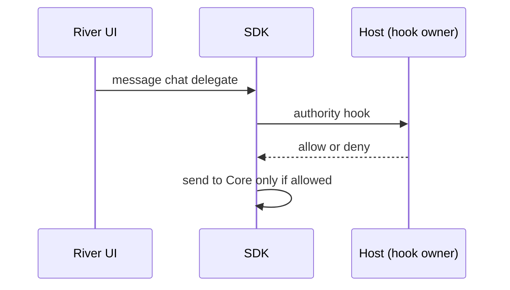
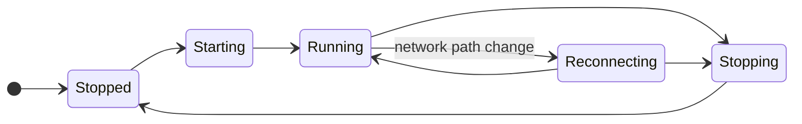
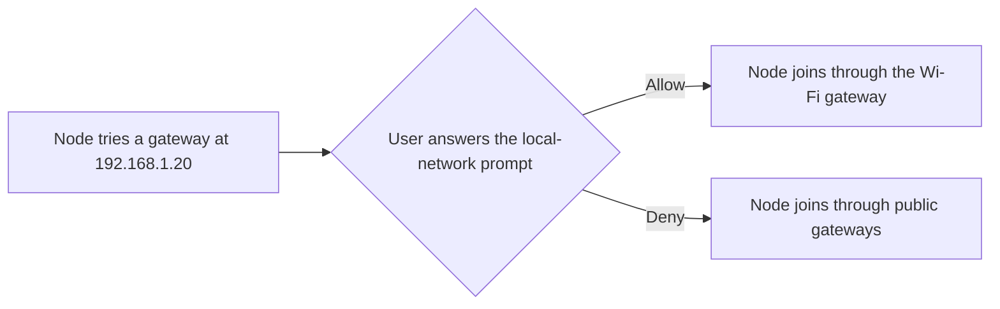

# 1.2 Embedded node and mobile SDK

## Repositories

| Repository | Role | Work in this plan |
| --- | --- | --- |
| [freenet-core](https://github.com/freenet/freenet-core) | Modified | `crates/mobile` delivers the owned API, UniFFI Swift and Kotlin bindings, Keychain and Keystore key backends, per-platform Wasm profiles and build scripts. Core resolves gateway hostnames in its join loop, so the node starts offline. Core looks up each Wasm instance's memory address again after every contract and delegate call, so each instance reserves only the memory it uses |
| `freenet-appkit` | Modified | Swift package and Kotlin library that wrap the bindings, package the XCFramework and AAR builds. The Kotlin library's manifest declares `ACCESS_LOCAL_NETWORK` |

## Purpose

Manage embedded Core, transport, lifecycle and platform bindings. The app supplies storage paths. Core verifies contract state and executes delegates on the device.

## Owned API

| Operation | Required behavior |
| --- | --- |
| Start, stop and status | Serialize lifecycle transitions and define repeated-call results. |
| Get and put | Validate code, original parameter bytes and returned instance identity. |
| Update by delta or full state | Correlate the result and preserve an uncertain outcome after timeout. |
| Subscribe and release | Return owned handles, count them per session and contract, and close the subscription when the last handle is released. |
| Register, unregister and message delegates | Authenticate the app/user/session and call the [authority hook](#caller-hooks) before each delegate call. |
| Delegate startup and prompts | Call the [policy hook](#caller-hooks) for installation and permission decisions, including approved foreground startup. |
| Permission requests | Pass the app's request for a declared permission to the [policy hook](#caller-hooks) and return granted, denied or unavailable, under the [permission rules in 1.3 Single-application host](03-host.md#asking-for-a-permission). |
| Events and cancellation | Include SDK request and session identity, typed errors and submission uncertainty. Hand every callback from the node runtime's threads to the platform's expected executor ([callback threads finding](https://github.com/glesage/freenet-appkit/blob/main/docs/findings.md#callbacks-run-on-the-nodes-own-threads)), and reject expired-session callbacks. |

#### Build

Build the mobile crate fresh from Core main. [UniFFI](https://mozilla.github.io/uniffi-rs/latest/) generates the Swift and Kotlin bindings from it. Deliver every operation in the table above, plus build scripts for iOS and Android. Turn off Core's telemetry, which Core sends by default. Apply the [prototype learnings in 1.1 Mobile feasibility and supported profiles](01-feasibility.md#prototype-learnings).

#### Matching replies to requests

A stdlib reply carries its type and contract key, and nothing more. Alice's room list and her conversation screen might both read the "Skate club" room at the same moment. Both replies then arrive as "read result for Skate club", and the SDK sees them as identical.

So the SDK sends one request of each type per contract at a time and queues the rest. The next reply of that type and contract then belongs to the request in flight.

| Step | "Skate club" read in flight | Queue | What the SDK does |
| --- | --- | --- | --- |
| The room list reads the room | Room list | Empty | Sends the read |
| The conversation screen reads the room | Room list | Conversation | Holds the second read |
| A read result for "Skate club" arrives | Conversation | Empty | Hands the result to the room list and sends the queued read |
| A second read result arrives | None | Empty | Hands the result to the conversation screen |

Requests of other types, or for other contracts, go out in parallel. For example, Alice's new message to "Skate club" goes out as an update while her room list's read of the room is still in flight.

When a request times out, the SDK tells the app its outcome is uncertain, and the request keeps its place in flight. The queue moves on when the late reply arrives or the connection resets, so a late reply never reaches the next request.

#### Ending subscriptions

Subscribe returns a handle. The SDK counts handles per session and contract, and it ends the subscription when the last handle is released.

| Alice's action | Open handles on "Skate club" | What the SDK does |
| --- | --- | --- |
| Opens the room list | 1 | Subscribes |
| Opens the conversation | 2 | Reuses the subscription |
| Closes the conversation | 1 | Keeps the subscription |
| Leaves the room list | 0 | Ends the subscription |

Releasing handles in one session leaves other sessions' subscriptions open.

Freenet stdlib plans a client Unsubscribe request ([stdlib wire-format pins #95](https://github.com/freenet/freenet-stdlib/pull/95)). Until the pinned stdlib has it, a subscription lasts as long as its client connection ([disconnect unsubscribe test #4691](https://github.com/freenet/freenet-core/issues/4691)). So the SDK ends a subscription by closing that connection. Once the pinned stdlib has Unsubscribe, the SDK sends it instead.

#### Caller hooks

The code that embeds the SDK supplies two hooks. The SDK calls each one and acts on its answer.

| Hook | When the SDK calls it | What the SDK does with the answer |
| --- | --- | --- |
| Authority | Before each delegate call | Sends the call only when the hook allows it |
| Policy | Before delegate installation, startup, prompts and permission requests | Applies the installation and permission decision the hook returns |

## Runtime, packaging and lifecycle

#### Packaging

- **iOS**: XCFramework in the Swift package
- **Android**: AAR in the Kotlin library, for each selected processor type (ABI)

#### Running Wasm

The node runs standard contract and delegate Wasm on the phone. Release builds for iOS and every Android ABI (arm64-v8a, armeabi-v7a and x86_64) run it through the [Pulley interpreter](https://docs.wasmtime.dev/examples-pulley.html). No release build maps executable memory, so iOS builds fit the App Store rules and Android builds fit Google Play's interpreter exception ([distribution review](https://github.com/glesage/freenet-appkit/blob/main/docs/distribution-review.md)). Both platforms run one backend and the same test fixtures.

| Limit | Core default | Mobile |
| --- | --- | --- |
| Memory per Wasm instance | 256 MiB | 256 MiB. The contracts measured in [1.1 Mobile feasibility and supported profiles](01-feasibility.md#device-limits) use about 1 MiB. Contracts that need more run on desktop nodes |
| State per contract | 50 MiB | 50 MiB |
| Compiled module cache | Sized from Linux cgroup limits | Explicit size, because iOS has no cgroups that could cap memory, CPU and disk access |
| Wasm execution time | 5 seconds of wall-clock time | 5 seconds of wall-clock time |

Each Wasm instance reserves address space for the memory it uses and grows up to its memory limit, so iOS and Android replace Stores on Core's default schedule ([memory reservation findings](https://github.com/glesage/freenet-appkit/blob/main/docs/findings.md#recommendation-core-re-reads-the-memory-address-after-each-guest-call) from 1.1 Mobile feasibility and supported profiles).

The host enforces per-app limits for concurrent requests, response size and delegate event frequency. The limits leave room for one writer's full rate: about 21 local updates per second, 45 ms each, on every device that 1.1 Mobile feasibility and supported profiles measured ([local update finding](https://github.com/glesage/freenet-appkit/blob/main/docs/findings.md#a-local-update-takes-about-45-ms)).

Keep compiled modules on the phone and key them by engine version, so an engine update recompiles them. Check that timeouts, memory limits, cancellation and shutdown return the same bytes and errors on phones as on desktop.

#### Storage

The host supplies the storage paths. The SDK keeps those paths through restarts, reinstalls and moves of the app's data folder by iOS or Android. Test fixtures use their own store, separate from the network store.

#### Start, stop and reconnect

One coordinator runs every start, reconnect and stop, so two never overlap.

On stop, the SDK drops callbacks and releases the port, runtime and store locks. Test killing the app in every state.

The SDK watches the phone's network path with `NWPathMonitor` on iOS and `ConnectivityManager` network callbacks on Android. It tells the app whether the phone is online from that path, because Core keeps reporting its peers during an outage ([peer count finding](https://github.com/glesage/freenet-appkit/blob/main/docs/findings.md#the-peer-count-stays-up-during-an-outage)).

When Alice's phone moves from Wi-Fi to cellular, the SDK:

1. Restarts the node's transport, because Core keeps its connections on the Wi-Fi addresses ([cellular finding](https://github.com/glesage/freenet-appkit/blob/main/docs/findings.md#the-node-does-not-move-to-cellular-on-its-own)).
2. Rejoins the network.
3. Restores her subscription to "Skate club".
4. Fetches the latest room state.
5. Hands control back to River. Core sends the room's peers any messages Alice sent while offline.

When Alice opens River with no signal, the node starts and River shows her stored "Skate club" messages. Core resolves each gateway hostname in its join loop, just before it tries that gateway ([offline start finding in 1.1 Mobile feasibility and supported profiles](https://github.com/glesage/freenet-appkit/blob/main/docs/findings.md#the-node-cannot-start-offline-in-network-mode)), and the loop's backoff retries until the network returns. Core builds its fallback DNS resolver (hickory-resolver) only after an online lookup fails, and Android builds leave out its `system-config` feature.

#### Local network access

The node connects to gateways and peers on the phone's Wi-Fi, at private addresses such as `192.168.1.20`. iOS and Android ask the user first.

| | iOS | Android |
| --- | --- | --- |
| Declaration | The app's Info.plist has `NSLocalNetworkUsageDescription`, for example "River connects to Freenet peers on your Wi-Fi." The SDK setup steps tell developers to add it | The Kotlin library's manifest declares `ACCESS_LOCAL_NETWORK`. Android merges it into the app's manifest |
| Prompt | iOS shows it once, at the node's first connection to a private address | The host asks for `ACCESS_LOCAL_NETWORK` before the node first starts, in apps that target API 37 or later |
| First connection | iOS drops it while the prompt is open. The join loop's backoff sends it again after the user answers | The node starts after the user answers, then connects |

Sources: [TN3179 Understanding local network privacy](https://developer.apple.com/documentation/technotes/tn3179-understanding-local-network-privacy) and [Android local network permission](https://developer.android.com/privacy-and-security/local-network-permission).

#### Keys

The SDK packages the iOS Keychain and Android Keystore backends, plus any signing adapter. [1.5 Identity, keys and local protection](05-identity.md) owns what they protect and when keys may leave the device. Test these cases on real iOS and Android devices against [Apple key protection](https://developer.apple.com/documentation/security/protecting-keys-with-the-secure-enclave) and [Android Keystore](https://developer.android.com/privacy-and-security/keystore):

- The device is locked.
- A key was invalidated, for example after the user enrolls a new fingerprint or face.
- The device lacks support for the key's algorithm.

## Acceptance

- The node starts in Airplane Mode on iOS and Android, River shows stored rooms, and the node joins the network once the phone is back online.
- On a real iPhone and a real Android phone, Alice turns off Wi-Fi while "Skate club" is open. The node rejoins on cellular, and Bob's next message reaches her within 30 seconds.
- Concurrent requests stay isolated: two screens reading the same contract each get their own result, and a late reply after a timeout never reaches a queued request. Real delegate calls succeed, cancellation is safe, releasing a local subscription preserves other sessions' handles, and repeated start/stop/reconnect passes on iOS and Android.
- An iPhone and an Android phone share a Wi-Fi network with a gateway at a private address. If the user allows the local-network prompt, the node joins through that gateway. If the user denies it, the node joins through public gateways. Run this on real devices, where iOS shows the prompt.
- On an iPhone and an Android phone, 300 stored contracts and 200 updates to one contract pass with Core's default Store replacement.
- A slow Swift listener on iOS and a slow Kotlin listener on Android delay neither other notifications nor request replies.
- On an iPhone and an Android phone, measure River's contract and delegate run times under Pulley, because the emulator's compute case ran 3 to 16 times slower under Pulley than under Cranelift. River's largest room state stays under 50 MiB, and its slowest delegate call finishes within 5 seconds.
- A test policy supplies the authority and policy hooks. Delegate calls run only when the test policy allows them.
- CI runs a two-peer contract exchange, leak checks with thresholds tuned to measured noise, the update key-learning fallback and binding generation.

Regression sources: [response correlation #5048](https://github.com/freenet/freenet-core/issues/5048), [streaming PUT #5458](https://github.com/freenet/freenet-core/issues/5458), [UPDATE lookup #5475](https://github.com/freenet/freenet-core/pull/5475), [timeout uncertainty #3465](https://github.com/freenet/freenet-core/issues/3465), [wake recovery #4951](https://github.com/freenet/freenet-core/issues/4951), [missed updates #4681](https://github.com/freenet/freenet-core/issues/4681) and [delegate unsubscribe #5600](https://github.com/freenet/freenet-core/issues/5600). Record the pinned revision and outcome when testing each behavior.
