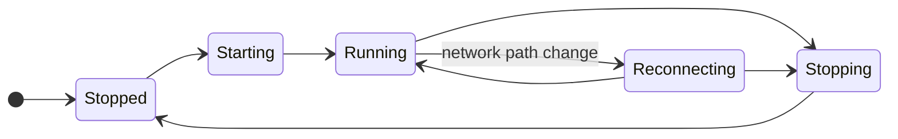
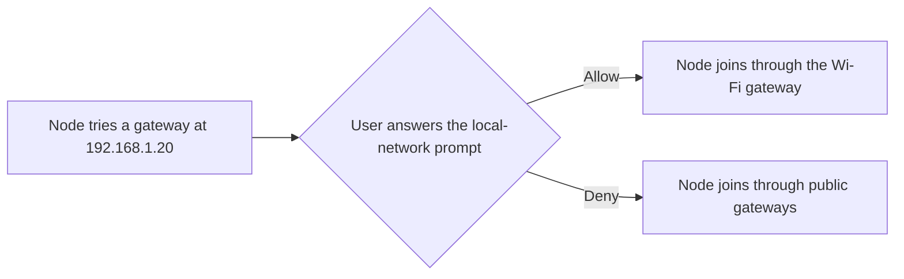

# 1.2 Embedded node and mobile SDK

## Repositories

| Repository | Role | Work in this plan |
| --- | --- | --- |
| [freenet-core](https://github.com/freenet/freenet-core) | Modified | Mobile API, bindings, key stores and Wasm profiles |
| [freenet-appkit](https://github.com/glesage/freenet-appkit) | Modified | Swift and Kotlin SDK packages |
| [freenet-stdlib](https://github.com/freenet/freenet-stdlib) | Modified | Public browser delegate calls, request serialization and reply-correlation fixes demonstrated by mobile fixtures |

## Purpose

Start and stop embedded Core, manage its connections and expose its operations to Swift on iOS and Kotlin on Android. Each application installation owns one embedded node and supplies its storage paths. River uses its existing browser client in an AppKit WebView; EVY uses the Swift and Kotlin APIs for its native SDUI readers. Core verifies contract state and runs the application's delegates on the device.

## What to build

Integrate the [mobile prototype in the Core fork](https://github.com/glesage/freenet-core/tree/571ad1acba9e6f6bddc71156d7d2791fc9a1bf65/crates/mobile) into upstream Core as `crates/mobile`. This gives iOS and Android one maintained interface for node lifecycle and contract operations. Core maintainers approve the embedding API and upstream scope before its feature PR. Record the decision, integrated implementation commit and device fixtures under the [decision gates in README.md](../README.md#decision-gates). Swift and Kotlin packages expose the selected implementation to iOS and Android. [1.3 Single-application host](03-host.md#freenet-issues-being-worked-on-that-are-required) records caller/permission release dependencies.

Classify operations against the [sources in README.md](../README.md#sources). **Existing** identifies a supplied operation. **Extension** adds an interface, platform backend or behavior to an existing primitive. **New Core capability** adds a coordinated runtime operation. **New host/application workflow** adds policy and coordination owned by the embedder or data layer.

| Operations needed | Existing Freenet support | New concept for Freenet? | Required behavior |
| --- | --- | --- | --- |
| Start, stop and status | Core runtime and mobile prototype bindings | Extension: mobile lifecycle | Serialize lifecycle transitions for the application's node, define repeated-call results and integrate the prototype upstream. |
| Get and put | Core/stdlib contract operations | Existing | Validate code, original parameter bytes and returned instance identity. |
| Update by delta or full state | Both input forms in stdlib | Existing | Match the result to its request and preserve an uncertain outcome after submission timeout. Peer-to-peer delta work follows [1.11 Cellular data and resource budgets](11-cellular-data-and-resource-budgets.md#client-update-deltas). |
| Subscribe and connection cleanup | Core/stdlib subscriptions, notifications and disconnect | Existing | Deliver updates to the application's data layer; restore its bounded contract set after reconnect using [Ending subscriptions](#ending-subscriptions). |
| Application demand policy | Contract subscriptions and cached state | New application workflow | Keep one demand entry per contract, retain pending-operation dependencies and prioritize work under [Application demand policy](#application-demand-policy). |
| Register, unregister and message delegates | Core/stdlib delegate request types | Existing | Expose browser and native calls, authenticate the owning application and check its permitted component identities and current session. |
| Delegate startup and prompts | Core lifecycle manifests, Background grants and user-input messages | Extension: native host integration | Route installation, startup and permission decisions through trusted host UI. |
| Application-driven delegate migration | freenet-migrate's Rust runner and application adapters | Extension: mobile interface to an existing library | Expose the runner and adapters to Swift and Kotlin under [1.7 Upgrades and migration](07-migration.md#mobile-migration-interface). Verify successor records before normal calls resume. |
| Stage and activate a restore | Secret import and per-secret snapshot restore | New Core capability: complete-generation activation | Expose isolated staging, migration, atomic activation and crash recovery under [1.10 Backup and restore](10-backup-and-restore.md#staged-restore-transaction). Recover one complete application generation before opening a session. |
| Capture and seal an application export | Encrypted FNSX secret export | New Core capability: application snapshot and codec | Capture the [application data inventory in 1.5 Identity, keys and local protection](05-identity.md#application-data-inventory), including delegate artifacts and host records. Expose the barrier, cancellation and versioned sealing under [1.10 Backup and restore](10-backup-and-restore.md#export). |
| Forget | Delegate/storage cleanup and key-backend deletion | New host workflow: recoverable installation cleanup | Fence work, stop the node, delete application records and keys, verify deletion and resume interrupted cleanup under [1.5 Identity, keys and local protection](05-identity.md#forget). |
| Permission requests | Core capability grants and prompts | New host policy: application device consent | Combine stored application decisions with OS permission status and return granted, denied or unavailable under [1.3 Single-application host](03-host.md#asking-for-a-permission). |
| Lock and unlock | Encrypted secret storage and key loading | New Core capability: secret-store lock lifecycle | Expose `SecretsStore` lock/unlock, fence private work, wipe controlled keys/buffers and open fresh sessions under [1.5 Identity, keys and local protection](05-identity.md#locking-and-unlocking). |
| Node key backends | Core's key-backend interface | Extension: iOS Keychain and Android Keystore | Package and test both backends and their platform settings under [Keys](#keys) and [1.5 Identity, keys and local protection](05-identity.md#node-encryption-key). |
| Read traffic counters | Core's cumulative send and authenticated-receive counters | Extension: raw receive measurement and mobile accounting | Expose counters, measurement layers, path/generation metadata and durable allowance accounting under [Traffic-counter interface](#traffic-counter-interface). |
| Events and cancellation | Core replies, notifications and error types | Extension: SDK request/session lifecycle | Identify the request and current connection/session generation, return [typed errors](#typed-errors), preserve submission uncertainty and dispatch callbacks to the platform executor ([callback finding](https://github.com/glesage/freenet-appkit/blob/1988c5cbdfc5c1f88065382de2a4f86093948b6e/docs/findings.md#callbacks-run-on-the-nodes-own-threads)). |

Existing primitives are defined by the pinned [stdlib client API](https://github.com/freenet/freenet-stdlib/blob/fca0848b78b12942f77422309bb07f76108940d6/rust/src/client_api/client_events.rs), [Core delegate capabilities](https://github.com/freenet/freenet-core/blob/e7d0b06c9326f377d250bf8344baaac2ba2658c6/crates/core/src/contract/delegate_capabilities.rs), [Core secret export/import](https://github.com/freenet/freenet-core/blob/e7d0b06c9326f377d250bf8344baaac2ba2658c6/crates/core/src/wasm_runtime/secret_export.rs) and [freenet-migrate](https://github.com/freenet/freenet-migrate/blob/74aed27eaec8a4347b47fa2665ea511d2fd14175/freenet-migrate/src/lib.rs). Application recovery extends those primitives with the `application-backup/1` codec, executable-inclusive snapshots and a durable activation record. Implement the complete-generation transaction around Core's per-entry import writes.

[UniFFI](https://mozilla.github.io/uniffi-rs/latest/) generates Swift and Kotlin bindings. Include build scripts for iOS and Android.

Set `telemetry-enabled = false` and keep `otel-telemetry-enabled` off on every start. Core persists both settings in `config.toml` ([#2466](https://github.com/freenet/freenet-core/pull/2466), [#5512](https://github.com/freenet/freenet-core/pull/5512)).

### Application connections

Freenet Core and stdlib maintainers agree the public browser delegate methods and transport changes before their feature PRs. River needs these methods to call its chat delegate through the authenticated browser connection. Each demonstrated reply-routing bug carries its regression fixture; parallel request support is enabled after the request-ID checks below pass.

River uses its browser WebSocket client and Core's authenticated shell route. EVY's native readers use the SDK connection. Each transport adapter owns its request queue, reply matching and connection generation. The host owns the application's session generation and permitted components, as [1.3 Single-application host](03-host.md#trusted-calls) defines.

Use Core and stdlib's client APIs. A transport fix is required when a fixture demonstrates incorrect reply ownership, admission or private-event delivery. Record that fix and its regression in the owning upstream issue. Lock, Forget, restore and reconnect replace the relevant session or connection generation and reject earlier callbacks.

The pinned [TypeScript client](https://github.com/freenet/freenet-stdlib/blob/fca0848b78b12942f77422309bb07f76108940d6/typescript/src/websocket-interface.ts) exposes contract methods and delegate message types. Add public register, unregister and application-message methods. Route every operation through the browser adapter's submission queue and match delegate replies and prompts to their authorized caller. Its contract reply matching uses the contract key; apply [Matching replies to requests](#matching-replies-to-requests) before dispatch. Record the adapter implementation commit and browser fixtures for queued calls, keyless errors, unsolicited events, cancellation and reset. Run the corresponding Swift and Kotlin fixtures on iOS and Android.

### Matching replies to requests

Assign a local request ID and retain the submitted contract/delegate key, expected reply type and connection generation. Some Core errors carry neither a request ID nor a structured contract key ([#5724](https://github.com/freenet/freenet-core/issues/5724)). Allow one request awaiting a reply per connection until the pinned API passes complete request-ID checks. Queue subsequent requests across contracts and request types. An UPDATE to "Skate club" waits while a PUT to another room awaits its reply.

| Event | Transport adapter behavior |
| --- | --- |
| Request reply | Match the sole submitted request and check its returned type and key. A terminal reply releases the slot. |
| Subscription update or unsolicited delegate event | Route to the application's authorized data/event handler while the request slot stays occupied. |
| Cancellation | Remove queued work before submission. For submitted work, stop its callback and retain the slot until a terminal reply or reset. |
| Timeout | Report uncertainty for submitted work and retain the slot. A retry waits for settlement or reset. |
| Connection reset | Report submitted work as uncertain, reject the earlier generation and restore the application's required subscriptions through the new queue. Queued work remains unsubmitted. |
| Unclassifiable reply | Report uncertainty and reset before sending another request. |

Core's request timeout is 60 seconds ([#3442](https://github.com/freenet/freenet-core/pull/3442)). Use a bounded reply window longer than that, then reset if settlement is still missing. Test dropped replies under load ([stdlib #105](https://github.com/freenet/freenet-stdlib/pull/105)).

Enable parallel requests only after browser and native fixtures verify client request IDs in every enabled success and error path ([stdlib #106](https://github.com/freenet/freenet-stdlib/issues/106)). Keep subscription updates flowing in both modes.

### Ending subscriptions

The application's data layer subscribes once to each needed contract on its connection. River's room state feeds its room list and conversation. EVY's data store feeds Home and Marketplace views of the same purchase. View navigation changes which cached data is displayed; the application owns the subscription lifetime.

Bound the required contract set by the application's storage and cellular budgets. Core allows 500 subscriptions per client connection ([#5391](https://github.com/freenet/freenet-core/pull/5391)).

Use disconnect and restoration for subscription cleanup when subscriptions follow the connection. Adopt per-contract release when the selected release API supplies it and the cleanup fixtures pass.

| Selected client API or lifecycle event | Application cleanup |
| --- | --- |
| Supports per-contract Unsubscribe | Release a contract when the application data layer finishes using it. |
| Subscriptions follow the connection | Retain a bounded contract set until disconnect. When refreshing that set, reconnect and restore every contract still required. |
| Suspension, lock or stop | Close the application connection and stop delivery to its data layer. |

Use the pinned stdlib's capabilities ([#95](https://github.com/freenet/freenet-stdlib/pull/95)) and verify disconnect cleanup ([#4691](https://github.com/freenet/freenet-core/issues/4691)). Core sends upstream Unsubscribe on disconnect ([#3143](https://github.com/freenet/freenet-core/pull/3143)); a recent GET or PUT can retain network demand for its 8-minute lease ([#4738](https://github.com/freenet/freenet-core/issues/4738)). Account for that lease in mobile traffic measurements.

### Application demand policy

The data layer keeps one demand entry per verified contract identity. Its reasons are active records, retained drafts, pending operations, configured watched rooms/listings and bounded refresh work. Views observe projections and add their requirements through this layer.

Retain demand while any application reason remains. Pending-operation reconciliation takes priority over background refresh. At budget pressure, suspend lowest-priority refresh demand first, preserve signed pending bytes and show stale observation times. The application removes a contract after all reasons clear or an explicit cap/lifecycle rule suspends it. Reconnection restores that resulting set once. Closing a view removes its observation; the data layer evaluates the remaining application reasons.

On iOS and Android, close Home while a Marketplace purchase remains pending, navigate between views, reconnect and reach a cap. The purchase retains one demand entry and both views receive the same projection when reopened.

### Typed errors

The SDK returns each Core failure as a typed error that the app can act on.

| Failure | What Core returns | What the SDK returns |
| --- | --- | --- |
| The delegate is not registered | `DelegateError::Missing`, in local and network mode ([#5729](https://github.com/freenet/freenet-core/pull/5729)) | Missing delegate |
| The delegate fails | An error ([#5287](https://github.com/freenet/freenet-core/pull/5287)). One path still returns an empty `DelegateResponse` ([#5590](https://github.com/freenet/freenet-core/issues/5590)) | Delegate failure. After a timeout, an empty reply counts as a possible failure |
| The connection holds 500 subscriptions | A typed error ([#5391](https://github.com/freenet/freenet-core/pull/5391)) | Subscription limit |
| The selected node/API lacks a requested operation | An error ([#5392](https://github.com/freenet/freenet-core/pull/5392)) | Unsupported request; select cleanup from the checked client API capabilities |
| The contract refuses a PUT | `OperationError` text without the contract key. [#5746](https://github.com/freenet/freenet-core/issues/5746) proposes a typed error | Uncertain for the sole submitted request when the error lacks a structured reason. A structured refusal maps to Refused once the pinned Core supports it |
| An UPDATE reaches a node that lacks the contract | A retry error without the contract key or a request ID ([#5724](https://github.com/freenet/freenet-core/issues/5724)) | Uncertain for the sole submitted request; the SDK retains its contract key and request ID from submission |
| The node has not joined yet | `PeerNotJoined` for UPDATE, PUT and Subscribe ([#2385](https://github.com/freenet/freenet-core/pull/2385)) | Not yet joined. See [Start, stop and reconnect](#start-stop-and-reconnect) |
| Peers require a newer Core than the app ships | The handshake fails with "too old for remote's min_compatible", and Core sets its public version-mismatch flag (`freenet::transport::has_version_mismatch`) | Update the app. The app tells the user to install the new store build |

The host alone controls process termination. For a version mismatch, return "update the app" and keep the host process running.

### Caller hooks

The embedder supplies the owning application's component policy and permission decisions. Native SDK dispatch checks the current session and allowed target. River's browser route authenticates the selected application through Core and its trusted host bridge.

| Host decision | When it applies |
| --- | --- |
| Component access | Before registration, delegate calls, protected host calls and private-event delivery. |
| Installation and startup | Before approved components run. |
| Permission | Before a device adapter is used or a delegate prompt is answered. |

Each prompt and private result is bound to the originating request and current session. Test unauthorized local calls, stale callbacks and locking while a prompt is open.

## Runtime, packaging and lifecycle

### Packaging

| Platform | Package |
| --- | --- |
| iOS | XCFramework in the Swift package |
| Android | AAR in the Kotlin library for each selected processor type (ABI) |

### Running Wasm

Core maintainers agree the memory-address change before its feature PR. It lets the mobile runtime use smaller reservations while keeping contract and delegate results valid after guest memory grows. Switching iOS and Android to Core's default executor and Store limits requires the approved implementation and passing device fixtures below.

The node runs standard contract and delegate Wasm on the phone. Release builds for iOS and every Android ABI (arm64-v8a, armeabi-v7a and x86_64) run it through the [Pulley interpreter](https://docs.wasmtime.dev/examples-pulley.html). iOS and Android release builds use interpreted execution with data-only memory mappings. This supports iOS App Store distribution and Android Google Play's interpreter exception ([distribution review](https://github.com/glesage/freenet-appkit/blob/1988c5cbdfc5c1f88065382de2a4f86093948b6e/docs/distribution-review.md)). Both platforms run one backend and the same test fixtures.

Wasmtime tests and maintains the Pulley interpreter, but its iOS and Android builds need platform-specific testing and maintenance ([Wasmtime support tiers](https://docs.wasmtime.dev/stability-tiers.html)). We run the appkit conformance suite on iOS and every supported Android ABI using the Wasmtime version resolved in the selected Core commit's `Cargo.lock`. The results record that Core commit and Wasmtime version. This check runs for the initial selected build and repeats whenever the resolved Wasmtime version changes. Release requires passing results for the version actually included in the build. We also validate 32-bit ARM Android support ourselves.

| Limit | Core default | Mobile |
| --- | --- | --- |
| Memory per Wasm instance | 256 MiB ([#3990](https://github.com/freenet/freenet-core/pull/3990)) | 256 MiB. River and Atlas used about 1 MiB in [1.1 Mobile feasibility and supported profiles](01-feasibility.md#device-limits) |
| Concurrent Wasm executors | One per CPU core, from 1 to 16 (`FREENET_RUNTIME_POOL_SIZE`) | iOS: 2. Android: Same as Core |
| Store replacement | After 500 instances, after 4 hours, or when retired instance memory reaches `clamp(RAM / 8 / executors, 4 MiB, 256 MiB)` ([#5324](https://github.com/freenet/freenet-core/pull/5324)) | iOS: after 4 instances. Android: Same as Core |
| State per contract | 50 MiB | Same as Core |
| Compiled module cache in memory | `clamp(RAM / 8, 64 MiB, 4 GiB)`, read from physical RAM, which gives a 4 GB phone 512 MiB ([#4452](https://github.com/freenet/freenet-core/pull/4452)) | An explicit size, set with `--module-cache-budget-bytes` |
| Compile cache on disk | `clamp(RAM / 8, 128 MiB, 512 MiB)` in the data folder, within the hosting disk budget ([#5328](https://github.com/freenet/freenet-core/pull/5328)) | Same as Core, bounded by the hosting disk budget in [Storage](#storage) |
| Wasm execution time | 5 seconds of wall-clock time, including time spent in host calls such as secret reads ([#5593](https://github.com/freenet/freenet-core/pull/5593), [#5594](https://github.com/freenet/freenet-core/issues/5594)) | 5 seconds of wall-clock time |

The mobile limits above account for the iPhone's refusal of the 23rd address-space reservation ([reservation finding](https://github.com/glesage/freenet-appkit/blob/1988c5cbdfc5c1f88065382de2a4f86093948b6e/docs/findings.md#the-iphone-refused-cores-wasm-memory-reservations)).

File a Core issue to read each instance's memory address again after every contract and delegate call returns. Follow the host-function handling in [#3248](https://github.com/freenet/freenet-core/issues/3248) and [#3270](https://github.com/freenet/freenet-core/pull/3270), using [contract.rs](https://github.com/freenet/freenet-core/blob/e7d0b06c9326f377d250bf8344baaac2ba2658c6/crates/core/src/wasm_runtime/contract.rs) as the implementation reference.

The lookup lets each instance reserve only the memory it uses. Test the fix on iOS and Android with Core's default executors and Store replacement limits. Use these defaults on both platforms after the tests pass ([memory address recommendation](https://github.com/glesage/freenet-appkit/blob/1988c5cbdfc5c1f88065382de2a4f86093948b6e/docs/findings.md#recommendation-core-re-reads-the-memory-address-after-each-guest-call)).

The host enforces application limits for concurrent requests, response size and delegate event frequency. [1.1 Mobile feasibility and supported profiles](01-feasibility.md) measured about 21 local updates per second, 45 ms each, on every tested device ([local update finding](https://github.com/glesage/freenet-appkit/blob/1988c5cbdfc5c1f88065382de2a4f86093948b6e/docs/findings.md#a-local-update-takes-about-45-ms)). A serving peer accepts about 10 UPDATEs per second for one contract from one sender address and silently drops the rest ([#4285](https://github.com/freenet/freenet-core/pull/4285)). The dropped updates reach peers later through Core's state summary comparison. Phones behind one carrier NAT share a sender address, so they share that limit.

Core's on-disk compile cache keys each compiled module by its Wasm bytes and the engine config, so an engine update recompiles it ([#3476](https://github.com/freenet/freenet-core/pull/3476)). The SDK keeps that cache on. Check that timeouts, memory limits, cancellation and shutdown return the same bytes and errors on phones as on desktop.

### Storage

The host supplies the storage paths. The SDK keeps those paths through restarts, reinstalls and moves of the app's data folder by iOS or Android. Local-mode fixtures and network-mode runs use separate data, config, secret, cache and log directories. Validate persisted config against the host-supplied data path, mode and gateway source before startup; replace mismatched config from the selected profile. Test each mismatch and repeated port reuse on iOS and Android. Core's sizes come from the RAM and disk of the device it runs on, so the SDK sets each budget explicitly.

One coordinator owns the application's node store and encryption key. River and EVY installations each have their own paths and key. All EVY features use the EVY installation's node handle. Private-data operations cover the [application data inventory in 1.5 Identity, keys and local protection](05-identity.md#application-data-inventory).

| Path or budget | Core default | Mobile |
| --- | --- | --- |
| Data, config and log folders | From the operating system | From the host |
| Unpacked web-app cache | The OS cache folder, or `FREENET_WEBAPP_CACHE_DIR`. On Android this falls back to a temporary folder the app cannot write to ([#2394](https://github.com/freenet/freenet-core/pull/2394)). Every node one user runs shares it ([#5706](https://github.com/freenet/freenet-core/issues/5706)) | A folder in the app's cache directory on iOS and Android, one per store. The OS may clear it, and Core unpacks the web app again from contract state |
| Hosted state (`max-hosting-storage`) | `clamp(RAM / 8, 128 MiB, 1 GiB)` | Set explicitly. The iPhone's stores used 6.1 MiB in [1.1 Mobile feasibility and supported profiles](01-feasibility.md#device-limits) |
| Hosting disk (`hosting-disk-pct`) | 50% of the disk space available to Freenet, up to 32 GiB | Set explicitly. Core's disk count leaves out redb free space and the web-app cache until [#5033](https://github.com/freenet/freenet-core/pull/5033) lands, so the setting leaves room for both |
| Log folder (`FREENET_LOG_DIR_MAX_BYTES`) | 512 MiB ([#5404](https://github.com/freenet/freenet-core/pull/5404)) | Set explicitly. The iPhone wrote 3.2 MiB of logs |
| Secret snapshots (`FREENET_DISABLE_SECRET_SNAPSHOTS`) | Up to about 62 versions and 3 MiB per secret, kept for up to 2 years ([secrets at rest](https://github.com/freenet/freenet-core/blob/e7d0b06c9326f377d250bf8344baaac2ba2658c6/docs/secrets-at-rest.md)) | Off. Use the export in [1.10 Backup and restore](10-backup-and-restore.md#export-and-import) for recovery |

### Start, stop and reconnect

One coordinator serializes start, reconnect and stop.

The SDK reports the selected loopback port, prefers the last port and falls back to a free port when occupied. Explicit host configuration takes precedence over persisted configuration. Stop completes after the listener and store locks are released. [1.3 Single-application host](03-host.md#browser-and-native-hosts) owns the `127.0.0.1` origin and restored shell records.

On stop, the SDK drops callbacks and releases the port, runtime and store locks ([store lock #4401](https://github.com/freenet/freenet-core/issues/4401)). Test killing the app in every state.

Core returns errors for a poisoned redb store or a fatal listener exit. The host process keeps running ([#4604](https://github.com/freenet/freenet-core/issues/4604)). The coordinator detects both, stops the node and starts it again on the same port.

The SDK watches the phone's network path with `NWPathMonitor` on iOS and `ConnectivityManager` network callbacks on Android. It tells the app whether the phone is online from that path, because Core keeps reporting its peers during an outage ([peer count finding](https://github.com/glesage/freenet-appkit/blob/1988c5cbdfc5c1f88065382de2a4f86093948b6e/docs/findings.md#the-peer-count-stays-up-during-an-outage)). Core has no connectivity status for clients ([#2967](https://github.com/freenet/freenet-core/issues/2967)).

When Alice's phone moves from Wi-Fi to cellular, the SDK:

1. Restarts the node's transport, because Core keeps its connections on the Wi-Fi addresses ([cellular finding](https://github.com/glesage/freenet-appkit/blob/1988c5cbdfc5c1f88065382de2a4f86093948b6e/docs/findings.md#the-node-does-not-move-to-cellular-on-its-own)).
2. Rejoins the network.
3. Restores her subscription to "Skate club".
4. Fetches the latest room state.
5. Hands control back to River. Core sends the room's peers any messages Alice sent while offline.

### Gateway hostnames

Core maintainers agree deferred gateway resolution and background index fetching before their feature PR. This lets a network-mode node open stored rooms while offline and join when connectivity returns. Offline-start acceptance requires the selected build to pass the iOS and Android fixtures.

File a Core issue for these changes so Alice can open River and read stored "Skate club" messages while offline:

- Start the node with its local data. Move hostname resolution from `NodeConfig::new` into the join loop. Resolve each hostname just before trying that gateway, retry with backoff when the network returns, and join once a lookup succeeds.
- Fetch the [public gateway index](https://github.com/freenet/web/blob/main/hugo-site/static/keys/gateways.toml), which lists hostnames, at each start without blocking offline startup.
- Build the fallback DNS resolver (`hickory-resolver`) after an online lookup fails on iOS and Android. Exclude its `system-config` feature from Android builds.

Sources: [node.rs](https://github.com/freenet/freenet-core/blob/e7d0b06c9326f377d250bf8344baaac2ba2658c6/crates/core/src/node.rs) (`parse_socket_addr`), [#1119](https://github.com/freenet/freenet-core/pull/1119), [offline startup findings](https://github.com/glesage/freenet-appkit/blob/1988c5cbdfc5c1f88065382de2a4f86093948b6e/docs/findings.md#the-node-cannot-start-offline-in-network-mode) and [community mobile gateway findings](https://github.com/freenet/river/issues/319).

### Local operations before the first join

Core maintainers agree local reads, merges and subscriptions before the first handshake, including how saved work reaches peers on join. This lets Alice use stored rooms and queue messages during an offline first start. The selected build's capability determines the SDK behavior in the table below.

File a Core issue to allow local operations on stored contracts before the first network handshake:

- Read contracts.
- Merge updates.
- Record subscriptions.

Core sends saved updates and subscriptions when the node joins. Implement this after the [gateway hostname changes](#gateway-hostnames).

Implementation references: `ensure_peer_ready` in [error.rs](https://github.com/freenet/freenet-core/blob/e7d0b06c9326f377d250bf8344baaac2ba2658c6/crates/core/src/client_events/error.rs) and its callers in [client_events.rs](https://github.com/freenet/freenet-core/blob/e7d0b06c9326f377d250bf8344baaac2ba2658c6/crates/core/src/client_events.rs).

Support first-join behavior according to the pinned Core build ([#2385](https://github.com/freenet/freenet-core/pull/2385)):

| Core capability | SDK and River behavior |
| --- | --- |
| Local UPDATE and Subscribe before joining | Save updates to stored contracts locally, subscribe and send them on join |
| `PeerNotJoined` for UPDATE, PUT and Subscribe | Queue Alice's message and her "Skate club" subscription until the first join. River keeps her draft and reads the phone's stored copy without subscribing |

### Traffic-counter interface

Use Core's cumulative send counter and authenticated-receive counter as the existing measurement primitives ([transport metrics](https://github.com/freenet/freenet-core/blob/e7d0b06c9326f377d250bf8344baaac2ba2658c6/crates/core/src/transport/metrics.rs)). Add the raw socket receive counter defined in [1.11 Cellular data and resource budgets](11-cellular-data-and-resource-budgets.md#cellular-budget-contract), counting packets before authentication/decryption, for cap enforcement.

Expose monotonic sent/received network-byte counters, measurement layer, network-path ID, counter generation and timestamp through Swift and Kotlin. Persist allowance use before acknowledging a cap transition. Counter resets and path changes retain conservative usage through the host’s budget journal. [1.11 Cellular data and resource budgets](11-cellular-data-and-resource-budgets.md#cellular-budget-contract) owns reconciliation, reserves and cap enforcement. SDK fixtures cover delayed samples, process termination and Wi-Fi/cellular transitions.

### Local network access

The node connects to gateways and peers on the phone's Wi-Fi subnet, at addresses such as `192.168.1.20`. iOS and Android ask the user first.

| | iOS | Android |
| --- | --- | --- |
| Declaration | The app's Info.plist has `NSLocalNetworkUsageDescription`, for example "River connects to Freenet peers on your Wi-Fi." The SDK setup steps tell developers to add it | In apps that target API 37 or later, the Kotlin library's manifest declares `ACCESS_LOCAL_NETWORK` and Android merges it into the app's manifest. Apps that target API 36 or lower leave it out |
| Prompt | iOS shows it once, at the node's first connection to an address on the Wi-Fi or Ethernet subnet. Cellular and VPN connections need no prompt | In apps that target API 37 or later, the host asks for `ACCESS_LOCAL_NETWORK` before the node first starts. Users see it as a "Nearby devices" prompt. Android also checks inbound local connections |
| First connection | iOS drops it while the prompt is open. The join loop's backoff sends it again after the user answers | The node starts after the user answers, then connects |

Sources: [TN3179 Understanding local network privacy](https://developer.apple.com/documentation/technotes/tn3179-understanding-local-network-privacy) and [Android local network permission](https://developer.android.com/privacy-and-security/local-network-permission).

### Keys

The SDK packages the iOS Keychain and Android Keystore backends, plus any signing adapter. [1.5 Identity, keys and local protection](05-identity.md#node-encryption-key) owns what they protect, the key settings for each Android version and when keys may leave the device. Test these cases on real iOS and Android devices against [Apple Keychain item accessibility](https://developer.apple.com/documentation/security/restricting-keychain-item-accessibility), [Android Keystore](https://developer.android.com/privacy-and-security/keystore) and [`setUnlockedDeviceRequired`](https://developer.android.com/reference/android/security/keystore/KeyGenParameterSpec.Builder#setUnlockedDeviceRequired(boolean)):

- The device is locked.
- A key was invalidated, for example after the user enrolls a new fingerprint or face.
- The device lacks support for the key's algorithm.
- The user has no lock screen, or removes it, on Android 9 to 11, Android 12 to 14 and Android 15 or later, and on iOS.

## Acceptance

- The node starts in Airplane Mode on iOS and Android, River shows stored rooms, and the node joins the network once the phone is back online.
- On a real iPhone and a real Android phone, Alice turns off Wi-Fi while "Skate club" is open. The node rejoins on cellular, and Bob's next message reaches her within 30 seconds.
- On iOS and Android, concurrent application requests queue behind one submitted request per connection. Fixtures mix GET, PUT, UPDATE, Subscribe and delegate calls across contracts and connection generations, including two screens reading the same contract. A keyless error reaches only the submitted request. Subscription updates and unsolicited delegate events flow while a request awaits its reply and leave its slot occupied.
- On iOS and Android, cancellation, timeout, a late reply and a dropped reply preserve request ownership. A submitted request holds its slot until a terminal reply or reset, while queued requests remain unsubmitted. Reset rejects callbacks from the previous connection generation and restores subscriptions through the queue. Real delegate calls succeed, application subscription cleanup preserves every contract still required, and repeated start/stop/reconnect passes.
- Before enabling parallel requests on a connection, fixtures verify that the pinned Core and stdlib echo request IDs in every success and error path for the request types involved. Out-of-order replies, keyless errors and timeout retries reach the correct request and session on iOS and Android.
- An iPhone and an Android phone share a Wi-Fi network with a gateway on the Wi-Fi subnet. If the user allows the local-network prompt, the node joins through that gateway. If the user denies it, the node joins through public gateways. Run this on real devices, where iOS shows the prompt. On Android, run it with a build that targets API 37 or later.
- On an iPhone and an Android phone, 300 stored contracts and 200 updates to one contract pass with the mobile limits in [Running Wasm](#running-wasm).
- A slow Swift listener on iOS and a slow Kotlin listener on Android delay neither other notifications nor request replies.
- On an iPhone and an Android phone, measure River's contract and delegate run times under Pulley, because the emulator's compute case ran 3 to 16 times slower under Pulley than under Cranelift. River's largest room state stays under 50 MiB, and its slowest delegate call finishes within 5 seconds, counting its secret reads and other host calls.
- On iOS and Android, fixtures produce each failure in [Typed errors](#typed-errors), and the SDK returns the matching error. A test peer that requires a newer Core gives "update the app", and the app process keeps running.
- On iOS and Android, a fixture poisons the redb store, and the coordinator restarts the node on the same port.
- River's browser fixtures and EVY's Swift/Kotlin fixtures verify authenticated access, request matching, keyless errors, late replies, cancellation, connection reset and private-event routing. Each adapter rejects earlier connection/session generations. Equivalent local API paths enforce the owning application's component policy.
- A test host supplies component and permission decisions. Protected requests and private events use the current authorized application session.
- CI runs a two-peer contract exchange, leak checks with thresholds tuned to measured noise, the update key-learning fallback and binding generation.

Regression sources: [response correlation #5048](https://github.com/freenet/freenet-core/issues/5048), [streaming PUT #5458](https://github.com/freenet/freenet-core/issues/5458), [UPDATE lookup #5475](https://github.com/freenet/freenet-core/pull/5475), [timeout uncertainty #3465](https://github.com/freenet/freenet-core/issues/3465), [wake recovery #4951](https://github.com/freenet/freenet-core/issues/4951), [missed updates #4681](https://github.com/freenet/freenet-core/issues/4681) and [uncorrelated UPDATE retry #5724](https://github.com/freenet/freenet-core/issues/5724). Record the pinned revision and outcome when testing each behavior.
