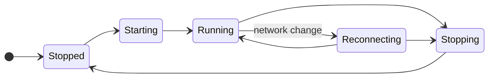

# 1.2 Embedded node and mobile SDK

## Repositories

| Repository | Role | Work in this plan |
| --- | --- | --- |
| [freenet-core](https://github.com/freenet/freenet-core) | Modified | `crates/mobile` delivers the owned API, UniFFI Swift and Kotlin bindings, Keychain and Keystore key backends, per-platform Wasm profiles and build scripts |
| `freenet-appkit` | Modified | Swift package and Kotlin library that wrap the bindings, package the XCFramework and AAR builds |
| [freenet-stdlib](https://github.com/freenet/freenet-stdlib) | Used | Client API request correlation, with an upstream request-ID extension as one selectable option |

## Purpose

Manage embedded Core, transport, lifecycle and platform bindings. The app supplies storage paths. [1.3 Single-application host](03-host.md) adds session authority and grants to the same crate. Core verifies contract state and executes delegates on the device. [1.10 Thin-peer role and cellular data budgets](10-thin-peer.md) later layers the thin-peer role and cellular budgets onto this SDK.

## Prerequisites

Compatible versions and profiles from [1.1 Mobile feasibility and supported profiles](01-feasibility.md).

## Owned API

| Operation | Required behavior |
| --- | --- |
| Start, stop and status | Serialize lifecycle transitions and define repeated-call results. |
| Get and put | Validate code, original parameter bytes and returned instance identity. |
| Update by delta or full state | Correlate the result and preserve an uncertain outcome after timeout. |
| Subscribe and release | Return owned handles, count them per session and contract, and close the subscription when the last handle is released. |
| Register, unregister and message delegates | Authenticate the app/user/session and check current grants through the session authority from [1.3 Single-application host](03-host.md). |
| Delegate startup and prompts | Apply the trusted host's installation and permission policy, including approved foreground startup. |
| Events and cancellation | Include SDK request and session identity, typed errors and submission uncertainty. Deliver callbacks on the platform's expected executor and reject expired-session callbacks. |

#### Build

Build the mobile crate fresh from Core main. [UniFFI](https://mozilla.github.io/uniffi-rs/latest/) generates the Swift and Kotlin bindings from it. Deliver every operation in the table above, plus build scripts for iOS and Android. Apply the [prototype learnings in 1.1 Mobile feasibility and supported profiles](01-feasibility.md#prototype-learnings).

#### Matching replies to requests

Today stdlib matches a reply to its request only by the reply's type and contract key. Alice's room list and her conversation screen might both read the "Skate club" room at the same moment. Both replies then arrive as "read result for Skate club", and the SDK sees them as identical.

Pick one of these fixes and test it:

- The SDK sends only one request of each type per contract at a time and queues the rest.
- Freenet stdlib adds a request ID to every reply. This is an upstream change.

The SDK uses two kinds of ID:

| ID | What it names | How long it lasts | Owner |
| --- | --- | --- | --- |
| SDK request ID | One message between the SDK and the node | Until the reply arrives or the call is cancelled | This plan |
| Operation ID | One user action, such as Bob sending "Skate session Saturday?" | Through retries, restarts and upgrades | [1.6 Application protocols, data and operations](06-data-and-operations.md#operation-identity-and-journal) |

For example, Bob taps Send and his phone loses signal. When River retries, it sends a new SDK request ID with the same operation ID, so the retry counts as the same send.

#### Ending subscriptions

Subscribe returns a handle. The SDK counts handles per session and contract, and it ends the subscription when the last handle is released.

| Alice's action | Open handles on "Skate club" | What the SDK does |
| --- | --- | --- |
| Opens the room list | 1 | Subscribes |
| Opens the conversation | 2 | Reuses the subscription |
| Closes the conversation | 1 | Keeps the subscription |
| Leaves the room list | 0 | Ends the subscription |

Releasing handles in one session leaves other sessions' subscriptions open.

Freenet stdlib plans a client Unsubscribe request ([stdlib wire-format pins #95](https://github.com/freenet/freenet-stdlib/pull/95)). Until the pinned stdlib has it, a subscription lasts as long as its client connection ([disconnect unsubscribe test #4691](https://github.com/freenet/freenet-core/issues/4691)). So the SDK ends a subscription by closing that connection. Once the pinned stdlib has Unsubscribe, the SDK sends it instead.

#### Trusted calls

Some calls act with the app's authority. Examples are registering River's chat delegate and asking it to sign Bob's message. The host sends each of these calls to Core over a trusted path tied to:

- the verified app (River)
- the exact release it runs (its content reference)
- the user (Bob)
- the current session

This includes calls over the node's local WebSocket port. If another app on the same phone connects to that port and claims to be River, Core rejects its calls. [Session admission #5264](https://github.com/freenet/freenet-core/issues/5264) tracks this Core change upstream.

[1.3 Single-application host](03-host.md) owns the base rules for who may call what. [2.2 Multi-application sessions and authority](../2-evy-mobile-app/02-sessions.md#delegate-namespace-policy) adds rules for several apps sharing one node, for example two apps that ship the same delegate.

## Runtime, packaging and lifecycle

#### Packaging

| Platform | Package | Builds |
| --- | --- | --- |
| iOS | XCFramework in the Swift package | Device and simulator |
| Android | AAR in the Kotlin library | Device and emulator, for each selected processor type (ABI) |

Build scripts produce identical bindings from the same source and publish a checksum for each package.

#### Running Wasm

The node runs standard contract and delegate Wasm on the phone. iOS uses the [Pulley interpreter](https://docs.wasmtime.dev/examples-pulley.html) because iOS blocks just-in-time compilation. [1.1 Mobile feasibility and supported profiles](01-feasibility.md) picks the Android backend for each ABI. Both platforms run the same test fixtures.

| Limit | Core default | Mobile |
| --- | --- | --- |
| Memory per Wasm instance | 256 MiB | Set from [1.1 Mobile feasibility and supported profiles](01-feasibility.md) measurements |
| State per contract | 50 MiB | Set from [1.1 Mobile feasibility and supported profiles](01-feasibility.md) measurements |
| Compiled module cache | Sized from Linux cgroup limits | Explicit size, because iOS has no cgroups |

Keep compiled modules on the phone and key them by engine version, so an engine update recompiles them. Check that timeouts, memory limits, cancellation and shutdown return the same bytes and errors on phones as on desktop.

#### Storage

The host supplies the storage paths. The SDK keeps those paths and a node role setting through restarts, reinstalls and moves of the app's data folder by iOS or Android. Test fixtures use their own store, separate from the network store. The role setting is there for [1.10 Thin-peer role and cellular data budgets](10-thin-peer.md) to select the thin role.

#### Start, stop and reconnect

One coordinator runs every start, reconnect and stop, so two never overlap.

On stop, the SDK saves the operation journal, then drops callbacks and releases the port, runtime and store locks. Test killing the app in every state.

When Alice's phone moves from Wi-Fi to cellular, the SDK:

1. Rejoins the network.
2. Restores her subscription to "Skate club".
3. Fetches the latest room state.
4. Hands control back to River, which then retries her pending messages.

#### Keys

The SDK packages the iOS Keychain and Android Keystore backends, plus any signing adapter. [1.5 Identity, keys and local protection](05-identity.md) owns what they protect and when keys may leave the device. Test these cases on real iOS and Android devices against [Apple key protection](https://developer.apple.com/documentation/security/protecting-keys-with-the-secure-enclave) and [Android Keystore](https://developer.android.com/privacy-and-security/keystore):

- The device is locked.
- A key was invalidated, for example after the user enrolls a new fingerprint or face.
- The device lacks support for the key's algorithm.

## Acceptance

Acceptance requires concurrent request isolation, real delegate calls, safe cancellation, local subscription release that preserves other sessions' handles and repeated start/stop/reconnect on both platforms. Verify pending work and original operation IDs through termination.

Regression sources: [response correlation #5048](https://github.com/freenet/freenet-core/issues/5048), [streaming PUT #5458](https://github.com/freenet/freenet-core/issues/5458), [UPDATE lookup #5475](https://github.com/freenet/freenet-core/pull/5475), [timeout uncertainty #3465](https://github.com/freenet/freenet-core/issues/3465), [wake recovery #4951](https://github.com/freenet/freenet-core/issues/4951) and [missed updates #4681](https://github.com/freenet/freenet-core/issues/4681). Record the pinned revision and outcome when testing each behavior.
