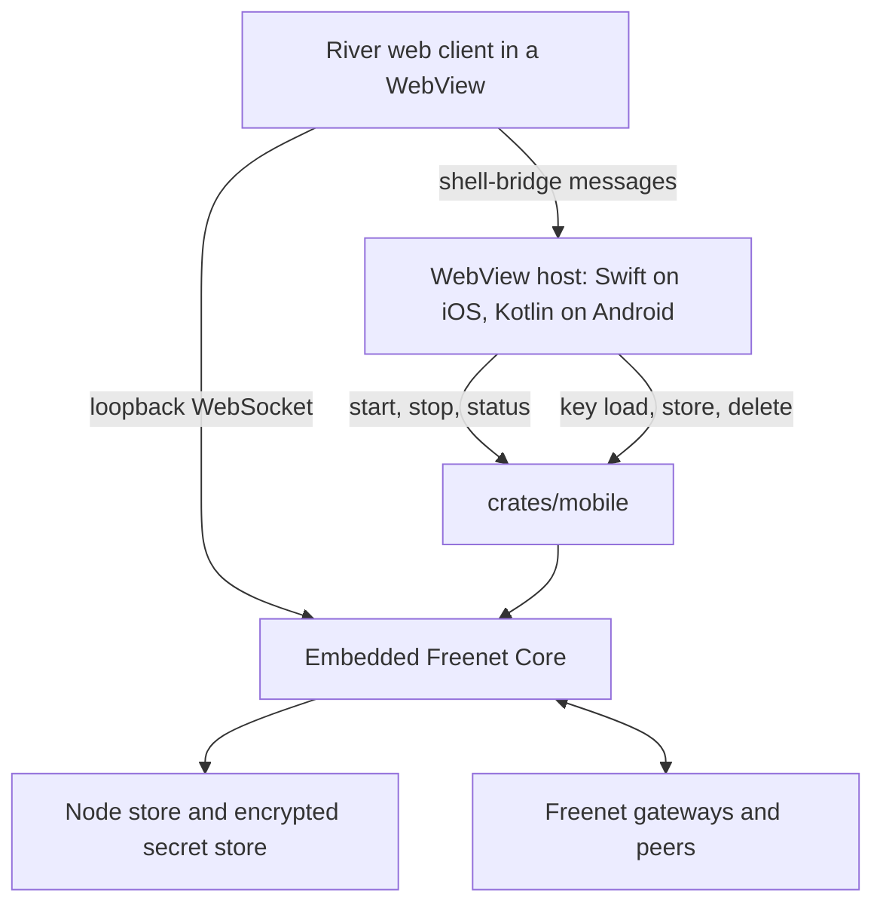
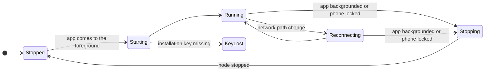

# 1.2 Embedded node and mobile SDK

## Repositories

| Repository | Role | Work in this plan |
| --- | --- | --- |
| [freenet-core](https://github.com/freenet/freenet-core) | Modified | New `crates/mobile` interface, complete node-task teardown, offline startup, host-supplied key backend and host records |
| [freenet-appkit](https://github.com/glesage/freenet-appkit) | Modified | Swift package for iOS and Kotlin library for Android, with network-path monitoring, the bandwidth profile and iOS and Android traffic tests |
| [river](https://github.com/freenet/river) | Used | Web client that runs against the embedded node |

## Purpose

Run an embedded Freenet node inside River's iOS and Android app. The Swift package on iOS and the Kotlin library on Android do three things:

- start and stop the node
- report its status
- run the WebView host

River's web client talks to the node itself, over the node's loopback WebSocket, as it does in a desktop browser.

Each installation owns one node, one store and one encryption key.

Agree the interface and Core changes with Core's maintainers before writing the code.

## Architecture

```mermaid
flowchart TD
  River[River web client in a WebView] -->|loopback WebSocket| Core[Embedded Freenet Core]
  River -->|shell-bridge messages| Host[WebView host: Swift on iOS, Kotlin on Android]
  Host -->|start, stop, status| Mobile[crates/mobile]
  Host -->|key load, store, delete| Mobile
  Mobile --> Core
  Core --> Store[Node store and encrypted secret store]
  Core <--> Network[Freenet gateways and peers]
```

| Part | What it does |
| --- | --- |
| River's web client | Reads and writes rooms, registers its chat delegate and resubscribes after a reconnect |
| WebView host | Loads River, handles shell-bridge messages, watches the network path and the app's foreground state |
| `crates/mobile` | Wraps Core for Swift and Kotlin: node lifecycle, status, settings, key backend and host records |
| Core | Verifies state, runs contracts and delegates, and routes and hosts for the network within the bandwidth profile |

## SDK interface and packages

Add `crates/mobile` to freenet-core with this interface and generate the Swift bindings for iOS and the Kotlin bindings for Android from it with [UniFFI](https://mozilla.github.io/uniffi-rs/latest/).

| Interface item | What it provides |
| --- | --- |
| `MobileNode` | `new(settings)`, `start()`, `stop()`, `status()`, `info()` with the loopback port and River's URL, and `wait_for_peers()` |
| `NodeSettings` | Host-supplied data, config, secret, cache and log folders; network or local mode; gateway overrides; preferred loopback port; bandwidth profile; Wasm backend |
| `NodeEventListener` | Status changes, peer count and failures, implemented in Swift and Kotlin |
| `WebBundle` and `WebBridge` | Serve River's bundle files from the node and parse shell-bridge JSON messages, so iOS and Android share one implementation |
| `KekBackend` | Callbacks the host implements to load, store and delete the node encryption key. See [Keys and host records](#keys-and-host-records) |
| Host records | Get, put, delete and list for the host's own records. See [Keys and host records](#keys-and-host-records) |
| `MobileError` | Typed errors. See [Requests, events and errors](#requests-events-and-errors) |

Packages:

| Platform | Package | Targets |
| --- | --- | --- |
| iOS | XCFramework inside a Swift package | arm64 devices and the iOS Simulator |
| Android | AAR inside a Kotlin library | arm64-v8a and x86_64 |

## Node lifecycle and connectivity

### Start, stop and reconnect

One owner inside `crates/mobile` runs start, reconnect and stop one at a time. A repeated call returns the current state.

The node runs only while River is in the foreground. Locking the phone backgrounds the app, so it also stops the node.

```mermaid
stateDiagram-v2
  direction LR
  [*] --> Stopped
  Stopped --> Starting: app comes to the foreground
  Starting --> Running
  Starting --> KeyLost: installation key missing
  Running --> Reconnecting: network path change
  Reconnecting --> Running
  Running --> Stopping: app backgrounded or phone locked
  Reconnecting --> Stopping: app backgrounded or phone locked
  Stopping --> Stopped: node stopped
```

For example, Alice reads "Skate club" on the bus and then locks her phone:

1. The WebView host gives River about 2 seconds to save its drafts.
2. The host destroys River's WebView.
3. The host calls `stop()`. Core shuts down within one deadline and releases the loopback port, the store and the keys it holds.
4. When Alice unlocks and opens River again, the host starts the node and opens a fresh WebView.

Rules:

- Give every node-owned background task a retained cancellation and join handle, including tasks started during construction and transport startup. Track shared process-wide runtime tasks separately.
- `stop()` requests shutdown and lets node-owned tasks finish their cleanup within the shutdown deadline. It then cancels and joins any remaining node-owned tasks within that same deadline.
- `stop()` finishes only when every node-owned task has ended and the port, listeners, store and held keys are released. A remaining task or resource returns `IncompleteShutdown`. Keep lifecycle operations serialized until the remaining tasks and resources are reclaimed.
- Complete Core's task-teardown work tracked by [#6048](https://github.com/freenet/freenet-core/issues/6048) before the first iOS and Android release. Verify the selected fix against the task monitor and each registered task, using [Core's task-monitor implementation](https://github.com/freenet/freenet-core/blob/0f0c942494c0ddbead78c2a0879d75971cdd0d0c/crates/core/src/node/background_task_monitor.rs) as the source baseline. That version aborts tasks registered through its `LateRegistrar`; tasks registered with `register` still need the fix.
- Report the loopback port the node picked. Reuse the previous port so River keeps the same web origin and storage. If that port is taken, pick a free one and report it.
- Watch the network path with `NWPathMonitor` on iOS and `ConnectivityManager` on Android. On a change, rejoin Freenet. River's web client re-reads and resubscribes its rooms when its WebSocket reconnects ([river#759](https://github.com/freenet/river/pull/759)).
- Restart the node after a node failure while the app process keeps running.
- Turn off legacy telemetry and OpenTelemetry on every start, after the saved config is merged.
- Deliver listener callbacks on the iOS and Android main thread, so a slow listener cannot hold up the node's own threads.

### Offline startup

Alice opens River on the subway with no signal. She still sees "Skate club" and can write a message.

| Stage | What happens |
| --- | --- |
| Start | The node opens its store and the loopback API before it joins Freenet |
| Before the first join | River reads its stored rooms and its chat delegate. Core returns `PeerNotJoined` for network operations, and River keeps the unsent message in its chat delegate |
| After the first join | River sends the kept message and refreshes its rooms |

Core changes:

- Resolve gateway hostnames inside the join loop, so startup finishes offline.
- Serve stored contracts and delegate storage before the first join.
- Report "joined" separately from "WebSocket connected".
- Refresh gateway discovery when connectivity returns, and retry.

### Transport profile

Use one recorded transport profile for the first iOS and Android release:

| Setting | Release profile | Evidence |
| --- | --- | --- |
| `transport-quic` | Unset. Core's default mode on iOS and Android is `off`. Record the effective mode at startup | [Core's default QUIC mode](https://github.com/freenet/freenet-core/blob/0f0c942494c0ddbead78c2a0879d75971cdd0d0c/crates/core/src/transport/quic.rs#L154-L164) |
| `quic-data-percent`, `quic-max-paths` | Unset; record the resolved values | [Core transport configuration](https://github.com/freenet/freenet-core/blob/0f0c942494c0ddbead78c2a0879d75971cdd0d0c/crates/core/src/config.rs) |
| Congestion controller | Core's resolved default, recorded with its version | [Core transport configuration](https://github.com/freenet/freenet-core/blob/8942fd239b2b53e606ffb1e26ee986623008afb2/crates/core/src/config.rs) |
| `total-bandwidth-limit`, `min-bandwidth-per-connection`, connection limits | Set from the [bandwidth profile](#bandwidth-profile); record the resolved values | [Node-wide egress cap #5964](https://github.com/freenet/freenet-core/pull/5964), [Core transport configuration](https://github.com/freenet/freenet-core/blob/0f0c942494c0ddbead78c2a0879d75971cdd0d0c/crates/core/src/config.rs) |
| `bandwidth-limit` | Unset | [Per-connection streaming cap #6051](https://github.com/freenet/freenet-core/pull/6051) |

Application traffic uses the UDP transport. Core is replacing that transport with QUIC ([#5940](https://github.com/freenet/freenet-core/issues/5940)): desktop nodes default to `shadow`, and `prefer` sends data on QUIC where both peers agree ([#6114](https://github.com/freenet/freenet-core/pull/6114)). Move the phone profile to QUIC before Core removes the UDP transport. Each transport profile change is an explicit release change with new iOS and Android connectivity, traffic, memory and task-cleanup evidence. Record configured and effective settings in the [release support matrix in 1.1 Mobile feasibility and supported profiles](01-feasibility.md#release-profile-evidence).

### Bandwidth profile

The phone's node is a full Freenet peer, the one peer role the [whitepaper](https://github.com/freenet/paper-1/blob/bff15702759800a003ffbfce639fe859f57d966d/sections/03-primitives.tex) describes. It verifies contracts, runs delegates and keeps subscribed state on the device, and it routes and hosts for the network as every peer does. Core's bandwidth controls bound what it sends. Core's mobile discussions are [#420](https://github.com/freenet/freenet-core/discussions/420) and [#811](https://github.com/freenet/freenet-core/discussions/811).

[1.1 Mobile feasibility and supported profiles](01-feasibility.md) measured a phone on Wi-Fi with every bandwidth setting unset ([finding](https://github.com/glesage/freenet-appkit/blob/0a80db4218b46e4d1854ab783ac3c44b1377190f/docs/findings.md#phones-are-full-peers-on-the-public-network)):

| Run | Upload | Download |
| --- | --- | --- |
| iPhone 13 mini, first two minutes, 27 peers | 7.2 MB, about 60 KiB/s | 6.4 MB, about 60 KiB/s |
| Android emulator, first two minutes, 22 peers | About 22 KiB/s | About 22 KiB/s |
| iPhone 13 mini, idle | Under 1 KiB/s | Under 1 KiB/s |
| Android emulator, idle, 1 peer | 1.4 KiB/s | 1.1 KiB/s |
| Loading River's 1.06 MB bundle on the public network | 9 KiB | 1.2 MiB |

At 60 KiB/s, one hour of traffic uses about 210 MiB each way and drains the battery. Every released iOS and Android build therefore runs with this profile:

| Setting | What Core does | Phone profile |
| --- | --- | --- |
| `total-bandwidth-limit` | One node-wide token bucket charges every datagram the node sends on UDP and QUIC: handshakes, ACKs, keepalives, retransmissions and stream fragments ([#5964](https://github.com/freenet/freenet-core/pull/5964), [#6116](https://github.com/freenet/freenet-core/pull/6116), [#6147](https://github.com/freenet/freenet-core/pull/6147)). A QUIC path holds its share of the cap ([#6111](https://github.com/freenet/freenet-core/pull/6111), [#6126](https://github.com/freenet/freenet-core/pull/6126)) | Set, with one measured value per platform |
| `min-bandwidth-per-connection` | Each connection's share is the cap divided by the active connections, and at least this minimum. Core's default of 1 MB/s is above a phone's share ([#6113](https://github.com/freenet/freenet-core/pull/6113)) | Set below the cap divided by `max-number-of-connections`, so connections share the cap evenly |
| `max-number-of-connections`, `min-number-of-connections` | Bound the number of peers. Core's defaults are 200 and 25 | Set from the traffic measurements |
| `bandwidth-limit` | Caps one connection's streaming rate, at 64 KiB/s or more. `total-bandwidth-limit` overrides it | Unset |

Sources: Core's [bandwidth configuration](https://github.com/freenet/freenet-core/blob/0f0c942494c0ddbead78c2a0879d75971cdd0d0c/docs/architecture/transport/configuration/bandwidth-configuration.md) and [egress_cap.rs](https://github.com/freenet/freenet-core/blob/0f0c942494c0ddbead78c2a0879d75971cdd0d0c/crates/core/src/transport/egress_cap.rs).

- The host passes the profile in `NodeSettings`. It takes precedence over the saved config.
- The node runs only in the foreground, so a session sends at most the cap multiplied by its foreground time.
- The cap covers what the phone sends. Download follows what peers send, so measure it and record it beside the cap.
- Under the cap, Core fails a stream whose turn would come more than 5 seconds late, and the user's own sends share the cap with routed traffic. River keeps an unsent message in its chat delegate and sends it again. Core's per-connection scheduler is tracked in [#5976](https://github.com/freenet/freenet-core/issues/5976).

#### Traffic measurement

Measure traffic on iOS and Android with the [harness](https://github.com/glesage/freenet-appkit/tree/1988c5cbdfc5c1f88065382de2a4f86093948b6e/harness) `watch` scenario and Core's upload and download counters. Run each workload twice: on a development build with every bandwidth setting unset, then on the release build with the profile. Record battery drain per hour beside each workload, on an unplugged iPhone and Android phone. Publish the results with the resolved transport and bandwidth settings in the [release support matrix in 1.1 Mobile feasibility and supported profiles](01-feasibility.md#release-profile-evidence).

| Workload | What to record |
| --- | --- |
| Foreground idle | Upload and download per minute, including keepalives and subscription upkeep |
| Active use | Upload and download for River's join, read and send sequence |
| Reconnect and network change | Upload and download per reconnect, with a room state above 1 MiB. River's reconnect uses code-free GET subscriptions, deltas and fallback PUTs ([River PR #759](https://github.com/freenet/river/pull/759)); record each part |
| Cap reached | Upload held at the cap while routed traffic fills it, Core's refused-stream counters, and the time Bob's own message takes to send |

Each message Bob sends today costs the whole room state, because Core forwards the full merged state ([#4072](https://github.com/freenet/freenet-core/pull/4072)).

#### Upstream bandwidth work

Bandwidth use is general to Freenet. Track it in Core's issues and file a new issue where none exists.

| Change | State |
| --- | --- |
| A node-wide upload cap in Core's default configuration ([#6045](https://github.com/freenet/freenet-core/issues/6045)) | Open |
| Lower daily upload volume for metered connections ([#6171](https://github.com/freenet/freenet-core/issues/6171)) | Open. A median node sends about 3 GB a day, 28% of it hosting announcements |
| A per-connection stream scheduler under the cap ([#5976](https://github.com/freenet/freenet-core/issues/5976)) | Open |
| QUIC transport with a capped congestion window and one shared admission queue ([#5940](https://github.com/freenet/freenet-core/issues/5940)) | Tracking issue open. The cap PRs are merged |
| Compress every peer message with zstd ([#3336](https://github.com/freenet/freenet-core/issues/3336)) | Open proposal |
| Send a code hash first and the Wasm only when the receiver lacks it ([#5707](https://github.com/freenet/freenet-core/issues/5707)) | Open proposal |
| Send client UPDATEs as deltas against the receiver's state summary ([#4072](https://github.com/freenet/freenet-core/pull/4072) left the delta format for later) | Core issue to be filed |
| Cut summary, interest-sync and hosting-announcement traffic ([#5203](https://github.com/freenet/freenet-core/pull/5203), [#5109](https://github.com/freenet/freenet-core/pull/5109), [#4965](https://github.com/freenet/freenet-core/issues/4965), [#5157](https://github.com/freenet/freenet-core/issues/5157)) | Draft PRs and open issues under Core's bandwidth tracking issue [#5153](https://github.com/freenet/freenet-core/issues/5153) |

### Local network access

The host handles the iOS local-network prompt and Android's `ACCESS_LOCAL_NETWORK` permission.

- With access, the node may use gateways and peers on the Wi-Fi network.
- Without access, the node uses public gateways.
- Test both answers on iOS and Android.

## Requests, events and errors

River's web client sends its requests over the loopback WebSocket with freenet-stdlib's web API. Core matches each reply to its request as it does in a desktop browser. The Swift and Kotlin packages carry no contract or delegate calls.

The packages report node status and these typed errors:

| Error | Meaning | What River's app shows |
| --- | --- | --- |
| `StartFailed` | The node could not start | A retry screen |
| `KeyLost` | The installation key is missing | The key-loss screen |
| `UpdateRequired` | Peers refuse this build's Core version | "Update River", with a link to the App Store or Google Play |
| `IncompleteShutdown` | Stop passed its deadline with a node-owned task, port, store or key still held | Nothing; the host logs it and finishes teardown before another start |
| `NoGateways` | No gateway is usable | A "no connection" banner |

## Keys and host records

| Item | What `crates/mobile` adds |
| --- | --- |
| Node encryption key | One generic host-supplied key backend in Core. The host implements its `load`, `store` and `delete` callbacks through UniFFI: Swift with the iOS Keychain, Kotlin with the Android Keystore |
| Host records | The host's private records, such as River's notification choice, are secrets in Core's existing encrypted secret store. They sit under a reserved host namespace. No key leaves Core |
| Missing key | Core records the backend in `secrets_dir/kek_backend` and loads the key only from it. A missing key returns `KeyLost` |

Use [kek.rs](https://github.com/freenet/freenet-core/blob/8942fd239b2b53e606ffb1e26ee986623008afb2/crates/core/src/config/kek.rs) and [#4137](https://github.com/freenet/freenet-core/issues/4137) as implementation references. Stopping the node releases the key and every key Core derived from it.

## Wasm runtime and storage

### Running Wasm

Run contracts and delegates with the [Pulley interpreter](https://docs.wasmtime.dev/examples-pulley.html) in iOS and Android release builds. The first release uses the fixed-reservation profile measured in [1.1 Mobile feasibility and supported profiles](01-feasibility.md#device-limits).

| Setting | Value |
| --- | --- |
| Wasm linear-memory reservation | 256 MiB per instance |
| iOS Store replacement | After 4 instances |
| iOS contract executors | At most 2 |
| Delegate executor | Core's one delegate executor, with its fixed 16 MiB Store budget ([#6144](https://github.com/freenet/freenet-core/pull/6144)) |
| Android executors and Store replacement | Measured per ABI and pinned in the release support matrix |
| Android ABIs | arm64-v8a and x86_64 |

- Check that contracts and delegates give the same results on iOS and Android, including memory growth and returned buffers.
- Measure memory, run time and capacity failures on the exact release builds.
- Measure River's read and send times while the contract executors validate contracts hosted for the network.
- Adopt smaller reservations once an upstream Core release handles moving guest memory. Repeat the contract, delegate, memory-growth, capacity and lifecycle tests on iOS and Android before changing the profile.
- Add armeabi-v7a once smaller reservations are adopted and a 32-bit Android phone passes these tests.
- Change executor and Store limits only through a measured profile update. Record each setting and build digest in the release support matrix.

### Storage

The host supplies installation-specific data, config, secret, cache and log folders. Its settings take precedence over the saved config.

- Keep local-mode and network-mode stores apart. Discard a saved config whose folder, mode or gateway source differs.
- Set the hosting budgets in the release profile: hosted state bytes, disk budget, hosted-contract memory share and module cache. Measure them on iOS and Android while the node hosts for the network, starting from the prototype values in [1.1 Mobile feasibility and supported profiles](01-feasibility.md#prototype-learnings). Record the resolved values in the release support matrix.
- Keep rebuildable web-app caches apart from secrets.
- Turn off Core's secret snapshots, so the phone keeps only each secret's current value.
- Keep store ownership and paths across node restarts and iOS container moves.

## Maintainer review

- Does the `crates/mobile` interface and the UniFFI approach suit Core?
- Is the generic host-supplied key backend acceptable in Core?
- Is a reserved host namespace in the secret store acceptable?
- Which Core changes are needed for offline startup and mobile Wasm execution?
- Which bandwidth cap and connection limits suit a phone that runs only in the foreground?

## Acceptance

- On iOS and Android, River runs against its installation's own embedded node.
- Start, stop and reconnect follow the state diagram. Locking the phone and backgrounding the app both stop the node.
- On iOS and Android, stop releases every node-owned task, the port, store and keys within its deadline, or returns `IncompleteShutdown`.
- Run repeated start/stop cycles within one live app process on iOS and Android. Cover normal stop, a shutdown timeout and a startup failure. Per-generation task counters show zero live node-owned tasks after completed teardown; stale callbacks cease, the stopped generation's samplers stop updating counters, and the port and store can be reused. Record shared process-wide runtime tasks and caches separately; shared task counts remain stable across cycles and caches stay within their configured bounds.
- The release support matrix records the configured and effective transport settings. A profile change passes the affected iOS and Android connectivity, traffic, memory and lifecycle tests.
- On real iOS and Android phones, on Wi-Fi and on each supported carrier, upload stays within `total-bandwidth-limit` during idle, active use and reconnect. Bob's message sends while routed traffic holds the cap.
- Idle, active, reconnect and cap-reached traffic is measured and published for iOS and Android, on a development build with every bandwidth setting unset and on the release build with the profile.
- With every network off, the host reports offline from the OS network path while Core's peer count stays up, and rejoins when the path returns, on iOS and Android.
- After a restart, the node reuses its previous loopback port. With that port taken, it reports a new port.
- Offline startup shows River's stored rooms and chat delegate before the first join.
- The Keychain backend on iOS and the Keystore backend on Android load, store and delete the node key. A missing key returns `KeyLost`.
- Host records survive a restart and stay inside Core's encrypted secret store.
- Pulley execution passes the measured profile on iOS and on both Android ABIs.
- Local-network permission answers work across network changes on iOS and Android.
- A test peer that requires a newer Core gives `UpdateRequired` on iOS and Android.
