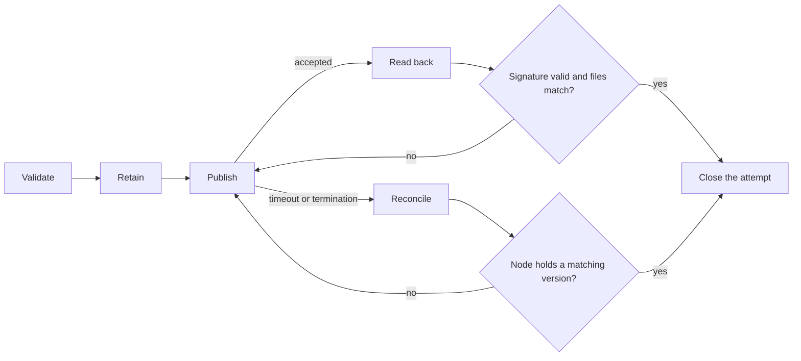

# 1.4 Application bundles

## Repositories

| Repository | Role | Work in this plan |
| --- | --- | --- |
| `freenet-appkit` | Modified | Packaging CLI: `app_definition.json` format, metadata and component validation, install checks, publication retention and verified readback, reconciliation after an uncertain submission. Host installation interface: candidate verification, release tracking, rollback and retention of installed copies |
| [freenet-core](https://github.com/freenet/freenet-core) | Used | `fdev website publish` and the stock website container as the unchanged publication base |
| [river](https://github.com/freenet/river) | Modified | River's release build gains `app_definition.json` and publishes through the packaging CLI |
| [paper-1](https://github.com/freenet/paper-1) | Used | Status section on hosting demand and retention |

## Purpose

Package and publish a single defined application's web UI, contract and delegate artifacts, and host metadata. For our 1st MVP we will use River and it's web UI, but custom native builds can use the SDK and their platform distribution process.

Freenet already builds contracts, archives a web directory, signs it and stores it in a website container. This plan adds what a mobile host needs around that base.

| Area | Freenet today | What we need |
| --- | --- | --- |
| Archive contents | `index.html`, application assets and `contracts/` from `fdev build` | `delegates/` and `app_definition.json` |
| Publication | `fdev website publish` archives, stamps a version, signs and submits in one call | Validation before the call, retention before it, verified readback after it, reconciliation after an uncertain result |
| Installation | A browser opens `index.html` from the node | Install checks in the packaging CLI and the host's installation interface, release tracking, rollback, retention and component setup rules |
| References | Container key and version | `publication_ref` and `application_content_ref` encodings that name one exact release |

## Prerequisites

The supported versions and application profile in [1.1 Mobile feasibility and supported profiles](01-feasibility.md), [1.2 Embedded node and mobile SDK](02-sdk.md), and the [1.3 Single-application host](03-host.md) interface.

## The archive and its definition

`fdev build` writes `contracts/<code_hash>.wasm` and `dependencies.json`. `fdev website publish` requires `index.html`, creates a tar.xz archive, signs its version and archive, and submits it to the website container.

```text
index.html                    # today: required by fdev website publish
application code and assets   # today: loaded from index.html
contracts/
  <code_hash>.wasm            # today: written by fdev build
  dependencies.json           # today: written by fdev build
delegates/
  <delegate>.wasm             # This plan: delegates ship inside the archive
app_definition.json           # This plan: host metadata, every field below
```

Application code loads its assets from `index.html` and coordinates concrete application requests. `app_definition.json` is new in this plan and supplies the metadata the selected host needs.

| Field | Purpose |
| --- | --- |
| Format version | Select the supported metadata encoding |
| Name and description | Identify the application in trusted install and application-management screens |
| Host requirements | Name compatible host APIs and concrete application protocol versions |
| Contract/delegate references | Identify artifacts, exact parameters or their application-defined encoding, setup requirements and predecessors |
| Permissions | Declare required and optional capabilities under the [base authorization rules in 1.3 Single-application host](03-host.md#base-authorization-and-device-access) |
| Publisher transfer | Carry a transfer statement or acknowledgement under [1.7 Upgrades and migration](07-migration.md) |

River's definition, with the owner of each part in the comments:

```jsonc
{
  "format_version": "1",                        // this plan: selects this layout
  "name": "River",
  "description": "Group chat rooms on Freenet",
  "host_requirements": {                        // this plan: host API and protocol versions
    "host_api": "1",
    "protocols": { "river.chat": "1" }
  },
  "components": [                               // this plan: one entry per contract and delegate
    {
      "alias": "river.room",
      "kind": "contract",
      "artifact": "contracts/<code_hash>.wasm",
      "parameters": "ChatRoomParametersV1",     // encoding owned by the application
      "protocols": ["ChatRoomStateV1"],
      "setup": "none",
      "predecessors": []                        // rows owned by 1.7 Upgrades and migration
    },
    {
      "alias": "river.chat",
      "kind": "delegate",
      "artifact": "delegates/chat.wasm",
      "parameters": "empty",
      "protocols": ["river.chat/1"],
      "setup": "register",
      "predecessors": []
    }
  ],
  "permissions": {                              // this plan: shape owned by 1.3 Single-application host
    "required": [],
    "optional": ["notifications", "clipboard"]
  }
  // "publisher_transfer" appears only during a transfer under 1.7 Upgrades and migration
  // "native_links" is added by 3.3 Artifact certification and publication evidence
  // "sdui" is added by 4.2 SDUI bundles and publication
}
```

Container version orders publications. Format version selects the metadata layout. Application protocol versions select concrete codecs. Each has a separate encoding and purpose. Native executable changes arrive through an installed-app release.

## Contracts, delegates and initialization

Component entries and setup rules are new in this plan. Each component entry records `alias`, `kind`, artifact path or verified reference, parameter encoding, protocol versions, setup requirement and predecessor rows. An alias is an application-local name. [1.7 Upgrades and migration](07-migration.md#component-identity-and-re-keying) owns key derivation, predecessor encodings and the build check for changed component code.

| River component | Parameters and protocol | Setup |
| --- | --- | --- |
| `river.room` contract | `ChatRoomParametersV1 { owner }`, `ChatRoomStateV1` | `none` at installation. Application code and its delegate create each room |
| `river.chat` delegate | Empty parameters, the chat delegate's concrete message protocol | `register` under user-approved installation |

`setup` records `create` with an initial-state rule, `register`, or `none`. The application's bootstrap code performs these steps through authorized host/SDK calls. It supplies the cipher and nonce required by `RegisterDelegate`. Setup is retry-safe and records completion before opening dependent features.

River sources include the [chat delegate protocol](https://github.com/freenet/river/blob/main/delegates/chat-delegate/README.md) and [invite parameter handling](https://github.com/freenet/river/blob/main/ui/src/components/members.rs). Packaging copies the application's predecessor registry into release metadata where the host needs it. [1.7 Upgrades and migration](07-migration.md#predecessor-registry) defines how those rows select and recover components.

## Publishing and evidence

`fdev website publish <dir> --key <name>` archives the directory, stamps the current Unix time as the version, signs the version and archive, and submits the result in one call. This plan keeps that command unchanged. The packaging CLI wraps it with validation, retention, verified readback and reconciliation.



| Step | What the packaging CLI does |
| --- | --- |
| 1. Validate | Checks metadata, component hashes, parameter fixtures, compatibility, declared permissions and archive limits. |
| 2. Retain | Saves the exact release directory, a digest of every file, the container key, the signing key name and an attempt record. Step 3 starts only after this save succeeds. |
| 3. Publish | Runs `fdev website publish` on the retained directory. The command archives, stamps the version, signs and submits. |
| 4. Read back | Reads the stored state from the node, verifies the signature with the publisher's verifying key, unpacks the archive and compares every file with the retained directory. On a match, it saves the exact signed envelope and archive bytes as read back, with their version and digest, and closes the attempt. Those bytes are the `publication_ref`. On a mismatch, it repeats step 3. |
| 5. Reconcile | Runs after a timeout or termination in step 3. Reads back first. When the node holds a version whose files match the retained directory, it saves that readback and closes the attempt. Otherwise it repeats step 3 from the same retained directory. The command stamps a new version and signature, and step 4 supplies the reference. |

A changed release directory starts a new attempt at step 1, with its own retention record.

| Reference | Required fields |
| --- | --- |
| `publication_ref` | Full container `ContractKey`, signed container version, hash algorithm and digest of the exact archive read back |
| `application_content_ref` with `kind: publication` | A `publication_ref` |
| `application_content_ref` with `kind: native` | Platform identity, build identity, hash algorithm and build digest |

River's source fixture identifies its container as `raAqMhMG7KUpXBU2SxgCQ3Vh4PYjttxdSWd9ftV7RLv`, per [FREENET.md](https://github.com/freenet/river/blob/main/FREENET.md). Validate deployed identities when selecting release fixtures.

These references have fixed, versioned encodings. Routine website releases retain the container identity while advancing its signed version. A rebuild may change archive bytes and therefore its digest.

## Installing a copy

These checks are new in this plan. The packaging CLI validates them before publishing. The host's installation interface repeats applicable checks before executing archive content.

| Check | Requirement |
| --- | --- |
| Container identity, signature and version | Match the selected application and verify the signed snapshot |
| Paths | Reject absolute paths, parent traversal, symlinks, hardlinks and duplicate paths |
| Executable content | Match the supported application profile and declared artifacts |
| Resource use | Enforce measured download, decompression, file-count and memory caps |
| Metadata and components | Verify artifact hashes, supported formats, parameter encodings and application protocols |
| Setup and access | Match approved setup and declared capabilities |

The source snapshot records a 50 MiB Core contract-state limit. Release tooling checks the pinned node and container limits together. [1.1 Mobile feasibility and supported profiles](01-feasibility.md#device-measurements) sets measured host caps. Each publication sends the whole archive, including assets. A separate blob-store proposal can use the [hash-keyed contract discussion #3985](https://github.com/freenet/freenet-core/issues/3985) as evidence.

The installation interface then handles each candidate release:

| Step | Requirement |
| --- | --- |
| Verify a candidate | Check the selected app's snapshot before execution, including host APIs, concrete protocols, setup, device adapters and data compatibility. Obtain consent for changed delegates, setup or access under the [base authorization rules in 1.3 Single-application host](03-host.md#base-authorization-and-device-access) |
| Track release selection | Keep the active release separate from the newest observed version, digest and observation time. Preserve the highest observed version during local rollback |
| Hand over for activation | Supply the verified `application_content_ref` as the release reference for [activation in 1.3 Single-application host](03-host.md#activating-a-release) |
| Retain and recover | Keep the active copy, one backup and every release that a retained record still references, within the storage budget. On failure, keep a usable copy and saved work |

It resolves these cases:

- A newer signed archive becomes a new candidate and goes through these steps.
- An older publication keeps the active copy and the newest observed record.
- Same-version divergence keeps the accepted bytes and both pieces of evidence, and suspends automatic activation until a higher signed version resolves the conflict.
- Unsupported host APIs or protocols keep the compatible copy and report the unmet requirement.
- A deliberate local rollback passes current data compatibility checks.

## Retention and recovery

The packaging CLI's retention store keeps exact archives and signed envelopes as read back, including supported predecessor releases. The website container holds its latest state, and network availability depends on hosting demand, as described in the [whitepaper status](https://github.com/freenet/paper-1/blob/main/sections/07-status.tex). Restoring an archived release requires retained bytes and a compatible host.

Publisher-key backup and transfer belong to [1.7 Upgrades and migration](07-migration.md).

## Reference definitions

| Term owned here | Meaning |
| --- | --- |
| Application container identity | The full container `ContractKey` followed across routine releases |
| Container version | The signed order of publications under that identity |
| Definition format version | The encoding of host metadata |
| `publication_ref` | One exact signed web archive |
| `application_content_ref` | The web publication or native build used by an operation |
| Retained attempt | The exact release directory, file digests, container key and signed readback the packaging CLI keeps for one publication |
| Installation interface | The host part that verifies, tracks, hands over and retains installed releases |

## Acceptance

- River's web archive builds, signs, publishes and opens in the supported iOS and Android WebViews.
- Every fixture publishes through the unchanged `fdev website publish` and the stock website container.
- CLI/CI rejects unsafe paths, hash mismatches, unsupported metadata, invalid parameter fixtures and releases that exceed the selected profile's limits.
- A failed retention save stops the call to `fdev website publish`. Timeout and termination fixtures reconcile by readback and re-publish the same retained directory when the node holds no matching version.
- A consumer verifies a `publication_ref` against retained bytes after the live container advances. A `kind: native` reference verifies against its build digest.
- Setup can resume after termination. Changed delegates and new access pass the host's consent checks before activation.
- The installation interface handles replayed content, older publications, same-version divergence, unsupported requirements, rollback with changed data and cleanup while a retained record still references a release.

Sources: [website publication manual](https://freenet.org/build/manual/publish-a-website/), [container implementation](https://github.com/freenet/freenet-core/tree/main/crates/website-contract), [fdev website subcommand](https://github.com/freenet/freenet-core/blob/main/crates/fdev/src/website.rs).
