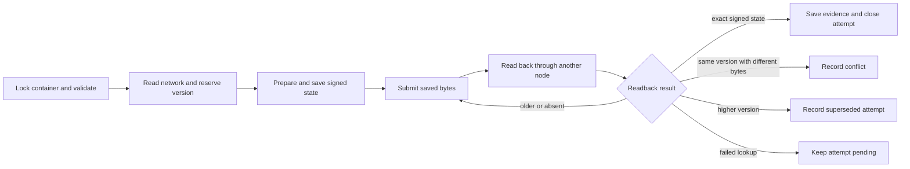

# 1.4 Application bundles

## Repositories

| Repository | Role | Work in this plan |
| --- | --- | --- |
| [freenet-appkit](https://github.com/glesage/freenet-appkit) | Modified | Bundle packaging and installation |
| [river](https://github.com/freenet/river) | Modified | River bundle publication |
| [freenet-core](https://github.com/freenet/freenet-core) | Modified | Separate website preparation and submission in fdev; readback |

## Purpose

Package and publish an application's web UI, contract and delegate artifacts, and host metadata. River's web UI is the first MVP on iOS and Android. Custom Swift and Kotlin apps use the SDK and their platform's distribution process.

Build contracts, archive the web directory, sign it and store it in a Freenet website container. Add metadata, publication evidence and installation checks for the mobile host.

| Area | Required result |
| --- | --- |
| Archive | `index.html`, application assets, `contracts/` from `fdev build`, and `app_definition.json` naming every contract and delegate Wasm file |
| Publication | Validate the archive, assign an increasing version, save the signed state, submit with pinned container Wasm, verify independent readback and replay saved bytes after an uncertain result |
| Installation | Check releases in the packaging CLI and host; track activation, rollback, retention and component setup |
| References | `publication_ref` and `application_content_ref` identify one exact release by container key, version and digest |

## The archive and its definition

`fdev build` writes `contracts/<code_hash>.wasm` and `dependencies.json`. `fdev website publish` requires `index.html`, creates a tar.xz archive, signs its version and archive, and submits it to the website container.

```text
index.html                    # today: required by fdev website publish
application code and assets   # today: loaded from index.html
contracts/
  <code_hash>.wasm            # today: written by fdev build
  dependencies.json           # today: written by fdev build
app_definition.json           # This plan: host metadata, every field below
```

River ships its two Wasm files by name, as `contracts/room_contract.wasm` and `contracts/chat_delegate.wasm`. Each component entry names its file by path.

Application code loads assets from `index.html` and calls contracts and delegates. Add `app_definition.json` with the metadata the host needs. River's definition:

```jsonc
{
  "format_version": "1",                           // format version: how the host reads this file
  "name": "River",                                 // name and description identify the app
  "description": "Group chat rooms on Freenet",    // in trusted install and app-management screens
  "host_requirements": {                           // what the host must support to run the app
    "host_api": "1",                               // host API version the app code calls
    "protocols": { "river.chat": "1" }             // protocol versions the app code uses
  },
  "components": [                                  // one entry per contract and delegate the app uses
    {
      "alias": "river.room",                       // the app's own name for the component
      "kind": "contract",                          // contract or delegate
      "artifact": "contracts/room_contract.wasm",  // Wasm file in the archive, or a verified reference to it
      "parameters": "ChatRoomParametersV1",        // the app's encoding, since each room has its own { owner }
      "protocols": ["ChatRoomStateV1"],            // state format version this contract stores
      "setup": "none"                              // nothing at installation: River's UI creates
                                                   // a room contract each time a user makes a room
    },
    {
      "alias": "river.chat",
      "kind": "delegate",
      "artifact": "contracts/chat_delegate.wasm",
      "parameters": "empty",                       // the exact parameters, here none
      "protocols": ["river.chat/1"],               // message format version this delegate uses
      "setup": "register"                          // the app registers the delegate with the node
                                                   // after the user approves the installation
    }
  ],
  "permissions": {                                 // each permission the app uses, as required or optional
    "required": [],                                // names are permission codes in Core's grant table
    "optional": ["notifications"]                  // 1.3 Single-application host sets when the host asks
  }                                                // Background lives in a delegate's Wasm manifest
}
```

River's [chat delegate messages](https://github.com/freenet/river/blob/main/common/src/chat_delegate.rs), its [delegate built with empty parameters](https://github.com/freenet/river/blob/main/ui/src/components/app/chat_delegate.rs#L67-L76) and its [room parameters](https://github.com/freenet/river/blob/main/common/src/room_state.rs#L527) show the component fields in real code. Assign `river.chat/1` as River's protocol name and `river.room` and `river.chat` as component aliases. River's [pointer records](https://github.com/freenet/river/blob/main/pointer-records.toml) name the same components `river.room-contract` and `river.chat-delegate`.

Two values outside this file identify a release.

- The container identity is the full container `ContractKey`. It derives from the container Wasm and the publisher's verifying key. fdev embeds a stock container Wasm that can change between fdev versions, so the packaging CLI passes each app's pinned container Wasm with `--contract-wasm` on every publication ([dapp-builder skill](https://github.com/freenet/freenet-agent-skills/blob/main/skills/dapp-builder/references/web-container-contract.md)). For River that file is the committed [`published-contract/web_container_contract.wasm`](https://github.com/freenet/river/tree/main/published-contract), so every River release keeps the key `raAqMhMG7KUpXBU2SxgCQ3Vh4PYjttxdSWd9ftV7RLv`. Check container identity across releases using [mail#200](https://github.com/freenet/mail/issues/200) and [raven#45](https://github.com/freenet/raven/issues/45) as regression cases.
- The container version is an unsigned 32-bit integer covered by the publisher signature. The packaging CLI assigns each new publication a version higher than every version it has reserved and the verified version read from the network. Unix seconds provide a starting floor, as defined under [Publishing and evidence](#publishing-and-evidence). Retries retain the prepared publication's version.

A bundle carries web code, contracts and delegates. Changes to the native iOS or Android app ship as a new release through the App Store or Google Play.

## Setup

Each component's `setup` says what must happen before the app can use it. River uses `register` and `none`. The third value, `create`, has the app create one contract from the entry's initial-state rule.

The app's startup code runs these steps through host and SDK calls that the host authorizes:

- For `register`, the app sends fixed cipher and nonce bytes. `RegisterDelegate` carries both fields, and Core ignores them. Core derives each delegate's key from the node encryption key ([#4146](https://github.com/freenet/freenet-core/pull/4146), [#5265](https://github.com/freenet/freenet-core/issues/5265), [#5472](https://github.com/freenet/freenet-core/pull/5472)).
- The app sends its first message to a delegate only after the node answers its `RegisterDelegate`. River waits for that answer before it lists rooms, because a send resolves before the node runs it ([river#709](https://github.com/freenet/river/issues/709), [river#710](https://github.com/freenet/river/pull/710)).
- If the app closes partway through, running setup again finishes the job without doing any step twice.
- The app records when setup finishes. Features that need a component stay closed until then. For example, River's chat opens only after `river.chat` is registered.

## Publishing and evidence

The packaging CLI uses separate fdev preparation and submission capabilities proposed in [C12 Prepare and replay signed website publications](../UPSTREAM_ISSUES.md#c12-prepare-and-replay-signed-website-publications). Preparation accepts an explicit version, the publisher key and the pinned container Wasm, and returns the complete signed container state. Submission sends that saved state unchanged.

Use one publisher workspace and durable publication journal per container. Hold an exclusive per-container lock during preparation, submission and reconciliation across local and CI jobs. Include the journal and prepared states in publisher recovery backups. Publisher moves transfer the journal and prepared states with the key. Recovery reconciles pending attempts and the verified network version before preparing another publication.

For each new publication, the CLI reserves and durably records:

```text
version = max(current Unix seconds,
              highest version reserved in the journal + 1,
              highest verified network version recorded in the journal + 1)
```

Each verified network read raises the journal's observed version floor when higher. A new, verified absent container starts with a network floor of zero. A failed lookup waits for a successful read. Calculate in a wider integer and check that the result fits `1..=u32::MAX` before preparation. Version exhaustion reports a release error. Preparation preserves the pinned container's metadata and signature encoding: the four-byte big-endian version followed by the archive bytes ([website container source](https://github.com/freenet/freenet-core/blob/main/crates/website-contract/src/lib.rs)). Reserved versions remain consumed after a failed preparation or a cancelled attempt. The CLI prepares exactly one signed state for each reserved version. After termination, a reservation with no complete saved signed state is closed as an interrupted preparation; the next attempt reserves a higher version.



| Step | What the packaging CLI does |
| --- | --- |
| 1. Validate | Locks the container and checks `app_definition.json`, component hashes, parameter fixtures, host API and protocol versions, and archive size limits. Checks permission names against the pinned Core grant table. Reconciles a pending attempt before preparing another publication. |
| 2. Prepare and save | Reads and verifies the network state, reserves the next version, then archives and signs the release once. Durably saves the release folder, file digests, exact archive and complete signed state, container key, pinned container Wasm, signing key name, version and attempt record before submission. A failed save stops the attempt. |
| 3. Submit | Sends the saved signed state with its pinned container Wasm and exact container parameters. Every retry sends those same bytes, signature and version. |
| 4. Read back | Reads through a node other than the publishing node, with `fdev --node-url <url> execute get`. Verifies the container identity and publisher signature, then compares the complete signed state, version, archive digest and files with the prepared copy. An exact match saves the readback evidence and closes the attempt.<br>Produces a `publication_ref`: the full container `ContractKey`, signed version, hash algorithm and archive digest. Produces an `application_content_ref` with `kind: publication`, holding that reference. |
| 5. Reconcile | After a timeout or termination, reads back first as in step 4. An exact match completes the attempt. An older or verified absent state allows replay of step 3. A failed lookup leaves the attempt pending. Different bytes at the same version record a conflict; a higher version records the attempt as superseded. Both outcomes retain the evidence and advance the journal's observed version floor. A subsequent publication starts at step 1 with a higher version. |

The publishing node's PUT reply confirms local persistence, with propagation continuing asynchronously ([#3626](https://github.com/freenet/freenet-core/pull/3626)). The CLI issues a `publication_ref` after exact readback through another node. Retry fixtures cover timeouts, termination and equal-version divergence, using [river#634](https://github.com/freenet/river/pull/634), [river#635](https://github.com/freenet/river/pull/635), [delta#82](https://github.com/freenet/delta/issues/82) and [atlas#53](https://github.com/freenet/atlas/issues/53) as cases.

The readback fixture pins the container metadata encoding and Ed25519 signature serialization to the pinned container Wasm ([#5437](https://github.com/freenet/freenet-core/issues/5437)).

Changes to release files start a new publication at step 1, with a new reserved version and saved signed state.

An `application_content_ref` names the code an operation ran with. Step 4 produces the `kind: publication` form for web releases. A native iOS or Android build uses `kind: native`, with platform identity, build identity, hash algorithm and build digest.

## Installing a copy

The host's installation interface verifies and retains releases and hands them to activation. The packaging CLI checks each archive before publishing. The host repeats the checks before running archive code.

| Check | Requirement |
| --- | --- |
| Container identity, signature and version | Match the selected application and verify the signed snapshot |
| Paths | Reject absolute paths, parent traversal, symlinks, hardlinks and duplicate paths. Core's unpacker rejects the first four too ([#3946](https://github.com/freenet/freenet-core/issues/3946), [#4372](https://github.com/freenet/freenet-core/pull/4372)) |
| Executable content | Match the supported application profile and declared artifacts. Allow copies compiled into the app code, as River's UI Wasm embeds both of River's Wasm files ([constants.rs](https://github.com/freenet/river/blob/main/ui/src/constants.rs), [river#424](https://github.com/freenet/river/issues/424)) |
| Resource use | Enforce download, decompression, file-count and memory caps |
| Metadata and components | Verify artifact hashes, supported formats, parameter encodings and application protocols |
| Setup and permissions | Match approved setup and declared permissions |

Core caps contract state at 50 MiB, and fdev checks the packed state against that limit before it sends ([#4654](https://github.com/freenet/freenet-core/pull/4654)). Core's 64 MiB WebSocket limit and the container's 100 MiB web limit sit above it, so the release tooling checks 50 MiB. This plan sets the download and memory caps from the large-record and River download values in [device limits in 1.1 Mobile feasibility and supported profiles](01-feasibility.md#device-limits), and sets the decompression and file-count caps from River's and Atlas's archives. Test the size and file-count caps against archives with stale UI Wasm builds ([harvest#4](https://github.com/freenet/harvest/issues/4), [delta#70](https://github.com/freenet/delta/issues/70)). Each publication sends the whole archive, including assets. A separate blob-store proposal can use [freenet-git pack contracts #3985](https://github.com/freenet/freenet-core/issues/3985) as evidence.

Keep files from one release together after publication. Content-hashed asset names provide one tested approach. Test this against Core's `ETag`, `Last-Modified` and absent `Cache-Control` headers ([#5323](https://github.com/freenet/freenet-core/issues/5323), [harvest#193](https://github.com/freenet/harvest/pull/193)). Give each host data directory its own web cache ([#5706](https://github.com/freenet/freenet-core/issues/5706)).

The installation interface then takes each candidate release through these steps:

1. Check the candidate before running any of its code: host APIs, protocols, setup, device adapters and data compatibility. If the candidate changes delegates, setup or access, ask the user first, under the [base authorization rules in 1.3 Single-application host](03-host.md#base-authorization-and-device-access). For example, a River release that adds a delegate waits for Alice to approve it.
2. Record the candidate as the newest release seen, with its version, digest and the time the host saw it. Keep this record apart from the active release. A local rollback changes the active release and keeps the highest version seen.
3. Hand the verified `application_content_ref` to [activation in 1.3 Single-application host](03-host.md#activating-a-release).
4. Keep the active copy, one backup and every release that a stored record still references, within the storage budget. If any step fails, keep a working copy and the user's saved work.

Release handling:

- A newer signed archive becomes a new candidate and goes through these steps.
- An older publication keeps the active copy and the newest observed record.
- Same-version divergence keeps the accepted bytes and both pieces of evidence, and suspends automatic activation until a higher signed version resolves the conflict.
- Unsupported host APIs or protocols keep the compatible copy and report the unmet requirement.
- A required permission this host lacks keeps the compatible copy and reports the unmet requirement. A request for an optional permission this host lacks returns unavailable.
- A deliberate local rollback passes current data compatibility checks.

## Saved copies and recovery

The packaging CLI keeps a saved copy of each release, including supported predecessor releases. Each saved copy holds the prepared archive, complete signed state and pinned container Wasm, plus readback evidence when publication completes. The website container holds its latest state, and network availability depends on hosting demand, as described in the [whitepaper status](https://github.com/freenet/paper-1/blob/main/sections/07-status.tex). Core's [netcheck probe](https://github.com/freenet/freenet-core/tree/main/crates/netcheck) reads contracts published 24 hours, 48 hours and 7 days earlier, and [#5504](https://github.com/freenet/freenet-core/issues/5504) asks whether 7 days fits demand-driven hosting. Restoring an older release needs its saved copy and a compatible host.

The publisher keeps a tested backup of its signing key file, `~/.config/freenet/website-keys/<name>.toml`, which `--key <name>` reads. The website container accepts updates only from that key, so a restored backup signs the next release to the same container. River's publisher stores River's existing signing key in this file.

## Acceptance

- River's web archive builds, signs, publishes and opens in the supported iOS and Android WebViews.
- Every fixture prepares and submits through the separate fdev capabilities with its pinned container Wasm. River keeps the key `raAqMhMG7KUpXBU2SxgCQ3Vh4PYjttxdSWd9ftV7RLv` across releases. Two releases within one second receive increasing versions, including after clock rollback or journal recovery.
- CLI/CI rejects unsafe paths, hash mismatches, unsupported metadata, invalid parameter fixtures and releases that exceed the selected profile's limits. The install check accepts River's archive with the Wasm copies its UI embeds.
- A failed save in step 2 stops submission. Timeout and termination fixtures replay exactly the saved signed state, archive and version after readback. Termination after reservation consumes that version. Concurrent jobs for one container serialize through the same journal. Same-version conflict and a higher network version retain evidence and require a new publication at a higher version. Step 4 issues references only after exact readback through another node.
- A consumer verifies a `publication_ref` against the saved copy after the live container advances. A `kind: native` reference verifies against its build digest.
- Setup resumes after termination. The app waits for the delegate's registration reply before sending messages to it. Changed delegates and new access pass the host's consent checks before activation.
- A restored backup of the publisher's key file signs a valid update to the same container.
- The installation interface handles replayed content, older publications, same-version divergence, unsupported requirements, rollback with changed data and cleanup while a retained record still references a release.

Sources: [website publication manual](https://freenet.org/build/manual/publish-a-website/), [container implementation](https://github.com/freenet/freenet-core/tree/main/crates/website-contract), [fdev website subcommand](https://github.com/freenet/freenet-core/blob/main/crates/fdev/src/website.rs).
