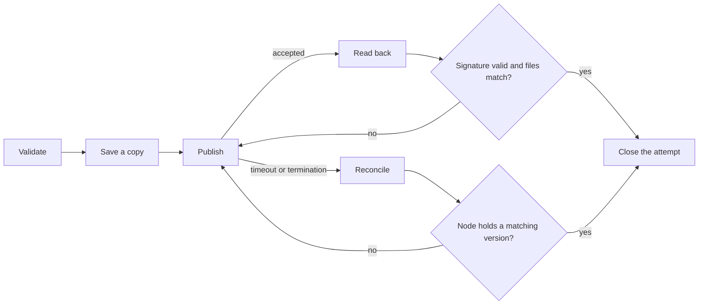

# 1.4 Application bundles

## Repositories

| Repository | Role | Work in this plan |
| --- | --- | --- |
| `freenet-appkit` | Modified | Packaging CLI: `app_definition.json` format, metadata and component validation, install checks, a saved copy of each release and verified readback, reconciliation after an uncertain submission. Host installation interface: candidate verification, release tracking, rollback and retention of installed copies |
| [freenet-core](https://github.com/freenet/freenet-core) | Used | `fdev website publish` and the stock website container as the unchanged publication base |
| [river](https://github.com/freenet/river) | Modified | River's release build gains `app_definition.json` and publishes through the packaging CLI |

## Purpose

Package and publish a single defined application's web UI, contract and delegate artifacts, and host metadata. For our 1st MVP we will use River and it's web UI, but custom native builds can use the SDK and their platform distribution process.

Freenet already builds contracts, archives a web directory, signs it and stores it in a website container. This plan adds what a mobile host needs around that base.

| Area | Freenet today | What we need |
| --- | --- | --- |
| Archive contents | `index.html`, application assets and `contracts/` from `fdev build` | `delegates/` and `app_definition.json` |
| Publication | `fdev website publish` archives, stamps a version, signs and submits in one call | Validation and a saved copy before the call, verified readback after it, reconciliation after an uncertain result |
| Installation | A browser opens `index.html` from the node | Install checks in the packaging CLI and the host's installation interface, release tracking, rollback, retention and component setup rules |
| References | Container key and version | `publication_ref` and `application_content_ref` encodings that name one exact release |

## The archive and its definition

`fdev build` writes `contracts/<code_hash>.wasm` and `dependencies.json`. `fdev website publish` requires `index.html`, creates a tar.xz archive, signs its version and archive, and submits it to the website container.

```text
index.html                    # today: required by fdev website publish
application code and assets   # today: loaded from index.html
contracts/
  <code_hash>.wasm            # today: written by fdev build
  dependencies.json           # today: written by fdev build
delegates/
  <delegate>.wasm             # This plan: delegates ship inside the archive
app_definition.json           # This plan: host metadata, every field below
```

Application code loads its assets from `index.html` and coordinates concrete application requests. `app_definition.json` is new in this plan and supplies the metadata the selected host needs. River's definition shows every field, with its purpose in the comments:

```jsonc
{
  "format_version": "1",                        // format version: how the host reads this file
  "name": "River",                              // name and description identify the app
  "description": "Group chat rooms on Freenet", // in trusted install and app-management screens
  "host_requirements": {                        // what the host must support to run the app
    "host_api": "1",                            // host API version the app code calls
    "protocols": { "river.chat": "1" }          // protocol versions the app code uses
  },
  "components": [                               // one entry per contract and delegate the app uses
    {
      "alias": "river.room",                    // the app's own name for the component
      "kind": "contract",                       // contract or delegate
      "artifact": "contracts/<code_hash>.wasm", // Wasm file in the archive, or a verified reference to it
      "parameters": "ChatRoomParametersV1",     // the app's encoding, since each room has its own { owner }
      "protocols": ["ChatRoomStateV1"],         // state format version this contract stores
      "setup": "none"                           // nothing at installation: the app and its delegate
                                                // create a room contract each time a user makes a room
    },
    {
      "alias": "river.chat",
      "kind": "delegate",
      "artifact": "delegates/chat.wasm",
      "parameters": "empty",                    // the exact parameters, here none
      "protocols": ["river.chat/1"],            // message format version this delegate uses
      "setup": "register"                       // the app registers the delegate with the node
                                                // after the user approves the installation
    }
  ],
  "permissions": {                              // each permission the app uses, as required or optional
    "required": [],                             // names are permission codes in Core's grant table
    "optional": ["notifications", "clipboard"]  // 1.3 Single-application host sets when the host asks
  }                                             // each delegate's Wasm manifest declares Background
}
```

River's [chat delegate protocol](https://github.com/freenet/river/blob/main/delegates/chat-delegate/README.md) and [invite parameter handling](https://github.com/freenet/river/blob/main/ui/src/components/members.rs) show the component fields in real code.

River's definition leaves out 3 fields:

- `capabilities` is added by [3.2 Release certification](../3-attribution-remuneration-payment/02-certification.md).
- `sdui` is added by [4.4 SDUI bundles and publication](../4-sdui/04-bundles.md).
- `predecessors` on each component is added by [4.4 SDUI bundles and publication](../4-sdui/04-bundles.md#publication).

Two values outside this file identify a release. The container identity is the full container `ContractKey`, and every River release keeps the same one. The container version is the Unix time that `fdev website publish` stamps and signs on each publication, for example `1790640000`. The host uses it to tell which publication is the newest.

A bundle carries web code, contracts and delegates. Changes to the native iOS or Android app ship as a new release through the App Store or Google Play.

## Setup

Each component's `setup` says what must happen before the app can use it. River uses `register` and `none`. The third value, `create`, has the app create one contract from the entry's initial-state rule.

The app's startup code runs these steps through host and SDK calls that the host authorizes:

- For `register`, the app supplies the cipher and nonce that `RegisterDelegate` needs.
- If the app closes partway through, running setup again finishes the job without doing any step twice.
- The app records when setup finishes. Features that need a component stay closed until then. For example, River's chat opens only after `river.chat` is registered.

## Publishing and evidence

`fdev website publish <dir> --key <name>` archives the directory, stamps the current Unix time as the version, signs the version and archive, and submits the result in one call. This plan keeps that command unchanged. The packaging CLI wraps it with validation, a saved copy, verified readback and reconciliation.



| Step | What the packaging CLI does |
| --- | --- |
| 1. Validate | Checks `app_definition.json`, component hashes, parameter fixtures, host API and protocol versions, and archive size limits. Rejects any permission name that isn't a code in the pinned Core. |
| 2. Save a copy | Saves a copy of the release folder, a digest of each file, the container key, the signing key name and an attempt record. If this save fails, the CLI stops and publishes nothing. |
| 3. Publish | Runs `fdev website publish` on the saved copy. The command builds the archive, stamps the version, signs it and sends it to the node. |
| 4. Read back | Reads the release back from the node. Checks the signature against the publisher's verifying key and compares every file with the saved copy.<br>If both match, the CLI saves the signed envelope and archive bytes as read back and closes the attempt. If not, it goes back to step 3.<br>--> Produces a `publication_ref`, which names this one signed archive: the full container `ContractKey`, the signed version, the hash algorithm and the archive digest.<br>--> Produces an `application_content_ref` with `kind: publication`, which holds that `publication_ref`. |
| 5. Reconcile | Runs when step 3 times out or the process stops, because the CLI can't tell whether the node got the release. It reads back first.<br>If the node holds a version whose files match the saved copy, the CLI saves that readback and closes the attempt. If not, it runs step 3 again on the same saved copy, and step 4 follows.<br>--> Produces the same references as step 4. |

If any file in the release changes, the packaging CLI treats it as a new release. It starts again at step 1 and saves a new copy.

An `application_content_ref` names the code an operation ran with. Step 4 produces the `kind: publication` form for web releases. A native iOS or Android build uses `kind: native`, with platform identity, build identity, hash algorithm and build digest.

## Installing a copy

The installation interface is the part of the host that checks, tracks, hands over and keeps installed releases. The packaging CLI runs the checks below before publishing, and the installation interface runs them again before any archive code runs.

| Check | Requirement |
| --- | --- |
| Container identity, signature and version | Match the selected application and verify the signed snapshot |
| Paths | Reject absolute paths, parent traversal, symlinks, hardlinks and duplicate paths |
| Executable content | Match the supported application profile and declared artifacts |
| Resource use | Enforce measured download, decompression, file-count and memory caps |
| Metadata and components | Verify artifact hashes, supported formats, parameter encodings and application protocols |
| Setup and permissions | Match approved setup and declared permissions |

Core today has a 50 MiB contract-state limit. Release tooling checks the pinned node and container limits together. [1.1 Mobile feasibility and supported profiles](01-feasibility.md#device-measurements) sets measured host caps. Each publication sends the whole archive, including assets. A separate blob-store proposal can use the [hash-keyed contract discussion #3985](https://github.com/freenet/freenet-core/issues/3985) as evidence.

The installation interface then takes each candidate release through these steps:

1. Check the candidate before running any of its code: host APIs, protocols, setup, device adapters and data compatibility. If the candidate changes delegates, setup or access, ask the user first, under the [base authorization rules in 1.3 Single-application host](03-host.md#base-authorization-and-device-access). For example, a River release that adds a delegate waits for Alice to approve it.
2. Record the candidate as the newest release seen, with its version, digest and the time the host saw it. Keep this record apart from the active release. A local rollback changes the active release and keeps the highest version seen.
3. Hand the verified `application_content_ref` to [activation in 1.3 Single-application host](03-host.md#activating-a-release).
4. Keep the active copy, one backup and every release that a stored record still references, within the storage budget. If any step fails, keep a working copy and the user's saved work.

It resolves these cases:

- A newer signed archive becomes a new candidate and goes through these steps.
- An older publication keeps the active copy and the newest observed record.
- Same-version divergence keeps the accepted bytes and both pieces of evidence, and suspends automatic activation until a higher signed version resolves the conflict.
- Unsupported host APIs or protocols keep the compatible copy and report the unmet requirement.
- A required permission this host lacks keeps the compatible copy and reports the unmet requirement. A request for an optional permission this host lacks returns unavailable.
- A deliberate local rollback passes current data compatibility checks.

## Saved copies and recovery

The packaging CLI keeps a saved copy of each release, including supported predecessor releases. Each saved copy holds the exact archive and signed envelope as read back. The website container holds its latest state, and network availability depends on hosting demand, as described in the [whitepaper status](https://github.com/freenet/paper-1/blob/main/sections/07-status.tex). Restoring an older release needs its saved copy and a compatible host.

The publisher keeps a tested backup of its signing key. The website container accepts updates only from that key, so a restored backup signs the next release to the same container.

## Acceptance

- River's web archive builds, signs, publishes and opens in the supported iOS and Android WebViews.
- Every fixture publishes through the unchanged `fdev website publish` and the stock website container.
- CLI/CI rejects unsafe paths, hash mismatches, unsupported metadata, invalid parameter fixtures and releases that exceed the selected profile's limits.
- A failed save in step 2 stops the call to `fdev website publish`. Timeout and termination fixtures reconcile by readback and publish the same saved copy again when the node holds no matching version.
- A consumer verifies a `publication_ref` against the saved copy after the live container advances. A `kind: native` reference verifies against its build digest.
- Setup can resume after termination. Changed delegates and new access pass the host's consent checks before activation.
- A restored backup of the publisher key signs a valid update to the same container.
- The installation interface handles replayed content, older publications, same-version divergence, unsupported requirements, rollback with changed data and cleanup while a retained record still references a release.

Sources: [website publication manual](https://freenet.org/build/manual/publish-a-website/), [container implementation](https://github.com/freenet/freenet-core/tree/main/crates/website-contract), [fdev website subcommand](https://github.com/freenet/freenet-core/blob/main/crates/fdev/src/website.rs).
