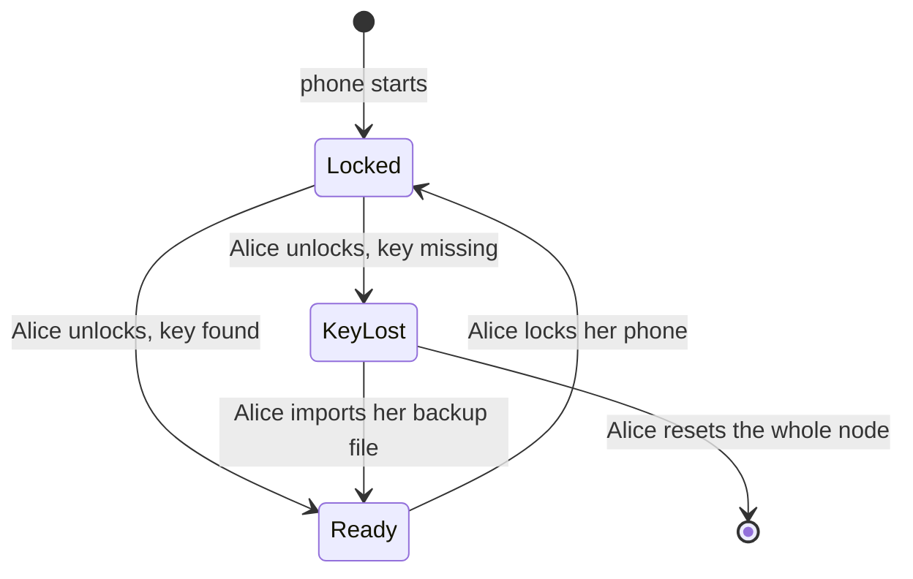

# 1.5 Identity, keys and local protection

## Repositories

| Repository | Role | Work in this plan |
| --- | --- | --- |
| [freenet-core](https://github.com/freenet/freenet-core) | Modified | Key protection, backup and restore |
| [river](https://github.com/freenet/river) | Used | Identity export fixture |

## Purpose

This plan keeps one app's keys and private data safe on the phone, and lets the user back them up and restore them. River is the first app:

- Alice's River identity key, her "Skate club" room secret and the DMs she sent are stored encrypted on her phone. The iOS Keychain or Android Keystore protects the key that unlocks them.
- Alice exports them to an encrypted backup file. Only her recovery code opens it.
- On a new iPhone or Android phone, she imports the file. The app lists what it restored and what the file left out.
- If Alice wants them gone, she deletes them, and the app confirms they were deleted.

The app goes to public users only after backup and restore pass the tests in [Acceptance](#acceptance).

## Keys in Freenet and River today

Today, Freenet and River give each part its own key:

| Key | What it is | Who controls it |
| --- | --- | --- |
| Application | River's website container key. Core computes it from the container code and the publisher's verifying key | Nobody holds it. Anyone can recompute it |
| Publisher | The key that signs each River bundle release | The River publisher |
| User | Alice's signing key for "Skate club". River makes one per room and stores it in its chat delegate | Alice |
| Delegate | River's chat delegate key, a hash of its code. Its secret store holds Alice's signing keys and the DMs she sent | Nobody holds it. Anyone can recompute it |
| Node network key | The key Alice's node uses to connect to other peers. Core creates it on first run and saves it as `transport_keypair` in its secrets directory | Alice's node |
| Node encryption key | The key that encrypts every delegate's secret store. Core calls it the KEK and keeps it in a systemd credential, a file, or the macOS or Windows keyring | Alice's node |

## What this plan adds

| Change | Why | How |
| --- | --- | --- |
| [Keep the node encryption key in the iOS Keychain or Android Keystore](#node-encryption-key) | Core's backends are built for desktops and servers. On a phone, the file backend would store the key next to the secrets it protects | [1.2 Embedded node and mobile SDK](02-sdk.md) adds Keychain and Keystore backends to Core. This plan stores the node encryption key there, with a key setting for each Android version |
| [Lock the key when the phone locks](#locking-and-unlocking) | Someone holding Alice's locked phone gets only encrypted data | Core wipes the key from memory when the phone locks and reads it again on unlock. Delegate calls in between return `Locked`. A missing key returns `KeyLost` |
| [One encrypted backup file](#app-specific-export-and-import) | Today Alice moves one room at a time with `riverctl identity export`, which writes an unencrypted token | Core's encrypted delegate backup (FNSX) uses a recovery code the app generates for Alice as its passphrase. One file holds the keys for all her rooms and her DMs |
| [New sessions after a restore](#app-specific-export-and-import) | A copied backup must never carry a live River session onto another phone | Export leaves out session tokens. Import opens new sessions through [1.3 Single-application host](03-host.md) |
| [Forget and whole-node reset](#forget) | Alice needs to remove application data or reset the phone's node | Application Forget deletes its owned data and grants. Whole-node reset deletes the node encryption key and clears the shared store |

## Protected keys and records

### Node encryption key

On first start, `crates/mobile` creates one encryption key for the node installation and stores it with the phone backend from [1.2 Embedded node and mobile SDK](02-sdk.md). Applications and EVY services attached to that installation share this KEK, following [Shared node and key scope in 1.3 Single-application host](03-host.md#shared-node-and-key-scope):

| Platform | Where the key lives | Key setting |
| --- | --- | --- |
| iOS | A Keychain item | `kSecAttrAccessibleWhenUnlockedThisDeviceOnly` |
| Android 9 to 11 | A file in the app's storage, encrypted with an Android Keystore AES key | [`setUnlockedDeviceRequired(true)`](https://developer.android.com/reference/android/security/keystore/KeyGenParameterSpec.Builder#setUnlockedDeviceRequired(boolean)) |
| Android 12 to 14 | The same file and Keystore key | No unlocked-device setting. On these versions, removing the lock screen deletes every key that has the setting, and a phone without a lock screen cannot create one |
| Android 15 and later | The same file and Keystore key | `setUnlockedDeviceRequired(true)` |

- `setUnlockedDeviceRequired` needs Android 9 (API 28), which sets the Android floor in [supported profiles in 1.1 Mobile feasibility and supported profiles](01-feasibility.md#supported-profiles).
- On iOS, Android 9 to 11 and Android 15 and later, the node can read the key only while the phone is unlocked. On Android 12 to 14, the Keystore key also works while the phone is locked. [Locking and unlocking](#locking-and-unlocking) wipes the key from memory on every version.
- [Keys in 1.2 Embedded node and mobile SDK](02-sdk.md#keys) tests each row with and without a lock screen.
- Core records the backend in `secrets_dir/kek_backend` and loads the key only from that backend. The host reports a missing key as `KeyLost`. The Keychain and Keystore backends add variants to Core's closed `KekBackendKind` enum.
- Core's keyring backend refuses only Linux, so on Android it would run on keyring's in-memory mock store. The Android build refuses the keyring backend too. We file this with the Keychain and Keystore backends as one issue under [#4137](https://github.com/freenet/freenet-core/issues/4137).
- `crates/mobile` sets the umask to `0o077` before it starts any thread, as Core's `freenet` binary does ([#4219](https://github.com/freenet/freenet-core/pull/4219)).
- The key stays on this phone. The app excludes its storage from iCloud and Google device backups, because a device backup would bring back the encrypted files without the key.
- Alice moves her data to a new phone with the backup file from [App-specific export and import](#app-specific-export-and-import).

### What the key protects

Core derives a separate key for each delegate from the node encryption key. The host derives one more key the same way for its own private records. `crates/mobile` turns off Core's secret snapshots ([Storage in 1.2 Embedded node and mobile SDK](02-sdk.md#storage)), so the phone keeps only each secret's current value.

| Record | Where it lives | Protected by | After a restore |
| --- | --- | --- | --- |
| Alice's signing key, room secrets and membership proof for "Skate club" | River's chat delegate store, under `room:<owner key>` | The chat delegate's derived key | Back from the backup file |
| DMs Alice sent | River's chat delegate store | The chat delegate's derived key | Back from the backup file |
| Records the app declares | Host records | The host's derived key | Back from the backup file |
| "Skate club" messages, members and bans | Room contract state on the network | The [room secret](https://github.com/freenet/river/blob/main/README.md#privacy-model) and member signatures | The app fetches them from the network |

### Locking and unlocking

Core's `SecretsStore` holds the node encryption key and every derived key in memory until the node stops. This plan adds a lock and an unlock to it:

| Event | iOS signal | Android signal | What happens |
| --- | --- | --- | --- |
| Phone locks | `protectedDataWillBecomeUnavailable` | `ACTION_SCREEN_OFF` | The host finishes pending secret writes. Core then wipes the key and every derived key from memory |
| Phone unlocks | `protectedDataDidBecomeAvailable` | `ACTION_USER_PRESENT` | Core reads the key again from the Keychain or Keystore |

Core keeps secret plaintext in zeroizing buffers, but no test checks that they are wiped ([#5599](https://github.com/freenet/freenet-core/issues/5599)). The lock work adds that test.



| State | What the host does |
| --- | --- |
| `Locked` | Returns `Locked` to delegate calls until Alice unlocks. The chat delegate's room secret rotation for rooms Alice owns also waits for the unlock |
| `KeyLost` | Reports the missing node KEK and the affected applications, retains their encrypted records and offers backup restore or whole-node reset. Restoring one application's backup recovers that application's selected records; each affected application has its own recovery coverage report |

Recovery from a lost KEK creates one replacement installation KEK in the Keychain or Keystore before staging a backup. The host labels the retained encrypted generations with their lost key generation and keeps them quarantined for recovery. Restored application generations use the replacement KEK. Each application whose records remain under the lost key stays in `KeyLost` until its own backup is restored or its data is forgotten. The host records these states durably so a restart resolves each application to its restored or quarantined generation.

### Forget

Removing River from the host keeps its keys and private records on the phone until Alice forgets River.

Application Forget follows the host's verified ownership selection. Its nonsecret cleanup journal is host-owned control data and remains available through application-data deletion and whole-node reset until cleanup verifies:

1. Persist a cleanup-pending record for the target application, disable its backup runs and invalidate its identity generation. Close its sessions, delegate activity and active exports, and revoke its grants to shared components. Backup setup, key installation and file publication use the same per-application coordinator as Forget; callbacks act only on the current enabled identity generation.
2. Delete its owned delegate secrets, retained predecessor copies and private host records, including local backup keys, folder-access records, backup settings and temporary export files. Wipe its plaintext export buffers and cached backup-key material. Delete exclusive registrations and release its references to shared contracts, delegates and platform folder grants. Keep the node KEK and the data of remaining consumers.
3. Verify cleanup through every selected store, including app-owned Keychain or Keystore entries and OS folder grants. Retry incomplete cleanup on restart before opening a new identity or enabling backups for that application, and report failures. Mark Forget complete after cleanup verifies. The report distinguishes application-record deletion from the cryptographic erasure performed by a whole-node reset, and lists what stays elsewhere:
   - Messages Alice posted stay in "Skate club" on the network.
   - Backup files she exported keep working.
   - River on her other devices keeps her identity.
   - If Alice owns "Skate club", only her key can change its settings. She needs a backup file to do that again.

Before giving her phone away, Alice uses the host's whole-node reset. The host lists every affected application, closes all sessions and wipes plaintext and derived keys from memory. It runs backup-key, folder-access and temporary-file cleanup for every affected application, invalidates their identity generations, then deletes the KEK with Core's `KekBackend::delete` and clears the node store. It verifies cleanup across the node, platform key stores and host records, retaining its cleanup journal while any deletion awaits retry. Erasing the KEK makes retained copies of KEK-encrypted files unreadable. The host reports any incomplete deletion and the exported backups and network copies that remain.

## App-specific export and import

Alice saves River's keys and private records in one encrypted backup file. On a new iPhone or Android phone, she opens the file with her recovery code and gets her rooms and DMs back.

Today, Core's `export` and `import` commands move a node's delegate secrets through one [FNSX file](https://github.com/freenet/freenet-core/blob/main/docs/secrets-at-rest.md), encrypted with a passphrase. River's UI and [`riverctl identity export`](https://github.com/freenet/river/blob/main/cli/README.md) share one unencrypted `IdentityExport` token per room ([river#136](https://github.com/freenet/river/issues/136)).

### Recovery code

When Alice turns on backups, the app generates a recovery code and shows it once. Alice writes it down and types it back to confirm. The app tells her that if she loses both the code and her phone, nobody can recover her River identity.

We track Core [#5764](https://github.com/freenet/freenet-core/issues/5764), passkeys with PRF brokered by the shell, as a way to seal a backup with a synced passkey. WebAuthn with PRF needs the origin `localhost`.

### The backup file

```text
River backup file
├── Header: format version
├── Manifest: River's container key, release version and coverage report
├── Core backup bundle: delegate secrets, Wasm and exact registration parameters, encrypted with Alice's recovery code
└── Host records River declares, encrypted with Alice's recovery code
```

Core derives the backup key from the recovery code with Argon2id and encrypts the bundle with XChaCha20-Poly1305. The host encrypts its records the same way. Each part has one layer of encryption, and the manifest holds no secrets.

Backup support requires Core's executable-inclusive export and import proposed in [#4035](https://github.com/freenet/freenet-core/issues/4035). Core includes the Wasm, code hash, delegate key and exact registration parameters for every delegate whose secrets the file holds. These entries share the secrets bundle's authenticated encryption. The mobile export and import surface exposes this capability to the host.

Application selection requires [C11 Scope private-data operations on a shared node](../UPSTREAM_ISSUES.md#c11-scope-private-data-operations-on-a-shared-node). Core applies the host-authorized namespace selection before building an export, importing records or deleting data. The host checks an authenticated backup's selected namespaces against the target application's ownership before staging. Whole-node export is a separate host-owned operation with a coverage report for all included applications.

The coverage report tells Alice how each part comes back:

| From the file | From the network | Created by the new phone |
| --- | --- | --- |
| Signing keys, room secrets, the DMs she sent and host records | "Skate club" messages, members and bans | Session tokens and node keys |

### Export

Alice runs the export with River open, and the node keeps running:

1. `crates/mobile` calls Core's executable-inclusive export on the running node, using `export_bundle` for secrets and the delegate code and registration export required under #4035.
2. The host supplies River's verified ownership selection: its current and supported predecessor delegate namespaces and declared host-record sets. Core exports those entries with their code and parameters. The coverage report lists the selected namespaces and any shared data the app accesses through another owner's component.
3. The host adds the manifest and its encrypted records.
4. The host opens the iOS or Android save dialog, because a download from the app's frame does nothing. Freenet Mail sends its backup downloads through the shell in the browser for the same reason ([mail#77](https://github.com/freenet/mail/issues/77), [mail#194](https://github.com/freenet/mail/pull/194)).
5. Alice saves the file wherever she likes, for example iCloud Drive or Google Drive.

### Restore

1. Alice picks the file and types her recovery code. The host authenticates and decrypts the full backup, including its declared host records. A wrong code or a damaged file stops the restore before anything is written.
2. The host checks that this River release can read the file. Core verifies each Wasm code hash and delegate registration against the authenticated bundle, and the app checks that its migration adapters and mobile runtime support each restored generation. The host shows Alice what the file holds and asks her to confirm. These checks finish before any restore writes.
3. `crates/mobile` creates an encrypted staging store for River. Core installs and registers the bundled delegates there through the capability required under #4035, then restores their secrets under the recorded keys with `import_bundle`. The host writes the declared host records into the same staged generation.
4. River runs its supported delegate migrations in staging and verifies the resulting records. The host activates the complete generation through the [staged restore transaction](#staged-restore-transaction).
5. River checks each restored signing key against Alice's member entry in "Skate club", then fetches messages, members and bans. The host opens new sessions and shows Alice the coverage report.

A backup from a supported earlier River release supplies that release's chat delegate Wasm and exact parameters. Core registers it in staging and restores its secrets under the recorded key. River carries those secrets forward to the current chat delegate in staging, as [1.7 Upgrades and migration](07-migration.md#delegate-secret-export-and-import) describes. Public release requires this restore path to pass on iOS and Android.

### Staged restore transaction

`crates/mobile` coordinates one restore transaction for the target app's delegate code, registrations, secrets and declared host records. The host shows a native restoring screen and pauses the app's sessions during the transaction. The existing generation stays selected until activation succeeds. Staging uses the node encryption key's Keychain or Keystore protection on iOS and Android.

| Phase | Required behavior |
| --- | --- |
| Stage | Write the backup into a separate generation with its own delegate and host-record stores. Core's per-entry `import_bundle` writes go into this generation. |
| Validate and migrate | Check restored records, run the app's supported migration adapters and verify successor readback in staging. Staged delegates run only the restore adapters; network writes, subscriptions and automatic wake-ups resume after activation. |
| Prepare activation | Flush the complete generation and its validated manifest to durable storage. Use the host's ownership and grant records to find consumers of any shared namespace being replaced. Close the target app's and affected consumers' sessions, delegate activity and store handles. Unrelated applications keep running |
| Activate | Atomically switch one durable activation record to select the complete generation. Core and the host resolve their stores through that record. New sessions open against the selected generation. |
| Recover | Before opening sessions after a restart, read the activation record. An interruption before the switch selects the existing generation; an interruption after the switch selects the complete restored generation. A failed staging attempt leaves the existing generation selected and offers a retry. |
| Clean up | Reclaim the superseded generation and abandoned staging files after activation or recovery has selected a complete generation. |

The transaction replaces the target app's selected data together within the shared node. Other applications retain their data, and the node KEK stays active. The durable activation record selects the target app's generation; Core continues resolving other ownership scopes through their existing generations. Affected shared-component consumers reopen with new sessions after resolving the restored component and revalidating their grants and identity-dependent state. Callbacks from their previous sessions are rejected. Local restore success means the complete generation is active; network refresh follows activation. Core's store isolation and durable activation support are tracked as [C10 Stage and activate a complete app restore](../UPSTREAM_ISSUES.md#c10-stage-and-activate-a-complete-app-restore).

## Acceptance

- On iOS and Android, River's backup file restores Alice's signing keys, room secrets and DMs onto a fresh installation.
- On iOS and Android, a fresh installation containing only the latest River release restores a backup from a supported earlier delegate build using the file's Wasm and exact parameters, then migrates its keys and records to the current delegate. Fixtures cover skipped releases, code or registration mismatches and unsupported generations; validation failures keep the phone's data intact.
- Host records River declares round-trip through the backup file. Device-local backup keys, folder-access grants and cleanup-control records stay with their owning installation.
- On iOS and Android, restore over an existing identity with different signing keys, room secrets and host records. Inject failures during code installation, each secrets and host-record write, migration, validation and activation. After recovery, the app reads either the complete existing generation or the complete restored generation. Fixtures include full storage and process termination immediately before and after the activation switch.
- On iOS and Android, staged delegates produce network effects only after activation. A successful restore opens new sessions, rejects callbacks from superseded sessions and reclaims staging files after recovery.
- Tests cover wrong recovery codes, damaged or cut-off files, unknown format versions, oversized fields, interrupted imports, reinstall and full storage.
- On Android 9 to 11 and Android 15 and later, the node key has `setUnlockedDeviceRequired(true)`. On Android 12 to 14 it does not, and Alice keeps River's data after she removes her lock screen.
- On iOS and Android, locking the phone wipes the key from memory, and delegate calls return `Locked` until the unlock. A test checks that the wipe zeroes the key and every derived key. A missing key returns `KeyLost` and keeps the encrypted store until import or forget.
- A restore opens new sessions and passes host isolation tests. A copied backup file opens only with its recovery code.
- On iOS and Android, River and a second admitted application use the same node KEK. River's export contains its selected records and component code; restoring or forgetting River preserves the second application's private data and working sessions. Scope substitution fails authorization. Forget verifies app-owned backup-key and folder-access cleanup, reports deletion results and retains external backup files.
- On iOS and Android, Forget during export, backup setup or post-restore key storage fences earlier callbacks. Termination during cleanup resumes the remaining deletions before a new identity starts. Key or folder-grant deletion failures remain visible and retryable; unrelated applications keep their backup credentials and node access.
- On iOS and Android, whole-node reset closes every application's sessions, wipes keys from memory, deletes the KEK and clears the node store. Fixtures verify that retained KEK-encrypted copies become unreadable and that failures are reported.
- On iOS and Android, lose the KEK of a node holding two applications. Restore their backups separately under one replacement KEK, with a restart between restores. The recovered application works while the other remains in `KeyLost` with its encrypted generation retained; the second restore recovers its own data.
- On iOS and Android, restore a shared delegate's owning application while another application consumes it. Activation closes both applications' affected sessions, rejects old callbacks and reopens consumers against the restored generation after grant and identity checks. An unrelated application's sessions and records keep working.
- The baseline passes before public release with valuable identities.
