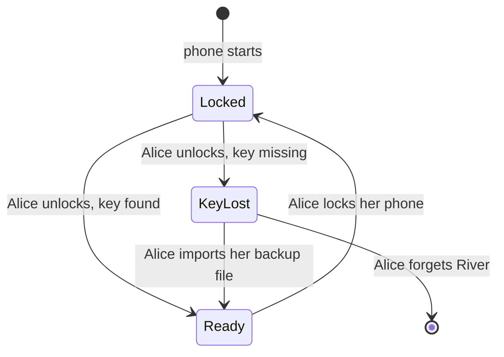

# 1.5 Identity, keys and local protection

## Repositories

| Repository | Role | Work in this plan |
| --- | --- | --- |
| [freenet-core](https://github.com/freenet/freenet-core) | Modified | Key protection, backup and restore |
| [river](https://github.com/freenet/river) | Used | Identity export fixture |

## Purpose

This plan keeps one app's keys and private data safe on the phone, and lets the user back them up and restore them. River is the first app:

- Alice's River identity key, her "Skate club" room secret and the DMs she sent are stored encrypted on her phone. The iOS Keychain or Android Keystore protects the key that unlocks them.
- Alice exports them to an encrypted backup file. Only her recovery code opens it.
- On a new iPhone or Android phone, she imports the file. The app lists what it restored and what the file left out.
- If Alice wants them gone, she deletes them, and the app confirms they were deleted.

The app goes to public users only after backup and restore pass the tests in [Acceptance](#acceptance).

## Keys in Freenet and River today

Today, Freenet and River give each part its own key:

| Key | What it is | Who controls it |
| --- | --- | --- |
| Application | River's website container key. Core computes it from the container code and the publisher's verifying key | Nobody holds it. Anyone can recompute it |
| Publisher | The key that signs each River release when the publisher runs `fdev website publish` | The River publisher |
| User | Alice's signing key for "Skate club". River makes one per room and stores it in its chat delegate | Alice |
| Delegate | River's chat delegate key, a hash of its code. Its secret store holds Alice's signing keys and the DMs she sent | Nobody holds it. Anyone can recompute it |
| Node network key | The key Alice's node uses to connect to other peers. Core creates it on first run and saves it as `transport_keypair` in its secrets directory | Alice's node |
| Node encryption key | The key that encrypts every delegate's secret store. Core calls it the KEK and keeps it in a systemd credential, a file, or the macOS or Windows keyring | Alice's node |

## What this plan adds

| Change | Why | How |
| --- | --- | --- |
| [Keep the node encryption key in the iOS Keychain or Android Keystore](#node-encryption-key) | Core's backends are built for desktops and servers. On a phone, the file backend would store the key next to the secrets it protects | [1.2 Embedded node and mobile SDK](02-sdk.md) adds Keychain and Keystore backends to Core. This plan stores the node encryption key there, with a key setting for each Android version |
| [Lock the key when the phone locks](#locking-and-unlocking) | Someone holding Alice's locked phone gets only encrypted data | Core wipes the key from memory when the phone locks and reads it again on unlock. Delegate calls in between return `Locked`. A missing key returns `KeyLost` |
| [One encrypted backup file](#app-specific-export-and-import) | Today Alice moves one room at a time with `riverctl identity export`, which writes an unencrypted token | Core's encrypted delegate backup (FNSX) uses a recovery code the app generates for Alice as its passphrase. One file holds the keys for all her rooms and her DMs |
| [New sessions after a restore](#app-specific-export-and-import) | A copied backup must never carry a live River session onto another phone | Export leaves out session tokens. Import opens new sessions through [1.3 Single-application host](03-host.md) |
| [Forget](#forget) | Alice needs to wipe River's keys before she gives her phone away | The host deletes the node encryption key, then River's storage, and reports anything it could not delete |

## Protected keys and records

### Node encryption key

On first start, `crates/mobile` creates the node encryption key and stores it with the phone backend from [1.2 Embedded node and mobile SDK](02-sdk.md):

| Platform | Where the key lives | Key setting |
| --- | --- | --- |
| iOS | A Keychain item | `kSecAttrAccessibleWhenUnlockedThisDeviceOnly` |
| Android 9 to 11 | A file in the app's storage, encrypted with an Android Keystore AES key | [`setUnlockedDeviceRequired(true)`](https://developer.android.com/reference/android/security/keystore/KeyGenParameterSpec.Builder#setUnlockedDeviceRequired(boolean)) |
| Android 12 to 14 | The same file and Keystore key | No unlocked-device setting. On these versions, removing the lock screen deletes every key that has the setting, and a phone without a lock screen cannot create one |
| Android 15 and later | The same file and Keystore key | `setUnlockedDeviceRequired(true)` |

- `setUnlockedDeviceRequired` needs Android 9 (API 28), which sets the Android floor in [supported profiles in 1.1 Mobile feasibility and supported profiles](01-feasibility.md#supported-profiles).
- On iOS, Android 9 to 11 and Android 15 and later, the node can read the key only while the phone is unlocked. On Android 12 to 14, the Keystore key also works while the phone is locked. [Locking and unlocking](#locking-and-unlocking) wipes the key from memory on every version.
- [Keys in 1.2 Embedded node and mobile SDK](02-sdk.md#keys) tests each row with and without a lock screen.
- Core records the backend in `secrets_dir/kek_backend` and loads the key only from that backend. The host reports a missing key as `KeyLost`. The Keychain and Keystore backends add variants to Core's closed `KekBackendKind` enum.
- Core's keyring backend refuses only Linux, so on Android it would run on keyring's in-memory mock store. The Android build refuses the keyring backend too. We file this with the Keychain and Keystore backends as one issue under [#4137](https://github.com/freenet/freenet-core/issues/4137).
- `crates/mobile` sets the umask to `0o077` before it starts any thread, as Core's `freenet` binary does ([#4219](https://github.com/freenet/freenet-core/pull/4219)).
- The key stays on this phone. The app excludes its storage from iCloud and Google device backups, because a device backup would bring back the encrypted files without the key.
- Alice moves her data to a new phone with the backup file from [App-specific export and import](#app-specific-export-and-import).

### What the key protects

Core derives a separate key for each delegate from the node encryption key. The host derives one more key the same way for its own private records. `crates/mobile` turns off Core's secret snapshots ([Storage in 1.2 Embedded node and mobile SDK](02-sdk.md#storage)), so the phone keeps only each secret's current value.

| Record | Where it lives | Protected by | After a restore |
| --- | --- | --- | --- |
| Alice's signing key, room secrets and membership proof for "Skate club" | River's chat delegate store, under `room:<owner key>` | The chat delegate's derived key | Back from the backup file |
| DMs Alice sent | River's chat delegate store | The chat delegate's derived key | Back from the backup file |
| Records the app declares | Host records | The host's derived key | Back from the backup file |
| "Skate club" messages, members and bans | Room contract state on the network | The [room secret](https://github.com/freenet/river/blob/main/README.md#privacy-model) and member signatures | The app fetches them from the network |

### Locking and unlocking

Core's `SecretsStore` holds the node encryption key and every derived key in memory until the node stops. This plan adds a lock and an unlock to it:

| Event | iOS signal | Android signal | What happens |
| --- | --- | --- | --- |
| Phone locks | `protectedDataWillBecomeUnavailable` | `ACTION_SCREEN_OFF` | The host finishes pending secret writes. Core then wipes the key and every derived key from memory |
| Phone unlocks | `protectedDataDidBecomeAvailable` | `ACTION_USER_PRESENT` | Core reads the key again from the Keychain or Keystore |

Core keeps secret plaintext in zeroizing buffers, but no test checks that they are wiped ([#5599](https://github.com/freenet/freenet-core/issues/5599)). The lock work adds that test.



| State | What the host does |
| --- | --- |
| `Locked` | Returns `Locked` to delegate calls until Alice unlocks. The chat delegate's room secret rotation for rooms Alice owns also waits for the unlock |
| `KeyLost` | Returns `KeyLost` and keeps the encrypted store until Alice imports her backup file or forgets River |

### Forget

Removing River from the host keeps its keys and private records on the phone until Alice forgets River.

Alice forgets River before she gives her phone away:

1. The host deletes the node encryption key with Core's `KekBackend::delete`. Every delegate store and host record on the phone becomes unreadable at once. This includes copies the flash storage keeps after a file delete.
2. The host deletes River's storage directory and checks it is gone.
3. The host reports anything it could not delete, and what stays elsewhere:
   - Messages Alice posted stay in "Skate club" on the network.
   - Backup files she exported keep working.
   - River on her other devices keeps her identity.
   - If Alice owns "Skate club", only her key can change its settings. She needs a backup file to do that again.

## App-specific export and import

Alice saves River's keys and private records in one encrypted backup file. On a new iPhone or Android phone, she opens the file with her recovery code and gets her rooms and DMs back.

Today, Core's `export` and `import` commands move a node's delegate secrets through one [FNSX file](https://github.com/freenet/freenet-core/blob/main/docs/secrets-at-rest.md), encrypted with a passphrase. River's UI and [`riverctl identity export`](https://github.com/freenet/river/blob/main/cli/README.md) share one unencrypted `IdentityExport` token per room ([river#136](https://github.com/freenet/river/issues/136)).

### Recovery code

When Alice turns on backups, the app generates a recovery code and shows it once. Alice writes it down and types it back to confirm. The app tells her that if she loses both the code and her phone, nobody can recover her River identity.

We track Core [#5764](https://github.com/freenet/freenet-core/issues/5764), passkeys with PRF brokered by the shell, as a way to seal a backup with a synced passkey. WebAuthn with PRF needs the origin `localhost`.

### The backup file

```text
River backup file
├── Header: format version
├── Manifest: River's container key, release version and coverage report
├── Core's FNSX bundle: River's chat delegate store, encrypted with Alice's recovery code
└── Host records River declares, encrypted with Alice's recovery code
```

Core derives the FNSX key from the recovery code with Argon2id and encrypts the bundle with XChaCha20-Poly1305. The host encrypts its records the same way. Each part has one layer of encryption, and the manifest holds no secrets.

The coverage report tells Alice how each part comes back:

| From the file | From the network | Created by the new phone |
| --- | --- | --- |
| Signing keys, room secrets, the DMs she sent and host records | "Skate club" messages, members and bans | Session tokens and node keys |

### Export

Alice runs the export with River open, and the node keeps running:

1. `crates/mobile` calls Core's `export_bundle` on the running node's secret store, as Core's hosted export does. Only Core's command-line export needs the node stopped.
2. Core's export takes a whole secret scope. The node on this phone runs only River, so the scope holds River's delegate stores.
3. The host adds the manifest and its encrypted records.
4. The host opens the iOS or Android save dialog, because a download from the app's frame does nothing. Freenet Mail sends its backup downloads through the shell in the browser for the same reason ([mail#77](https://github.com/freenet/mail/issues/77), [mail#194](https://github.com/freenet/mail/pull/194)).
5. Alice saves the file wherever she likes, for example iCloud Drive or Google Drive.

### Restore

1. Alice picks the file and types her recovery code. The host decrypts its records first and writes them only after Core's import succeeds. A wrong code or a damaged file stops the restore before anything is written.
2. The host checks that this River release can read the file, shows Alice what it holds and asks her to confirm.
3. `crates/mobile` imports the FNSX bundle into the running node with Core's `import_bundle`, the call behind Core's live import endpoint `POST /v1/import` ([#4592](https://github.com/freenet/freenet-core/issues/4592), [#4603](https://github.com/freenet/freenet-core/pull/4603)). The host imports its records. The host keeps any River data already on the phone until the restore succeeds. If the import is interrupted, running it again is safe.
4. River checks each restored signing key against Alice's member entry in "Skate club", then fetches messages, members and bans.
5. The host opens new sessions and shows Alice the coverage report.

A backup from an older River release restores under that release's chat delegate key. River's startup sweep then carries the secrets forward to the current chat delegate, as [1.7 Upgrades and migration](07-migration.md#delegate-secret-export-and-import) describes. We track Core [#4035](https://github.com/freenet/freenet-core/issues/4035), which bundles the delegate Wasm with its exported secrets.

## Acceptance

- On iOS and Android, River's backup file restores Alice's signing keys, room secrets and DMs onto a fresh installation.
- Host records River declares round-trip through the backup file.
- Tests cover wrong recovery codes, damaged or cut-off files, unknown format versions, oversized fields, interrupted imports, reinstall and full storage.
- On Android 9 to 11 and Android 15 and later, the node key has `setUnlockedDeviceRequired(true)`. On Android 12 to 14 it does not, and Alice keeps River's data after she removes her lock screen.
- On iOS and Android, locking the phone wipes the key from memory, and delegate calls return `Locked` until the unlock. A test checks that the wipe zeroes the key and every derived key. A missing key returns `KeyLost` and keeps the encrypted store until import or forget.
- A restore opens new sessions and passes host isolation tests. A copied backup file opens only with its recovery code.
- Forget deletes the node encryption key first, then River's storage, and reports failures and the copies that stay elsewhere.
- The baseline passes before public release with valuable identities.
