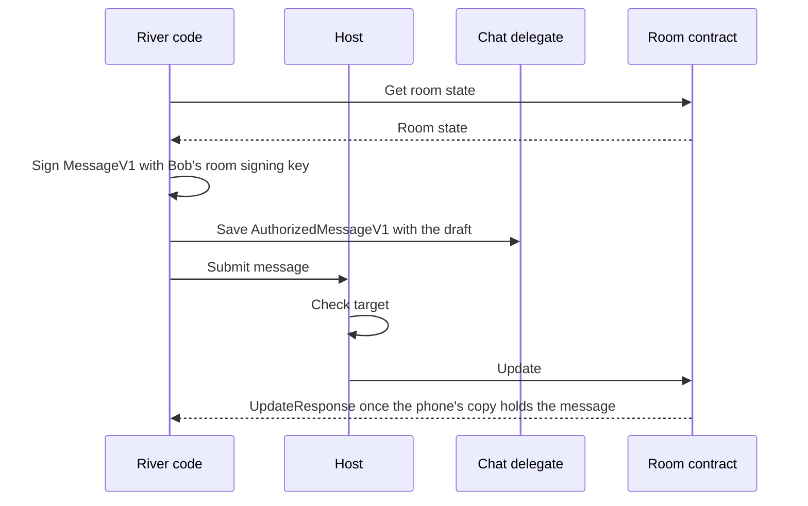

# 1.6 Application protocols, data and operations

## Repositories

| Repository | Role | Work in this plan |
| --- | --- | --- |
| [freenet-core](https://github.com/freenet/freenet-core) | Modified | `crates/mobile` gains arrival times on contract responses. Built on the delegate secret store in `native_api.rs`, [#5730](https://github.com/freenet/freenet-core/pull/5730) startup behavior, Core's offline update handling and [#5493](https://github.com/freenet/freenet-core/pull/5493) delegate subscription demand |
| `freenet-appkit` | Modified | River signing fixture |
| [river](https://github.com/freenet/river) | Modified | The chat delegate subscribes to each room the user owns, and River PUTs a lost room back. River saves drafts and signed messages waiting to be sent in the chat delegate's store. Chat delegate `SignMessage` and `SignResponse`, `AuthorizedMessageV1` and room state merge rules serve as fixtures |

## Purpose

This plan lets an app call its delegates. It also keeps the user's work safe when the phone goes offline, the app restarts or a new release installs. River is the first app. When Bob sends "Skate session Saturday?" to the "Skate club" room:

1. River saves the text as a draft in the chat delegate's store.
2. River reads the room, signs the message in its own code with Bob's room signing key and saves the signed message with the draft.
3. River sends the signed message to the room as an update. Core adds it to the phone's copy of the room, saves that copy on disk and answers River.
4. River marks the message sent and clears the draft.
5. Bob's phone loses signal, or River restarts. The message stays in the phone's copy of the room.
6. Back online, Core sends the room to peers that lack the message, and Alice and Carol see it.

The steps are the same whether Bob uses River's web UI or a native screen on iOS or Android. River's code decides the order of the steps. This plan supplies the parts:

| Part | Section |
| --- | --- |
| Delegate request and result formats, and caller policy | [Calling a delegate](#calling-a-delegate) |
| Arrival time on reads, and where drafts, private records and sent messages are stored | [Reads and local data](#reads-and-local-data) |
| What happens to a send when the phone is offline, River restarts or a message arrives twice | [Sending updates](#sending-updates) |
| Rooms the network lost | [Lost network state](#lost-network-state) |

## How a send works

Each part has one job:

- Application code coordinates requests, interprets domain results and updates its own UI.
- The host admits callers, checks grants and targets, routes replies and enforces resource limits.
- The SDK registers delegates, transfers bytes and correlates client requests and callbacks.
- A delegate holds private records, applies caller policy, and signs and prepares domain results.
- A contract validates shared state and merges updates through `ContractInterface`.

Shared helpers follow needs demonstrated by applications. Domain codecs, signing inputs and how to handle merge results stay with the application. Delegate secret upgrades use [1.7 Upgrades and migration](07-migration.md).

River's code runs each step of Bob's send:

Three rules apply to every step:

- The release pins the chat delegate's code, its parameter bytes and the protocol versions River supports for the whole session. Compatibility fixtures test those exact picks. [1.3 Single-application host](03-host.md) activates the session and checks permissions.
- River gets time and random values through interfaces that tests can replace. Fixtures supply fixed values.
- When a delegate returns a resource reference, the host checks it against target and query limits before River follows it.

## Calling a delegate

This plan builds on these APIs from freenet-stdlib's [client API](https://github.com/freenet/freenet-stdlib/blob/main/rust/src/client_api.rs) and [delegate interface](https://github.com/freenet/freenet-stdlib/blob/main/rust/src/delegate_interface.rs):

| API | What it does |
| --- | --- |
| `DelegateRequest::ApplicationMessages` | Carries a delegate key, parameters and inbound messages |
| `ApplicationMessage` | Carries opaque payload bytes, `DelegateContext` and a processed flag |
| `DelegateContext::MAX_SIZE` | Caps a `DelegateContext` at 409,600 bytes in stdlib today |
| `DelegateInterface::process` | Receives an `Option<MessageOrigin>` and produces outbound messages |
| `MessageOrigin::WebApp(contract id)` | Attests the web application when Core has authenticated its session |
| `MessageOrigin::Delegate(key)` | Attests the immediate calling delegate and replaces the web-app origin for that call |
| `OutboundDelegateMsg` | Reaches a client as `HostResponse::DelegateResponse` |

Delegates can request contract get, put, update, subscribe and unsubscribe operations, call another delegate, and issue `RequestUserInput`. Each supported path needs end-to-end SDK fixtures.

An app and its delegate share a delegate protocol, which fixes the exact payload encoding and what each message does. The app encodes and decodes its own messages, and the host passes the bytes through.

River's protocol is `river.chat/1`. Its [chat delegate](https://github.com/freenet/river/blob/main/common/src/chat_delegate.rs) accepts `SignMessage` with a request ID, room key and serialized `MessageV1`. The room key is the owner's key. It returns `SignResponse` with the same request ID and a 64-byte signature, or an error string when the room's key is unavailable. Application code combines the message and signature into [AuthorizedMessageV1](https://github.com/freenet/river/blob/main/common/src/room_state/message.rs). River's code maps the error string for its callers.

Each protocol's fixtures, River's included, pin:

- The exact bytes of every request and result
- The allowed range of each number
- The exact bytes the delegate signs
- How each protocol error maps to a host or app error
- Which side owns a byte buffer after it crosses the binding

Validation rejects:

- A request that reuses a request ID with different content
- A call that names an unknown handle
- A malformed result
- A result that arrives after its session expired

A delegate decides what a caller may do from these sources:

- `MessageOrigin`, attested by Core, is the verified caller. For River, it identifies the calling River container once session authentication succeeds.
- App, user or session fields inside the payload are unverified claims.
- Evidence the app's protocol defines and the delegate can check gives extra authority.

The host keeps each session's user and installation. Extra evidence reaches the delegate through the [trusted calls in 1.3 Single-application host](03-host.md#trusted-calls).

Subscription-triggered execution and the startup behavior described in [#5730](https://github.com/freenet/freenet-core/pull/5730) can run with no origin or request ID. Handle those as autonomous delegate events under explicit policy. Deliver private results only to authorized subscribers through the [host admission and routing rules in 1.3 Single-application host](03-host.md#freenet-issues-being-worked-on-that-are-required).

## Reads and local data

These calls come from the same Rust client API:

| API | What it does |
| --- | --- |
| `Get { key, return_contract_code, subscribe }` | Returns `GetResponse { key, contract, state }` or a missing-instance result |
| `Subscribe { key, summary }` | Returns `SubscribeResponse`, then `UpdateNotification { key, update }` |
| Contract responses | Carry contract identity and data |
| `ContractRequest` | Identifies each reply only by its response type and contract key. [1.2 Embedded node and mobile SDK](02-sdk.md) keeps two requests for the same contract apart |

The host records when each response arrives. Two times describe a read:

1. Arrival time is when Bob's phone received the response. The node can answer from its local copy, so the state inside can be older.
2. Created time is when Alice's device chose to set this value, it could be misleading or out of sync compared to Bob's device.

Subscriptions follow the [handle counting in 1.2 Embedded node and mobile SDK](02-sdk.md#ending-subscriptions).

River's data lives in two places:

| Record | Where it lives | How long it lasts |
| --- | --- | --- |
| Drafts, signed messages waiting to be sent and private records | The app delegate's secret store: `get_secret`, `set_secret`, `remove_secret` and prefix-based `list_secrets` in [native_api.rs](https://github.com/freenet/freenet-core/blob/main/crates/core/src/wasm_runtime/native_api.rs) | Until the user [forgets the app in 1.5 Identity, keys and local protection](05-identity.md#forget) |
| Sent messages | The node's copy of the room, on disk | While the node hosts the room. River's subscription to the room keeps it hosted |

[1.5 Identity, keys and local protection](05-identity.md) encrypts the delegate store and host records, locks them when the phone locks, backs them up and deletes them on forget. Apps batch draft edits, flush them on pause and backgrounding, and mark a save durable only after storage acknowledges it.

## Sending updates

`Update { key, data }` sends state, delta or both. The contract's `update_state` merges into the receiving replica and returns `UpdateModification`. `UpdateResponse { key, summary }` describes the local node's merge. An application observes its domain result through subsequent state.

Core merges every update into the phone's copy of the contract and saves it before it answers the app. It then sends the update to a peer when it has one ([op_ctx_task.rs](https://github.com/freenet/freenet-core/blob/main/crates/core/src/operations/update/op_ctx_task.rs)). When a connection opens, and every 5 minutes after, the node compares state summaries with peers that host the same contract. It sends its state to any peer that lacks part of it ([node.rs](https://github.com/freenet/freenet-core/blob/main/crates/core/src/node.rs)).

This is how Bob's send behaves:

| Situation | What happens |
| --- | --- |
| No signal, or Wi-Fi with no internet | Core adds the message to the phone's copy and answers River. Peers get it when the phone reconnects |
| River or the phone restarts after Core answered | The message stays in the phone's copy on disk and goes out when the phone reconnects |
| River stops before Core answered | The signed message is still in the delegate store with its draft. River sends those same bytes again |
| The same message arrives twice | The room keeps one copy, because each message ID is a hash of its signature ([message.rs](https://github.com/freenet/river/blob/main/common/src/room_state/message.rs)) |
| Local validation fails | Core returns an error. River keeps the draft and shows the error |

These rules apply to every send:

- An app subscribes to each contract it updates, so its node hosts the contract and can merge updates while offline. River subscribes to every room Bob is in.
- When a merge goes against the user, River decides what to show. For example, Alice's owner-signed configuration edit can lose to another valid edit under the room's merge rule in [configuration.rs](https://github.com/freenet/river/blob/main/common/src/room_state/configuration.rs), and River tells her the edit was overridden.
- If a ban rotates the room secret while Bob's reply is still a draft, River keeps the draft and decides whether to sign and send it.
- After a restart, reopening or release activation, River reads its drafts from the delegate store and the room from the node.

## Lost network state

Freenet keeps contract state only while peers host it. If every peer drops a room's state (the [cold-state case #4642](https://github.com/freenet/freenet-core/issues/4642)), River puts it back:

1. River's chat delegate subscribes to each room Alice owns, as Delta's delegate does for published sites in [delta#30](https://github.com/freenet/delta/issues/30). Once [#5493](https://github.com/freenet/freenet-core/pull/5493) lands, that subscription registers hosting demand, so Alice's node keeps the room.
2. If the network still loses "Skate club", River PUTs the node's copy back to the same room contract, the same way the chat delegate PUTs a new room. `freenet-git rescue` does the same for lost chunks.

## Acceptance

- On iOS and Android, River's read, draft, send and reconnect flows pass with its own code and chat delegate. The send signs with Bob's room signing key, checks the 64-byte signature, builds the `AuthorizedMessageV1` and sees it in room state.
- Byte-level fixtures keep River's request and response encoding, including request IDs and error strings. They cover malformed bytes, unsupported protocols, wrong signing inputs, missing keys, conflicting request IDs, oversized results, expired sessions and unauthorized targets.
- A small Swift and Kotlin fixture calls a delegate protocol at the support level set in 1.1 Mobile feasibility and supported profiles.
- Forged payload identities fail caller-policy tests. Delegate-to-delegate calls and origin-free events get only the authority their attested context supplies, and their private results reach only authorized sessions.
- Killing the app at each step (drafting, signing, sending) keeps the draft and signed message until Core answers, and keeps the message in the phone's copy of the room after. A resend after a restart leaves one copy of the message in room state.
- A message Bob sends with no signal, and one he sends on Wi-Fi with no internet, reach an independent peer after his phone reconnects.
- Concurrent edits, rotated room secrets, codec errors and incompatible versions produce defined outcomes, with repairable drafts where they apply.
- Permission revocation, device lock and expired sessions stop unauthorized effects and keep drafts. Storage exhaustion reports failed durable saves.
- A room Alice owns loses its network copy in an isolated test network. River PUTs the node's copy back to the same room contract, and an independent peer reads it back.
- Release activation keeps drafts and signed messages waiting to be sent.
- After a restore under 1.5 Identity, keys and local protection, River's drafts come back and each room refreshes from the network.
