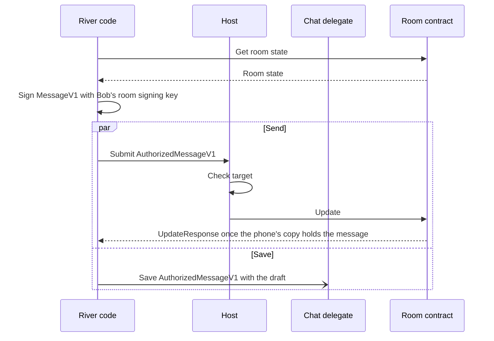

# 1.6 Application protocols, data and operations

## Repositories

| Repository | Role | Work in this plan |
| --- | --- | --- |
| [freenet-core](https://github.com/freenet/freenet-core) | Modified | Contract response timing and offline behavior |
| [freenet-appkit](https://github.com/glesage/freenet-appkit) | Modified | River signing fixture |
| [river](https://github.com/freenet/river) | Modified | Drafts and signed chat messages |
| [freenet-stdlib](https://github.com/freenet/freenet-stdlib) | Used | Client API and delegate interface |

## Purpose

This plan lets an app call its delegates. It also keeps the user's work safe when the phone goes offline, the app restarts or a new release installs. River is the first app. When Bob sends "Skate session Saturday?" to the "Skate club" room:

1. While Bob types, River saves the text as a draft in the chat delegate's store.
2. Bob taps send. River reads the room and signs the message in its own code with Bob's room signing key.
3. River sends the signed message to the room as an update. At the same time, it saves the signed message with the draft in the delegate store.
4. Core adds the message to the phone's copy of the room, saves that copy on disk and answers River.
5. River marks the message sent and clears the draft.
6. Bob's phone loses signal, or River restarts. The message stays in the phone's copy of the room.
7. Back online, Core sends the room to peers that lack the message, and Alice and Carol see it.

The send never waits for the delegate store. Delegate calls queue behind contract merges in the node's serial contract event loop, and River signs chat messages in the page for that reason ([river#512](https://github.com/freenet/river/issues/512), [river#518](https://github.com/freenet/river/pull/518)).

The steps are the same whether Bob uses River's web UI or a native screen on iOS or Android. River's code decides the order of the steps. This plan supplies the parts:

| Part | Section |
| --- | --- |
| Delegate request and result formats, and caller policy | [Calling a delegate](#calling-a-delegate) |
| Arrival time on reads, and where drafts, private records and sent messages are stored | [Reads and local data](#reads-and-local-data) |
| What happens to a send when the phone is offline, River restarts or a message arrives twice | [Sending updates](#sending-updates) |
| Rooms the network lost | [Lost network state](#lost-network-state) |

## How a send works

Each part has one job:

- Application code coordinates requests, interprets domain results and updates its own UI.
- The host admits callers, checks grants and targets, routes replies and enforces resource limits.
- The SDK registers delegates, transfers bytes and correlates client requests and callbacks.
- A delegate holds private records, applies caller policy, and signs and prepares domain results.
- A contract validates shared state and merges updates through `ContractInterface`.

Shared helpers follow needs demonstrated by applications. Domain codecs, signing inputs and how to handle merge results stay with the application. Delegate secret upgrades use [1.7 Upgrades and migration](07-migration.md).

River's code runs each step of Bob's send:

Three rules apply to every step:

- The release pins the chat delegate's code, its parameter bytes and the protocol versions River supports for the whole session. Compatibility fixtures test those exact picks and instantiate River's delegate on the pinned Core, because a delegate built on a newer stdlib can fail at instantiation on an older Core ([#5617](https://github.com/freenet/freenet-core/issues/5617)). [1.3 Single-application host](03-host.md) activates the session and checks permissions.
- River gets time and random values through interfaces that tests can replace. Fixtures supply fixed values. Core is removing host-clock access from contracts ([#5465](https://github.com/freenet/freenet-core/issues/5465)), so the fixtures also check that River's room contract imports no host clock.
- When a delegate returns a resource reference, the host checks it against target and query limits before River follows it.

## Calling a delegate

This plan builds on these APIs from freenet-stdlib's [client API](https://github.com/freenet/freenet-stdlib/blob/main/rust/src/client_api.rs) and [delegate interface](https://github.com/freenet/freenet-stdlib/blob/main/rust/src/delegate_interface.rs):

| API | What it does |
| --- | --- |
| `DelegateRequest::ApplicationMessages` | Carries a delegate key, parameters and inbound messages |
| `ApplicationMessage` | Carries opaque payload bytes, `DelegateContext` and a processed flag |
| `DelegateContext::MAX_SIZE` | Caps a `DelegateContext` at 409,600 bytes in stdlib today |
| `DelegateInterface::process` | Receives an `Option<MessageOrigin>` and produces outbound messages |
| `MessageOrigin::WebApp(contract id)` | Attests the web application when Core has authenticated its session |
| `MessageOrigin::Delegate(key)` | Attests the immediate calling delegate and replaces the web-app origin for that call |
| `OutboundDelegateMsg` | Carries a delegate's contract requests and replies. A reply reaches a client as `HostResponse::DelegateResponse` |

Delegates request contract get, put, update and subscribe operations through outbound messages ([#5638](https://github.com/freenet/freenet-core/pull/5638)). They can also call another delegate and issue `RequestUserInput`. Core refuses a delegate's `UnsubscribeContractRequest` as not yet implemented ([contract.rs](https://github.com/freenet/freenet-core/blob/main/crates/core/src/contract.rs), [#5600](https://github.com/freenet/freenet-core/issues/5600)). Each supported path needs end-to-end SDK fixtures.

An app and its delegate share a delegate protocol, which fixes the exact payload encoding and what each message does. The app encodes and decodes its own messages, and the host passes the bytes through.

River defines no protocol names, so [1.4 Application bundles](04-bundles.md#the-archive-and-its-definition) assigns River's protocol the name `river.chat/1`. When Alice invites Carol, River's UI sends the [chat delegate](https://github.com/freenet/river/blob/main/common/src/chat_delegate.rs) `SignMember` with a request ID, room key and serialized `Member`. The room key is the owner's key. The delegate returns `SignResponse` with the same request ID and a 64-byte signature, or the error string "Signing key not found for this room". River's UI checks the signature against Alice's key and signs locally when the check or the call fails ([signing.rs](https://github.com/freenet/river/blob/main/ui/src/signing.rs)). It then combines the member and signature into [AuthorizedMember](https://github.com/freenet/river/blob/main/common/src/room_state/member.rs). The protocol keeps `SignMessage` for older River clients.

Each protocol's fixtures, River's included, pin:

- The exact bytes of every request and result
- The allowed range of each number
- The exact bytes the delegate signs
- How each protocol error maps to a host or app error
- Which side owns a byte buffer after it crosses the binding

Validation rejects:

- A request that reuses a request ID with different content
- A call that names an unknown handle
- A malformed result
- A result that arrives after its session expired

A delegate decides what a caller may do from these sources:

- `MessageOrigin`, attested by Core, is the verified caller. For River, it identifies the calling River container once session authentication succeeds.
- App, user or session fields inside the payload are unverified claims.
- Evidence the app's protocol defines and the delegate can check gives extra authority.

A delegate gives the calling app only the authority its attested identity supports, as the Ghostkeys and Raven delegates do ([ghostkeys#28](https://github.com/freenet/ghostkeys/pull/28), [raven#64](https://github.com/freenet/raven/pull/64)). The host keeps each session's user and installation. Extra evidence reaches the delegate through the [trusted calls in 1.3 Single-application host](03-host.md#trusted-calls).

Subscription-triggered execution, the startup behavior described in [#5730](https://github.com/freenet/freenet-core/pull/5730) and wake-ups ([#5747](https://github.com/freenet/freenet-core/pull/5747)) can run with no origin or request ID. Handle those as autonomous delegate events under explicit policy. Notification runs get empty parameters ([#5616](https://github.com/freenet/freenet-core/issues/5616)), which matches River's chat delegate. Deliver private results only to authorized subscribers through the [host admission and routing rules in 1.3 Single-application host](03-host.md#freenet-issues-being-worked-on-that-are-required). Prompts from these runs follow [background runs and delegate prompts in 1.3 Single-application host](03-host.md#background-runs-and-delegate-prompts).

## Reads and local data

These calls come from the same Rust client API:

| API | What it does |
| --- | --- |
| `Get { key: ContractInstanceId, return_contract_code, subscribe, blocking_subscribe }` | Returns `GetResponse { key, contract, state }` or `ContractResponse::NotFound { instance_id }` ([#2362](https://github.com/freenet/freenet-core/pull/2362), [#2366](https://github.com/freenet/freenet-core/pull/2366)). Without `blocking_subscribe`, the reply can arrive before the subscription exists ([#2501](https://github.com/freenet/freenet-core/pull/2501)) |
| `Subscribe { key: ContractInstanceId, summary }` | Returns `SubscribeResponse`, then `UpdateNotification { key, update }` |
| Contract responses | Carry contract identity and data |
| `ContractRequest` | Identifies each reply only by its response type and contract key. [1.2 Embedded node and mobile SDK](02-sdk.md#matching-replies-to-requests) keeps two requests for the same contract apart |

The host records when each response arrives. Two times describe a read:

1. Arrival time is when Bob's phone received the response. The state inside can be older:
   - On a joined node, Core answers from the phone's copy only while some session holds a subscription to that contract. Otherwise it asks the network ([#2430](https://github.com/freenet/freenet-core/pull/2430)).
   - Before the first join, Core answers a read without a subscription from the phone's copy ([Start, stop and reconnect in 1.2 Embedded node and mobile SDK](02-sdk.md#start-stop-and-reconnect)).
2. Created time is when Alice's device chose to set this value. Her device clock can differ from Bob's.

Subscriptions follow the [handle counting in 1.2 Embedded node and mobile SDK](02-sdk.md#ending-subscriptions).

River's data lives in two places:

| Record | Where it lives | How long it lasts |
| --- | --- | --- |
| Drafts, signed messages waiting to be sent and private records | The app delegate's secret store: `get_secret`, `set_secret`, `remove_secret` and prefix-based `list_secrets` in [native_api.rs](https://github.com/freenet/freenet-core/blob/main/crates/core/src/wasm_runtime/native_api.rs) | Until the user [forgets the app in 1.5 Identity, keys and local protection](05-identity.md#forget) |
| Sent messages | The node's copy of the room, on disk | While the node hosts the room. River's subscription puts the room among the last that Core evicts, but it does not pin the room. Eviction deletes the copy from disk ([#4212](https://github.com/freenet/freenet-core/pull/4212)), and a bounded local pin is open in [#5041](https://github.com/freenet/freenet-core/issues/5041). [Storage in 1.2 Embedded node and mobile SDK](02-sdk.md#storage) sets the hosting budget |

[1.5 Identity, keys and local protection](05-identity.md) encrypts the delegate store and host records, locks them when the phone locks, backs them up and deletes them on forget. Apps batch draft edits, flush them on pause and backgrounding, and mark a save durable only after storage acknowledges it.

River stores drafts by these rules:

- Each draft gets its own small key, apart from River's room records. River's room slots cache room state, and each chat message rewrote about 373 KiB per member until River delayed those writes ([river#533](https://github.com/freenet/river/issues/533), [river#534](https://github.com/freenet/river/pull/534)).
- Two tabs, a background run and the UI can write the same draft. So River writes drafts with its compare-and-swap requests `GetVersionedRequest` and `CasStoreRequest` ([river#345](https://github.com/freenet/river/issues/345), [river#347](https://github.com/freenet/river/pull/347)).
- Core sets no quota on local-scope secrets ([#5560](https://github.com/freenet/freenet-core/issues/5560)), so River caps the number and size of its drafts. `list_secrets` returns at most 4,096 keys per scope ([store.rs](https://github.com/freenet/freenet-core/blob/main/crates/core/src/wasm_runtime/secrets_store/store.rs)).
- `crates/mobile` turns off Core's secret snapshots ([Storage in 1.2 Embedded node and mobile SDK](02-sdk.md#storage)), so a deleted draft leaves no older copy on the phone.

Mail keeps drafts the same way, in a per-device delegate that saves on every keystroke ([mail#56](https://github.com/freenet/mail/pull/56)).

## Sending updates

`Update { key, data }` sends state, delta or both. The contract's `update_state` merges into the receiving replica and returns `UpdateModification`. `UpdateResponse { key, summary }` describes the local node's merge. An application observes its domain result through subsequent state.

Core merges every update into the phone's copy of the contract and saves it before it answers the app. It then sends the full merged state to a peer when it has one ([op_ctx_task.rs](https://github.com/freenet/freenet-core/blob/main/crates/core/src/operations/update/op_ctx_task.rs), [#4072](https://github.com/freenet/freenet-core/pull/4072)). On cellular, each message then costs the whole room state. A serving peer accepts about 10 updates per second for one contract from one sender ([Running Wasm in 1.2 Embedded node and mobile SDK](02-sdk.md#running-wasm)).

When a connection opens, and every 5 minutes after, the node compares state summaries with peers that host the same contract. Each round covers up to 64 contracts shared with that peer, so a shared set of `n` contracts takes `ceil(n / 64)` rounds ([interest.rs](https://github.com/freenet/freenet-core/blob/main/crates/core/src/ring/interest.rs)). The node sends its state to any peer that lacks part of it ([node.rs](https://github.com/freenet/freenet-core/blob/main/crates/core/src/node.rs)).

This is how Bob's send behaves:

| Situation | What happens |
| --- | --- |
| The node joined, then the phone lost signal or kept Wi-Fi with no internet | Core adds the message to the phone's copy and answers River. Peers get it when the phone reconnects |
| River started with no signal, so the node has not joined yet | The SDK holds the message until the first join, and River keeps the draft, as [Start, stop and reconnect in 1.2 Embedded node and mobile SDK](02-sdk.md#start-stop-and-reconnect) describes |
| River or the phone restarts after Core answered | The message stays in the phone's copy on disk and goes out when the phone reconnects |
| River stops before Core answered | River reads the signed message from the delegate store and sends those same bytes again. If River stopped before that save finished, the last saved draft remains |
| The same message arrives twice | The room keeps one copy, because each message ID is a hash of its signature ([message.rs](https://github.com/freenet/river/blob/main/common/src/room_state/message.rs)) |
| Local validation fails | Core returns an error, which the SDK maps as [typed errors in 1.2 Embedded node and mobile SDK](02-sdk.md#typed-errors) describes. River keeps the draft and shows the error |

These rules apply to every send:

- An app subscribes to each contract it updates, so its node hosts the contract and can merge updates while offline. River subscribes to every room Bob is in, again on each start, because client subscriptions do not survive a node restart ([#4785](https://github.com/freenet/freenet-core/issues/4785)). On reconnect River subscribes with a full-state `Put { subscribe: true }` and holds outbound updates until each PUT reply arrives ([river#561](https://github.com/freenet/river/issues/561)).
- Before its first update to a contract it does not hold, an app reads the contract and waits for the state or `NotFound`. Core bounces an update for a contract the node lacks ([#5724](https://github.com/freenet/freenet-core/issues/5724)), and Harvest lost a buyer's first message that way ([harvest#119](https://github.com/freenet/harvest/issues/119), [harvest#126](https://github.com/freenet/harvest/pull/126)).
- When a merge goes against the user, River decides what to show. For example, Alice's configuration edit from her phone loses to her own edit from her laptop when that edit has a higher `configuration_version` ([configuration.rs](https://github.com/freenet/river/blob/main/common/src/room_state/configuration.rs)). River tells her the edit was overridden. Two edits with the same version never converge ([river#703](https://github.com/freenet/river/issues/703)).
- Core checks a sample of 1 in 32 updates for idempotency and stops committing and broadcasting a contract that fails ([#4279](https://github.com/freenet/freenet-core/pull/4279), [#4306](https://github.com/freenet/freenet-core/pull/4306)). Core plans to warn about, and then remove, contracts that break merge laws ([#5320](https://github.com/freenet/freenet-core/issues/5320), [#5629](https://github.com/freenet/freenet-core/issues/5629)). So River's fixtures run `fdev verify-merge` on the room contract ([#5725](https://github.com/freenet/freenet-core/issues/5725)).
- If a ban rotates the room secret while Bob's reply is still a draft, River keeps the draft and decides whether to sign and send it.
- After a restart, reopening or release activation, River reads its drafts from the delegate store and the room from the node.

## Lost network state

Freenet keeps contract state only while peers host it. If every peer drops a room's state (the [cold-state case #4642](https://github.com/freenet/freenet-core/issues/4642)), River puts it back with code it already has:

1. River's UI asks the chat delegate to subscribe to each room Alice owns (`EnsureRoomSubscription`, [river#235](https://github.com/freenet/river/pull/235), [river#276](https://github.com/freenet/river/pull/276)). The subscription takes network interest ([#5615](https://github.com/freenet/freenet-core/pull/5615)) and comes back after a restart ([#5728](https://github.com/freenet/freenet-core/pull/5728)). Hosting demand from delegate subscriptions is tracked in [#4669](https://github.com/freenet/freenet-core/issues/4669).
2. When a subscribe finds no room on the network and the node holds a copy, River's UI waits 20 seconds (`REPUT_DELAY_MS`) and PUTs the node's copy back to the same room contract ([subscribe_response.rs](https://github.com/freenet/river/blob/main/ui/src/components/app/freenet_api/response_handler/subscribe_response.rs), backward probe [river#293](https://github.com/freenet/river/pull/293)). [freenet-git](https://github.com/freenet/freenet-git) `rescue` does the same for lost chunks.

The repair has these limits:

- A delegate holds at most 256 subscriptions. Past that, Core drops the least recently notified one without telling the delegate ([#5623](https://github.com/freenet/freenet-core/pull/5623)).
- A delegate cannot tell whether its subscription took ([#5565](https://github.com/freenet/freenet-core/issues/5565)), and only a new subscribe refreshes it ([#5622](https://github.com/freenet/freenet-core/issues/5622)). River's UI asks again on each start and after each reconnect.
- A delegate GET returns `None` both for a missing room and when it could not find out ([stdlib #131](https://github.com/freenet/freenet-stdlib/issues/131)). So the re-PUT decision stays in River's UI, which reads the subscribe result.
- A phone behind NAT sends a PUT slowly, and state of 1 MiB or more may not reach peers ([#5643](https://github.com/freenet/freenet-core/issues/5643)).
- Core publishes no figure for how long a subscribed contract stays hosted. [D5310](https://github.com/freenet/freenet-core/discussions/5310) asks the same question, and we track its answer to time River's re-PUT.

## Acceptance

- On iOS and Android, River's read, draft, send and reconnect flows pass with its own code and chat delegate. River signs Bob's message with his room signing key, builds the `AuthorizedMessageV1` and sees it in room state. A `SignMember` call for Alice's invitation of Carol returns a 64-byte signature that verifies with Alice's key.
- Byte-level fixtures keep River's request and response encoding, including request IDs and error strings. They cover malformed bytes, unsupported protocols, wrong signing inputs, missing keys, conflicting request IDs, oversized results, expired sessions and unauthorized targets.
- A small Swift and Kotlin fixture calls a delegate protocol through the delegate calls that [1.2 Embedded node and mobile SDK](02-sdk.md) adds to the native API.
- Forged payload identities fail caller-policy tests. Delegate-to-delegate calls and origin-free events get only the authority their attested context supplies, and their private results reach only authorized sessions.
- Killing the app while Bob drafts or sends keeps the last saved draft, and keeps the message in the phone's copy of the room once Core answers. A resend after a restart leaves one copy of the message in room state.
- A message Bob sends after his phone loses signal, and one he sends on Wi-Fi with no internet, reach an independent peer after his phone reconnects. A message he sends after River starts with no signal reaches an independent peer after the first join.
- Concurrent edits, rotated room secrets, codec errors and incompatible versions produce defined outcomes, with repairable drafts where they apply. River's room contract passes `fdev verify-merge`.
- Permission revocation, device lock and expired sessions stop unauthorized effects and keep drafts. Storage exhaustion reports failed durable saves.
- A room Alice owns loses its network copy in an isolated test network that pins its gateways and has no live-network peers ([#5552](https://github.com/freenet/freenet-core/issues/5552)). The test confirms that the owner-room subscription took. River PUTs the node's copy back to the same room contract, and an independent peer reads it back. The test runs once with a room above 1 MiB.
- Release activation keeps drafts and signed messages waiting to be sent.
- After a restore under [1.5 Identity, keys and local protection](05-identity.md#restore), River's drafts come back and each room refreshes from the network.
