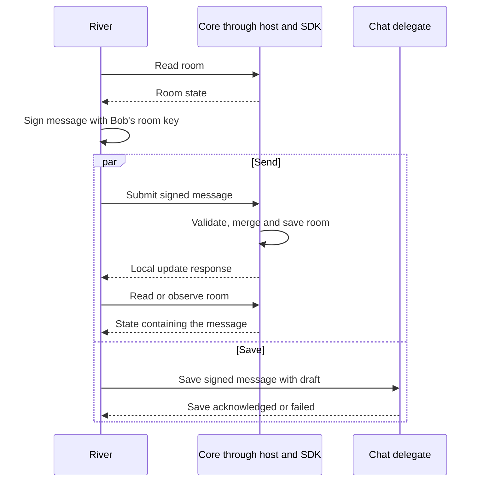

# 1.6 Application protocols, data and operations

## Repositories

| Repository | Role | Work in this plan |
| --- | --- | --- |
| [freenet-core](https://github.com/freenet/freenet-core) | Modified | Record response arrival times in the mobile API; test and fix local update response timing |
| [freenet-appkit](https://github.com/glesage/freenet-appkit) | Modified | River read, draft, send, invitation and recovery tests on iOS and Android |
| [river](https://github.com/freenet/river) | Modified | Save and recover drafts and pending signed messages; show save and send conflicts |
| [freenet-stdlib](https://github.com/freenet/freenet-stdlib) | Used | Client API and delegate interface |

## Purpose

This plan saves River's drafts and pending signed messages, records when read responses arrive, and tests recovery on iOS and Android.

Bob types "Skate session Saturday?" in the "Skate club" room:

1. River saves his draft and confirms when storage finishes.
2. Bob taps send. River reads the room, [signs the message locally](https://github.com/freenet/river/blob/main/ui/src/signing.rs) and submits it. Alongside the send, River saves the signed message for a possible retry.
3. After Core saves the room, River checks that its state contains the message.
4. After an interruption, River recovers the last acknowledged draft or pending message. Reconnect tests check that an independent peer receives the message.

Test River's web UI and a native SDK fixture on iOS and Android after outages, restarts and release changes.

| Deliverable | Section |
| --- | --- |
| Tests of River's invitation signing and the SDK's delegate calls | [Calling a delegate](#calling-a-delegate) |
| Response arrival times, saved drafts and pending messages | [Reads and local data](#reads-and-local-data) |
| Local confirmation, retries, duplicate handling and reconnect tests | [Sending updates](#sending-updates) |
| Tests of River restoring a room that peers dropped | [Lost network state](#lost-network-state) |

## How a send works

- **River:** Reads the room, signs the message, saves recovery records and shows the result.
- **Host:** Checks River's session, permission and room target; routes private replies.
- **SDK:** Passes requests to Core and matches each reply to its request.
- **Chat delegate:** Stores the draft and pending message; checks who may read or change them.
- **Room contract:** Checks the message signature and merges the message into room state.

SDK operations and host checks follow [1.2 Embedded node and mobile SDK](02-sdk.md) and [1.3 Single-application host](03-host.md).

Once River confirms the local message, it finishes any save of that message before deleting its saved draft and pending record. Cleanup uses version checks to preserve later edits and remains the final write. A failed save produces a recovery error. The send proceeds independently.

| Check | Requirement |
| --- | --- |
| Exact release | Load River's real delegate and room contract on the release's Core and stdlib versions. Keep the code, parameter bytes and protocols from [1.4 Application bundles](04-bundles.md) fixed for the session ([#5617](https://github.com/freenet/freenet-core/issues/5617)) |
| Repeatable messages | Supply fixed time and random values through test interfaces. Check that River's room contract imports no host clock ([#5465](https://github.com/freenet/freenet-core/issues/5465)) |
| References returned by a delegate | Apply the target and query limits from [1.3 Single-application host](03-host.md) before River follows the reference |

## Calling a delegate

Core and stdlib supply delegate messaging. This plan tests River's existing invitation flow through the mobile SDK on iOS and Android, using River's real chat delegate and the Core version included in the release.

### Alice invites Carol

Alice invites Carol to "Skate club" through River's [chat delegate](https://github.com/freenet/river/blob/main/common/src/chat_delegate.rs):

1. River sends Carol's membership details, the room key and a request ID to the delegate.
2. The delegate returns a 64-byte signature with the same request ID.
3. River checks the signature against Alice's public key and combines it with Carol's membership details into a [signed membership record](https://github.com/freenet/river/blob/main/common/src/room_state/member.rs).

The test verifies the delegate's signature, then tests River's [local signing fallback](https://github.com/freenet/river/blob/main/ui/src/signing.rs) after a failed call or signature check. River defines its message format and signs chat messages in its own code.

### Work supplied by other plans

- **[1.2 Embedded node and mobile SDK](02-sdk.md):** Delegate calls from Swift on iOS and Kotlin on Android, reply matching, errors and safe transfer of message data.
- **[1.3 Single-application host](03-host.md#trusted-calls):** Checks on the app, user, installation, permissions and session; private replies reach authorized sessions.
- **[1.4 Application bundles](04-bundles.md#the-archive-and-its-definition):** Names River's message format `river.chat/1` and sets the versions each release supports.

### Checks before release

| Test | Required result |
| --- | --- |
| Message compatibility | Exact request and reply bytes, request IDs, signing inputs and error strings match River's format. A separate test checks its existing `SignMessage` request |
| Invalid messages | Changed content under a reused request ID, unknown handles, malformed replies and values outside number or size limits produce errors. Include oversized results and delegate context under the release's [stdlib limits](https://github.com/freenet/freenet-stdlib/blob/main/rust/src/delegate_interface.rs) |
| Failed calls | Missing signing keys, unsupported requests and delegate errors reach the app as defined errors |
| Caller permissions | The host checks the app, user, installation, permission and session under 1.3 Single-application host. The delegate checks Core's caller identity and any required proof. Forged claims such as "I am Alice" produce errors |
| Private replies | Replies reach authorized sessions. The host discards replies for expired sessions |
| Other delegate operations | Separate SDK tests exercise contract reads, writes, subscriptions, calls to another delegate and user prompts |
| Runs started by Core | Separate SDK tests check permissions and private replies for room updates, startup and wake-ups. They cover runs with no calling app or request ID, and room notifications with empty parameters |

## Reads and local data

Core supplies contract reads, subscriptions and the delegate's private store. This plan adds response arrival times and River's saved drafts and signed messages waiting to be sent.

### Bob opens "Skate club"

The mobile API records when Bob's phone receives the room state and passes that time to River. Alice's message may carry a creation time from her device. River keeps these times separate because the clocks can differ and the received copy can be older than the network's latest state.

| Test | Required result |
| --- | --- |
| Room list and conversation read the same room | Each screen receives its own result through [reply matching in 1.2 Embedded node and mobile SDK](02-sdk.md#matching-replies-to-requests) |
| Read also requests room updates | River waits for subscription confirmation before relying on update notifications ([#2501](https://github.com/freenet/freenet-core/pull/2501)) |
| Open River before the node joins | River reads the saved room through [1.2 Embedded node and mobile SDK](02-sdk.md#start-stop-and-reconnect) |
| Close one screen while another watches the room | The remaining screen keeps its subscription through [1.2 Embedded node and mobile SDK](02-sdk.md#ending-subscriptions) |

### Where River saves data

| Record | Where it lives | How long it lasts |
| --- | --- | --- |
| Drafts, signed messages waiting to be sent and private records | The chat delegate's private store | River removes completed or discarded drafts and pending messages. [1.5 Identity, keys and local protection](05-identity.md#forget) deletes the app's private data on forget |
| Messages already added to the room | The node's room copy on disk | Core keeps the copy within the [storage budget in 1.2 Embedded node and mobile SDK](02-sdk.md#storage). Subscriptions give it a higher retention priority; eviction can still delete it ([#4212](https://github.com/freenet/freenet-core/pull/4212)) |

[1.5 Identity, keys and local protection](05-identity.md) supplies encryption, locking, backup and deletion. [1.2 Embedded node and mobile SDK](02-sdk.md#storage) turns off Core's secret snapshots. This plan tests River's records with those settings.

### Bob's saved draft

River adds the draft and pending-message storage described in [UPSTREAM_ISSUES.md](../UPSTREAM_ISSUES.md#r4-save-drafts-and-pending-signed-messages-in-the-chat-delegate):

| Work | Required result |
| --- | --- |
| Save each draft under a small separate key | Typing updates the draft record independently of the room record |
| Reuse River's versioned reads and compare-and-swap writes | Two screens or a background run editing the same draft detect a conflicting save ([river#347](https://github.com/freenet/river/pull/347)) |
| Batch edits and flush on pause or backgrounding | River marks a save complete after storage acknowledges it. Reopening restores the last acknowledged draft |
| Save the exact signed message beside the send | Reopening can retry the saved bytes under [Sending updates](#sending-updates) |
| Set limits on record count and size | River enforces its own local-store limits and reports a failed save when a limit or storage capacity is reached ([#5560](https://github.com/freenet/freenet-core/issues/5560)) |
| Keep every saved record discoverable | Limits account for other records in the same scope and the 4,096-key listing limit ([store.rs](https://github.com/freenet/freenet-core/blob/main/crates/core/src/wasm_runtime/secrets_store/store.rs)) |
| Include draft and pending-message keys in River's export and migration index | Backup, restore and release migration preserve these new records through [1.5 Identity, keys and local protection](05-identity.md) and [1.7 Upgrades and migration](07-migration.md) |

### Core retention and offline delivery

Core owns contract retention and network propagation. This plan tests cached reads, acknowledged delegate saves and reconnect delivery while the room state remains in Core's store. Storage tests fill the hosting budget and record which room copies the pinned Core build retains or evicts.

Durable offline delivery across contract eviction belongs to separate Core work. Follow [bounded local contract retention #5041](https://github.com/freenet/freenet-core/issues/5041), the [storage design question #4651](https://github.com/freenet/freenet-core/issues/4651) and [restart demand recovery #4785](https://github.com/freenet/freenet-core/issues/4785). Their scope and status are recorded in [UPSTREAM_ISSUES.md](../UPSTREAM_ISSUES.md#core-retention-and-delivery-research). This plan adopts stronger retention and delivery guarantees when they ship in Core.

## Sending updates

This plan adds interrupted-send recovery on iOS and Android. River saves the draft and signed message alongside its existing send, under [Save drafts and pending signed messages in the chat delegate](../UPSTREAM_ISSUES.md#r4-save-drafts-and-pending-signed-messages-in-the-chat-delegate).

River tracks saves, local room state and delivery separately:

| Result | What it confirms |
| --- | --- |
| The delegate acknowledges a save | The saved draft or exact signed message |
| Core stores the update, then River reads the message in the phone's room state | The message in the locally stored room, while Core keeps that room hosted |
| An independent peer reads the message | Evidence that the message reached another node |

Test Core's response timing with forwarding to a peer blocked. Core must answer after saving locally and let River read the saved message. Adjust Core if the release fails this check on its [forwarding path](https://github.com/freenet/freenet-core/blob/main/crates/core/src/operations/update/op_ctx_task.rs).

| What happens to Bob's send | Required result |
| --- | --- |
| His phone loses signal after joining, or Wi-Fi stays connected without internet | Core saves the message locally. With the room state retained within Core's hosting budget, an independent peer reads it after reconnecting |
| River starts without signal, before the node's first join | Keep the saved draft and test the first-join path from [1.2 Embedded node and mobile SDK](02-sdk.md#start-stop-and-reconnect). An independent peer reads the message after joining |
| River stops after the message reaches the locally stored room | With the room state retained within Core's hosting budget, River reads it back after restart and checks that a peer receives it after reconnecting |
| River stops before the send result arrives | River checks the room and retries any saved signed message with the same bytes. An interrupted save leaves the last acknowledged draft save |
| The same signed message arrives twice | The room contains one copy. River's message ID derives from its signature ([message.rs](https://github.com/freenet/river/blob/main/common/src/room_state/message.rs)) |
| Validation or storage fails | River keeps the recoverable draft and shows the error returned through [1.2 Embedded node and mobile SDK](02-sdk.md#typed-errors) |

Test the save completion, version checks and cleanup order in [How a send works](#how-a-send-works).

### Preparing and restoring a room

- Subscribe to each room Bob uses. Restore client subscriptions on every start and reconnect. Test River's reconnect flow, which submits the saved room with `Put { subscribe: true }` and resumes sends after the PUT reply ([river#561](https://github.com/freenet/river/issues/561), [#4785](https://github.com/freenet/freenet-core/issues/4785)). Room retention follows the storage budget in [1.2 Embedded node and mobile SDK](02-sdk.md#storage).
- Read a room absent from the node before updating it. If Core returns `NotFound`, keep the draft and report the room unavailable. An owner with a saved copy can use [Lost network state](#lost-network-state). Test this first-send case ([#5724](https://github.com/freenet/freenet-core/issues/5724), [Harvest's first-message fix](https://github.com/freenet/harvest/pull/126)).
- Test the selected first-join path from [1.2 Embedded node and mobile SDK](02-sdk.md#start-stop-and-reconnect). Core builds with [local updates before the first join](../UPSTREAM_ISSUES.md#c2-accept-local-updates-and-subscriptions-before-the-first-join) must save the message before joining and share it on join. Releases using the SDK queue must keep acknowledged drafts and submit queued sends on join.
- After reopening or release activation, read saved drafts and pending messages from the delegate and read each room from the node. Record recovery only after those reads complete.

Test reconnect delivery through Core's [state comparison](https://github.com/freenet/freenet-core/blob/main/crates/core/src/ring/interest.rs). Cellular traffic follows [1.8 Thin-peer role and cellular data budgets](08-thin-peer.md); update rate limits follow [1.2 Embedded node and mobile SDK](02-sdk.md#running-wasm).

### Conflicting changes

| Change | Work in this plan |
| --- | --- |
| Alice edits the room settings on her phone and laptop | Test the [higher-version winner](https://github.com/freenet/river/blob/main/common/src/room_state/configuration.rs) and tell Alice when her edit was overridden. Acceptance of equal-version edits depends on the upstream convergence fix in [river#703](https://github.com/freenet/river/issues/703) |
| A ban changes the room secret while Bob has a draft | Keep the draft. River checks Bob's current membership and the room secret before deciding whether to sign it again and send it |
| Peers merge changes in different orders or receive duplicates | Run `fdev verify-merge` and test actual room states after those deliveries. Check the verification report for inconclusive results ([#5725](https://github.com/freenet/freenet-core/issues/5725)) |

## Lost network state

This plan tests River's existing recovery flow when remote peers lose a room and Alice's phone still holds a copy. Use an isolated test network with fixed gateways and no live-network peers ([#5552](https://github.com/freenet/freenet-core/issues/5552)). Keep Alice's copy while removing the remote copies.

1. Run River's owner-room subscription request and confirm that the subscription took.
2. Remove the remote copies of "Skate club" and exercise River's failed-subscription recovery.
3. River submits Alice's saved copy to the same room contract.
4. An independent peer reads the restored room. Record the recovery time.

River already requests owner-room subscriptions through `EnsureRoomSubscription` ([river#235](https://github.com/freenet/river/pull/235), [river#276](https://github.com/freenet/river/pull/276)). Core supplies [network interest](https://github.com/freenet/freenet-core/pull/5615) and [subscription restoration after restart](https://github.com/freenet/freenet-core/pull/5728). River's [re-PUT handler](https://github.com/freenet/river/blob/main/ui/src/components/app/freenet_api/response_handler/subscribe_response.rs) waits 20 seconds before submitting the saved copy. Treat that wait as a retry delay; establish remote loss through the controlled test setup.

| Condition | Required check |
| --- | --- |
| Owner-room subscription | Confirm acceptance, restoration after restart and hosting behavior on the selected Core version. Track the remaining subscription work in [#4669](https://github.com/freenet/freenet-core/issues/4669) and acknowledgement work in [#5565](https://github.com/freenet/freenet-core/issues/5565) |
| Delegate subscription limit | Exercise the 256-subscription cap and eviction of the least recently notified room. Check River's resubscription on start and reconnect ([#5623](https://github.com/freenet/freenet-core/pull/5623), [#5622](https://github.com/freenet/freenet-core/issues/5622)) |
| Room lookup fails | River's UI owns the recovery decision and uses its client subscription result. Test missing-room and failed-lookup cases because the delegate GET reports both as `None` ([stdlib #131](https://github.com/freenet/freenet-stdlib/issues/131)) |
| A room above 1 MiB, sent through NAT | Require an independent peer to read the restored room. Resolve any failure before accepting this case ([#5643](https://github.com/freenet/freenet-core/issues/5643)) |
| Hosting and retry timing | Measure room retention and recovery time on the release build, within the mobile storage budget. Use those results to choose River's retry timing ([D5310](https://github.com/freenet/freenet-core/discussions/5310)) |

## Acceptance

Run these scenarios with River's real code, room contract and chat delegate on the release's Core version, on iOS and Android. Swift on iOS and Kotlin on Android also exercise the native delegate API from [1.2 Embedded node and mobile SDK](02-sdk.md).

| Scenario | Required result |
| --- | --- |
| Alice invites Carol | All [delegate-call checks](#calling-a-delegate) pass, including exact message bytes, request IDs, error strings, invalid inputs and a 64-byte signature verified with Alice's key |
| Two screens read the same room | Replies reach the correct requests. Arrival times describe phone receipt; message creation times remain app-supplied values |
| Bob edits a draft in two sessions; storage fills up or a save fails | Draft conflicts have a defined outcome. Failed saves report an error and recovery retains the last acknowledged save |
| River stops during draft saving, sending or cleanup | Recovery follows [Sending updates](#sending-updates). Saved signed bytes retry unchanged, the room holds one copy, and cleanup waits for outstanding saves |
| Peer forwarding stalls | Core answers after local persistence and River reads the message in room state. Restart preserves that local result within the hosting budget |
| Signal drops; Wi-Fi has no internet; River starts before the first join | With the room state retained within Core's hosting budget, each send reaches an independent peer after reconnect or first join. Test the selected local-save or queued-send path and restore client subscriptions before network sends resume |
| A room is absent before its first update | River reads first. `NotFound` keeps the draft and enters the defined unavailable-room or recovery outcome |
| Settings conflict, messages repeat or the room secret changes | The [conflicting-change checks](#conflicting-changes) pass. River shows the winning edit, keeps affected drafts and checks membership and the new secret before signing again |
| Permission is revoked, the device locks or a session expires | The host enforces [1.3 Single-application host](03-host.md) and [1.5 Identity, keys and local protection](05-identity.md). Saved drafts remain protected. Forged identities fail, and calls between delegates, private replies and Core-started runs use only their verified authority |
| Remote room copies disappear while Alice retains hers | The [isolated recovery test](#lost-network-state) restores the same room contract and an independent peer reads it, including a room above 1 MiB through NAT |
| A release activates or changes delegate versions | Drafts and pending signed messages survive activation and the record migration in [1.7 Upgrades and migration](07-migration.md). Incompatible versions and message formats report defined errors with recoverable drafts |
| A backup is restored | Drafts and pending signed messages return through [1.5 Identity, keys and local protection](05-identity.md#restore), and each room refreshes from the network |
