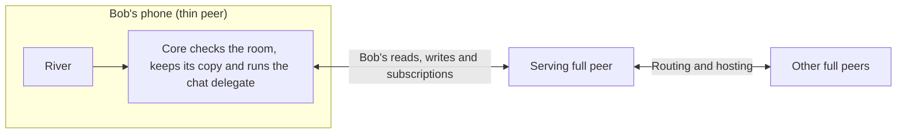

# 1.8 Thin-peer role and cellular data budgets

## Repositories

| Repository | Role | Work in this plan |
| --- | --- | --- |
| [freenet-core](https://github.com/freenet/freenet-core) | Modified | Thin role in the connect protocol, connection manager, ring and serving-peer selection, subscription delivery and lifecycle configuration; cellular budget accounting, cap enforcement and role and traffic diagnostics |
| `freenet-appkit` | Modified | Workload test definitions for the iOS and Android device runs, built on the harness's `watch` scenario |

## Purpose

This plan makes the phone's node a thin peer on iOS and Android, and keeps its cellular data use inside set budgets. River is the first app. When Bob reads and posts in "Skate club" on his phone:

- The phone sends and receives Bob's own traffic only. Full peers route and host for the rest of the network.
- The phone counts every byte it sends and receives on cellular. When a budget runs out, it pauses network work, keeps Bob's drafts and shows the cap and what lets it resume.

In 1.1 Mobile feasibility and supported profiles, phones on Wi-Fi ran as full peers and routed for the network ([finding](https://github.com/glesage/freenet-appkit/blob/main/docs/findings.md#phones-are-full-peers-on-the-public-network)):

| Run | Upload | Download |
| --- | --- | --- |
| iPhone 13 mini, full peer, first two minutes, 27 peers | 7.2 MB, about 60 KiB/s | 6.4 MB, about 60 KiB/s |
| Android emulator, full peer, first two minutes, 22 peers | About 22 KiB/s | About 22 KiB/s |
| Idle node with one or two peers | Under 1.3 KiB/s | Under 1.3 KiB/s |
| Loading River's 1.06 MB archive on the public network | 9 KiB | 1.2 MiB |

The thin role fixes two problems:

- At 60 KiB/s, one hour as a full peer uses about 210 MiB of Bob's data each way, plus the battery to move it.
- Google Play allows an app to relay traffic for others only when relaying is the app's main purpose ([Device and Network Abuse policy](https://support.google.com/googleplay/android-developer/answer/9888379)). River is a chat app, so a phone that routes as a full peer puts River's Play listing at risk. A thin peer sends only its user's own traffic.

Phones run in the thin role for all testing and for the release of milestone 1 (Freenet mobile AppKit). Only development fixture profiles can run a phone as a full peer.

| Part | Section |
| --- | --- |
| What the phone does, what the serving peer does and the Core changes | [Scope and trust boundary](#scope-and-trust-boundary) |
| Byte limits per workload, how to count bytes and what happens at a cap | [Cellular budget contract](#cellular-budget-contract) |
| The upstream proposal and carrier issues | [Upstream work and carrier evidence](#upstream-work-and-carrier-evidence) |

This plan is proposed Core work. Its acceptance needs upstream agreement on the thin-role protocol, and device runs that pass the budgets.

| Upstream source | State on 2026-09-22 |
| --- | --- |
| [Smartphone discussion #811](https://github.com/freenet/freenet-core/discussions/811) | Nearest upstream thread |
| Thin-role proposal issue | To be filed |
| [Whitepaper peers and ring section](https://github.com/freenet/paper-1/blob/main/sections/03-primitives.tex) | Describes one peer role |

Before this plan's acceptance runs, recheck these against the pinned Core build, then link the proposal issue and the accepted protocol here.

## Scope and trust boundary

A thin peer opens terminal connections to serving full peers for its own reads, writes and subscriptions. On-device Core retains contract verification, its copy of each subscribed contract, delegate execution, signing and protected secrets. Serving full peers handle onward routing, fallback routing, hosting and subscription roots. Treat returned state as input for local verification.

| Core area | Required change |
| --- | --- |
| Connect protocol | Negotiate a versioned thin role and acknowledge it explicitly. Accept only thin-role connections for the release profile. |
| Connection manager | Retain terminal edges and their negotiated role across completion, reconnect and network changes. |
| Ring and serving-peer selection | Assign network routing/hosting to full peers. Bound serving connections, selection attempts and retries, with capacity and reachability errors. |
| Subscription delivery | Deliver only authorized active demand down terminal edges. Define unsubscribe, resubscribe and cleanup after disconnect. |
| Lifecycle and configuration | Persist the selected role, release downstream state and preserve thin behavior across startup and Wi-Fi/cellular changes. |
| SDK and diagnostics | Expose negotiated role, serving state, traffic counters, exhausted budgets and actionable failure reasons. Add budget failures to the [diagnostics in 1.3 Single-application host](03-host.md#diagnostics). Detect offline and serving-peer loss from the OS network path that 1.2 Embedded node and mobile SDK watches and from the serving connection's own state, because Core's peer count stays up during an outage ([finding](https://github.com/glesage/freenet-appkit/blob/main/docs/findings.md#the-peer-count-stays-up-during-an-outage)). |

An unsupported protocol or role fails visibly and retries within the configured budget while preserving the thin role. Exhausted attempts leave a visible disconnected state and retain local work. Only explicit development-fixture profiles may request a full-peer role.

Specify how thin nodes reach gateways and select replacement serving peers, including capacity limits and backoff. Test cleanup when peers disappear abruptly and deduplicate subscription demand after reconnect. Pin the client Unsubscribe capability with [1.2 Embedded node and mobile SDK](02-sdk.md) and prove that released demand stops consuming the cellular budget while other consumers in the app retain service.

## Cellular budget contract

1.1 Mobile feasibility and supported profiles measured the full-peer numbers in [Purpose](#purpose) and built the tools that measure each workload. This plan sets the thin role's upload and download ceilings from those numbers, picks the supported carriers, devices and test durations, and enforces the ceilings. Approve them before this plan's acceptance runs.

| Workload | Fix in the test definition | Required limits and measurements |
| --- | --- | --- |
| Foreground idle | Duration, subscribed contracts, state sizes and remote update rate | Separate upload/download bytes per interval, including keepalives and subscription maintenance. |
| Active use | River join/read/send sequence, message/state sizes, update rate and archive-fetch policy | Separate upload/download bytes per operation and workload, plus sustained/peak rates over defined windows. |
| Reconnect and network transition | Offline duration, stale state, pending work, Wi-Fi/cellular path and retry schedule | Upload/download bytes per reconnect, cumulative retry bytes, attempts and recovery time. |
| Serving-peer loss | Forced disconnects, unavailable candidates, repeated failures and recovery window | Upload/download bytes per loss and across the full failure window, bounded replacement attempts and subscription-repair traffic. |
| Traffic-accounting overhead | Counter collection, persistence, diagnostic/report export and instrumented comparison runs | Upload/download bytes added by accounting or reporting, plus CPU, memory and battery cost. |
| Total cellular use | The app and host work, plus shared protocol overhead, over an approved period | Node-wide upload/download caps. Include retries, archive downloads and background-transition traffic. |

Core's transport counters, which `crates/mobile` exposes as `node_traffic`, report upload and download bytes. The freenet-appkit harness's `watch` scenario records them for each workload. Count bytes at the network layer as well as application payloads. Include bootstrap traffic, framing, encryption, retransmission, failed requests, repair and shared overhead. Record each counter's measurement layer and reconcile SDK counters with platform counters or controlled packet traces on each supported OS. Account for other device traffic in the test setup and state the uncertainty in estimating carrier-billed usage.

Attribute app traffic where possible and charge shared overhead once to the total node budget.

Reserve bounded upload/download allowances inside the caps for counter delay, in-flight packets and teardown. Set byte and time limits from device measurements. Trigger cap enforcement when the remaining upload or download budget reaches its reserve, leaving that allowance to complete shutdown within the hard cap.

1. Persist usage and the exhausted-budget state, pause queued network work and keep drafts and the phone's copy of each contract. Show the cap and the condition for resuming.
2. Release affected downstream subscription demand and require serving peers to stop delivery. Close affected serving connections if release is unavailable, unconfirmed or traffic continues, within the reserved byte/time limits. Count teardown and late packets against the reserve.
3. At a node-wide cap, release all downstream demand and close all cellular serving connections.
4. Stop automatic reconnects, resubscriptions and retries for the exhausted scope. Preserve this state through restart, foreground resume and network changes. Resume only when the approved budget policy grants a new allowance, using the thin role and normal reconciliation rules.

## Upstream work and carrier evidence

File and link the role-design proposal, then track negotiation, terminal edges, serving-peer selection, subscription delivery and carrier acceptance against it. Preserve the behaviors covered by [GET routing for subscribed contracts #4222](https://github.com/freenet/freenet-core/issues/4222) and [placement migration #4440](https://github.com/freenet/freenet-core/issues/4440).

Recorded carrier evidence includes [mobile network restrictions #5051](https://github.com/freenet/freenet-core/discussions/5051) and [relay fallback #2925](https://github.com/freenet/freenet-core/issues/2925), recorded as closed without an implementation. Supported carrier paths need direct-transport or an implemented fallback proof. [Wake recovery #4951](https://github.com/freenet/freenet-core/issues/4951) supplies a resume regression case. Issue status and discussion notes are research evidence, while pinned builds and device runs establish release support.

## Acceptance

- Upstream thin-role support is implemented in the pinned Core build.
- On real iOS and Android devices, Bob joins "Skate club", reads it and sends a message through terminal connections. Core verifies state and runs River's chat delegate on the phone.
- Traces show application traffic and bounded protocol overhead on the phone. Serving full peers handle onward routing and network hosting.
- Unsupported roles, incompatible versions and exhausted serving capacity produce visible failures. Retry, restart, resume and network-change tests preserve the thin role.
- Malformed state, wrong contract identities and forged updates fail on-device validation. Serving peers receive only the application's authorized network payloads, while signing keys stay in the on-device protected boundary.
- Idle, active, reconnect, serving-peer-loss and accounting-overhead tests pass their approved upload/download budgets and total cellular caps. Publish workload definitions, revisions, devices, carriers, durations and traces with the results.
- Loss of a serving peer keeps sent messages in the phone's copy of the room, refreshes state and sends them through the replacement serving peer. Repeated losses exhaust bounded attempts visibly.
- Keep remote publishers sending continuously as the upload and download stop thresholds are reached in separate runs. Test working, unavailable and unconfirmed subscription release. Network-layer traces must show terminal delivery ending within the teardown deadline and reserved bytes, with total use inside the hard caps. Continued publisher activity must leave the capped phone connection stopped.
- Restart, foreground resume and Wi-Fi/cellular changes preserve the exhausted state and suppress automatic traffic until a new allowance permits it. Keep drafts and the phone's copy of each room throughout.
