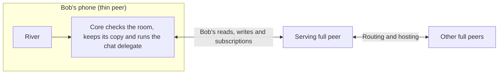

# 1.8 Thin-peer protocol

## Repositories

| Repository | Role | Work in this plan |
| --- | --- | --- |
| [freenet-core](https://github.com/freenet/freenet-core) | Modified | Thin-role protocol and serving-peer support |
| [freenet-appkit](https://github.com/glesage/freenet-appkit) | Modified | iOS and Android workload tests |
| [river](https://github.com/freenet/river) | Used | Mobile app workload fixture |
| [freenet-test-network](https://github.com/freenet/freenet-test-network) | Used | NAT and peer-loss test network |

## Purpose

Each River or EVY installation accounts for its own embedded node, storage and traffic. Its application data layer owns the bounded set of active contract subscriptions. [1.11 Cellular data and resource budgets](11-cellular-data-and-resource-budgets.md) owns that installation’s accounting and resource limits.

Run the phone’s node as a negotiated thin peer on iOS and Android. River is the first app. When Bob reads and posts in "Skate club" on his phone:

- The phone sends and receives Bob's own traffic only. Full peers route and host for the rest of the network.
- Measure terminal traffic and enforce caps through [1.11 Cellular data and resource budgets](11-cellular-data-and-resource-budgets.md). At a cap, keep drafts and show the allowance needed to resume.

[1.1 Mobile feasibility and supported profiles](01-feasibility.md) measured full-peer traffic on Wi-Fi ([finding](https://github.com/glesage/freenet-appkit/blob/1988c5cbdfc5c1f88065382de2a4f86093948b6e/docs/findings.md#phones-are-full-peers-on-the-public-network)):

| Run | Upload | Download |
| --- | --- | --- |
| iPhone 13 mini, full peer, first two minutes, 27 peers | 7.2 MB, about 60 KiB/s | 6.4 MB, about 60 KiB/s |
| Android emulator, full peer, first two minutes, 22 peers | About 22 KiB/s | About 22 KiB/s |
| iPhone 13 mini, idle | Under 1 KiB/s | Under 1 KiB/s |
| Android emulator, idle, 1 peer | 1.4 KiB/s | 1.1 KiB/s |
| Loading River's 1.06 MB archive on the public network | 9 KiB | 1.2 MiB |

Use the thin role for these reasons:

- At 60 KiB/s, one hour of traffic uses about 210 MiB each way and consumes battery power.
- Google Play allows an app to relay traffic for others only when relaying is the app's main purpose ([Device and Network Abuse policy](https://support.google.com/googleplay/android-developer/answer/16559646)). River's iOS and Android release uses the thin role to send the user's own traffic. Chat is River's main purpose.

Development fixtures and dated feasibility runs may select a full-peer profile. Release-profile acceptance for River and EVY requires negotiated thin support on iOS and Android. Record the profile and exact protocol/build in every result.

| Part | Section |
| --- | --- |
| What the phone does, what the serving peer does and the Core changes | [Scope and trust boundary](#scope-and-trust-boundary) |
| Byte limits per workload, how to count bytes and what happens at a cap | [Cellular budget contract in 1.11 Cellular data and resource budgets](11-cellular-data-and-resource-budgets.md#cellular-budget-contract) |
| The upstream proposal and carrier issues | [Upstream work and carrier evidence](#upstream-work-and-carrier-evidence) |

Agree the thin-role protocol with Core maintainers, implement it and pass terminal-role device/carrier fixtures. The independent budget plan owns numeric caps and accounting acceptance.

| Upstream source | State on 2026-10-01 |
| --- | --- |
| [Mobile app discussion #420](https://github.com/freenet/freenet-core/discussions/420) | Closed. The only maintainer statement on a node on the phone (iduartgomez, 2022): "a limited node will be running in the device" |
| [Smartphone discussion #811](https://github.com/freenet/freenet-core/discussions/811) | Closed. It says Freenet will support mobile and holds no design |
| [Incentive discussions #136](https://github.com/freenet/freenet-core/discussions/136), [#137](https://github.com/freenet/freenet-core/discussions/137) and [#893](https://github.com/freenet/freenet-core/discussions/893) | Open. Core intends to tie the resources a peer uses on others to a karma score |
| Thin-role proposal issue | To be filed |
| [Whitepaper peers and ring section](https://github.com/freenet/paper-1/blob/bff15702759800a003ffbfce639fe859f57d966d/sections/03-primitives.tex) | Describes one peer role |

Before acceptance runs, check the sources against the pinned Core build and record the proposal issue and accepted protocol.

## Scope and trust boundary

A thin peer opens terminal connections to full peers for its own reads, writes and subscriptions. Core verifies contracts, keeps subscribed state, runs delegates, signs and protects secrets on the phone. Serving full peers handle onward routing, fallback routing, hosting and subscription roots. Treat returned state as input for local verification.

Gateways keep the link of a peer that has not joined the ring ([#5656](https://github.com/freenet/freenet-core/pull/5656)). The thin-role implementation gives these links explicit retention and admission rules. Keep an admitted terminal connection while its authorized subscription demand or bounded idle lease remains active, including receive-only sessions. Define capacity and fairness for phones sharing a carrier address. The rules cover the request-based retention, per-address limits and transport-age limits in that gateway mechanism.

| Core area | Required change |
| --- | --- |
| Connect protocol | Negotiate a versioned thin role and acknowledge it explicitly. Accept only thin-role connections for the release profile. |
| Connection manager | Retain terminal edges and their negotiated role across completion, reconnect and network changes. |
| Ring and serving-peer selection | Assign network routing/hosting to full peers. Bound serving connections, selection attempts and retries, with capacity and reachability errors. |
| Subscription delivery | Deliver only authorized active demand down terminal edges. Define unsubscribe, resubscribe and cleanup after disconnect. |
| Lifecycle and configuration | Persist the selected role, release downstream state and preserve thin behavior across startup and Wi-Fi/cellular changes. |
| SDK and diagnostics | Expose negotiated role, serving state, traffic counters, exhausted budgets and actionable failure reasons. Add budget failures to the [diagnostics in 1.3 Single-application host](03-host.md#diagnostics). Detect offline and serving-peer loss from the OS network path monitored by [1.2 Embedded node and mobile SDK](02-sdk.md) and the serving connection's state. Test outages that leave Core's peer count unchanged ([finding](https://github.com/glesage/freenet-appkit/blob/1988c5cbdfc5c1f88065382de2a4f86093948b6e/docs/findings.md#the-peer-count-stays-up-during-an-outage)). |

An unsupported protocol or role fails visibly and retries within the configured budget while preserving the thin role. Exhausted attempts leave a visible disconnected state and retain local work. Only explicit development-fixture profiles may request a full-peer role.

Specify how thin nodes reach gateways and select replacement serving peers, including capacity limits and backoff. Test cleanup when peers disappear abruptly and deduplicate subscription demand after reconnect. Pin the client Unsubscribe capability with [1.2 Embedded node and mobile SDK](02-sdk.md) and prove that released demand stops consuming the cellular budget once the subscription lease ends, while other consumers in the app retain service.

## Upstream work and carrier evidence

File the thin-role Core proposal in this plan. [1.11 Cellular data and resource budgets](11-cellular-data-and-resource-budgets.md) owns the independent cap-enforcement and client-delta proposals. Core maintainers approve the terminal-role protocol; its completion evidence is negotiated-role and carrier fixtures on the pinned build. Begin protocol approval and serving-peer work alongside [1.2 Embedded node and mobile SDK](02-sdk.md).

Define terminal-link renewal alongside the admission, retention and capacity rules in [Scope and trust boundary](#scope-and-trust-boundary), separately from unjoined transport safeguards. Run the same workload on iOS and Android with the selected serving-peer build. Cover the carrier cases in [Acceptance](#acceptance), capacity rejection, renewal and reconnect within the [Cellular budget contract in 1.11 Cellular data and resource budgets](11-cellular-data-and-resource-budgets.md#cellular-budget-contract).

1. File the thin-role Core issue and record maintainer approach approval before opening its feature PR ([#4311](https://github.com/freenet/freenet-core/pull/4311)). Follow the evidence requirements in the [decision gates in README.md](../README.md#decision-gates).
2. Link the issue here and track negotiation, terminal edges, serving-peer selection, subscription delivery and carrier acceptance.

| Proposal decision | Requirements |
| --- | --- |
| Resource accounting | Define how thin peers repay serving full peers. Thin peers use serving capacity and route for no one ([#136](https://github.com/freenet/freenet-core/discussions/136), [#137](https://github.com/freenet/freenet-core/discussions/137) and [#893](https://github.com/freenet/freenet-core/discussions/893)). |
| GET routing | Keep GET routing for subscribed contracts ([#4222](https://github.com/freenet/freenet-core/issues/4222)). Account for relay GETs that drop at the first hop without fallback ([#4229](https://github.com/freenet/freenet-core/issues/4229)). |
| Hosting demand | Define how reads, PUTs and subscriptions count under demand-driven hosting ([#4642](https://github.com/freenet/freenet-core/issues/4642)). Hosts evict by subscriber count. Reads and PUTs count as demand, and every hop hosts within demand limits. |
| Protocol overhead | Specify which summary and hosting exchanges thin peers skip ([#4965](https://github.com/freenet/freenet-core/issues/4965), [#5157](https://github.com/freenet/freenet-core/issues/5157)). |

These upstream changes lower every budget:

| Change | State |
| --- | --- |
| Compress every peer message with zstd ([#3336](https://github.com/freenet/freenet-core/issues/3336)) | Proposal filed 2026-09-29. Gate rollout on each peer's minimum version |
| Send a code hash first and the Wasm only when the receiver lacks it ([#5707](https://github.com/freenet/freenet-core/issues/5707)) | Open proposal |
| [Send client UPDATEs as deltas in 1.11 Cellular data and resource budgets](11-cellular-data-and-resource-budgets.md#client-update-deltas) | Core issue to be filed |
| Cut summary and interest-sync traffic ([#5203](https://github.com/freenet/freenet-core/pull/5203), [#5109](https://github.com/freenet/freenet-core/pull/5109)) | Draft PRs under Core's bandwidth tracking issue [#5153](https://github.com/freenet/freenet-core/issues/5153) |

### Carrier evidence

Prove that each supported carrier path works through direct transport or an implemented fallback. Core's direct transport is encrypted UDP with hole punching ([#2211](https://github.com/freenet/freenet-core/pull/2211)).

| Source | State | What it means for phones |
| --- | --- | --- |
| [CGNAT discussion #5051](https://github.com/freenet/freenet-core/discussions/5051) | Open | A phone-hotspot user reports that the carrier blocks UDP. The question on relay fallback has no maintainer answer |
| [Relay fallback #2925](https://github.com/freenet/freenet-core/issues/2925) | Closed without an implementation | No relay exists for carrier paths that block UDP |
| [SOCKS5 #2409](https://github.com/freenet/freenet-core/issues/2409) | Open | A possible path where UDP is blocked |
| [NAT'd node streams at about 1% of uplink #5643](https://github.com/freenet/freenet-core/issues/5643) | Open | A state of 1 MiB or more put by a node behind NAT cannot be fetched cold. The reconnect workload includes a room state above 1 MiB |
| [Dual-stack IPv6 #3648](https://github.com/freenet/freenet-core/pull/3648), [IPv6 on gateways #3666](https://github.com/freenet/freenet-core/issues/3666) | #3648 merged, #3666 open | Until #3666 lands, IPv6-only carriers reach the IPv4 gateways through NAT64. Track #3666 |
| [1200-byte packets #3619](https://github.com/freenet/freenet-core/pull/3619) | Merged | Avoids IP fragmentation on carrier NAT paths |
| [Stream-listener wakeups #5751](https://github.com/freenet/freenet-core/pull/5751) | Merged 2026-10-03 | Keeps the wakeup when a re-armed stream listener fires. Check the fix in the pinned Core build and run lossy-link regression cases |
| [Duplicate-packet acknowledgements and receive timers #5803](https://github.com/freenet/freenet-core/pull/5803) | Shipped in [Core 0.2.142](https://github.com/freenet/freenet-core/releases/tag/v0.2.142) | Re-acknowledges duplicate packets and preserves receive timers across cancellation. Test dropped acknowledgements, duplicate packets and interrupted receives on the pinned build |
| [Wake recovery #4951](https://github.com/freenet/freenet-core/issues/4951), [state after suspend #4153](https://github.com/freenet/freenet-core/issues/4153) | Open | Resume regression cases |

Run the carrier-NAT and serving-peer-loss cases on freenet-test-network's Docker NAT simulation as well as on carriers. Check its stdlib pin against the pinned Core first. Use pinned builds and device runs to establish release support. Keep issue status and discussion notes as research evidence.

## Acceptance

- Upstream thin-role support is implemented in the pinned Core build.
- On real iOS and Android devices, Bob joins "Skate club", reads it and sends a message through terminal connections. Core verifies state and runs River's chat delegate on the phone.
- Traces show application traffic and bounded protocol overhead on the phone. Serving full peers handle onward routing and network hosting.
- On real iOS and Android devices and the isolated NAT network, keep receive-only subscriptions active beyond the transient timeout and keep a session active for more than one hour. More than two thin peers behind one carrier address retain admitted demand within the serving peer's declared capacity. Revoked or disconnected demand is reclaimed within the terminal-role lease.
- Unsupported roles, incompatible versions and exhausted serving capacity produce visible failures. Retry, restart, resume and network-change tests preserve the thin role.
- Malformed state, wrong contract identities and forged updates fail on-device validation. Serving peers receive only the application's authorized network payloads, while signing keys stay in the on-device protected boundary.
- Loss of a serving peer keeps sent messages in the phone's copy of the room, refreshes state and sends them through the replacement serving peer. Repeated losses exhaust bounded attempts visibly.
- Integration with [1.11 Cellular data and resource budgets](11-cellular-data-and-resource-budgets.md#acceptance) confirms that cap teardown preserves the negotiated thin role and stops downstream delivery.
