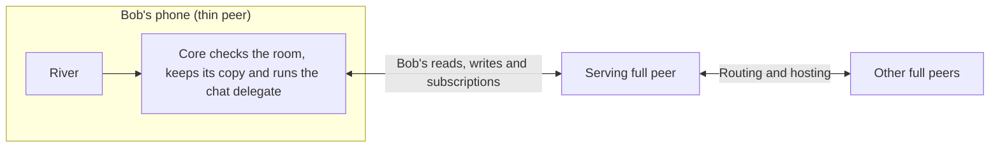

# 1.8 Thin-peer role and cellular data budgets

## Repositories

| Repository | Role | Work in this plan |
| --- | --- | --- |
| [freenet-core](https://github.com/freenet/freenet-core) | Modified | Thin-peer role and cellular budgets |
| [freenet-appkit](https://github.com/glesage/freenet-appkit) | Modified | iOS and Android workload tests |
| [river](https://github.com/freenet/river) | Used | Mobile app workload fixture |
| [freenet-test-network](https://github.com/freenet/freenet-test-network) | Used | NAT and peer-loss test network |

## Purpose

This plan makes the phone's node a thin peer on iOS and Android, and keeps its cellular data use inside set budgets. River is the first app. When Bob reads and posts in "Skate club" on his phone:

- The phone sends and receives Bob's own traffic only. Full peers route and host for the rest of the network.
- The phone counts every byte it sends and receives on cellular. When a budget runs out, it pauses network work, keeps Bob's drafts and shows the cap and what lets it resume.

In 1.1 Mobile feasibility and supported profiles, phones on Wi-Fi ran as full peers and routed for the network ([finding](https://github.com/glesage/freenet-appkit/blob/main/docs/findings.md#phones-are-full-peers-on-the-public-network)):

| Run | Upload | Download |
| --- | --- | --- |
| iPhone 13 mini, full peer, first two minutes, 27 peers | 7.2 MB, about 60 KiB/s | 6.4 MB, about 60 KiB/s |
| Android emulator, full peer, first two minutes, 22 peers | About 22 KiB/s | About 22 KiB/s |
| iPhone 13 mini, idle | Under 1 KiB/s | Under 1 KiB/s |
| Android emulator, idle, 1 peer | 1.4 KiB/s | 1.1 KiB/s |
| Loading River's 1.06 MB archive on the public network | 9 KiB | 1.2 MiB |

The thin role fixes two problems:

- At 60 KiB/s, one hour as a full peer uses about 210 MiB of Bob's data each way, plus the battery to move it.
- Google Play allows an app to relay traffic for others only when relaying is the app's main purpose ([Device and Network Abuse policy](https://support.google.com/googleplay/android-developer/answer/16559646)). River is a chat app, so a phone that routes as a full peer puts River's Play listing at risk. A thin peer sends only its user's own traffic.

Phones run in the thin role for all testing and for the release of milestone 1 (Freenet mobile AppKit). Only development fixture profiles can run a phone as a full peer.

| Part | Section |
| --- | --- |
| What the phone does, what the serving peer does and the Core changes | [Scope and trust boundary](#scope-and-trust-boundary) |
| Byte limits per workload, how to count bytes and what happens at a cap | [Cellular budget contract](#cellular-budget-contract) |
| The upstream proposal and carrier issues | [Upstream work and carrier evidence](#upstream-work-and-carrier-evidence) |

This plan is proposed Core work. Its acceptance needs upstream agreement on the thin-role protocol, and device runs that pass the budgets.

| Upstream source | State on 2026-10-01 |
| --- | --- |
| [Mobile app discussion #420](https://github.com/freenet/freenet-core/discussions/420) | Closed. The only maintainer statement on a node on the phone (iduartgomez, 2022): "a limited node will be running in the device" |
| [Smartphone discussion #811](https://github.com/freenet/freenet-core/discussions/811) | Closed. It says Freenet will support mobile and holds no design |
| [Incentive discussions #136](https://github.com/freenet/freenet-core/discussions/136), [#137](https://github.com/freenet/freenet-core/discussions/137) and [#893](https://github.com/freenet/freenet-core/discussions/893) | Open. Core intends to tie the resources a peer uses on others to a karma score |
| Thin-role proposal issue | To be filed |
| [Whitepaper peers and ring section](https://github.com/freenet/paper-1/blob/main/sections/03-primitives.tex) | Describes one peer role |

Before this plan's acceptance runs, recheck these against the pinned Core build, then link the proposal issue and the accepted protocol here.

## Scope and trust boundary

A thin peer opens terminal connections to serving full peers for its own reads, writes and subscriptions. On-device Core retains contract verification, its copy of each subscribed contract, delegate execution, signing and protected secrets. Serving full peers handle onward routing, fallback routing, hosting and subscription roots. Treat returned state as input for local verification.

Gateways keep the link of a peer that has not joined the ring ([#5656](https://github.com/freenet/freenet-core/pull/5656)). A thin peer lives on this kind of link.

| Core area | Required change |
| --- | --- |
| Connect protocol | Negotiate a versioned thin role and acknowledge it explicitly. Accept only thin-role connections for the release profile. |
| Connection manager | Retain terminal edges and their negotiated role across completion, reconnect and network changes. |
| Ring and serving-peer selection | Assign network routing/hosting to full peers. Bound serving connections, selection attempts and retries, with capacity and reachability errors. |
| Subscription delivery | Deliver only authorized active demand down terminal edges. Define unsubscribe, resubscribe and cleanup after disconnect. |
| Lifecycle and configuration | Persist the selected role, release downstream state and preserve thin behavior across startup and Wi-Fi/cellular changes. |
| SDK and diagnostics | Expose negotiated role, serving state, traffic counters, exhausted budgets and actionable failure reasons. Add budget failures to the [diagnostics in 1.3 Single-application host](03-host.md#diagnostics). Detect offline and serving-peer loss from the OS network path that 1.2 Embedded node and mobile SDK watches and from the serving connection's own state, because Core's peer count stays up during an outage ([finding](https://github.com/glesage/freenet-appkit/blob/main/docs/findings.md#the-peer-count-stays-up-during-an-outage)). |

An unsupported protocol or role fails visibly and retries within the configured budget while preserving the thin role. Exhausted attempts leave a visible disconnected state and retain local work. Only explicit development-fixture profiles may request a full-peer role.

Specify how thin nodes reach gateways and select replacement serving peers, including capacity limits and backoff. Test cleanup when peers disappear abruptly and deduplicate subscription demand after reconnect. Pin the client Unsubscribe capability with [1.2 Embedded node and mobile SDK](02-sdk.md) and prove that released demand stops consuming the cellular budget once the subscription lease ends, while other consumers in the app retain service.

## Cellular budget contract

[1.1 Mobile feasibility and supported profiles](01-feasibility.md#startup-and-network) measured the full-peer numbers in [Purpose](#purpose). Its [harness](https://github.com/glesage/freenet-appkit/tree/main/harness) `watch` scenario and Core's `node_traffic` counters measure each workload. This plan sets the thin role's upload and download ceilings from those numbers, picks the supported carriers, devices and test durations, and enforces the ceilings. Approve them before this plan's acceptance runs.

| Workload | Fix in the test definition | Required limits and measurements |
| --- | --- | --- |
| Foreground idle | Duration, subscribed contracts, state sizes and remote update rate | Separate upload/download bytes per interval, including keepalives, state summary exchanges and subscription maintenance. |
| Active use | River join/read/send sequence, message/state sizes, update rate and archive-fetch policy | Separate upload/download bytes per operation and workload, plus sustained/peak rates over defined windows. Record state bytes, Wasm bytes and updates the serving peer drops separately. |
| Reconnect and network transition | Offline duration, stale state, pending work, Wi-Fi/cellular path, retry schedule and a room state above 1 MiB | Upload/download bytes per reconnect, cumulative retry bytes, attempts and recovery time. |
| Serving-peer loss | Forced disconnects, unavailable candidates, repeated failures and recovery window | Upload/download bytes per loss and across the full failure window, bounded replacement attempts and subscription-repair traffic. |
| Traffic-accounting overhead | Counter collection, persistence, diagnostic/report export and instrumented comparison runs | Upload/download bytes added by accounting or reporting, plus CPU, memory and battery cost. |
| Total cellular use | The app and host work, plus shared protocol overhead, over an approved period | Node-wide upload/download caps. Include retries, archive downloads and background-transition traffic. |

The budgets count these Core and River costs:

| Cost | What Core or River does today | Workloads that count it |
| --- | --- | --- |
| Client UPDATE | Core forwards the full post-merge state to its peer, not the delta ([#4072](https://github.com/freenet/freenet-core/pull/4072)). Each message Bob sends to "Skate club" costs the whole room state | Active use, reconnect |
| Update rate limit | A serving peer silently drops more than about 10 UPDATEs per second for one sender address and contract ([Running Wasm in 1.2 Embedded node and mobile SDK](02-sdk.md#running-wasm)). Phones behind one carrier NAT share that limit | Active use, reconnect |
| Subscription lease | After Core sends Unsubscribe upstream, a GET or PUT in the previous 8 minutes keeps delivery going until that lease ends ([Ending subscriptions in 1.2 Embedded node and mobile SDK](02-sdk.md#ending-subscriptions)) | Cap enforcement reserve |
| Contract code in transfers | PUT and GET resend contract Wasm that the receiver already holds. Behind a mobile hotspot this was over 95% of PUT bytes ([#5707](https://github.com/freenet/freenet-core/issues/5707)) | Active use, reconnect |
| River reconnect | River re-subscribes each room with a full-state `Put { subscribe: true }` and holds outbound updates until each PUT reply arrives ([river#561](https://github.com/freenet/river/issues/561)) | Reconnect, serving-peer loss |
| Large-GET retries | A stalled stream restarts from its first fragment ([#4800](https://github.com/freenet/freenet-core/issues/4800)) | Reconnect, serving-peer loss |
| Large contracts | A peer fetches and verifies a contract's whole state before it reads any part ([discussion #678](https://github.com/freenet/freenet-core/discussions/678)). A first read of a large contract, such as Atlas's index, costs its full state | Active use |
| Protocol overhead | Interest-sync summaries were over half of outbound bytes ([#4965](https://github.com/freenet/freenet-core/issues/4965)). NeighborHosting sends the full hosted set to every peer every 5 minutes ([#5157](https://github.com/freenet/freenet-core/issues/5157)). Broadcast re-fan-out delivered each update about 18 times ([#5147](https://github.com/freenet/freenet-core/issues/5147)) | Foreground idle, total |
| Keepalives | Every connection pings every 5 s and backs off to 60 s when pings go unanswered ([#2404](https://github.com/freenet/freenet-core/pull/2404)) | Foreground idle, total |

Core already has these settings. The thin role on cellular sets them explicitly:

| Setting | Core default | Thin role on cellular |
| --- | --- | --- |
| `total-bandwidth-limit` ([config.rs](https://github.com/freenet/freenet-core/blob/main/crates/core/src/config.rs)) | None | Set it as the node's rate cap in bytes per second. It caps rate, so the byte budgets here still apply |
| Send rate per connection | 10 Mbps ([#2936](https://github.com/freenet/freenet-core/pull/2936)) | Size the cap reserves from it, since it sets how fast a reserve drains |
| `min-number-of-connections`, `max-number-of-connections` | 10 and 20 | Lower the connection count. The node still routes with these, so the thin-role proposal builds on them ([#1628](https://github.com/freenet/freenet-core/pull/1628)) |
| `max-hosting-storage` | `clamp(RAM / 8, 128 MiB, 1 GiB)` | Set explicitly, as [Storage in 1.2 Embedded node and mobile SDK](02-sdk.md#storage) does. Development full-peer profiles set it too |

Core's transport counters, which `crates/mobile` exposes as `node_traffic`, report upload and download bytes. Core counts sent bytes at the UDP socket and received bytes only after decryption succeeds ([#3996](https://github.com/freenet/freenet-core/pull/3996), [#4024](https://github.com/freenet/freenet-core/pull/4024)). The carrier also bills inbound packets that fail decryption. Core meters bandwidth per peer as well ([#4455](https://github.com/freenet/freenet-core/pull/4455)). The freenet-appkit harness's `watch` scenario records the counters for each workload. Count bytes at the network layer as well as application payloads. Include bootstrap traffic, framing, encryption, retransmission, failed requests, repair and shared overhead. Record each counter's measurement layer and reconcile SDK counters with iOS and Android platform counters or controlled packet traces on each supported OS. Account for other device traffic in the test setup and state the uncertainty in estimating carrier-billed usage.

Attribute app traffic where possible and charge shared overhead once to the total node budget.

Reserve bounded upload/download allowances inside the caps for counter delay, in-flight packets and teardown. Set byte and time limits from device measurements. Trigger cap enforcement when the remaining upload or download budget reaches its reserve, leaving that allowance to complete shutdown within the hard cap.

1. Persist usage and the exhausted-budget state, pause queued network work and keep drafts and the phone's copy of each contract. Show the cap and the condition for resuming.
2. Release affected downstream subscription demand and require serving peers to stop delivery. Count up to 8 minutes of delivery under the subscription lease against the reserve. Close affected serving connections if release is unavailable, unconfirmed or traffic continues, within the reserved byte/time limits. Count teardown and late packets against the reserve.
3. At a node-wide cap, release all downstream demand and close all cellular serving connections.
4. Stop automatic reconnects, resubscriptions and retries for the exhausted scope. Preserve this state through restart, foreground resume and network changes. Resume only when the approved budget policy grants a new allowance, using the thin role and normal reconciliation rules.

## Upstream work and carrier evidence

1. File the thin-role proposal as a Core issue and get it approved before opening a PR. Core auto-closes feature PRs that have no approved issue ([#4311](https://github.com/freenet/freenet-core/pull/4311)).
2. Link the issue here, then track negotiation, terminal edges, serving-peer selection, subscription delivery and carrier acceptance against it.

The proposal answers these questions:

- How a thin peer fits Core's planned resource accounting. A thin peer uses serving capacity and routes for no one ([discussions #136, #137 and #893](https://github.com/freenet/freenet-core/discussions/136)).
- How a thin peer keeps GET routing for subscribed contracts ([#4222](https://github.com/freenet/freenet-core/issues/4222)). Relay GETs drop at the first hop with no fallback ([#4229](https://github.com/freenet/freenet-core/issues/4229)).
- How a thin peer's reads, PUTs and subscriptions count as demand under the demand-driven hosting rules ([#4642](https://github.com/freenet/freenet-core/issues/4642)). Hosts evict by subscriber count, reads and PUTs count as demand, and every hop hosts within the demand limits.
- Which summary and hosting exchanges a thin peer skips ([#4965](https://github.com/freenet/freenet-core/issues/4965), [#5157](https://github.com/freenet/freenet-core/issues/5157)).

These upstream changes lower every budget:

| Change | State |
| --- | --- |
| Compress every peer message with zstd ([#3336](https://github.com/freenet/freenet-core/issues/3336)) | We proposed it on 2026-09-29. Rollout can wait for each peer's minimum version |
| Send a code hash first and the Wasm only when the receiver lacks it ([#5707](https://github.com/freenet/freenet-core/issues/5707)) | Open proposal |
| Send client UPDATEs as deltas | Core deferred the raw-delta wire format in [#4072](https://github.com/freenet/freenet-core/pull/4072). No issue yet |
| Cut summary and interest-sync traffic ([#5203](https://github.com/freenet/freenet-core/pull/5203), [#5109](https://github.com/freenet/freenet-core/pull/5109)) | Draft PRs under Core's bandwidth tracking issue [#5153](https://github.com/freenet/freenet-core/issues/5153) |

Supported carrier paths need direct transport or an implemented fallback proof. Core's direct transport is encrypted UDP with hole punching ([#2211](https://github.com/freenet/freenet-core/pull/2211)).

| Source | State | What it means for phones |
| --- | --- | --- |
| [CGNAT discussion #5051](https://github.com/freenet/freenet-core/discussions/5051) | Open | A phone-hotspot user reports that the carrier blocks UDP. The question on relay fallback has no maintainer answer |
| [Relay fallback #2925](https://github.com/freenet/freenet-core/issues/2925) | Closed without an implementation | No relay exists for carrier paths that block UDP |
| [SOCKS5 #2409](https://github.com/freenet/freenet-core/issues/2409) | Open | A possible path where UDP is blocked |
| [NAT'd node streams at about 1% of uplink #5643](https://github.com/freenet/freenet-core/issues/5643) | Open | A state of 1 MiB or more put by a node behind NAT cannot be fetched cold. The reconnect workload includes a room state above 1 MiB |
| [Dual-stack IPv6 #3648](https://github.com/freenet/freenet-core/pull/3648), [IPv6 on gateways #3666](https://github.com/freenet/freenet-core/issues/3666) | #3648 merged, #3666 open | Until #3666 lands, IPv6-only carriers reach the IPv4 gateways through NAT64. Track #3666 |
| [1200-byte packets #3619](https://github.com/freenet/freenet-core/pull/3619) | Merged | Avoids IP fragmentation on carrier NAT paths |
| [Stream-listener wakeups #5751](https://github.com/freenet/freenet-core/pull/5751) | Merged 2026-10-03 | Keeps the wakeup when a re-armed stream listener fires. Check the fix in the pinned Core build and run lossy-link regression cases |
| [Duplicate-packet acknowledgements and receive timers #5803](https://github.com/freenet/freenet-core/pull/5803) | Shipped in [Core 0.2.142](https://github.com/freenet/freenet-core/releases/tag/v0.2.142) | Re-acknowledges duplicate packets and preserves receive timers across cancellation. Test dropped acknowledgements, duplicate packets and interrupted receives on the pinned build |
| [Wake recovery #4951](https://github.com/freenet/freenet-core/issues/4951), [state after suspend #4153](https://github.com/freenet/freenet-core/issues/4153) | Open | Resume regression cases |

Run the carrier-NAT and serving-peer-loss cases on freenet-test-network's Docker NAT simulation as well as on carriers. Check its stdlib pin against the pinned Core first. Issue status and discussion notes are research evidence, while pinned builds and device runs establish release support.

## Acceptance

- Upstream thin-role support is implemented in the pinned Core build.
- On real iOS and Android devices, Bob joins "Skate club", reads it and sends a message through terminal connections. Core verifies state and runs River's chat delegate on the phone.
- Traces show application traffic and bounded protocol overhead on the phone. Serving full peers handle onward routing and network hosting.
- Unsupported roles, incompatible versions and exhausted serving capacity produce visible failures. Retry, restart, resume and network-change tests preserve the thin role.
- Malformed state, wrong contract identities and forged updates fail on-device validation. Serving peers receive only the application's authorized network payloads, while signing keys stay in the on-device protected boundary.
- Idle, active, reconnect, serving-peer-loss and accounting-overhead tests pass their approved upload/download budgets and total cellular caps. Publish workload definitions, revisions, devices, carriers, durations and traces with the results.
- Loss of a serving peer keeps sent messages in the phone's copy of the room, refreshes state and sends them through the replacement serving peer. Repeated losses exhaust bounded attempts visibly.
- Keep remote publishers sending continuously as the upload and download stop thresholds are reached in separate runs. Test working, unavailable and unconfirmed subscription release. Network-layer traces must show terminal delivery ending within the teardown deadline and reserved bytes, with total use inside the hard caps. Continued publisher activity must leave the capped phone connection stopped.
- Restart, foreground resume and Wi-Fi/cellular changes preserve the exhausted state and suppress automatic traffic until a new allowance permits it. Keep drafts and the phone's copy of each room throughout.
