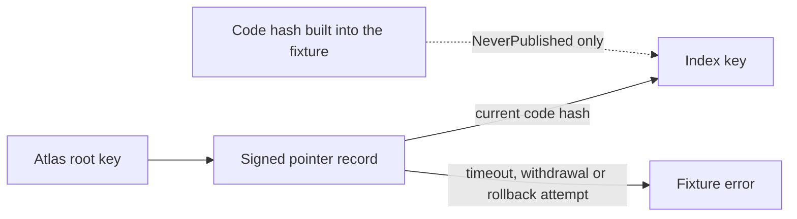

# 1.9 Testing and release

## Repositories

| Repository | Role | Work in this plan |
| --- | --- | --- |
| [freenet-appkit](https://github.com/glesage/freenet-appkit) | Modified | AppKit tests, developer package and store release |
| [river](https://github.com/freenet/river) | Modified | River moderation and support materials |
| [freenet-core](https://github.com/freenet/freenet-core) | Used | Pinned Core build and compatibility |
| [freenet-migrate](https://github.com/freenet/freenet-migrate) | Used | Atlas migration fixture |
| [freenet-test-network](https://github.com/freenet/freenet-test-network) | Used | Isolated test networks |
| [atlas](https://github.com/freenet/atlas) | Used | Atlas publication fixture |

## Purpose

This plan tests milestone 1 (Freenet mobile AppKit) on real iOS and Android phones in the thin-peer role from [1.8 Thin-peer role and cellular data budgets](08-thin-peer.md), then releases it as the [developer package](#developer-package). The tests use two existing Freenet apps:

| | River | Atlas |
| --- | --- | --- |
| Used as | The reference app, built for iOS and Android | A few Atlas records in a separate test index, used as fixtures. The published Atlas index stays as it is |
| What runs | River's signed web UI in an in-app WebView, served by the phone's embedded node. River's own code calls its room contract and chat delegate | Atlas's own UI GETs and SUBSCRIBEs to the test index, searches it on the phone, refreshes on `UpdateNotification` and follows Open links. `atlasctl` writes the test records |
| What it proves | Alice and Bob join "Skate club", read and send messages, go offline, reconnect and upgrade River | The Swift and Kotlin SDKs keep record bytes and the index key unchanged, send each response to the right request, share subscriptions between views and stay within device limits |
| Sections | [River scope](#river-scope), [River acceptance cases](#river-acceptance-cases) | [Atlas today and pinned identity](#atlas-today-and-pinned-identity), [Atlas fixture scope and acceptance](#atlas-fixture-scope-and-acceptance) |

## River scope

- Pin the River website container, publisher, archive reference, room contract, chat delegate and original parameter bytes for every run. Preserve predecessor artifacts needed by upgrade tests.
- A compatibility fixture instantiates River's chat delegate on the pinned Core. A delegate built against a newer freenet-stdlib fails at instantiation when it imports host functions the pinned Core lacks ([#5617](https://github.com/freenet/freenet-core/issues/5617), [#5719](https://github.com/freenet/freenet-core/issues/5719), [#5717](https://github.com/freenet/freenet-core/issues/5717)).
- Drive River's own UI for invite, join, read, send and reconnect tests. Use real embedded Core, contract validation and delegate signing. Deterministic fixtures isolate transport or fault cases alongside these end-to-end runs.
- Run prompt and notification tests with the node in network mode. `freenet local` drops delegate prompts and contract notifications ([#5273](https://github.com/freenet/freenet-core/issues/5273)).
- Build isolated test networks with [freenet-test-network](https://github.com/freenet/freenet-test-network), whose Docker NAT simulation covers carrier-NAT cases. It pins freenet-stdlib 0.1.29, so check it against the pinned Core before the first run.
- Each isolated node gets its gateways with `--gateway` and `--skip-load-from-network` ([#4264](https://github.com/freenet/freenet-core/pull/4264)). Core replaces an empty gateway list with the public one ([#5552](https://github.com/freenet/freenet-core/issues/5552)), so each run checks that no node has a peer on the public network.
- Exercise the supported Swift/Kotlin APIs with the same protocol fixtures. [1.1 Mobile feasibility and supported profiles](01-feasibility.md) published native-route coverage for the iPhone 13 mini, iOS Simulator and Android emulator in the [support matrix](https://github.com/glesage/freenet-appkit/blob/main/docs/support-matrix.md#operations). Add the Android phone column to it.
- Label locally cached observations and independently retrieved network evidence separately. Keep signed bytes with the draft until Core answers, under 1.6 Application protocols, data and operations.

River publishes a signed tar.xz website archive through its [web container contract](https://github.com/freenet/river/blob/main/contracts/web-container-contract/src/lib.rs). Its [chat delegate protocol](https://github.com/freenet/river/blob/main/common/src/chat_delegate.rs) includes `SignMember` and `SignResponse`, which River's UI calls when Alice invites Carol ([invitation_builder.rs](https://github.com/freenet/river/blob/main/ui/src/components/members/invitation_builder.rs)). The delegate signing test uses that exchange to form an [authorized member](https://github.com/freenet/river/blob/main/common/src/room_state/member.rs), as [calling a delegate in 1.6 Application protocols, data and operations](06-data-and-operations.md#calling-a-delegate) describes. River signs chat messages in the page. The send test checks that Bob's [authorized message](https://github.com/freenet/river/blob/main/common/src/room_state/message.rs) reaches the room's [recent messages](https://github.com/freenet/river/blob/main/common/src/room_state.rs).

## River acceptance cases

| Scenario | Passing result |
| --- | --- |
| Install and invite | A clean install verifies River's signed archive. Opening Alice's invite validates its app and room references, shows trusted consent and joins the intended room. Invalid or substituted references fail visibly. |
| Notifications at first run | Bob runs River for the first time. The host asks for `notifications` once and stores his answer in Core's grant table. The notification modal's Enable button and Bob's first send then show the stored answer with no new prompt. After a denial, River's alerts stay in-app. |
| Read and refresh | Bob reads the joined room, sees cached observation time while offline and receives verified updates after reconnect. |
| Missing network copy | Remove remote copies of a River room Alice owns in an isolated test network. River PUTs the node's copy back under [lost network state in 1.6 Application protocols, data and operations](06-data-and-operations.md#lost-network-state). Verify readback through an independent peer. An interrupted or repeated PUT leaves each message in the room once. |
| Send and sign | River signs Bob's message in the page with his room signing key, saves it with its draft, sends it and sees it in room state. An independent peer can retrieve the message. The real chat delegate answers a `SignMember` call for Alice's invitation of Carol on-device, and the signature verifies with Alice's key. |
| Offline and interrupted send | Send with no signal, on Wi-Fi with no internet, and with River terminated before and after Core answers. With the room state retained within Core's hosting budget, the message reaches an independent peer after reconnect, and a resend leaves one copy in the room. Retention scope follows [Core retention and offline delivery in 1.6 Application protocols, data and operations](06-data-and-operations.md#core-retention-and-offline-delivery). |
| Changed room authority | Write a draft offline, change membership or rotate the room secret, then reconnect. River keeps the draft and applies its protocol's conflict/repair rules. |
| Foreground lifecycle | Lock, background, terminate and resume during startup, signing, submission and refresh. Retain committed drafts, keys and sent messages, invalidate old callbacks and release ports/store locks. Alerts follow the foreground scope that [1.1 Mobile feasibility and supported profiles](01-feasibility.md#message-alerts) confirmed. |
| Connectivity | Change Wi-Fi/cellular paths and remove the serving peer. Reconnect restores demand. |
| Compatible web update | Install a verified new version while an open session stays on the version it started with. Activate it under the [rules in 1.3 Single-application host](03-host.md#activating-a-release) and keep drafts and signed messages waiting to be sent. |
| Interrupted component upgrade | Upgrade from an older River release on iOS and Android and kill the app during the migration. The next start finishes it, and the checks in [1.7 Upgrades and migration](07-migration.md#acceptance) pass. |
| Protected data | Test permission revocation, locked or invalidated keys and app-specific encrypted export/import through 1.5 Identity, keys and local protection. Show coverage and keep drafts. |
| Interrupted restore | On iOS and Android, restore over an existing identity and inject storage, migration and process failures before and after activation. Recovery selects one complete generation, as [1.5 Identity, keys and local protection](05-identity.md#staged-restore-transaction) requires. |
| Device limits and usability | Storage exhaustion, large records and rapid updates remain within the [device limits in 1.1 Mobile feasibility and supported profiles](01-feasibility.md#device-limits) and the mobile limits in [Running Wasm in 1.2 Embedded node and mobile SDK](02-sdk.md#running-wasm). Keyboard, focus, large text and screen-reader flows work on both platforms. River tracks two mobile layout gaps in [river#714](https://github.com/freenet/river/issues/714) and [river#718](https://github.com/freenet/river/issues/718). |

Use a separate test contract for destructive migration cases and small Atlas records for canonical encoding, request correlation, subscriptions and binding costs. Preserve the published Atlas index identity. River upgrade runs exercise River's actual delegate and migration path. Its [room predecessor registry](https://github.com/freenet/river/blob/main/common/legacy_room_contracts.toml), [delegate registry](https://github.com/freenet/river/blob/main/legacy_delegates.toml) and [migration build rules](https://github.com/freenet/river/blob/main/.claude/rules/delegate-migration.md) provide the recorded source evidence.

## Atlas today and pinned identity

- [Atlas](https://github.com/freenet/atlas) has a Rust browser UI on `freenet-stdlib` 0.8.x. [Supported profiles in 1.1 Mobile feasibility and supported profiles](01-feasibility.md#supported-profiles) confirmed that Atlas main's web UI runs on the pinned Core with no adapter, in the iOS and Android WebView demos.
- Atlas's UI reads the index and never writes ([ui/src/main.rs](https://github.com/freenet/atlas/blob/main/ui/src/main.rs)). The curator CLI `atlasctl` writes entries with `add`, `update` and `remove`, signed with `root.key` and `online.key` ([cli/src/main.rs](https://github.com/freenet/atlas/blob/main/cli/src/main.rs)).

The index contract gets a new key whenever Atlas's `common/` or `contracts/` code changes. An old key still answers with an older copy of the index. Atlas's UI build pins the current key in `ATLAS_INDEX_ID`, which `atlasctl key` prints. Other clients look up the current key in a [pointer record](https://github.com/freenet/atlas/blob/main/pointer-records.toml) signed by Atlas's root key. The fixtures resolve the pointer with `freenet_migrate::pointer::resolve_app_pointer`:



Only a `NeverPublished` result falls back to the built-in code hash. Every other unreadable result is an error ([FREENET.md](https://github.com/freenet/atlas/blob/main/FREENET.md)).

Pin these for every run:

| Pin | Source |
| --- | --- |
| Atlas root key | `author_verifying_key` in `pointer-records.toml` |
| Signed pointer record | The `atlas.index-contract` record in the same file |
| Index code hash and contract Wasm | That record's `code_hash` and `wasm_path` |
| Parameter bytes | The root key and the slug `default`, encoded as `IndexParams` |
| Signed Atlas records | The published index, byte for byte |
| Test index parameters | A test root key kept with the `freenet-appkit` fixtures and the test slug, encoded as `IndexParams` |

The fixtures' test root key and online key sign the test index, so Atlas's root key signs nothing in the tests. The code hash is the same for every slug, so the pointer's code hash with the test parameters gives the test index key. Each new Atlas build is tested against the test index:

```sh
atlasctl --key-dir <test keys> --slug <test slug> init
ATLAS_INDEX_ID=$(atlasctl --key-dir <test keys> --slug <test slug> key) dx build --release -p atlas-ui
```

## Atlas fixture scope and acceptance

Use a bounded deterministic index first, then the separate test index. Keep the published Atlas index intact. Test GET and SUBSCRIBE, client-side search, refresh on `UpdateNotification` and Open through Atlas's own UI. Domain preparation and SDK transport get separate measurements.

| Fixture | Passing result |
| --- | --- |
| Canonical records and identity | Browser and supported Swift/Kotlin paths preserve record bytes, signatures and pinned index identity. Malformed records fail validation. |
| Reads and subscriptions | Known records and bounded queries return the expected results. Cached data shows observation time. Releasing one view preserves another's demand through tested SDK subscription ownership. |
| Correlation and cancellation | Concurrent app requests follow the [connection queue in 1.2 Embedded node and mobile SDK](02-sdk.md#matching-replies-to-requests). Keyless errors reach the sole submitted request; subscription updates flow while its slot stays occupied. Cancellation, timeout and reopened sessions preserve request ownership and reject callbacks from superseded connections. |
| Permissions | Running Atlas on iOS and Android raises no prompt, because Atlas declares no permissions. |
| Publication | `atlasctl add`, `update` and `remove` with the test keys change the test index. Atlas's UI on iOS and Android shows each change after the `UpdateNotification`, with no restart. |
| Upgrade adapter | A separate test contract changes code, recovers predecessor state through the application adapter, resumes an interrupted migration and verifies successor readback. |
| Resource costs | Measurements separate transport/bindings, Core execution and UI work. Record large-record copying, subscription rate and elapsed time against the [device limits in 1.1 Mobile feasibility and supported profiles](01-feasibility.md#device-limits) and its [split by layer](https://github.com/glesage/freenet-appkit/blob/main/docs/device-results.md#large-record-copying-split-by-layer). |

Atlas tracks three index limits that affect these costs on a phone:

- Each update re-verifies every signature, so index growth is quadratic ([atlas#8](https://github.com/freenet/atlas/issues/8)).
- Records with equal versions never reconcile through the summary protocol ([atlas#9](https://github.com/freenet/atlas/issues/9)).
- The index has no sharding plan ([atlas#10](https://github.com/freenet/atlas/issues/10)).

The existing TypeScript SDK and Rust browser build provide protocol comparisons. The TypeScript SDK times out on large contracts over slow links ([freenet-stdlib#127](https://github.com/freenet/freenet-stdlib/issues/127)) and mishandles late GET responses ([freenet-stdlib#96](https://github.com/freenet/freenet-stdlib/issues/96)). Swift/Kotlin examples use the native SDK's supported APIs. Each application supplies its own domain codecs and delegate messages through [application operations in 1.6 Application protocols, data and operations](06-data-and-operations.md#calling-a-delegate).

## Developer package

The package lets a developer build River, or their own app, for iOS and Android. It contains:

- A River WebView starter, and Swift and Kotlin SDK examples for native screens
- The supported-version matrix and pinned dependencies
- iOS and Android setup, build and distribution instructions, covering artifact verification, fixture setup and lifecycle integration
- Diagnostic export and the release checklist

## Store requirements

The release sends River to TestFlight on iOS and to Play internal testing on Android. River is a chat app, so both stores' rules for user-generated content apply. River's own UI handles moderation. The policy sources are the versions published on 2026-09-30.

River's room owner and member deputies can ban a member ([river#411](https://github.com/freenet/river/pull/411)). River warns about names that look like a moderator's ([river#489](https://github.com/freenet/river/pull/489)), and the official room's invite service limits automated requests ([web#83](https://github.com/freenet/web/pull/83)). The iOS and Android release uses these controls in invite-only rooms.

The remaining work is tracked by requirement:

| Release work | Tracking |
| --- | --- |
| DM blocking and leaving a DM | [river#461](https://github.com/freenet/river/issues/461) |
| Reporting and a monitored inbox; room-wide blocking; default content filter; terms before posting; support page and store links; child-safety standards and declaration | [R5 in Upstream issues](../UPSTREAM_ISSUES.md#r5-complete-rivers-store-release-requirements), to file |

Related River design proposals cover room membership and delegated moderation in [river#371](https://github.com/freenet/river/issues/371), and a recent-actions admin panel in [river#492](https://github.com/freenet/river/issues/492). Store-release completion is checked against the requirements below.

| Requirement | What the release does | App Store | Google Play |
| --- | --- | --- | --- |
| Reporting | River's UI lets a user report a message or a member. Reports go to an inbox the River team monitors. The team answers each report within the time stated on the support page. | [Guidelines](https://developer.apple.com/app-store/review/guidelines/) 1.2 | [User-generated content](https://support.google.com/googleplay/android-developer/answer/9876937) |
| Blocking | Blocking a member hides their messages on the blocker's phone, in rooms and in DMs. The room owner can also ban the member from the room. | Guidelines 1.2 | User-generated content |
| Content filter | River's UI filters objectionable messages by default. | Guidelines 1.2 | User-generated content |
| Support URL | River publishes a support page with contact details. Both store listings link to it. | Guidelines 1.2 | User-generated content |
| Terms | River shows its terms before a user's first post. The user accepts them to post. | – | User-generated content |
| Child safety | River publishes child-safety standards for its chat rooms and declares them in Play Console. | – | [Child safety standards](https://support.google.com/googleplay/android-developer/answer/14747720) |
| Downloaded code | The app is a River app with River's website key and contract keys pinned. The node runs only contracts and delegates whose code hashes are on the pinned list. The WebView bridge carries only node calls. | Guidelines 2.5.2 and 4.7; [DPLA](https://developer.apple.com/support/terms/apple-developer-program-license-agreement/) 3.3.1(B) | [Device and network abuse](https://support.google.com/googleplay/android-developer/answer/16559646) |
| Large downloads | Before the first large download, the host asks the user and states the download size. | Guidelines 4.2.3 | – |
| Interpreter | wasmtime's Pulley interpreter runs all Wasm on iOS and on every Android ABI, so no build maps executable memory. | DPLA 3.3.1(B); [alternative browser engines](https://developer.apple.com/support/alternative-browser-engines/) | Device and network abuse |
| Review notes | App Review notes explain the embedded node and the Pulley interpreter. River's contracts and delegates run as Wasm in Pulley outside the WebView, so the notes cite Guideline 2.5.2 and DPLA 3.3.1(B) for them, beside 4.7 for the web UI. The notes say that River rooms are invite-only with pseudonymous keys, for Guideline 1.2's rule on random or anonymous chat. | Guidelines 1.2, 2.5.2 and 4.7; DPLA 3.3.1(B) | – |
| Encryption export | Declare the standard algorithms in App Store Connect: X25519, AES-GCM, ChaCha20, XChaCha20-Poly1305, Ed25519, BLAKE3, HKDF-SHA256 and SHA-256 ([#3203](https://github.com/freenet/freenet-core/pull/3203)). Record in the release checklist whether River ships in France, and file the French encryption declaration if it does. File the US year-end self-classification report when the export rules require it. | [Encryption export regulations](https://developer.apple.com/documentation/security/complying-with-encryption-export-regulations) | – |
| Data safety | Declare the messages, user IDs and IP addresses River sends to peers, except data that is end-to-end encrypted. Declare encryption in transit. | – | [Data safety](https://support.google.com/googleplay/android-developer/answer/10787469) |
| EU trader status | Declare River's trader status under the EU Digital Services Act for EU listings. | [Upcoming requirements](https://developer.apple.com/news/upcoming-requirements/) | Trader status in Play Console |
| Age rating | Answer App Store Connect's updated age rating questions and Play's content rating questionnaire. | Upcoming requirements | Content rating questionnaire |

### Store build checks

The iOS and Android packaging scripts run these checks on every store build. Any failed check fails the build.

| Check | iOS | Android |
| --- | --- | --- |
| Pulley only | No Cranelift native backend and no JIT entitlement | No Cranelift native backend for any ABI |
| No file sharing | `Info.plist` has no `UIFileSharingEnabled` | – |
| [16 KB pages](https://developer.android.com/guide/practices/page-sizes) | – | `zipalign -c -P 16 -v 4` passes on the APK, and every LOAD segment of each 64-bit `.so` has 16 KB alignment (`llvm-objdump -p`) |
| Build SDK | Xcode 26 and the iOS 26 SDK ([upcoming requirements](https://developer.apple.com/news/upcoming-requirements/)) | `targetSdk` is 36 or later ([target API](https://support.google.com/googleplay/android-developer/answer/11926878)) |
| Minimum OS | Deployment target iOS 16, as in [supported profiles in 1.1 Mobile feasibility and supported profiles](01-feasibility.md#supported-profiles) | `minSdk` is 28 (Android 9) |
| Release signing | Distribution certificate | Upload key, with Play App Signing |
| Privacy and encryption | `PrivacyInfo.xcprivacy` is in the `.app`, and `Info.plist` sets `ITSAppUsesNonExemptEncryption` | – |
| No test harness | The binary has no `appkit.scenario` or `APPKIT_RESULT` | `classes*.dex` and native libraries have no `appkit.scenario` or `APPKIT_RESULT` |
| Merge laws | `fdev verify-merge` passes on River's pinned room contract | Same |
| Core version | The release checklist records the pinned Core version and the network's `min-compatible-version` | Same |

From 2027-02-01, Play blocks app updates that lack 16 KB page support. The merge-law check follows [sending updates in 1.6 Application protocols, data and operations](06-data-and-operations.md#sending-updates). [#5725](https://github.com/freenet/freenet-core/issues/5725) tracks `fdev verify-merge` reporting a rejected merge of two valid states as inconclusive.

### Core version and the network

Peers refuse a node whose Core version is below the network's `min-compatible-version` ([#1360](https://github.com/freenet/freenet-core/pull/1360), [#3294](https://github.com/freenet/freenet-core/pull/3294)). That minimum is 0.2.64 on Core main today. Desktop nodes update themselves and reconnect ([#2521](https://github.com/freenet/freenet-core/pull/2521), [#2516](https://github.com/freenet/freenet-core/pull/2516)), and Core's maintainers want peers to update quickly during alpha ([D2918](https://github.com/freenet/freenet-core/discussions/2918)). An iOS or Android store build keeps the Core it shipped with, so the release follows these rules:

- Each iOS and Android store build records its Core version and the network's `min-compatible-version`.
- A new iOS and Android store build ships before the network's minimum passes the pinned Core version.
- A phone that falls behind gets "update the app" from the SDK ([typed errors in 1.2 Embedded node and mobile SDK](02-sdk.md#typed-errors)). River tells the user to install the new store build.

## Release tests

Every test runs on iOS and Android, with the phone in the thin-peer role.

| Release test | Passing evidence |
| --- | --- |
| Independent build | A second developer builds and installs River from the starter instructions on iOS and Android. |
| River | The join, read, send, reconnect, restart and interrupted-upgrade cases in [River acceptance cases](#river-acceptance-cases) pass through River's UI and real chat delegate. |
| Atlas | The [Atlas fixtures](#atlas-fixture-scope-and-acceptance) pass. |
| Thin role and budgets | The [acceptance in 1.8 Thin-peer role and cellular data budgets](08-thin-peer.md#acceptance) passes on the pinned Core build. |
| Safety and durability | Host authority, protected keys, offline sends, app-specific encrypted export/import and supported migrations pass their owning plans. |
| Local network | The local-network case in the [acceptance in 1.2 Embedded node and mobile SDK](02-sdk.md#acceptance) passes with River. |
| Device limits and accessibility | Startup, memory, battery, storage exhaustion, keyboard, focus, large text and screen-reader tests pass on the declared devices. |
| Distribution | The TestFlight and Play internal-testing builds of River pass review, and every [store requirement](#store-requirements) holds. |
| Core version | The [Core version rule](#core-version-and-the-network) holds for both builds. A test peer that requires a newer Core gives "update the app" on iOS and Android. |
| Diagnostics | Reports identify versions, node role, lifecycle state, observation provenance and pending-operation status. Apply [host redaction in 1.3 Single-application host](03-host.md#diagnostics) to keys, tokens, message content and private references. |

## Acceptance evidence

Publish results with exact revisions, devices, OS versions, network conditions and redacted logs.
