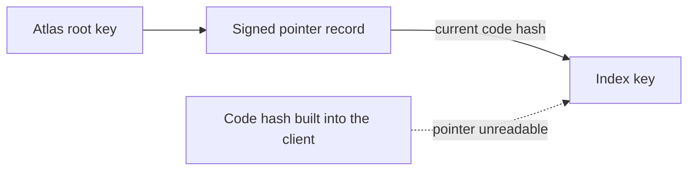

# 1.9 Testing and release

## Repositories

| Repository | Role | Work in this plan |
| --- | --- | --- |
| `freenet-appkit` | Modified | River scenario suite, Atlas compatibility fixtures, destructive-migration test contract and published results. Developer package: River WebView starter, Swift and Kotlin examples, version matrix, setup, diagnostics export and release checklist. Store release: first-download size prompt, App Review notes and the [store build checks](#store-build-checks) |
| [river](https://github.com/freenet/river) | Modified | Moderation in River's UI: reporting, blocking, a default content filter and terms before the first post. A published support URL and child-safety standards |
| [atlas](https://github.com/freenet/atlas) | Modified | Separate test index for the compatibility fixtures |

## Purpose

This plan tests milestone 1 (Freenet mobile AppKit) on real iOS and Android phones in the thin-peer role from [1.8 Thin-peer role and cellular data budgets](08-thin-peer.md), then releases it as the [developer package](#developer-package). The tests use two existing Freenet apps:

| | River | Atlas |
| --- | --- | --- |
| Used as | The reference app, built for iOS and Android | A few Atlas records in a separate test index, used as fixtures. The published Atlas index stays as it is |
| What runs | River's signed web UI in an in-app WebView, served by the phone's embedded node. River's own code calls its room contract and chat delegate | Atlas's own code runs `loadIndex`, search, refresh and `addProducts` against the test index |
| What it proves | Alice and Bob join "Skate club", read and send messages, go offline, reconnect and upgrade River | The Swift and Kotlin SDKs keep record bytes and the index key unchanged, send each response to the right request, share subscriptions between views and stay within device limits |
| Sections | [River scope](#river-scope), [River acceptance cases](#river-acceptance-cases) | [Atlas today and pinned identity](#atlas-today-and-pinned-identity), [Atlas fixture scope and acceptance](#atlas-fixture-scope-and-acceptance) |

## River scope

- Pin the River website container, publisher, archive reference, room contract, chat delegate and original parameter bytes for every run. Preserve predecessor artifacts needed by upgrade tests.
- Drive River's own UI for invite, join, read, send and reconnect tests. Use real embedded Core, contract validation and delegate signing. Deterministic fixtures isolate transport or fault cases alongside these end-to-end runs.
- Exercise the supported Swift/Kotlin APIs with the same protocol fixtures. Publish native-route coverage in the support matrix of 1.1 Mobile feasibility and supported profiles.
- Label locally cached observations and independently retrieved network evidence separately. Keep signed bytes with the draft until Core answers, under 1.6 Application protocols, data and operations.

River publishes a signed tar.xz website archive through its [web container contract](https://github.com/freenet/river/blob/main/contracts/web-container-contract/src/lib.rs). Its [chat delegate protocol](https://github.com/freenet/river/blob/main/common/src/chat_delegate.rs) includes `SignMessage` and `SignResponse`. The signing test uses that exchange to form an [authorized message](https://github.com/freenet/river/blob/main/common/src/room_state/message.rs), then checks the room's [recent-message state](https://github.com/freenet/river/blob/main/common/src/room_state/version.rs).

## River acceptance cases

| Scenario | Passing result |
| --- | --- |
| Install and invite | A clean install verifies River's signed archive. Opening Alice's invite validates its app and room references, shows trusted consent and joins the intended room. Invalid or substituted references fail visibly. |
| Read and refresh | Bob reads the joined room, sees cached observation time while offline and receives verified updates after reconnect. |
| Missing network copy | Remove remote copies of a River room Alice owns in an isolated test network. River PUTs the node's copy back under [lost network state in 1.6 Application protocols, data and operations](06-data-and-operations.md#lost-network-state). Verify readback through an independent peer. An interrupted or repeated PUT leaves each message in the room once. |
| Send through the delegate | The real chat delegate signs Bob's message on-device. River saves the signed message with its draft, sends it and sees it in room state. An independent peer can retrieve the message. |
| Offline and interrupted send | Send with no signal, on Wi-Fi with no internet, and with River terminated before and after Core answers. The message reaches an independent peer after reconnect, and a resend leaves one copy in the room. |
| Changed room authority | Write a draft offline, change membership or rotate the room secret, then reconnect. River keeps the draft and applies its protocol's conflict/repair rules. |
| Foreground lifecycle | Lock, background, terminate and resume during startup, signing, submission and refresh. Retain committed drafts, keys and sent messages, invalidate old callbacks and release ports/store locks. Alerts follow the foreground scope in 1.1 Mobile feasibility and supported profiles. |
| Connectivity | Change Wi-Fi/cellular paths and remove the serving peer. Reconnect restores demand. |
| Compatible web update | Stage a verified archive while a session remains on its selected compatible archive. Activate through host rules and keep drafts and signed messages waiting to be sent. |
| Interrupted component upgrade | Upgrade from an older River release on iOS and Android and kill the app during the migration. The next start finishes it, and the checks in [1.7 Upgrades and migration](07-migration.md#acceptance) pass. |
| Protected data | Test permission revocation, locked or invalidated keys and app-specific encrypted export/import through 1.5 Identity, keys and local protection. Show coverage and keep drafts. |
| Device limits and usability | Storage exhaustion, large records and rapid updates remain within the limits in 1.1 Mobile feasibility and supported profiles. Keyboard, focus, large text and screen-reader flows work on both platforms. |

Use a separate test contract for destructive migration cases and small Atlas records for canonical encoding, request correlation, subscriptions and binding costs. Preserve the published Atlas index identity. River upgrade runs still exercise River's actual delegate and migration path. Its [room predecessor registry](https://github.com/freenet/river/blob/main/common/legacy_room_contracts.toml), [delegate registry](https://github.com/freenet/river/blob/main/legacy_delegates.toml) and [migration build rules](https://github.com/freenet/river/blob/main/.claude/rules/delegate-migration.md) provide the recorded source evidence.

## Atlas today and pinned identity

- [Atlas](https://github.com/freenet/atlas) has a Rust browser UI on `freenet-stdlib` 0.8.3. Core main uses 0.12.1. Align the versions, or prove an adapter, before measuring.
- `atlas-client` on the [`feat/shared-atlas-wasm-client`](https://github.com/glesage/atlas/tree/feat/shared-atlas-wasm-client/client) fork branch is a browser Wasm client. 1.1 Mobile feasibility and supported profiles builds its iOS and Android WebView demos on it.

The index contract gets a new key whenever Atlas's `common/` or `contracts/` code changes. An old key still answers with an older copy of the index, so the client looks up the current key in a [pointer record](https://github.com/freenet/atlas/blob/main/pointer-records.toml) signed by Atlas's root key:

Pin these for every run:

| Pin | Source |
| --- | --- |
| Atlas root key | `author_verifying_key` in `pointer-records.toml` |
| Signed pointer record | The `atlas.index-contract` record in the same file |
| Index code hash and contract Wasm | That record's `code_hash` and `wasm_path` |
| Parameter bytes | The root key and the slug `default`, encoded as `IndexParams` |
| Signed Atlas records | The published index, byte for byte |

Test each new Atlas build in the separate test index, under the new key it produces.

## Atlas fixture scope and acceptance

Use a bounded deterministic index first, then a separate test index. Keep the published Atlas index intact. Test `loadIndex`, search, refresh and `addProducts` through Atlas's own application code. Domain preparation and SDK transport get separate measurements.

| Fixture | Passing result |
| --- | --- |
| Canonical records and identity | Browser and supported Swift/Kotlin paths preserve signing inputs, record bytes and pinned index identity. Malformed records fail validation. |
| Reads and subscriptions | Known records and bounded queries return the expected results. Cached data shows observation time. Releasing one view preserves another's demand through tested SDK subscription ownership. |
| Correlation and cancellation | Interleaved responses reach the right request/session. Reopened sessions reject late callbacks. |
| Publication | Application domain code prepares canonical updates. The signing fixture uses an authorized on-device delegate with keys protected by Core. The app saves the signed update before it sends it, then verifies readback. |
| Restart and resend | Termination before Core answers keeps the signed update, and resending it leaves one copy of the record. Termination after Core answers keeps the update in the node's copy. |
| Upgrade adapter | A separate test contract changes code, recovers predecessor state through the application adapter, resumes an interrupted migration and verifies successor readback. |
| Resource costs | Measurements separate transport/bindings, Core execution and UI work. Record large-record copying, delegate calls, subscription rate and elapsed time against the device limits in 1.1 Mobile feasibility and supported profiles. |

The existing TypeScript SDK and Rust browser build provide protocol comparisons. Swift/Kotlin examples use the native SDK's supported APIs. Each application supplies its own domain codecs and delegate messages through [application operations in 1.6 Application protocols, data and operations](06-data-and-operations.md#calling-a-delegate).

## Developer package

The package lets a developer build River, or their own app, for iOS and Android. It contains:

- A River WebView starter, and Swift and Kotlin SDK examples for native screens
- The supported-version matrix and pinned dependencies
- iOS and Android setup, build and distribution instructions, covering artifact verification, fixture setup and lifecycle integration
- Diagnostic export and the release checklist

## Store requirements

The release sends River to TestFlight on iOS and to Play internal testing on Android. River is a chat app, so both stores' rules for user-generated content apply. River's own UI handles moderation. The policy sources are the versions published on 2026-09-30.

| Requirement | What the release does | App Store | Google Play |
| --- | --- | --- | --- |
| Reporting | River's UI lets a user report a message or a member. Reports go to an inbox the River team monitors. The team answers each report within the time stated on the support page. | [Guidelines](https://developer.apple.com/app-store/review/guidelines/) 1.2 | [User-generated content](https://support.google.com/googleplay/android-developer/answer/9876937) |
| Blocking | Blocking a member hides their messages on the blocker's phone. The room owner can also ban the member from the room. | Guidelines 1.2 | User-generated content |
| Content filter | River's UI filters objectionable messages by default. | Guidelines 1.2 | User-generated content |
| Support URL | River publishes a support page with contact details. Both store listings link to it. | Guidelines 1.2 | User-generated content |
| Terms | River shows its terms before a user's first post. The user accepts them to post. | – | User-generated content |
| Child safety | River publishes child-safety standards for its chat rooms and declares them in Play Console. | – | [Child safety standards](https://support.google.com/googleplay/android-developer/answer/14747720) |
| Downloaded code | The app is a River app with River's website key and contract keys pinned. The node runs only contracts and delegates whose code hashes are on the pinned list. The WebView bridge carries only node calls. | Guidelines 2.5.2 and 4.7; [DPLA](https://developer.apple.com/support/terms/apple-developer-program-license-agreement/) 3.3.1(B) | [Device and network abuse](https://support.google.com/googleplay/android-developer/answer/9888379) |
| Large downloads | Before the first large download, the host asks the user and states the download size. | Guidelines 4.2.3 | – |
| Interpreter | wasmtime's Pulley interpreter runs all Wasm on iOS and on every Android ABI, so no build maps executable memory. | DPLA 3.3.1(B); [alternative browser engines](https://developer.apple.com/support/alternative-browser-engines/) | Device and network abuse |
| Review notes | App Review notes explain the embedded node and the Pulley interpreter. | Guidelines 2.5.2 | – |
| Encryption export | Declare the standard algorithms in App Store Connect: X25519, AES-GCM, ChaCha20, Ed25519 and BLAKE3. Record in the release checklist whether River ships in France, and file the French encryption declaration if it does. File the US year-end self-classification report when the export rules require it. | [Encryption export regulations](https://developer.apple.com/documentation/security/complying-with-encryption-export-regulations) | – |
| Data safety | Declare the messages, user IDs and IP addresses River sends to peers, except data that is end-to-end encrypted. Declare encryption in transit. | – | [Data safety](https://support.google.com/googleplay/android-developer/answer/10787469) |

### Store build checks

The iOS and Android packaging scripts run these checks on every store build. Any failed check fails the build.

| Check | iOS | Android |
| --- | --- | --- |
| Pulley only | No Cranelift native backend and no JIT entitlement | No Cranelift native backend for any ABI |
| No file sharing | `Info.plist` has no `UIFileSharingEnabled` | – |
| [16 KB pages](https://developer.android.com/guide/practices/page-sizes) | – | `zipalign -c -P 16` passes on the APK |
| [Target API](https://support.google.com/googleplay/android-developer/answer/11926878) | – | `targetSdk` is 36 or later |
| Release signing | Distribution certificate | Upload key, with Play App Signing |
| Privacy and encryption | `PrivacyInfo.xcprivacy` is in the `.app`, and `Info.plist` sets `ITSAppUsesNonExemptEncryption` | – |
| No test harness | The binary has no `appkit.scenario` or `APPKIT_RESULT` | `classes*.dex` and native libraries have no `appkit.scenario` or `APPKIT_RESULT` |

## Release tests

Every test runs on iOS and Android, with the phone in the thin-peer role.

| Release test | Passing evidence |
| --- | --- |
| Independent build | A second developer builds and installs River from the starter instructions on iOS and Android. |
| River | The join, read, send, reconnect, restart and interrupted-upgrade cases in [River acceptance cases](#river-acceptance-cases) pass through River's UI and real chat delegate. |
| Atlas | The [Atlas fixtures](#atlas-fixture-scope-and-acceptance) pass. |
| Thin role and budgets | The [acceptance in 1.8 Thin-peer role and cellular data budgets](08-thin-peer.md#acceptance) passes on the pinned Core build. |
| Safety and durability | Host authority, protected keys, offline sends, app-specific encrypted export/import and supported migrations pass their owning plans. |
| Local network | The local-network case in the [acceptance in 1.2 Embedded node and mobile SDK](02-sdk.md#acceptance) passes with River. |
| Device limits and accessibility | Startup, memory, battery, storage exhaustion, keyboard, focus, large text and screen-reader tests pass on the declared devices. |
| Distribution | The TestFlight and Play internal-testing builds of River pass review, and every [store requirement](#store-requirements) holds. |
| Diagnostics | Reports identify versions, node role, lifecycle state, observation provenance and pending-operation status. Apply [host redaction in 1.3 Single-application host](03-host.md#diagnostics) to keys, tokens, message content and private references. |

## Acceptance evidence

Publish results with exact revisions, devices, OS versions, network conditions and redacted logs.
