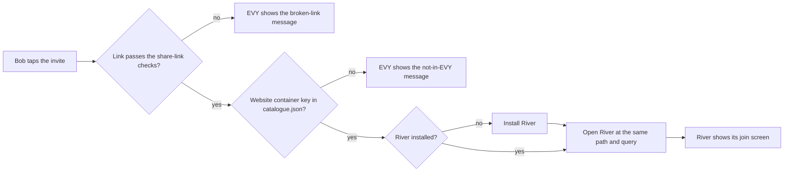

# 2.1 EVY catalogue and app hosting

## Repositories

| Repository | Role | Work in this plan |
| --- | --- | --- |
| [evy](https://github.com/EVY-Platform/evy) | Modified | iOS and Android catalogue, app hosting, links and settings |
| [freenet-appkit](https://github.com/glesage/freenet-appkit) | Modified | Per-app WebView storage, sessions and recovery |
| [freenet-core](https://github.com/freenet/freenet-core) | Modified | Per-app session admission, secret scopes and resource limits |
| [atlas](https://github.com/freenet/atlas) | Modified | Atlas bundle, reporting and support page |
| [river](https://github.com/freenet/river) | Modified | River share links and two-app fixture |
| [web](https://github.com/freenet/web) | Used | EVY open page and share-link docs |

## Purpose and hosting model

This plan builds EVY on iOS and Android. EVY lists River and Atlas, installs their release bundles and runs both on one embedded node in the thin-peer role from [1.8 Thin-peer role and cellular data budgets](../1-freenet-mobile-appkit/08-thin-peer.md). In milestone 2 (EVY mobile app), "app" means River or Atlas, and "EVY" means the phone app.

EVY starts from River's store build in [1.9 Testing and release](../1-freenet-mobile-appkit/09-testing-and-release.md). It installs each app under [1.4 Application bundles](../1-freenet-mobile-appkit/04-bundles.md#installing-a-copy) and applies the host rules in [1.3 Single-application host](../1-freenet-mobile-appkit/03-host.md), with the per-app scopes defined in this plan. EVY gets one node under [One node per app in 1.3 Single-application host](../1-freenet-mobile-appkit/03-host.md#one-node-per-app).

| Part | Scope |
| --- | --- |
| EVY home, navigation and settings | Shared by all installed apps |
| Embedded node, web-app file cache and network budgets | Shared by all installed apps |
| WebView and loaded Core shell page | One per open app, identified by its website container key |
| Session, persistent web data store, secret scope and permission grants | One per app |
| Contracts and delegates in an app's bundle | Run through the shared node |

Each app's WebView loads the same Core shell implementation. The shell embeds the app's web UI in a sandboxed frame with an opaque origin and storage handled by the shell, under [Browser and native hosts in 1.3 Single-application host](../1-freenet-mobile-appkit/03-host.md#browser-and-native-hosts). Separate persistent data stores let EVY clear one app's browser records while preserving the other app's records. Separate WebViews keep both pages loaded when the user switches apps. Verify renderer recovery on iOS and Android under [App lifecycle](#app-lifecycle).

Alice opens River and reads "Skate club", then switches to Atlas to browse apps. Bob's "Skate session Saturday?" reaches River and raises its alert. A tap returns Alice to the room. Each app's records, replies and permissions stay scoped to that app.

## Catalogue and installation

### The catalogue

EVY's release configuration is one `catalogue.json` that the iOS and Android builds both bundle. Each entry pins an app by its website container key.

```jsonc
{
  "store_age_rating": 16,                                                      // EVY's rating in the App Store and Google Play
  "apps": [
    {
      "name": "River",                                                         // shown on home and in the store index
      "publisher": "<River publisher>",                                        // shown in the store index
      "website_container_key": "raAqMhMG7KUpXBU2SxgCQ3Vh4PYjttxdSWd9ftV7RLv",  // from River's publish rules
      "age_rating": 16,                                                        // from the app's rating questionnaire
      "support_url": "<River support page>"                                    // from the app's store requirements
    },
    {
      "name": "Atlas",
      "publisher": "<Atlas curator>",
      "website_container_key": "771DvtPMwt2PumPyrFvsz7fpvU1gogcmb5qtS1yYEEH9", // from Atlas's README
      "age_rating": 16,
      "support_url": "<Atlas support page>"
    }
  ]
}
```

The keys come from [River's publish rules](https://github.com/freenet/river/blob/main/.claude/rules/river-publish.md) and [Atlas's README](https://github.com/freenet/atlas/blob/main/README.md). Each app keeps its key across releases, because the packaging CLI passes the app's pinned container Wasm on every publication ([the archive and its definition in 1.4 Application bundles](../1-freenet-mobile-appkit/04-bundles.md#the-archive-and-its-definition)). Atlas's index contract takes a new key when its code changes, and its website container key stays the same. The iOS and Android builds fail when an entry lacks a key or an age rating.

Home shows one tile per entry with its name and installed version. The first tap installs the app, after the first-download size prompt from [store requirements in 1.9 Testing and release](../1-freenet-mobile-appkit/09-testing-and-release.md#store-requirements).

### Atlas in EVY

| Work | What Atlas does |
| --- | --- |
| Definition | The release build gains `app_definition.json` with one component, the index contract with `IndexParams` (root key and slug `default`) and `setup: none`. It declares no permissions. |
| Publication | The release build publishes through the packaging CLI from [1.4 Application bundles](../1-freenet-mobile-appkit/04-bundles.md#publishing-and-evidence). The CLI passes Atlas's own [`web_container_contract.wasm`](https://github.com/freenet/atlas/tree/main/contracts/web-container) with `--contract-wasm`, so the container key stays `771D...`. fdev stamps the Unix time as the version, so Atlas's first release through the CLI has a version above its current value of about 10 ([atlas#53](https://github.com/freenet/atlas/issues/53)). Before the first release, check that fdev signs with Atlas's root key. |
| Filter | Safe search stays on by default and hides entries whose landing page is rated other than general audience ([main.rs](https://github.com/freenet/atlas/blob/main/ui/src/main.rs)). Entries with no rating still show. The rating reads only page text, so an image-only site can pass ([atlas#11](https://github.com/freenet/atlas/issues/11)). The toggle lives in `localStorage`, which the sandboxed frame denies, so it returns to on at each load. |
| Report | Each entry card gains a Report button. Reports go to an inbox the curator monitors. Today users report entries in Atlas's River room ([atlas#52](https://github.com/freenet/atlas/issues/52)). The curator removes a reported entry with [`atlasctl remove`](https://github.com/freenet/atlas/blob/main/cli/src/main.rs), which tombstones it for every reader. |
| Support URL | Atlas publishes a support page with contact details. Its catalogue entry holds the link. |

### Apps that bundle the same delegate

A delegate key comes from its code hash and parameters ([1.7 Upgrades and migration](../1-freenet-mobile-appkit/07-migration.md#component-identity-and-re-keying)). River's chat delegate has empty parameters, so any app that bundles it unchanged gets River's key. Core shares these by delegate key, whichever app made the call:

- delegate subscriptions, keyed by contract and delegate ([redb.rs](https://github.com/freenet/freenet-core/blob/main/crates/core/src/contract/storages/redb.rs))
- the context a delegate keeps between calls, cached by delegate key for 10 minutes ([#4049](https://github.com/freenet/freenet-core/pull/4049))
- wake-ups, lifecycle runs and notification runs; [Core and AppKit requirements](#core-and-appkit-requirements) defines their per-app secret scope

So in step 1 of [Installing a copy in 1.4 Application bundles](../1-freenet-mobile-appkit/04-bundles.md#installing-a-copy), the installation interface works out each delegate key from `components` in `app_definition.json`. It refuses an app whose delegate key matches an installed app's key, and names that app on the screen.

## Opening apps, links and alerts

### Sessions and replies

Each app gets its own session under [Trusted calls in 1.3 Single-application host](../1-freenet-mobile-appkit/03-host.md#trusted-calls).

| Rule | What EVY and Core do | River and Atlas example |
| --- | --- | --- |
| Session admission | `crates/mobile` binds each WebView's connection to its verified website container key, and Core attests that key to delegates as `MessageOrigin::WebApp`. [Core and AppKit requirements](#core-and-appkit-requirements) lists the admission change | River's chat delegate keys every stored record and signing key by the calling container ([utils.rs](https://github.com/freenet/river/blob/main/delegates/chat-delegate/src/utils.rs)). A call from Atlas reaches an empty namespace |
| Replies | Core sends each reply to the connection that sent the request. When both apps send the same GET, PUT, SUBSCRIBE or UPDATE, Core runs one network operation and replies to each connection ([#1825](https://github.com/freenet/freenet-core/pull/1825), [#2438](https://github.com/freenet/freenet-core/pull/2438)) | River's signing reply reaches River's WebView |

### Opening links and alerts

EVY opens Freenet share links ([share links manual](https://freenet.org/build/manual/share-links/), [#5726](https://github.com/freenet/freenet-core/issues/5726)). A share link keeps its target in the URL fragment, and browsers never send the fragment to a server. EVY accepts three forms of the same target on iOS and Android.

| Form | River example | How it reaches EVY |
| --- | --- | --- |
| EVY link | `https://<EVY link domain>/open#raAq.../?invitation=<code>` | Universal link on iOS and App Link on Android, from the `apple-app-site-association` and `assetlinks.json` files on EVY's link domain |
| `freenet:` link | `freenet:raAq.../?invitation=<code>` | EVY registers the `freenet:` scheme on iOS and Android. It also accepts `freenet://`, as Core's handler does ([#5753](https://github.com/freenet/freenet-core/pull/5753), [#5756](https://github.com/freenet/freenet-core/pull/5756)) |
| freenet.org link | `https://freenet.org/open#raAq.../?invitation=<code>` | The freenet.org/open page's "Open in Freenet" button emits the `freenet:` form ([web#184](https://github.com/freenet/web/pull/184), [web#186](https://github.com/freenet/web/pull/186)) |

EVY checks each link with the rules of Core's `freenet:` handler ([#5753](https://github.com/freenet/freenet-core/pull/5753)). The contract ID must decode from base58 to 32 bytes, and the path must hold no dot segments. EVY's tests run Core's [`share-link-vectors.json`](https://github.com/freenet/freenet-core/blob/main/crates/core/tests/data/share-link-vectors.json). EVY then turns the target into the path `/v1/contract/web/<website container key>/<path>?<query>` and passes the path and query to the app unchanged.

On a phone without EVY, the browser loads the `/open` page on EVY's link domain. The browser keeps the fragment, so EVY's server never receives the invite code. The page shows App Store and Google Play buttons to install EVY. Once EVY is installed, Bob taps the invite link again and EVY opens it.

River builds invite links from the page's own URL ([invite_member_modal.rs](https://github.com/freenet/river/blob/main/ui/src/components/members/invite_member_modal.rs)). Inside EVY that URL is the node's loopback address. So the host bridge gives River its link base `https://<EVY link domain>/open#raAq.../`, which is EVY's link domain followed by River's container key, and Alice's invite reads `https://<EVY link domain>/open#raAq.../?invitation=<code>`. River reads `invitation` from its URL ([app.rs](https://github.com/freenet/river/blob/main/ui/src/components/app.rs)), and its [portable invite code](https://github.com/freenet/river/blob/main/ui/src/components/room_list/join_with_code_modal.rs) works as it does today. Each invite holds one invitee's signing key and works for one person ([river#566](https://github.com/freenet/river/issues/566)). Draft [river#567](https://github.com/freenet/river/pull/567) makes an invite sent by direct message River's main action and keeps the link for people not yet on River.



A tap while EVY's node joins follows [Opening, suspending and reopening an app in 1.3 Single-application host](../1-freenet-mobile-appkit/03-host.md#opening-suspending-and-reopening-an-app), which keeps the link target ([#5745](https://github.com/freenet/freenet-core/issues/5745), [#5750](https://github.com/freenet/freenet-core/pull/5750)).

Each WebView loads its own container's path. The WebView host hands any other `/v1/contract/web/<website container key>/` path to EVY for catalogue checks and routing.

- Atlas's Open turns an entry's [`Locator`](https://github.com/freenet/atlas/blob/main/common/src/types.rs) into a link ([state.rs](https://github.com/freenet/atlas/blob/main/common/src/state.rs)). A `Freenet` or `AppResource` locator becomes a `/v1/contract/web/<website container key>/` path. For a catalogue key, EVY switches to that app. For any other key, EVY shows the not-in-EVY message and keeps Atlas on screen.
- An `External` locator is an https URL. Atlas indexes only Freenet sites ([atlas#34](https://github.com/freenet/atlas/pull/34)), and [atlas#35](https://github.com/freenet/atlas/issues/35) purges its 36 external entries, so new External entries come only from the curator.
- EVY opens an https URL in the system browser on iOS and Android. The URL arrives as the shell's `open_url` message, which River uses ([river#203](https://github.com/freenet/river/issues/203)), or as a `target="_blank"` link, which Atlas's Open uses. The WebView host validates both as [Shell-bridge messages in 1.3 Single-application host](../1-freenet-mobile-appkit/03-host.md#shell-bridge-messages) describes.
- `crates/mobile` tags each alert with its app's website container key and session, and posts it while another app is on screen. River tags each alert with its room ([notifications.rs](https://github.com/freenet/river/blob/main/ui/src/components/app/notifications.rs)). A tap opens the sending app in its own WebView and data store and returns the tag, so a River alert tapped while Atlas is on screen opens "Skate club". In a browser, a tap after the tab closes loses the tag ([#4939](https://github.com/freenet/freenet-core/issues/4939)), and EVY's native alert keeps it. The target check and refresh follow [1.3 Single-application host](../1-freenet-mobile-appkit/03-host.md#base-authorization-and-device-access).

## Per-app data and permissions

### Web storage

Both apps' shell pages load from the node's one origin, `http://127.0.0.1:<port>`. The shell keeps per-contract records in that origin's storage, such as River's notification consent under `freenet_notify:<website container key>` ([shell_bridge.js](https://github.com/freenet/freenet-core/blob/main/crates/core/src/server/path_handlers/assets/shell_bridge.js)). So the WebView host gives each app its own persistent data store, named by its website container key. Each app's cookies, storage, cache and service worker stay in its own store, and EVY deletes each store by app.

Core unpacks both apps into the node's own web-app cache folder from [Storage in 1.2 Embedded node and mobile SDK](../1-freenet-mobile-appkit/02-sdk.md#storage) ([#5706](https://github.com/freenet/freenet-core/issues/5706)).

| Platform | Data store per app | Supported versions |
| --- | --- | --- |
| iOS | `WKWebsiteDataStore(forIdentifier:)`, deleted with `WKWebsiteDataStore.remove(forIdentifier:)` | iOS 17 or later, the first version with `WKWebsiteDataStore(forIdentifier:)`. So EVY's iOS target is 17.0, above the iOS 16 floor in [Supported profiles in 1.1 Mobile feasibility and supported profiles](../1-freenet-mobile-appkit/01-feasibility.md#supported-profiles) |
| Android | An androidx.webkit `Profile` from `ProfileStore.getOrCreateProfile`, deleted with `deleteProfile` | Android 9 (API 28) or later, as in [Supported profiles in 1.1 Mobile feasibility and supported profiles](../1-freenet-mobile-appkit/01-feasibility.md#supported-profiles). androidx.webkit 1.9.0 or later (AppKit uses 1.15.0) and a System WebView that reports `WebViewFeature.MULTI_PROFILE`. EVY checks the feature at start and asks the user to update Android System WebView when it is missing |

### Secret scopes

Each app gets a random 32-byte secret and its own `SecretScope::User`. This gives [Forget in 1.5 Identity, keys and local protection](../1-freenet-mobile-appkit/05-identity.md#forget) an app-specific encryption key in EVY.

| Step | Who | Rule |
| --- | --- | --- |
| Create | `crates/mobile` | On River's first start, create its secret. Store it in the iOS Keychain or Android Keystore with the settings in [Node encryption key in 1.5 Identity, keys and local protection](../1-freenet-mobile-appkit/05-identity.md#node-encryption-key) |
| Run | Core | Run River's delegates under `SecretScope::User`, built from River's secret. Its scope key derives only from that secret ([user.rs](https://github.com/freenet/freenet-core/blob/main/crates/core/src/wasm_runtime/secrets_store/user.rs), from hosted mode in [#4381](https://github.com/freenet/freenet-core/issues/4381)) |

Each app's scope follows these rules:

- `crates/mobile` sets Core's `per-user-inactive-ttl` setting to 0, which turns off hosted mode's 30-day sweep ([sweep.rs](https://github.com/freenet/freenet-core/blob/main/crates/core/src/wasm_runtime/secrets_store/sweep.rs), [#4561](https://github.com/freenet/freenet-core/issues/4561)). River keeps its data when Alice skips it for a month. Hosted nodes reclaim a user's secrets on purpose ([#5105](https://github.com/freenet/freenet-core/issues/5105)).
- Each app's scope keeps Core's 4 MiB per-user quota ([quota.rs](https://github.com/freenet/freenet-core/blob/main/crates/core/src/wasm_runtime/secrets_store/quota.rs)), set with Core's `per-user-secret-quota` setting or `SecretsStore::with_user_quota`. One hosted River user reached 3,998.5 KiB of it, from room copies in 27 delegate generations ([river#586](https://github.com/freenet/river/issues/586)). River stays under it by retiring old versions as [Retiring the old version in 1.7 Upgrades and migration](../1-freenet-mobile-appkit/07-migration.md#retiring-the-old-version) describes. Measure River's `room:<vk>` slots and `rooms_meta` against it.
- Derive the encryption key for River's host records from River's secret, so Forget covers the records listed in [What the key protects in 1.5 Identity, keys and local protection](../1-freenet-mobile-appkit/05-identity.md#what-the-key-protects).
- On lock, `crates/mobile` wipes the node encryption key and per-app secrets from memory, following [Locking and unlocking in 1.5 Identity, keys and local protection](../1-freenet-mobile-appkit/05-identity.md#locking-and-unlocking). [The backup file in 1.5 Identity, keys and local protection](../1-freenet-mobile-appkit/05-identity.md#the-backup-file) needs to carry River's user-scope secrets.

### Permissions

On iOS and Android, the system grants notification permission to EVY once. Each app also needs its own grant in Core's table, under [Asking for a permission in 1.3 Single-application host](../1-freenet-mobile-appkit/03-host.md#asking-for-a-permission).

Core stores grants under `UserScope::Node`, keyed by app and permission, as [Base authorization and device access in 1.3 Single-application host](../1-freenet-mobile-appkit/03-host.md#base-authorization-and-device-access) describes. Forget deletes grants by the app's website container key.

- EVY asks for `notifications` the first time the user opens an app that declares it. Bob's answer belongs to River; Atlas declares no permissions and opens directly.
- River's Enable button and first send use the stored answer.
- The user changes or revokes an answer on the app's settings page. Revoking River's grant makes its next alert request return denied, while Atlas keeps its grants and session.

## App lifecycle

While EVY is in the foreground, both WebViews stay loaded and keep their sessions and subscriptions. When EVY goes to the background, the node stops for both apps, as [Foreground lifecycle in 1.1 Mobile feasibility and supported profiles](../1-freenet-mobile-appkit/01-feasibility.md#foreground-lifecycle) describes.

| Event in River | River | Atlas |
| --- | --- | --- |
| Alice closes River | Its session ends, and the SDK releases its subscription handles under [Ending subscriptions in 1.2 Embedded node and mobile SDK](../1-freenet-mobile-appkit/02-sdk.md#ending-subscriptions) | Keeps its session and index subscription |
| A new River version arrives | Activates at River's next session boundary under [Activating a release in 1.3 Single-application host](../1-freenet-mobile-appkit/03-host.md#activating-a-release) | Keeps its session and version |
| River's web content process ends | EVY reloads River in a new session, on `webViewWebContentProcessDidTerminate` on iOS and `onRenderProcessGone` on Android | Keeps running. Android can run both WebViews in one renderer process, so verify whether one loss reloads both apps there. Each app keeps its own web storage |

Apply the same rules with the apps swapped. Both apps count against the node-wide caps in [Cellular budget contract in 1.8 Thin-peer role and cellular data budgets](../1-freenet-mobile-appkit/08-thin-peer.md#cellular-budget-contract), and a cap pauses both together. [Core and AppKit requirements](#core-and-appkit-requirements) covers delegate queue limits and secret quotas.

## Settings and store index

### Settings

EVY's settings say that alerts arrive only while EVY is open ([message alerts in 1.1 Mobile feasibility and supported profiles](../1-freenet-mobile-appkit/01-feasibility.md#message-alerts)). Each app has its own page.

| Row | What it does | River example |
| --- | --- | --- |
| Permissions | Lists the app's grants and lets the user change or revoke each answer through Core's grant API, under [Permissions](#permissions). The user also controls EVY's notification permission in the iOS or Android system setting. | EVY asked the first time Bob opened River, and the page shows `notifications` granted. Atlas's page says Atlas uses no permissions, and opening Atlas raises no prompt. |
| Storage | Shows the bytes the app uses on the phone, from [diagnostics in 1.3 Single-application host](../1-freenet-mobile-appkit/03-host.md#diagnostics). | River's room copies, delegate records and web storage |
| Remove | Deletes the installed copy and the app's grants. Keys and records stay. | Alice installs River again and "Skate club" is back. |
| Forget | Deletes the app's keys and records after a confirmation, and reports deletion failures. [Forgetting one app](#forgetting-one-app) keeps the other app's records readable. | Forgetting River leaves Atlas as it was. |
| Diagnostics | Exports one report for this app through the iOS or Android share sheet. It holds the app's own connection state, subscriptions, grants, storage and failures, plus the node's role and data budget. Redaction follows [diagnostics in 1.3 Single-application host](../1-freenet-mobile-appkit/03-host.md#diagnostics). | River's report contains its own app data. Invite codes are redacted as keys, because each carries the invitee's signing key and the room secrets ([members.rs](https://github.com/freenet/river/blob/main/ui/src/components/members.rs)). |

### Forgetting one app

After the user confirms Forget, `crates/mobile` and EVY perform these steps for River:

1. Delete River's secret first. River's `room:<vk>` slots, `rooms_meta` and host records become unreadable at once, including copies retained by flash storage.
2. Delete River's secret files, grants by website container key, and WebView data store.
3. Report deletion failures. Atlas keeps its data and session.

### Store index and age check

The store index answers [App Store Review Guideline 4.7](https://developer.apple.com/app-store/review/guidelines/) (mini apps). EVY builds it from `catalogue.json` and shows it in settings on iOS and Android.

- Each row lists the app's name, publisher, age rating, website container key, support URL and EVY link.
- River and Atlas are rated at or below `store_age_rating` and open with no age question. An entry rated above it shows an age mark on home.
- EVY asks for the user's birth year the first time the user opens that entry. EVY keeps the answer in its settings and opens the app only when the age meets the entry's rating.

## Core and AppKit requirements

These changes support the per-app boundaries in this plan:

| Requirement | Work and source |
| --- | --- |
| Authenticated app admission | Bind verified app identity to the connection. Core's loopback token admission needs [session admission #5264](https://github.com/freenet/freenet-core/issues/5264), under [Trusted calls in 1.3 Single-application host](../1-freenet-mobile-appkit/03-host.md#trusted-calls) |
| User scope on a mobile connection | Add a user scope on a connection without hosted mode. Core currently builds it from a hosted `userToken` honored only from loopback with `X-Forwarded-Proto: https` ([websocket.rs](https://github.com/freenet/freenet-core/blob/main/crates/core/src/client_events/websocket.rs)); hosted mode also disables delegate capabilities. The mobile connection needs both user scope and delegate capabilities |
| Scope for autonomous delegate runs | Carry the app's user scope through notification, lifecycle, wake-up and inter-delegate runs ([#5736](https://github.com/freenet/freenet-core/issues/5736)). These currently run under `SecretScope::Local` ([contract.rs](https://github.com/freenet/freenet-core/blob/main/crates/core/src/contract.rs)). River's chat delegate needs to read River's per-app secrets when Bob's message wakes it |
| Delegate notification queue | Bound interference between apps and report overflow ([#5561](https://github.com/freenet/freenet-core/issues/5561)). Core's shared queue holds 1,000 entries and silently drops new entries when full. A busy delegate must leave River's message alert on time |
| Delegate secret quotas | Enforce the app's quota in every delegate run, including autonomous runs. Local-scope secrets currently have unrestricted growth ([#5560](https://github.com/freenet/freenet-core/issues/5560)). A delegate that writes on every notification must stop at its quota while both apps keep running |
| AppKit hosting | Bind WebView connections, navigation, callbacks and alerts to the app and session; select the app's persistent store; recover its WebView after termination; and delete its secret and data store on Forget |

## Acceptance

Every case runs on iOS and Android. [2.2 Testing and release](02-testing-and-release.md) owns the device scenarios and release evidence.

| Area | Passing result |
| --- | --- |
| Catalogue and installation | A clean EVY install lists River and Atlas from `catalogue.json`. The first tap installs and opens the app, and River shows "Skate club". A build rejects entries with missing keys or age ratings. Installation rejects a fixture app that bundles River's chat delegate unchanged and names the installed app whose delegate key matches |
| Atlas bundle and catalogue | Atlas publishes through the packaging CLI to container `771D...` at a Unix-time version and opens in EVY. Safe search starts on, and Report reaches the curator's inbox. Open on a catalogue app switches to its own WebView; Open on another key keeps Atlas on screen |
| Session and data isolation | River and Atlas share one thin-peer node and keep separate data stores. After restart, River retains its notification consent in its own store. Atlas's delegate calls are attested as Atlas and reach its own namespace; River's replies and Alice's `room:<vk>` slots are accessible only to River's authorized session |
| Links | Bob taps Alice's invite with River awaiting installation, in each of the three link forms and during node start. EVY installs River, preserves the invitation and opens its join screen. A browser without EVY shows the App Store and Google Play buttons, with the invite code held in the fragment. The server log excludes the invite code. Link checks pass Core's `share-link-vectors.json`; invalid links show the broken-link message, and keys outside the catalogue show the not-in-EVY message |
| External links | An External fixture entry added with `atlasctl add` to the test index from [1.9 Testing and release](../1-freenet-mobile-appkit/09-testing-and-release.md#atlas-today-and-pinned-identity), and River's `open_url` link, open in the system browser |
| Alerts and permissions | River's first run asks for `notifications` once; Atlas opens directly. With Atlas on screen, Bob's "Skate session Saturday?" wakes River's chat delegate in River's scope, reads River's secrets and raises its alert. Tapping it opens "Skate club". Revoking River's grant stops its alerts and preserves Atlas's grants and session |
| Lifecycle | Closing, updating or reloading River after its web content process ends preserves Atlas's session and index subscription. Apply the same checks with the apps swapped |
| Shared resource limits | A fixture delegate watching a contract that updates many times a second leaves River's message alert on time. A fixture delegate adding to a secret on every notification stops at its quota, and both apps keep running. Together the apps stay within the node-wide thin-peer budgets; a cap pauses both |
| Settings and deletion | Remove keeps River's keys and records. Forget asks for confirmation, makes River's secrets unreadable before file deletion, removes its grants and data store, and reports deletion failures. Atlas keeps its data and session. River's diagnostics contain River's app data and node status, with invite codes, keys and message bodies redacted |
| Store index and accessibility | Each store index link opens its app. An entry above EVY's store rating opens after the age check passes. Home, settings and the store index pass VoiceOver and Dynamic Type on iOS, and TalkBack and font scaling on Android |
