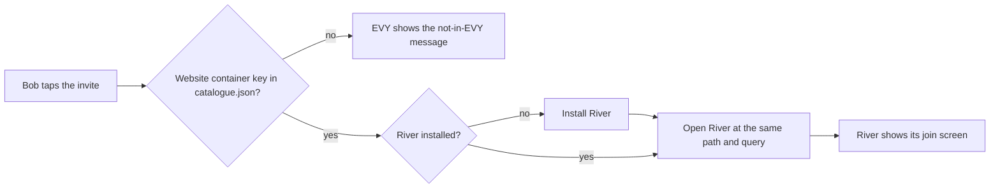

# 2.1 EVY shell and curated catalogue

## Repositories

| Repository | Role | Work in this plan |
| --- | --- | --- |
| [evy](https://github.com/EVY-Platform/evy) | Modified | `ios/` rebuilt on the AppKit Swift package and a new `android/` app on the Kotlin package. Home, `catalogue.json`, per-app settings, link and alert routing, the store index, the age check and per-app diagnostics export. The `apple-app-site-association` and `assetlinks.json` files for EVY's link domain |
| [atlas](https://github.com/freenet/atlas) | Modified | `app_definition.json`, publication through the packaging CLI, a Report button on each entry and a support page |
| [river](https://github.com/freenet/river) | Modified | Invite links use the link base the host supplies |
| `freenet-appkit` | Used | Swift and Kotlin packages, WebView hosts and bridge, installation interface and packaging CLI from milestone 1 (Freenet mobile AppKit) |
| [freenet-core](https://github.com/freenet/freenet-core) | Used | Embedded node in the thin-peer role, and `crates/mobile` host authority and grant API from milestone 1 (Freenet mobile AppKit) |

## Purpose

This plan builds EVY, one iOS app and one Android app that list River and Atlas and open each in its own in-app WebView. Both apps run on one embedded node in the thin-peer role. In milestone 2 (EVY mobile app), "app" means River or Atlas, and "EVY" means the phone app. EVY starts from River's store build in [1.9 Testing and release](../1-freenet-mobile-appkit/09-testing-and-release.md). It installs each app under [1.4 Application bundles](../1-freenet-mobile-appkit/04-bundles.md#installing-a-copy) and opens it through [1.3 Single-application host](../1-freenet-mobile-appkit/03-host.md).

Alice opens EVY on her phone and taps River. EVY installs River's release bundle, and River shows her private room "Skate club". She copies an invite link, Bob taps it on his phone, and EVY opens River's join screen. Atlas sits next to River on home and opens the apps it finds in its index.

## The catalogue

EVY's release configuration is one `catalogue.json` that the iOS and Android builds both bundle. Each entry pins an app by its website container key.

```jsonc
{
  "store_age_rating": 16,                                                      // EVY's rating in the App Store and Google Play
  "apps": [
    {
      "name": "River",                                                         // shown on home and in the store index
      "publisher": "<River publisher>",                                        // shown in the store index
      "website_container_key": "raAqMhMG7KUpXBU2SxgCQ3Vh4PYjttxdSWd9ftV7RLv",  // from River's publish rules
      "age_rating": 16,                                                        // from the app's rating questionnaire
      "support_url": "<River support page>"                                    // from the app's store requirements
    },
    {
      "name": "Atlas",
      "publisher": "<Atlas curator>",
      "website_container_key": "771DvtPMwt2PumPyrFvsz7fpvU1gogcmb5qtS1yYEEH9", // from Atlas's README
      "age_rating": 16,
      "support_url": "<Atlas support page>"
    }
  ]
}
```

The keys come from [River's publish rules](https://github.com/freenet/river/blob/main/.claude/rules/river-publish.md) and [Atlas's README](https://github.com/freenet/atlas/blob/main/README.md). Atlas's index contract takes a new key when its code changes, and its website container key stays the same. The iOS and Android builds fail when an entry lacks a key or an age rating.

Home shows one tile per entry with its name and installed version. The first tap installs the app, after the first-download size prompt from [store requirements in 1.9 Testing and release](../1-freenet-mobile-appkit/09-testing-and-release.md#store-requirements).

## Atlas in EVY

| Work | What Atlas does |
| --- | --- |
| Definition | The release build gains `app_definition.json` with one component, the index contract with `IndexParams` (root key and slug `default`) and `setup: none`. It declares no permissions. |
| Publication | The release build publishes through the packaging CLI from [1.4 Application bundles](../1-freenet-mobile-appkit/04-bundles.md#publishing-and-evidence) in place of `atlasctl webapp-put`. `fdev website publish --contract-wasm` takes Atlas's own [`web_container_contract.wasm`](https://github.com/freenet/atlas/tree/main/contracts/web-container), so the container key stays `771D...`. Check that fdev signs with Atlas's root key before the switch. |
| Filter | Safe search stays on by default and hides entries whose landing page is not rated general audience. |
| Report | Each entry card gains a Report button. Reports go to an inbox the curator monitors. The curator removes a reported entry with [`atlasctl remove`](https://github.com/freenet/atlas/blob/main/cli/src/main.rs), which tombstones it for every reader. |
| Support URL | Atlas publishes a support page with contact details. Its catalogue entry holds the link. |

## Opening links and alerts

EVY's link domain serves universal links on iOS and App Links on Android. A link uses the same path as a Freenet gateway, `https://<EVY link domain>/v1/contract/web/<website container key>/<path>?<query>`. EVY passes the path and query to the app unchanged.

River builds invite links from the page's own URL ([invite_member_modal.rs](https://github.com/freenet/river/blob/main/ui/src/components/members/invite_member_modal.rs)). Inside EVY that URL is the node's loopback address. So River takes the link base from the host bridge, and Alice's invite reads `https://<EVY link domain>/v1/contract/web/raAq.../?invitation=<code>`. River reads `invitation` from its URL ([app.rs](https://github.com/freenet/river/blob/main/ui/src/components/app.rs)), and its [portable invite code](https://github.com/freenet/river/blob/main/ui/src/components/room_list/join_with_code_modal.rs) works as it does today.



- Atlas's Open turns an entry's [`Locator`](https://github.com/freenet/atlas/blob/main/common/src/types.rs) into a link ([state.rs](https://github.com/freenet/atlas/blob/main/common/src/state.rs)). A `Freenet` or `AppResource` locator becomes a `/v1/contract/web/<website container key>/` path. For a catalogue key, EVY switches to that app. For any other key, EVY shows the not-in-EVY message and keeps Atlas on screen. An `External` locator is an https URL, and EVY opens it in the system browser.
- River tags each alert with its room ([notifications.rs](https://github.com/freenet/river/blob/main/ui/src/components/app/notifications.rs)). EVY records which app sent the alert. A tap opens that app and returns the tag, so a River alert tapped while Atlas is on screen opens "Skate club". The target check and refresh follow [1.3 Single-application host](../1-freenet-mobile-appkit/03-host.md#base-authorization-and-device-access).

## Settings

EVY's settings say that alerts arrive only while EVY is open ([message alerts in 1.1 Mobile feasibility and supported profiles](../1-freenet-mobile-appkit/01-feasibility.md#message-alerts)). Each app has its own page.

| Row | What it does | River example |
| --- | --- | --- |
| Permissions | Lists the app's grants through Core's grant API from [1.3 Single-application host](../1-freenet-mobile-appkit/03-host.md#asking-for-a-permission). The user changes or revokes an answer. | `notifications` granted, `clipboard` not asked yet. Atlas's page says Atlas uses no permissions. |
| Storage | Shows the bytes the app uses on the phone, from [diagnostics in 1.3 Single-application host](../1-freenet-mobile-appkit/03-host.md#diagnostics). | River's room copies, delegate records and web storage |
| Remove | Deletes the installed copy and the app's grants. Keys and records stay. | Alice installs River again and "Skate club" is back. |
| Forget | Deletes the app's keys and records after a confirmation, and reports what it could not delete. [Forgetting one app in 2.2 Two apps on one node](02-shared-node.md#forgetting-one-app) keeps the other app's records readable. | Forgetting River leaves Atlas as it was. |
| Diagnostics | Exports one report for this app through the iOS or Android share sheet. It holds the app's own connection state, subscriptions, grants, storage and failures, plus the node's role and data budget. Redaction follows [diagnostics in 1.3 Single-application host](../1-freenet-mobile-appkit/03-host.md#diagnostics). | Nothing from Atlas. River's invite codes are redacted as keys, because each carries the invitee's signing key and the room secrets ([members.rs](https://github.com/freenet/river/blob/main/ui/src/components/members.rs)). |

## Store index and age check

The store index answers [App Store Review Guideline 4.7](https://developer.apple.com/app-store/review/guidelines/) (mini apps). EVY builds it from `catalogue.json` and shows it in settings on iOS and Android.

- Each row lists the app's name, publisher, age rating, website container key, support URL and EVY link.
- River and Atlas are rated at or below `store_age_rating` and open with no age question. An entry rated above it shows an age mark on home.
- EVY asks for the user's birth year the first time the user opens that entry. EVY keeps the answer in its settings and opens the app only when the age meets the entry's rating.

## Acceptance

- On iOS and Android, a clean EVY install lists River and Atlas from `catalogue.json`. The first tap installs the app and opens it, and River shows "Skate club". A build with an entry that lacks a key or rating fails.
- Atlas's release bundle publishes through the packaging CLI to container `771D...` and opens in EVY on iOS and Android. Safe search is on by default, and Report reaches the curator's inbox. Atlas's Open on a catalogue app switches to that app, Open on any other key keeps Atlas on screen, and an external link opens the system browser.
- On iOS and Android, Bob taps Alice's invite with River not installed. EVY installs River, passes the invitation unchanged, and River shows its join screen for "Skate club". A link for a key outside the catalogue shows the not-in-EVY message. A River alert tapped while Atlas is on screen opens "Skate club".
- On iOS and Android, revoking River's `notifications` grant on River's settings page stops River's alerts. Remove keeps River's keys and records, and Forget asks first and reports what it could not delete. River's diagnostics export holds no Atlas data and no invite codes, keys or message bodies.
- On iOS and Android, each store index link opens its app. A test entry rated above EVY's store rating opens only after the age question.
- Home, settings and the store index pass VoiceOver and Dynamic Type on iOS, and TalkBack and font scaling on Android.
