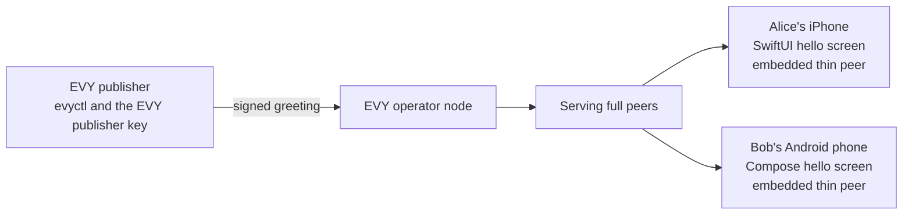
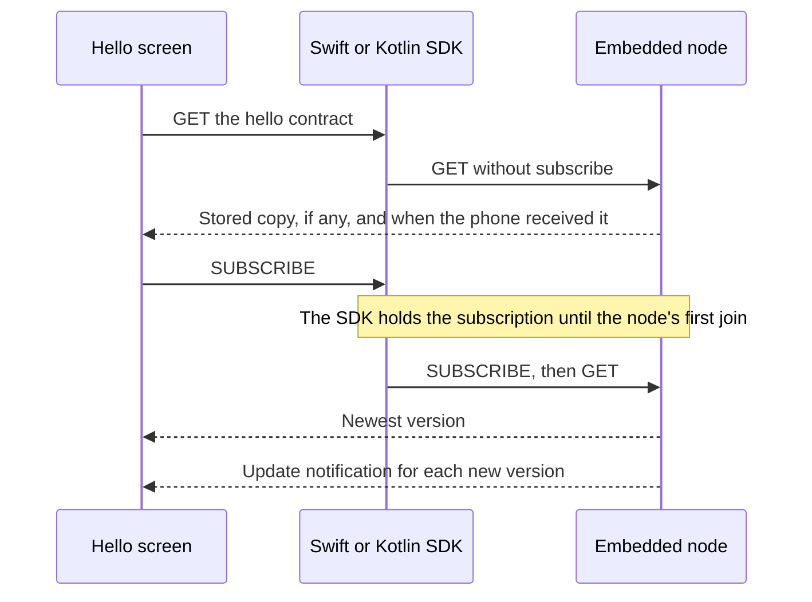
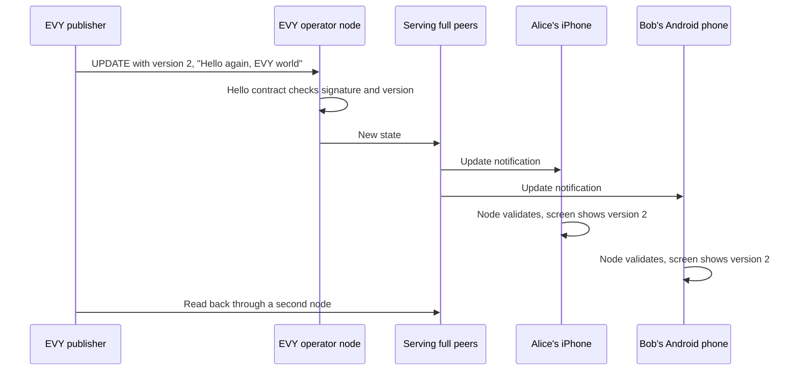

# 2.1 Hello EVY world

## Repositories

| Repository | Role | Work in this plan |
| --- | --- | --- |
| [evy](https://github.com/EVY-Platform/evy) | Modified | New `freenet/` Rust workspace with the hello contract and the `evyctl` CLI. Native hello screen in `ios/`. New Kotlin and Compose app in `android/` with the same screen. Pinned contract keys in `types/freenet/contract-keys.json` |
| [freenet-appkit](https://github.com/glesage/freenet-appkit) | Used | Swift package and Kotlin library from 1.2 Embedded node and mobile SDK |
| [freenet-core](https://github.com/freenet/freenet-core) | Used | Node and `fdev` |
| [freenet-stdlib](https://github.com/freenet/freenet-stdlib) | Used | Contract interface and the Rust client that `evyctl` uses |

## Purpose

EVY on iOS and Android reads a Freenet contract and follows its updates through the embedded node. The node uses the thin-peer role from [1.8 Thin-peer role and cellular data budgets](../1-freenet-mobile-appkit/08-thin-peer.md).

- Alice opens EVY on her iPhone and Bob opens EVY on his Android phone. Each build opens on one native hello screen.
- Each phone GETs and SUBSCRIBEs to the hello contract and shows its message, "Hello EVY world".
- The EVY publisher runs `evyctl hello publish --message "Hello again, EVY world"`. Both screens change within 30 seconds, while both apps keep running.



## The hello contract

A new Rust workspace in evy's `freenet/` folder starts with three crates:

- `freenet/common/`: signed JSON states, shared by the contracts and `evyctl`
- `freenet/contracts/hello/`: the hello contract
- `freenet/evyctl/`: the EVY publisher's CLI

Freenet derives a contract key from the contract's code and its parameter bytes ([component identity in 1.7 Upgrades and migration](../1-freenet-mobile-appkit/07-migration.md#component-identity-and-re-keying)). The hello contract's parameters are the 32 bytes of the EVY publisher verifying key. Its state is one JSON object. The signature covers the bytes `evy.hello/1` followed by the [RFC 8785](https://www.rfc-editor.org/rfc/rfc8785) canonical JSON of `version` and `message`. The `evy.hello/1` prefix binds the signature to the hello contract.

```jsonc
{
  "version": 2,                          // one higher with each greeting, starting at 1
  "message": "Hello again, EVY world",   // shown on the hello screen, 1 byte to 1 KiB of UTF-8
  "signature": "q3V0...Lw=="             // Ed25519 by the EVY publisher key, base64
}
```

The contract implements the four functions of freenet-stdlib's [contract interface](https://github.com/freenet/freenet-stdlib/blob/main/rust/src/contract_interface/trait_def.rs):

| Function | Rule |
| --- | --- |
| `validate_state` | The object has exactly the fields `version`, `message` and `signature`. The state bytes equal RFC 8785 canonical JSON of the complete signed object; `signature` is standard padded base64 encoding of a 64-byte Ed25519 signature. `version` is 1 or more, `message` is 1 byte to 1 KiB of UTF-8, and `signature` verifies with the key in the parameters |
| `update_state` | Takes whole states only. Keeps the valid state with the higher `version`. At equal versions it keeps the state with the higher BLAKE3 hash, so every peer keeps the same one. It rejects a wrong signature and leaves the state as it is for a lower version |
| `summarize_state` | `version` and the 32 bytes of `state_hash` |
| `get_state_delta` | The whole state when its `(version, state_hash)` is higher than the peer's summary; an empty delta for equal or lower tuples |

Publishers encode the signature as canonical standard padded base64, then serialize the complete signed object as RFC 8785 canonical JSON. `state_hash` is BLAKE3 of those exact complete signed state bytes, including `signature`. Ordering compares versions numerically, then the 32 hash bytes lexicographically as unsigned bytes at equal versions. The contract, greeting screen and `evyctl` use this ordering after checking identity and signature. The screen saves the exact bytes and tuple together and restores them on restart.

CI in evy runs a test for each rule and runs `fdev verify-merge` on fixture states. The workspace uses the freenet-stdlib release matching the SDK's pinned Core, 0.12.1. This keeps contract imports within the host functions that Core provides ([River scope in 1.9 Testing and release](../1-freenet-mobile-appkit/09-testing-and-release.md#river-scope)).

## The EVY publisher key

The EVY operator holds one Ed25519 key pair, the EVY publisher key. It signs the content that EVY itself publishes. In this plan that is each hello contract state.

| | EVY publisher key |
| --- | --- |
| Created with | `evyctl key new evy-publisher` on the operator's computer |
| Kept in | `~/.config/evy/keys/evy-publisher.toml`, readable only by the operator's account, and a tested offline backup |
| Verifying key | `evyctl key show evy-publisher` prints it. It is the hello contract's parameter, so the hello contract key depends on it |
| Used by | `evyctl` on the operator's computer, which signs with `--key evy-publisher` by default |

The hello contract accepts states signed by this key only. On a new computer the operator restores the backup and signs the next greeting with it, as the publisher in [saved copies and recovery in 1.4 Application bundles](../1-freenet-mobile-appkit/04-bundles.md#saved-copies-and-recovery) does with its key file.

## The EVY app on iOS and Android

Both apps start the embedded node at launch, in network mode and the thin-peer role, with the paths and budgets in [Storage in 1.2 Embedded node and mobile SDK](../1-freenet-mobile-appkit/02-sdk.md#storage). The node runs while the app is in the foreground, as in [foreground lifecycle in 1.1 Mobile feasibility and supported profiles](../1-freenet-mobile-appkit/01-feasibility.md#foreground-lifecycle).

| | iOS | Android |
| --- | --- | --- |
| App | The existing SwiftUI app in [`ios/`](https://github.com/EVY-Platform/evy/tree/dev/ios) | A new Kotlin and Compose app in `android/`, built with Gradle |
| First screen | The hello screen, a native SwiftUI view | The hello screen, a native Compose screen |
| Node and SDK | The `FreenetAppKit` Swift package | The `org.freenet.appkit` Kotlin library |
| Minimum OS | iOS 17, the deployment target of EVY's [Xcode project](https://github.com/EVY-Platform/evy/blob/dev/ios/evy.xcodeproj/project.pbxproj), because its views use the Observation framework ([EVYState.swift](https://github.com/EVY-Platform/evy/blob/dev/ios/evy/Data/EVYState.swift)). It meets the iOS 16 minimum in [1.1 Mobile feasibility and supported profiles](../1-freenet-mobile-appkit/01-feasibility.md#supported-profiles) | Android 9 (API 28), from 1.1 Mobile feasibility and supported profiles. `targetSdk` 36 |
| Local network | `NSLocalNetworkUsageDescription`: "EVY connects to Freenet peers on your Wi-Fi." | `ACCESS_LOCAL_NETWORK` in builds that target API 37 or later |
| Builds in this plan | Development build on an iPhone, and the iOS Simulator | Debug build on an Android phone, and the Android emulator |

Both apps get the SDK from the [developer package in 1.9 Testing and release](../1-freenet-mobile-appkit/09-testing-and-release.md#developer-package). The local network rows follow [local network access in 1.2 Embedded node and mobile SDK](../1-freenet-mobile-appkit/02-sdk.md#local-network-access).

### Pinned keys

`evyctl keys --out types/freenet/contract-keys.json` computes each contract key from the built Wasm and the parameters, and writes it to the file. Its `hello` entry holds the hello contract's base58 instance ID and code hash. Xcode copies the file into the iOS app bundle and Gradle copies it into the Android assets. The app reads only the pinned contract, as Atlas's UI build pins its index key ([Atlas today and pinned identity in 1.9 Testing and release](../1-freenet-mobile-appkit/09-testing-and-release.md#atlas-today-and-pinned-identity)). A change to the hello contract's code or to the publisher key gives a new key, which ships in a new app build.

### The hello screen

The app opens on the hello screen. The phone's node runs the hello contract's `validate_state` on every state it receives, so the screen shows only messages that the EVY publisher signed.



Leaving the screen releases its subscription handle, as in [ending subscriptions in 1.2 Embedded node and mobile SDK](../1-freenet-mobile-appkit/02-sdk.md#ending-subscriptions).

### Offline and before the first read

Until the node first joins, Core answers a GET without subscribe from the node's stored copy, and the SDK holds the subscription until the join ([start, stop and reconnect in 1.2 Embedded node and mobile SDK](../1-freenet-mobile-appkit/02-sdk.md#start-stop-and-reconnect)). The received time comes from [reads and local data in 1.6 Application protocols, data and operations](../1-freenet-mobile-appkit/06-data-and-operations.md#reads-and-local-data).

| Situation | The hello screen shows |
| --- | --- |
| The node has joined | The newest message, for example "Hello EVY world" |
| A higher `(version, state_hash)` arrives | The winning message, while both apps keep running, including a higher hash at the same version |
| Offline or not joined yet, with a stored copy | The stored message and "Offline. Received 10:42" |
| Offline or not joined yet, nothing stored | "Connecting to Freenet". The message appears once the node joins |
| The network has no copy of the contract | "The greeting is not available right now" and a Retry button |
| Peers need a newer Core than the app ships | "Update EVY", with a link to the App Store or Google Play, from the "update the app" error in [typed errors in 1.2 Embedded node and mobile SDK](../1-freenet-mobile-appkit/02-sdk.md#typed-errors) |

## Publishing a new greeting

`evyctl` talks to a node over the WebSocket client API with freenet-stdlib's Rust client, as Atlas's `atlasctl` does ([api.rs](https://github.com/freenet/atlas/blob/main/cli/src/api.rs)). The EVY operator node is a full peer on an always-on machine. It stays subscribed to the hello contract, so at least one full peer keeps hosting it. `evyctl hello publish --message "Hello again, EVY world"`:

1. GETs the current state through the operator node (`--node-url`) and sets `version` to one above it, or to 1 when the contract is absent.
2. Signs the state with the EVY publisher key, serializes the complete signed object as canonical JSON and saves those exact bytes in evyctl's data folder.
3. Sends the state to the operator node: a PUT with the contract code and parameters for version 1, an UPDATE with the whole state after that.
4. Reads the contract back through a second node (`--readback-url`) and verifies its identity, signature and exact bytes. An exact match completes publication.
   - A verified absent state or lower `(version, state_hash)` allows replay of the same saved bytes.
   - A timeout keeps the attempt pending for readback and retry.
   - A higher tuple, including a higher hash at the same version, stops the attempt. `evyctl` reports the winning state and retains the evidence.



## Acceptance

- On iOS and Android, a fresh install on a real phone opens on the hello screen and, on Wi-Fi, shows "Hello EVY world" within 5 seconds. Record the time on the iPhone, the Android phone, the iOS Simulator and the Android emulator.
- On iOS and Android, Alice on her iPhone and Bob on his Android phone keep the hello screen open while the publisher runs `evyctl hello publish --message "Hello again, EVY world"`. Both screens show the new message within 30 seconds, while both apps keep running. Both phones run in the thin-peer role from 1.8 Thin-peer role and cellular data budgets.
- On iOS and Android, after one successful read, the app relaunched in Airplane Mode shows the stored message and its received time. Back online, it subscribes and shows any higher `(version, state_hash)`. A fresh install in Airplane Mode shows "Connecting to Freenet", then the greeting once the phone is online.
- On iOS and Android, a test peer sends a hello state signed by another key and a state with a lower version. The phone's node rejects both, and the screen keeps "Hello again, EVY world".
- Contract tests cover each rule in [the hello contract](#the-hello-contract), including equal versions with different bytes, a message over 1 KiB, a missing signature and signed objects with extra fields, noncanonical JSON or noncanonical signature encoding. `fdev verify-merge` passes on the hello contract.
- `evyctl` reads back each publish through a second node. A fixture that drops the reply to the first UPDATE leads `evyctl` to resend the same bytes. Competing equal-version states arrive in opposite orders; contract peers and both phones retain the higher-hash state after restart, and a losing publication stops on readback of the winner.
- A restored backup of the EVY publisher key signs a valid hello update.
