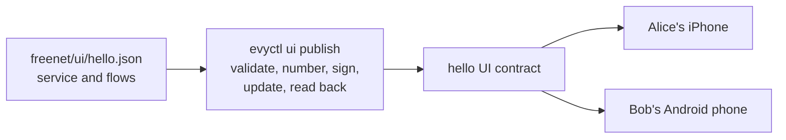
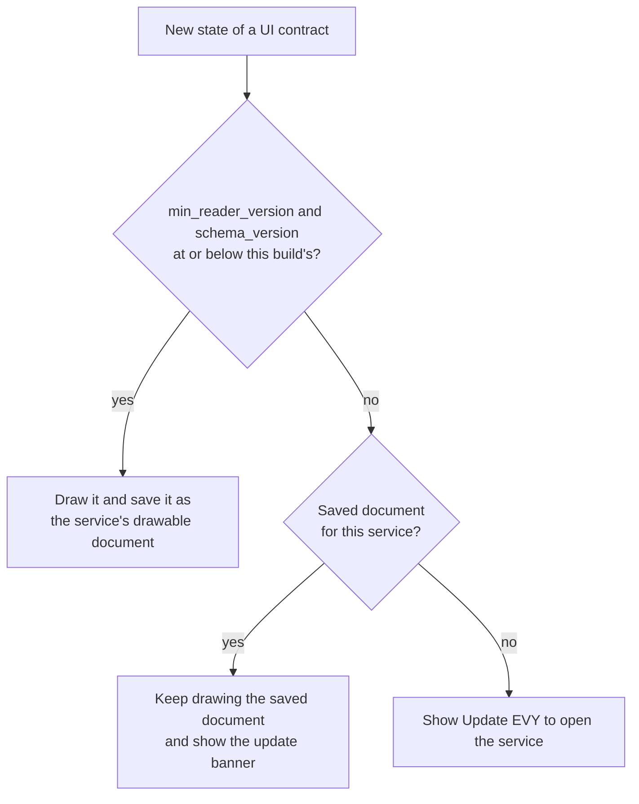

# 2.2 EVY UI contracts and publishing

## Repositories

| Repository | Role | Work in this plan |
| --- | --- | --- |
| [evy](https://github.com/EVY-Platform/evy) | Modified | UI contract in `freenet/contracts/ui/`, the home and hello documents in `freenet/ui/home.json` and `freenet/ui/hello.json`, compatibility fixtures in `freenet/fixtures/ui/`, `evyctl ui publish`. `types/schema/sdui/version.json`, `scripts/validate-ui-document.ts`, `reader-v<N>` tags, `ui.home` and `code.ui` in `types/freenet/contract-keys.json` |
| [freenet-core](https://github.com/freenet/freenet-core) | Used | Node and `fdev verify-merge` |
| [freenet-stdlib](https://github.com/freenet/freenet-stdlib) | Used | Contract interface and the Rust client that `evyctl` uses |

## Purpose

This plan stores each EVY service's screens in one Freenet contract per service, the UI contract. The service publisher signs each new version of the whole document, and every phone that follows the contract gets it.

The EVY publisher publishes the hello service's first UI version: a flow "Hello" with one page, holding a heading row and a text row "Hello EVY world". It also publishes EVY's home page as a service, `home`, with one button that opens Hello. Alice's iPhone and Bob's Android phone read version 1 with GET and SUBSCRIBE, and version 2 reaches both with no restart.



## The UI document

EVY's API stores screens today as flat `flows`, `pages` and `rows` records ([DATA_EVY_Flow, DATA_EVY_Page and DATA_EVY_Row in data.md](https://github.com/EVY-Platform/evy/blob/dev/docs/evy/data.md)), and its clients assemble them into the nested `UI_Flow` shape ([sdui.md](https://github.com/EVY-Platform/evy/blob/dev/docs/evy/sdui.md)). The UI document holds that nested shape directly. Each flow is valid against [evy.schema.json](https://github.com/EVY-Platform/evy/blob/dev/types/schema/sdui/evy.schema.json) and the row schemas in [definitions/](https://github.com/EVY-Platform/evy/tree/dev/types/schema/sdui/definitions), unchanged.

- The publisher edits `service` and `flows` in a file in evy, for example `freenet/ui/hello.json`. `evyctl` adds `version`, `schema_version`, `min_reader_version` and `signature`.
- The first flow is the service's entry flow. The app opens on the entry flow of the `home` service, as [The home service](#the-home-service) describes.
- An exact UI document is named by its UI contract key, service, version and `state_hash`, for example hello version 2 with the hash of its complete signed state.
- The `resources` field is added by [2.4 SDUI data and actions](04-data-and-actions.md). Each binding declares a versioned adapter from the shared EVY catalogue and its source context. Different services can bind the same purchase, messages or files through those shared interfaces.

The signature covers the bytes `evy.ui/1` followed by the [RFC 8785](https://www.rfc-editor.org/rfc/rfc8785) canonical JSON of every other field. Publishers encode the 64-byte Ed25519 signature as standard padded base64, then serialize the complete signed object as RFC 8785 canonical JSON. These complete bytes form the submitted state, saved copy and archive entry. The example below is formatted for reading. The hello service's first UI version, about 600 bytes:

```jsonc
{
  "service": "hello",                                        // service ID, equal to the contract's parameter
  "version": 1,                                              // UI version, one above the last published
  "schema_version": 1,                                       // EVY SDUI schema version the flows follow
  "min_reader_version": 1,                                   // lowest reader version that can draw this document
  "flows": [                                                 // EVY's UI_Flow objects, in the existing schema
    {
      "id": "87ea85b0-f214-4427-95b7-968cd9faa85a",          // flow UUID
      "name": "Hello",                                       // entry flow, opened by the home document's button
      "pages": [                                             // pages in order
        {
          "id": "09d29d88-650c-4e7a-8c9a-143b00272e2d",      // page UUID
          "name": "Hello",                                   // developer-facing page name
          "title": "Hello",                                  // shown in the navigation bar
          "rows": [                                          // rows from top to bottom
            {
              "id": "585b7d1f-9890-43dc-9e5d-633fd530eef4",  // row UUID
              "type": "heading",                             // heading row, from heading.schema.json
              "name": "Welcome heading",                     // developer-facing row name
              "title": "Welcome",                            // bold heading text
              "visible": "true",                             // always shown
              "actions": {}                                  // no actions
            },
            {
              "id": "438d3c34-55d9-47e0-b0ab-57a009690e31",  // row UUID
              "type": "text",                                // text row, from text.schema.json
              "name": "Greeting",                            // developer-facing row name
              "title": "Hello EVY world",                    // text shown under the heading
              "visible": "true",                             // always shown
              "actions": {}                                  // no actions
            }
          ]
        }
      ]
    }
  ],
  "signature": "Zm9v...Ag=="                                 // Ed25519 by the service publisher key, base64
}
```

## The UI contract

Each service has one UI contract, built from `freenet/contracts/ui/` in evy. Its parameters are the 32 bytes of the service publisher's verifying key followed by the service ID in UTF-8, for example `hello`. Service IDs follow EVY's service slug pattern `^[a-z][a-z0-9_-]*$` ([rpc.schema.json](https://github.com/EVY-Platform/evy/blob/dev/types/schema/common/rpc.schema.json)). EVY runs the `home`, `hello` and `marketplace` services, so their service publisher key is the EVY publisher key from [The EVY publisher key in 2.1 Hello EVY world](01-hello-evy-world.md#the-evy-publisher-key).

| Function | Rule |
| --- | --- |
| `validate_state` | The state is at most 512 KiB and its bytes equal RFC 8785 canonical JSON of the complete signed object. `signature` is the canonical standard padded base64 encoding of a 64-byte Ed25519 signature. `service` equals the service ID in the parameters. `version`, `schema_version` and `min_reader_version` are integers of 1 or more. `flows` is a list with at least one flow. `signature` verifies with the key in the parameters. Other top-level fields are allowed and signed with the rest, so the document can gain fields under the same contract key |
| `update_state` | Replaces the whole document with the valid state whose `(version, state_hash)` is higher under the ordering below |
| `summarize_state` | `version` and the 32 bytes of `state_hash` |
| `get_state_delta` | The whole state when its `(version, state_hash)` is higher than the peer's summary; an empty delta for equal or lower tuples |

The contract, Swift and Kotlin readers, EVY Developer and `evyctl` use this ordering after checking the contract identity, service and signature:

```text
state_hash = BLAKE3(exact complete signed state bytes, including signature)

Compare version numerically first.
At equal versions, compare the 32 hash bytes lexicographically as unsigned bytes.
Higher wins; an equal tuple is a duplicate; lower is stale.
```

Hashing uses the received signed bytes. Validation checks canonical encoding before a tuple enters ordering; the hash input stays the original state bytes. Publisher tools save and retry those exact bytes. The hash also supplies the `ui_digest` used by [2.8 Attribution](08-attribution.md#archiving-before-publication). Shared fixtures cover hashes and ordering in Rust, TypeScript, Swift and Kotlin. The hello contract uses the same ordering, as [The hello contract in 2.1 Hello EVY world](01-hello-evy-world.md#the-hello-contract) defines.

The contract checks the envelope and the signature. `evyctl` checks the flows with `scripts/validate-ui-document.ts` before it signs, so a valid signature shows that the publisher's checks passed.

### Size cap

| Fact | Size |
| --- | --- |
| The hello service's document | About 600 bytes |
| Marketplace's two flows in [service_sdui.json](https://github.com/EVY-Platform/evy/blob/dev/scripts/fixtures/services/service_sdui.json), "View Item" and "Create item" | 69,264 bytes |
| Core's limit for any contract state ([installing a copy in 1.4 Application bundles](../1-freenet-mobile-appkit/04-bundles.md#installing-a-copy)) | 50 MiB |
| A state of 1 MiB or more put by a node behind NAT cannot be fetched cold ([upstream work and carrier evidence in 1.8 Thin-peer role and cellular data budgets](../1-freenet-mobile-appkit/08-thin-peer.md#upstream-work-and-carrier-evidence)) | 1 MiB |
| Each new version reaches every subscribed phone as the whole document ([cellular budget contract in 1.8 Thin-peer role and cellular data budgets](../1-freenet-mobile-appkit/08-thin-peer.md#cellular-budget-contract)) | One document per publish |

The cap is 512 KiB. It is about 7 times Marketplace's flows, half the 1 MiB NAT limit, and the most one publish costs each subscribed phone. `scripts/validate-ui-document.ts` and the contract both check it.

### The home service

EVY's iOS app opens today on its home flow, `f267c629-2594-4770-8cec-d5324ebb4058` ([ContentView.swift](https://github.com/EVY-Platform/evy/blob/dev/ios/evy/ContentView.swift), [evy_sdui.json](https://github.com/EVY-Platform/evy/blob/dev/scripts/fixtures/evy/evy_sdui.json)). This plan publishes that home page as a service, `home`, with its own UI contract like every other service. The app opens on the first page of the home document's first flow.

The home document has one more field, `services`, which lists every other service the app can open. The app pins two values in `types/freenet/contract-keys.json`, the file from [pinned keys in 2.1 Hello EVY world](01-hello-evy-world.md#pinned-keys):

| Entry | Value |
| --- | --- |
| `ui.home` | The home UI contract key |
| `code.ui` | The UI contract's code hash. With a publisher key from `services` and the service ID, it gives that service's UI contract key |

So a new service needs a new home version, and no app release. Home version 1 holds one button that opens the hello service:

```jsonc
{
  "service": "home",                                         // the home service
  "version": 1,                                              // home version 1
  "schema_version": 1,                                       // as in the hello document
  "min_reader_version": 1,                                   // as in the hello document
  "services": {                                              // every other service the app can open
    "hello": "9xFq...Tz2"                                    // service ID: its publisher's verifying key, base58
  },
  "flows": [                                                 // EVY's home flow
    {
      "id": "f267c629-2594-4770-8cec-d5324ebb4058",          // the home flow UUID EVY uses today
      "name": "Home",                                        // entry flow: the app opens on it
      "pages": [
        {
          "id": "55e427ac-263c-441f-9673-f60627b1baea",      // the home page UUID EVY uses today
          "name": "Home",                                    // developer-facing page name
          "title": "Home",                                   // shown in the navigation bar
          "rows": [
            {
              "id": "c2b8e0f4-5a1d-4f7e-9b63-2e4d8a7f1c05",  // row UUID
              "type": "button",                              // button row, from button.schema.json
              "name": "Hello button",                        // developer-facing row name
              "label": "Hello EVY world",                    // button text
              "title": "",                                   // no header
              "visible": "true",                             // always shown
              "actions": {                                   // tap opens the hello flow by flow and page UUID
                "tap": [{ "condition": "", "true": "{navigate(87ea85b0-f214-4427-95b7-968cd9faa85a,09d29d88-650c-4e7a-8c9a-143b00272e2d)}", "false": "" }]
              }
            }
          ]
        }
      ]
    }
  ],
  "signature": "Zm9v...Ag=="                                 // Ed25519 by the EVY publisher key, base64
}
```

A `navigate` names a flow and page by UUID, as EVY's [actions](https://github.com/EVY-Platform/evy/blob/dev/docs/evy/actions.md) do today, so a button in one service can open a flow in another. `scripts/validate-ui-document.ts` checks each `navigate` target against the documents in `freenet/ui/` and checks that every `services` entry is a service ID with a 32-byte key.

## Publishing a UI version

The EVY publisher runs `evyctl ui publish --service hello --key evy-publisher freenet/ui/hello.json`:

| Step | What `evyctl` does |
| --- | --- |
| 1. Validate | Runs the new script `scripts/validate-ui-document.ts` with Bun, against the schemas at tag `reader-v<N>`, where N is `--min-reader-version`, by default the highest tag. The script holds every document check: `service` equals `--service`, EVY's `validateUiFlow` ([validators.ts](https://github.com/EVY-Platform/evy/blob/dev/types/validators.ts)) on each flow for the schemas, each row type's triggers and every action expression, unique flow, page and row IDs, every `show` target is a row in the document, and the signed state fits in 512 KiB.<br>--> Produces the validated document, or errors that name the JSON path |
| 2. Number | GETs the UI contract through the EVY operator node. Sets `version` to one above the network's version, or to 1 when the contract is absent. Sets `schema_version` and `min_reader_version` from `types/schema/sdui/version.json` at the tag |
| 3. Sign | Signs with the service publisher key, encodes the complete signed object as canonical JSON and saves those exact bytes in evyctl's data folder.<br>--> Produces the signed state |
| 4. Archive | For a service using attribution, submits the exact signed bytes to the archive and waits for a verified durable receipt, as [Archiving before publication in 2.8 Attribution](08-attribution.md#archiving-before-publication) requires. Saves the receipt with the pending publication |
| 5. Update | Sends the saved state to the operator node: a PUT with the UI contract code and parameters for version 1, an UPDATE with the whole state after that. The operator node stays subscribed |
| 6. Read back | GETs the contract through a second node and verifies its identity, service and signature. Exact saved bytes confirm publication. A verified absent state or a lower `(version, state_hash)` allows replay of the saved bytes; a timeout keeps the publication pending for readback and retry. A higher tuple, including a higher hash at the same version, stops the attempt and reports the winning document. Retains both documents as evidence. For a service using attribution, exact readback permits the publisher-signed publication confirmation naming the saved document and its evidence.<br>--> Produces the published UI document identity, for example hello version 2 and its `state_hash` |

For a service using attribution, archive confirmation precedes each PUT or UPDATE of a new signed document. An archive failure leaves the signed publication pending, and retry resumes with the same bytes and receipt. Publication resumes once the archive returns a valid receipt for those bytes.

## Reader compatibility

An EVY store build keeps the reader it shipped with, and a service can publish a new UI version at any time. Two numbers in evy's new `types/schema/sdui/version.json` tell the app whether its reader can draw a document. Each EVY build embeds both.

| Change in evy | `schema_version` | `reader_version` |
| --- | --- | --- |
| A row type, field or trigger in `types/schema/sdui/` | Plus 1 | Plus 1 |
| A method, formatter or action function in the [conformance corpus](https://github.com/EVY-Platform/evy/blob/dev/types/grammar/conformance.json) | Same | Plus 1 |
| A resource adapter, operation or supported contract codec | Plus 1 when the binding schema changes | Plus 1 |
| A reader fix that leaves documents as they are | Same | Same |

Methods and formatters are built into the clients ([formatting.md](https://github.com/EVY-Platform/evy/blob/dev/docs/evy/formatting.md)). The binding schemas and shared resource catalogue from [2.4 SDUI data and actions](04-data-and-actions.md#shared-evy-catalogue) also define reader capabilities. Publishing checks every selected adapter and operation against the chosen reader tag's catalogue and requires its minimum reader version. evy tags the commit of each reader version that ships in a store build `reader-v<N>`.



- The app saves the newest verified document and its `(version, state_hash)` separately from the last drawable document for each service, in Application Support on iOS and the files directory on Android. Each saved entry retains exact signed bytes with its tuple. A winning document that needs a newer reader raises the observed tuple while the saved drawable document remains available. After a reader update, startup checks the newest verified saved document for compatibility again.
- The update banner reads "A newer version of Hello needs the latest EVY", with an Update button to the App Store or Google Play.
- A document that fails to decode counts as one that needs a newer reader.

Bob's Android build has reader version 1. The publisher publishes a new hello version with `--min-reader-version 2`, because it uses a formatter that reader version 2 adds. Bob keeps the hello version he has and sees the update banner. Alice's iPhone has reader version 2 and draws the new version.

## Acceptance

- `evyctl ui publish --service hello --key evy-publisher freenet/ui/hello.json` publishes hello version 1, and the readback through a second node returns the same signed bytes. The next publish gives version 2.
- `evyctl ui publish --service home --key evy-publisher freenet/ui/home.json` publishes home version 1. `evyctl keys` writes `ui.home` and `code.ui`, and the hello UI contract key derived from `code.ui`, `services.hello` and `hello` equals the key that `evyctl ui publish` reports for hello.
- Validation stops before signing for a home document whose `navigate` names a flow in no document in `freenet/ui/`.
- On iOS and Android, an XCTest and an Android instrumented test on real phones GET and SUBSCRIBE to the hello UI contract by the key derived from the home document, receive version 1, and receive version 2 with no restart.
- Validation stops before signing for fixtures with a row missing `visible`, an unknown row type, a malformed action expression, a `show` of a row outside the document, a duplicate row ID, a `service` other than `--service` and a state over 512 KiB. Each error names the JSON path.
- In an isolated test network, Marketplace's two flows from service_sdui.json validate, publish as a test document and read back intact.
- Contract tests cover each rule in [the UI contract](#the-ui-contract), including a wrong service ID, a lower version, equal versions with different bytes, an extra top-level field and a state over 512 KiB. Shared Rust, TypeScript, Swift and Kotlin vectors hash the complete signed bytes and compare identical 32-byte tuples. Fixtures with added whitespace, reordered fields or an alternative base64 signature encoding fail canonical-state validation; publisher output matches the canonical bytes. Equal-version peers exchange the higher-hash state through summaries and deltas. `fdev verify-merge` passes on the UI contract.
- Concurrent `evyctl` and EVY Developer fixtures prepare different documents from the same live version. Readback confirms the higher tuple and reports the losing attempt; its signed bytes and archive receipt remain saved. A higher-hash winner at the same version ends retry of the lower-hash document.
- Compatibility fixtures in `freenet/fixtures/ui/` pair reader versions 1 and 2 with documents that need each. On iOS and Android, a test build with reader version 1 keeps the saved hello document and shows the update banner when the next version needs reader version 2. A fresh install shows "Update EVY to open Hello".
