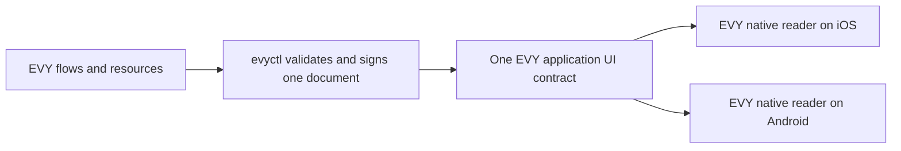

# 2.2 EVY UI contracts and publishing

## Repositories

| Repository | Role | Work in this plan |
| --- | --- | --- |
| [evy](https://github.com/EVY-Platform/evy) | Modified | One application UI contract in `freenet/contracts/ui/`, complete document in `freenet/ui/evy.json`, local feature source files, `evyctl ui publish`, validation and compatibility fixtures, and `ui.evy` in `types/freenet/contract-keys.json` |
| [freenet-core](https://github.com/freenet/freenet-core) | Used | Node and `fdev verify-merge` |
| [freenet-stdlib](https://github.com/freenet/freenet-stdlib) | Used | Contract interface and the Rust publisher client |

## Purpose

Publish EVY as one Freenet application. One publisher signs a complete UI document containing Home, Hello and Marketplace flows. The iOS and Android native readers pin that application's UI contract and receive its signed updates.

The first document contains Home and Hello. A later application version adds Marketplace. Each publication updates the complete EVY document under one application identity and one version stream.

The examples use this application-wide sequence. The publisher journal reserves actual versions; repeated updates consume higher versions in that same stream.

| Example application version | Complete document includes |
| --- | --- |
| 1 | Home and Hello |
| 4 | Home, Hello and the guestbook from [2.4 SDUI data and actions](04-data-and-actions.md) |
| 6 | Marketplace listing/purchase fixture from [2.12 Listings and purchases](12-listings-and-purchases.md), with the preceding flows |
| 7 | Marketplace flows and Home search from [2.7 EVY Marketplace](07-marketplace.md) |
| 8 | Carol's accepted Marketplace change and the contribution snapshot from [2.8 Attribution](08-attribution.md) |
| 9 | The subsequent compatible or reader-upgrade fixture in [2.10 Testing and release](10-testing-and-release.md) |

Policy versions have their own signed sequence under [2.6 Payments](06-payments.md#financial-policy-identity).



## The UI document

The application envelope contains `service: "evy"`, `routes`, `flows`, `resources`, `version`, `schema_version`, `min_reader_version` and `signature`. `service` is the fixed application namespace; feature names identify internal resources and capabilities. Flow and row fields follow EVY's [SDUI schema](https://github.com/EVY-Platform/evy/blob/d0fb7e6475f1dfc5c74325e37d4e92aed88d84ed/types/schema/sdui/evy.schema.json), [UI_Flow definitions](https://github.com/EVY-Platform/evy/blob/d0fb7e6475f1dfc5c74325e37d4e92aed88d84ed/docs/evy/sdui.md) and [data rules](https://github.com/EVY-Platform/evy/blob/d0fb7e6475f1dfc5c74325e37d4e92aed88d84ed/docs/evy/data.md).

- Home is the application's entry route.
- Hello and Marketplace are flows inside the same document.
- Each resource binding names a supported EVY adapter and verified source context under [2.4 SDUI data and actions](04-data-and-actions.md#evy-resource-catalogue).
- Payment-capable documents name EVY's `policy_version` and `policy_digest` under [2.6 Payments](06-payments.md#financial-policy-identity).
- One exact application release is identified by its UI contract key, version and `state_hash`.

```jsonc
{
  "service": "evy",
  "version": 1,
  "schema_version": 1,
  "min_reader_version": 1,
  "routes": {
    "entry": { "flow": "home-flow", "page": "home-page", "arguments": {} },
    "hello": { "flow": "hello-flow", "page": "hello-page", "arguments": {} }
  },
  "resources": {},
  "flows": [
    { "id": "home-flow", "name": "Home", "pages": ["<complete Home page objects>"] },
    { "id": "hello-flow", "name": "Hello", "pages": ["<complete Hello page objects>"] }
  ],
  "signature": "<canonical padded base64 signature>"
}
```

The example abbreviates the flow objects. Published fixtures use the UUID IDs and complete page/row objects required by the existing schemas. Local files may organize flows by feature; `evyctl` validates their assembled complete application document before publication.

Sign the bytes `evy.ui/1` followed by RFC 8785 canonical JSON of every field except `signature`. Encode the 64-byte Ed25519 signature as standard padded base64, then serialize the complete signed object as canonical JSON. The publisher saves, submits and archives those exact bytes.

## The UI contract

Use `ui.evy`, the fixed `evy` namespace and the signing domain below in shared identity/signature fixtures. These labels distinguish the complete application publication from internal feature data and give both readers the same contract identity.

Build one UI contract from `freenet/contracts/ui/`. Its parameters are the EVY publisher's 32-byte verifying key followed by UTF-8 `evy`. The publisher key is defined in [2.1 Hello EVY world](01-hello-evy-world.md#the-evy-publisher-key). Matching iOS and Android builds pin the resulting full key as `ui.evy` in `types/freenet/contract-keys.json`.

| Function | Rule |
| --- | --- |
| `validate_state` | At most 512 KiB; canonical JSON; `service` equals `evy`; integer version/schema/reader fields of at least 1; at least one complete flow; canonical 64-byte signature verifying with the parameter key. Additional top-level fields are signed with the document. |
| `update_state` | Retain the valid complete document with the higher `(version, state_hash)`. |
| `summarize_state` | Return version and the 32-byte state hash. |
| `get_state_delta` | Return the complete document for a higher tuple and an empty delta for an equal or lower tuple. |

```text
state_hash = BLAKE3(exact complete signed state bytes, including signature)
Compare version numerically, then hash bytes lexicographically as unsigned bytes.
Higher wins; an equal tuple is a duplicate; lower is stale.
```

The contract, Swift and Kotlin readers, local editor and CLI share identity, signature, canonical-encoding and ordering fixtures. Validate bytes before admitting a tuple to the saved observation. The hash also supplies the `ui_digest` in attribution evidence.

The contract validates its envelope and signature. Publisher validation checks full flow, route, resource and action semantics before signing. Run merge-law fixtures with `fdev verify-merge`.

### Size cap

The 512 KiB cap applies to the complete application document. Measure the assembled Home, Hello and Marketplace fixture on each release. Marketplace's existing two-flow fixture is 69,264 bytes; that measurement is input evidence for the combined-document test.

Both the publisher and contract enforce the cap. Each UI update transfers one complete application document. Record its bytes in the [cellular budget in 1.11 Cellular data and resource budgets](../1-freenet-mobile-appkit/11-cellular-data-and-resource-budgets.md#cellular-budget-contract). The 512 KiB bound is EVY’s application document cap. Carrier evidence in [1.8 Thin-peer protocol](../1-freenet-mobile-appkit/08-thin-peer.md#carrier-evidence) describes NAT transfer failures for larger states. Release fixtures measure complete-document cold fetch and update traffic on supported carriers.

### The home flow

Home is the entry flow inside `freenet/ui/evy.json`. Its Hello button opens the application's `hello` route. A Marketplace publication adds its flows and routes to that same signed document. The iOS and Android readers get all target flows with the release they activate.

### Application routes and compatible updates

Stable route names let retained drafts and purchases reach the intended screen after compatible UI changes. Matching schema and iOS and Android reader fixtures verify route names, inputs and compatibility before publication.

`routes` maps stable application route names to flow/page UUIDs and argument schemas. Implement `navigate_route(route, arguments)` for named routes within the retained EVY document. The existing `navigate(flow, page)` stays within that document. Update the grammar corpus, action schema and both iOS and Android readers together.

- Validate route targets, argument schemas and UUID uniqueness across the complete document.
- Preserve public route names, required arguments and action meanings for supported document generations.
- Retain the exact signed document, resource bindings and draft for an active flow.
- Open an internal target using that flow's retained document. A new flow started from an idle entry page uses the activated compatible document.
- A breaking route change requires an explicit schema/reader compatibility gate and supported pending-operation migration before publication.

## Publishing a UI version

Invoke `evyctl ui publish --key evy-publisher freenet/ui/evy.json` through [2.5 EVY authoring and publishing](05-developer.md#publishing-the-application). That plan owns validation, durable version reservation, signing/save, archival, submission, independent readback, confirmation and retry sequencing.

This plan owns the complete-document schema, canonical signed bytes, UI identity, version ordering, 512 KiB cap and reader compatibility. Payment-capable publication requires the exact retained policy and durable release receipt from [2.13 Release archive and policy evidence](13-release-archive-and-policy-evidence.md). Bootstrap and preview callers pass their fixture profile into the same publication workflow.

## Reader compatibility

`types/schema/sdui/version.json` records schema and reader versions. Each iOS and Android build embeds them. Tag the corresponding source as `reader-v<N>`.

| Change | Schema version | Reader version |
| --- | --- | --- |
| Envelope, row or resource schema | Increase | Increase |
| Route action, method, formatter or adapter behavior | Increase when its schema changes | Increase |
| Compatible reader fix | Same | Same |

Both readers store the newest verified application document and the newest drawable document with their exact bytes and tuples. A verified document requiring a newer reader advances the saved observation; the app keeps a drawable document and shows the update banner. A fresh installation fetches the pinned EVY document. Offline restart draws the retained compatible document.

Active forms, drafts and purchases retain the exact application version and resource context that opened them. Compatible queued updates activate when the user reaches the defined idle boundary in [2.3 Native SDUI readers](03-readers.md#reading-the-application-ui-contract). Retain historical documents referenced by pending operations and purchase evidence.

## Acceptance

- On iOS and Android, one pinned EVY UI contract opens Home and navigates to Hello within one document.
- Publishing a compatible application version updates both running readers within 30 seconds. A later version adds Marketplace flows and their routes together.
- Both publisher and contract reject a complete application document over 512 KiB. Report assembled fixture size and update bytes.
- Signature, identity, canonical encoding, version ordering, duplicates and equal-version hash conflicts produce identical results in Rust, TypeScript, Swift and Kotlin.
- Invalid route targets, duplicate IDs, unsupported adapters and malformed actions fail publisher validation at matching JSON paths.
- Concurrent local publication jobs serialize through one journal; retries use the reserved version and exact signed bytes. Archive failure retains the pending release.
- Independent readback confirms the submitted release. A higher competing tuple stops replay and reports the winner.
- Active drafts and purchases retain their exact document while compatible updates queue. Unsupported reader versions preserve the drawable document and update state across restart.
- UI-contract code or publisher-key changes follow the application upgrade and store-build gate in [1.7 Upgrades and migration](../1-freenet-mobile-appkit/07-migration.md).
