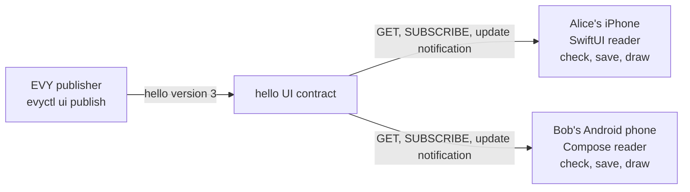

# 2.3 Native SDUI readers

## Repositories

| Repository | Role | Work in this plan |
| --- | --- | --- |
| [evy](https://github.com/EVY-Platform/evy) | Modified | The SwiftUI reader in `ios/` reads UI contracts. New Compose reader in `android/`. New `scripts/generate-kotlin-sdui.ts`. Shared reader fixtures in `scripts/fixtures/readers/`, and the `reader_parity.yml` and `mobile_builds.yml` workflows |
| [freenet-appkit](https://github.com/glesage/freenet-appkit) | Used | `FreenetAppKit` Swift package and `org.freenet.appkit` Kotlin library from 1.2 Embedded node and mobile SDK |
| [freenet-core](https://github.com/freenet/freenet-core) | Used | Embedded node |

## Purpose

This plan draws every EVY service from its UI contract, the home page included. On iOS the existing SwiftUI reader draws it, and on Android a new Compose reader draws it. Both readers draw every EVY row type from the same document, and both ship in signed builds made on GitHub.

- Alice opens EVY on her iPhone and Bob opens EVY on his Android phone. Each app opens on the home page from the `home` UI contract, and each taps its "Hello EVY world" button.
- The SwiftUI reader and the Compose reader read the `hello` UI contract from [The UI contract in 2.2 EVY UI contracts and publishing](02-ui-contracts.md#the-ui-contract). Both draw the "Hello" page: the heading "Welcome" and the text "Hello EVY world".
- The EVY publisher publishes hello version 3, which adds a `text_expand` row, "What is EVY?". Both phones draw it within 30 seconds, with no app update and no restart.

## Reading a UI contract

Both readers ship the shared resource catalogue and adapter implementations from [2.4 SDUI data and actions](04-data-and-actions.md#shared-evy-catalogue). Before activating a document's bindings, they check adapter versions, supported contract hashes, parameter codecs and binding dependencies against that catalogue. They project verified source state into EVY collections and apply each adapter's signing and ownership rules. Reader compatibility covers these adapters as well as row types and methods.

The app pins the home UI contract key in `types/freenet/contract-keys.json`, and derives every other service's key from the home document's `services` field, as [The home service in 2.2 EVY UI contracts and publishing](02-ui-contracts.md#the-home-service) sets. At start the reader reads `home`, then each service that `services` lists, so a `navigate` to any flow UUID finds the document that holds it. For each UI contract, the reader:

1. GETs the UI contract with subscribe set, through the Swift or Kotlin SDK. Before the node's first join, the GET reads the node's stored copy and the SDK holds the subscription until the join ([Start, stop and reconnect in 1.2 Embedded node and mobile SDK](../1-freenet-mobile-appkit/02-sdk.md#start-stop-and-reconnect)).
2. Checks identity, signature and canonical state encoding, compares the tuple, then checks reader compatibility as in the table below.
3. For a higher verified tuple, saves the newest verified document with its `(version, state_hash)`, and saves a compatible document as the service's drawable document, in Application Support on iOS and in the files directory on Android ([Reader compatibility in 2.2 EVY UI contracts and publishing](02-ui-contracts.md#reader-compatibility)). Persists each entry's exact signed bytes and tuple together before acknowledging the update.
4. Draws the page the user is on. At start that is the first page of the home document's first flow. A `navigate` opens the flow and page it names, in whichever service's document holds that flow.
5. Runs steps 2 to 4 again on every update notification. On the first page of a flow, a winning compatible document shows at once, including a higher hash at the same version. Further into a flow, it applies when Alice leaves the flow. The open flow keeps its exact signed document, version and hash, so a half-filled form keeps its pages and drafts and actions retain the UI identity it drew. Queued documents retain the highest compatible tuple accepted so far. The reader keeps one subscription handle per UI contract while the app is in the foreground. A service that a new home version drops from `services` gets its handle released ([Ending subscriptions in 1.2 Embedded node and mobile SDK](../1-freenet-mobile-appkit/02-sdk.md#ending-subscriptions)).

| Check | Why |
| --- | --- |
| The phone's node accepted the state | Core runs the UI contract's `validate_state` on the phone ([Scope and trust boundary in 1.8 Thin-peer role and cellular data budgets](../1-freenet-mobile-appkit/08-thin-peer.md#scope-and-trust-boundary)), so only documents the service publisher signed arrive |
| `service` is the service the reader asked for | A contract never draws another service's flows |
| `(version, state_hash)` is higher than the newest verified saved tuple | Uses the shared ordering from [The UI contract in 2.2 EVY UI contracts and publishing](02-ui-contracts.md#the-ui-contract), including its equal-version hash tie-break. Equal tuples are duplicates; lower tuples are stale |
| `min_reader_version` and `schema_version` are at or below this build's | [Reader compatibility in 2.2 EVY UI contracts and publishing](02-ui-contracts.md#reader-compatibility) sets what Alice sees for a newer document |
| The document decodes into the generated Swift or Kotlin types | A row the reader cannot draw never reaches the screen |

Identity, signature and canonical-state validation precede tuple comparison. The reader computes `state_hash` from the complete received signed bytes, retaining those bytes as the hash input. The first valid document creates the saved observation. A higher verified tuple advances the saved observation even when the compatibility checks retain the drawable document and show the update banner. Duplicate and stale states retain the saved observation and drawable document. Restart restores both entries and checks compatibility again. Diagnostics record the service, version, hash and failed check under [1.3 Single-application host](../1-freenet-mobile-appkit/03-host.md#diagnostics).

### First open and offline

| Situation | What Alice sees |
| --- | --- |
| She opened Hello before, and the phone is offline | The saved document. Once online, a higher compatible `(version, state_hash)` replaces it |
| She never opened EVY, and the node has not joined | "Connecting to Freenet", as on the hello screen in [2.1 Hello EVY world](01-hello-evy-world.md#the-evy-app-on-ios-and-android). The home page appears once the node joins |
| The network has no copy of the UI contract | "Hello is not available right now" and a Retry button |
| The newest version needs a newer reader | The saved document and the update banner from Reader compatibility in 2.2 EVY UI contracts and publishing |

### Linked purchase availability

For Marketplace and the hello test item, both readers expose the derived item `status` from [Item availability in 2.7 EVY Marketplace](07-marketplace.md#item-availability) to UI rows and action guards. The shared purchase adapter resolves and verifies linked purchase states, updates the value on purchase notifications and uses shared fixtures for sale, reservation, refund and unknown availability. Home and Marketplace consume the same purchase projection. The view's subscription handles cover the linked purchases it needs and are released when the view closes.

## The SwiftUI reader

Today the iOS app syncs flat `flows`, `pages` and `rows` records over the API WebSocket into `EVYDataStore`, and draws them with `EVYPage` and `EVYRow` ([sdui.md](https://github.com/EVY-Platform/evy/blob/dev/docs/evy/sdui.md#ios-and-web-sdui-data-flow)). This plan changes where those records come from.

| Part | iOS code today | In this plan |
| --- | --- | --- |
| Flow source | `EVY.sync()` over the API WebSocket ([EVY+Sync.swift](https://github.com/EVY-Platform/evy/blob/dev/ios/evy/Core/EVY+Sync.swift), [EVYAPIManager.swift](https://github.com/EVY-Platform/evy/blob/dev/ios/evy/Data/EVYAPIManager.swift)) | New `EVYUIContractSource` reads the UI contract through the `FreenetAppKit` Swift package, as in [Reading a UI contract](#reading-a-ui-contract) |
| Stored records | `EVYFlowStore`, `EVYPageStore` and `EVYRowStore` read flat records from `EVYDataStore` ([EVYFlowStore.swift](https://github.com/EVY-Platform/evy/blob/dev/ios/evy/Core/EVYFlowStore.swift)) | `EVYUIContractSource` splits the accepted document into the same flat flow, page and row records and replaces the service's earlier ones. The three stores read them as they are |
| Entry point | `ContentView` opens the synced `HOME_FLOW_ID` flow ([ContentView.swift](https://github.com/EVY-Platform/evy/blob/dev/ios/evy/ContentView.swift)) | `ContentView` opens the first flow of the `home` document, in place of the hello screen from 2.1 Hello EVY world. Its `NavigationStack` routes stay as they are |
| Drawing and actions | `EVYPage`, `EVYRow`, the row views in [ios/evy/UI/Rows](https://github.com/EVY-Platform/evy/tree/dev/ios/evy/UI/Rows), [EVYActionRunner.swift](https://github.com/EVY-Platform/evy/blob/dev/ios/evy/UI/EVYActionRunner.swift) and [interpreter.swift](https://github.com/EVY-Platform/evy/blob/dev/ios/evy/Utils/interpreter.swift) | The same code. The SDK hands every node callback to the main actor ([What to build in 1.2 Embedded node and mobile SDK](../1-freenet-mobile-appkit/02-sdk.md#what-to-build)), and `EVYUIContractSource` applies each document there |

## The Compose reader

The Compose reader lives in the Android app from [The EVY app on iOS and Android in 2.1 Hello EVY world](01-hello-evy-world.md#the-evy-app-on-ios-and-android), and replaces its hello screen as the first screen. It is a Kotlin port of the SwiftUI reader, part for part.

| Part | SwiftUI reader | Compose reader |
| --- | --- | --- |
| UI types | `types/generated/swift/` from [generate-swift-sdui.ts](https://github.com/EVY-Platform/evy/blob/dev/scripts/generate-swift-sdui.ts) | `types/generated/kotlin/` from `generate-kotlin-sdui.ts` |
| Expressions and action parsing | [interpreter.swift](https://github.com/EVY-Platform/evy/blob/dev/ios/evy/Utils/interpreter.swift), [functions.swift](https://github.com/EVY-Platform/evy/blob/dev/ios/evy/Utils/functions.swift), [EVYActionParser.swift](https://github.com/EVY-Platform/evy/blob/dev/ios/evy/UI/EVYActionParser.swift), [EVYObjectLiteral.swift](https://github.com/EVY-Platform/evy/blob/dev/ios/evy/UI/EVYObjectLiteral.swift) | Kotlin ports |
| Action runner | `EVYActionRunner` | Kotlin port with the same sequencing: a false condition runs its `false` branch and stops the list |
| UI contract source | `EVYUIContractSource` | `EvyUiContractSource`, through the `org.freenet.appkit` Kotlin library |
| Record and draft stores | `EVYDataStore` on SwiftData, and `EVYDraftStore` | A Room database with the same records, and a draft store |
| Pages and sheets | `NavigationStack` and `.sheet` | Navigation Compose and `ModalBottomSheet` |
| UI thread | Main actor | Main dispatcher |
| Inline icons such as `::image-plus::` | [lucide-icons-swift](https://github.com/JakubMazur/lucide-icons-swift) | The same Lucide icons for Compose |
| Font | SF Pro Text, bundled in [ios/evy/UI/Assets](https://github.com/EVY-Platform/evy/tree/dev/ios/evy/UI/Assets) | Roboto, Android's system font. Apple licenses SF Pro for Apple platforms only |

### Kotlin types

`scripts/generate-kotlin-sdui.ts` sits beside `generate-swift-sdui.ts`. It reads the same `evy.schema.json`, `action.schema.json` and row schemas through `rowSpecFromDefinitions` in [sdui-row-schema-utils.ts](https://github.com/EVY-Platform/evy/blob/dev/scripts/sdui-row-schema-utils.ts). It writes `UIEnums.kt`, `UIShapes.kt` and `UIRowPayloads.kt`, with kotlinx.serialization annotations, to `types/generated/kotlin/`.

- [generate-types.ts](https://github.com/EVY-Platform/evy/blob/dev/scripts/generate-types.ts) runs it after the Swift generator, so `bun run types:generate` writes Swift and Kotlin from one set of schemas. Action branches are handwritten, as `EVYActionBranch` in Swift and `EvyActionBranch` in Kotlin.
- The Compose reader's `when` over the generated row payloads has no `else` branch, as the Swift `switch` in [EVYRow.swift](https://github.com/EVY-Platform/evy/blob/dev/ios/evy/UI/EVYRow.swift) has no `default`. A new row schema fails both builds until each reader draws it.

### Row types

Both readers draw the 21 row types in [types/schema/sdui/definitions](https://github.com/EVY-Platform/evy/tree/dev/types/schema/sdui/definitions). Triggers come from each schema's `triggers` block.

| Row type | Triggers | SwiftUI view | Compose |
| --- | --- | --- | --- |
| `button` | `tap` | `EVYButtonRow` | `Button`, red for `style: "danger"` |
| `calendar` | `tap`, `tap_row`, `tap_column` | `EVYCalendarRow` | Grid of timeslots with day and time headers |
| `dropdown` | `tap` | `EVYDropdownRow`, a list in a sheet | The same list in a `ModalBottomSheet` |
| `heading` | `tap`, `swipe_left` | `EVYHeadingRow` | Heading text |
| `horizontal_container` | `tap` | `EVYHorizontalContainerRow` | `Row` of its children |
| `inline_picker` | `tap` | `EVYInlinePickerRow` | One toggle button per option |
| `input` | `tap`, `submit`, `swipe_left` | `EVYInputRow` | `OutlinedTextField`. `submit` runs on the keyboard's Done key or when focus leaves |
| `input_list` | `tap` | `EVYInputListRow` | Scrolling list of values |
| `list_item` | `tap`, `swipe_left` | `EVYListItemRow` | `ListItem` with image, title and subtitle |
| `map` | `tap` | `EVYMapRow`, on MapKit | Maps Compose, on the Google Maps SDK for Android |
| `photo_gallery` | `tap` | `EVYPhotoGalleryRow` | `HorizontalPager`, with a full-screen view |
| `search` | `tap` | `EVYSearchRow` | Text field and results, each drawn with the first child variant whose `visible` is true. No placeholder gives a plain list |
| `select_photo` | `tap`, `delete` | `EVYSelectPhotoRow`, with `PhotosPicker` | Photo tiles, with the Android photo picker |
| `tab_container` | `tap` | `EVYTabContainerRow`, a segmented `Picker` | `SingleChoiceSegmentedButtonRow` |
| `text` | `tap`, `swipe_left` | `EVYTextRow` | Text with title and subtitle |
| `text_action` | `tap` | `EVYTextActionRow` | Text with an action label, such as "Change" |
| `text_area` | `tap`, `submit` | `EVYTextAreaRow` | Multi-line `OutlinedTextField` |
| `text_expand` | `tap` | `EVYTextExpandRow` | Text that opens with its `expand_label` |
| `text_select` | `tap` | `EVYTextSelectRow` | Text with a check box |
| `timeslot_picker` | `tap` | `EVYTimeslotPickerRow` | Grid of timeslots |
| `vertical_container` | `tap` | `EVYVerticalContainerRow` | `Column` of its children |

Rows with a `swipe_left` action get a trailing swipe button, from [EVYSwipeableRow.swift](https://github.com/EVY-Platform/evy/blob/dev/ios/evy/UI/EVYSwipeableRow.swift) on iOS and an `anchoredDraggable` reveal on Android. A `show` action opens a row's `sheet` in a sheet on iOS and a `ModalBottomSheet` on Android ([sdui.md](https://github.com/EVY-Platform/evy/blob/dev/docs/evy/sdui.md#row-relationships)).

## Keeping both readers the same

Both readers run the same fixtures in evy. Each fixture has an expected result, and both readers must produce it.

| Fixture | What it holds | Expected result |
| --- | --- | --- |
| [types/grammar/conformance.json](https://github.com/EVY-Platform/evy/blob/dev/types/grammar/conformance.json) | Expression, value-position and action-parsing vectors. Swift ([GrammarConformanceTests.swift](https://github.com/EVY-Platform/evy/blob/dev/ios/evyTests/GrammarConformanceTests.swift)) and TypeScript run it today | A new Kotlin test gives the vectors' results |
| `scripts/fixtures/readers/rows/<row type>.json` | One UI document per row type, with every attribute and trigger its schema declares | `<row type>.semantics.json` |
| `scripts/fixtures/readers/hello.json` | The hello versions from 2.2 EVY UI contracts and publishing and this plan | `hello.semantics.json` |
| [service_sdui.json](https://github.com/EVY-Platform/evy/blob/dev/scripts/fixtures/services/service_sdui.json) as a UI document, with records from [service_data.json](https://github.com/EVY-Platform/evy/blob/dev/scripts/fixtures/services/service_data.json) loaded into the record store | Marketplace's "View Item" and "Create item" flows | `marketplace.semantics.json` |

For each fixture page, an XCTest UI test on iOS and a Compose UI test on Android draw the same document and write two things:

- A semantic snapshot. For every row drawn: its row ID, row type, shown texts, value, enabled state and accessibility label. iOS reads it from the accessibility tree and Android from the Compose semantics tree. Each row sets its row ID as its accessibility identifier on iOS and its test tag on Android.
- An action trace. The test taps, types into and swipes each row, then records the actions the runner ran and the draft writes, in order, for example `select(...)`, `show(<row id>)` and `navigate(<flow id>,<page id>)`.

Both outputs must equal the expected file, so VoiceOver and TalkBack read the same names, roles and values. Layout may differ, because fonts and system controls differ, so each platform keeps its own screenshot baselines for review, with swift-snapshot-testing on iOS and Roborazzi on Android.

`.github/workflows/reader_parity.yml` runs both on every pull request that touches `ios/`, `android/`, `types/` or `scripts/fixtures/`: the iOS Simulator on the macOS runner that [e2e_tests.yml](https://github.com/EVY-Platform/evy/blob/dev/.github/workflows/e2e_tests.yml) uses, and the Android emulator on Linux. A change to either reader's behaviour updates the expected files in the same commit, as [types/grammar/README.md](https://github.com/EVY-Platform/evy/blob/dev/types/grammar/README.md) asks of the grammar.

## Builds from GitHub

`.github/workflows/mobile_builds.yml` in evy runs only when a maintainer starts it (`workflow_dispatch`). It takes a git ref and a `variant`, `store` or `test`, and builds both apps from that one commit. A `test` build adds a `.preview` suffix to the app IDs, so it installs beside a `store` build.

| Step | iOS job | Android job |
| --- | --- | --- |
| Runner | `blacksmith-6vcpu-macos-26`, as in e2e_tests.yml | Linux |
| Prepare | `bun run types:generate`, then the reader parity tests | The same |
| Build | `xcodebuild archive` of the `evy` scheme in Release. The build number is the workflow run number | `./gradlew bundleRelease`. The `versionCode` is the workflow run number |
| Sign | Distribution certificate and App Store provisioning profile | Upload key |
| Deliver | Upload with an App Store Connect API key --> Produces a TestFlight build | Upload with a Play service account --> Produces a Play internal testing release |

- Both apps pin the same freenet-appkit release for the Swift package and the Kotlin library, and both read the same `types/freenet/contract-keys.json`.
- The secrets live in the GitHub environment `mobile-builds`, which only maintainers can use: `APP_STORE_CONNECT_KEY_ID`, `APP_STORE_CONNECT_ISSUER_ID` and `APP_STORE_CONNECT_KEY` for TestFlight, `IOS_DISTRIBUTION_P12`, `IOS_DISTRIBUTION_P12_PASSWORD` and `IOS_PROVISIONING_PROFILE` for iOS signing, `ANDROID_UPLOAD_KEYSTORE` and `ANDROID_UPLOAD_KEYSTORE_PASSWORD` for Android signing, `PLAY_SERVICE_ACCOUNT_JSON` for Play internal testing, and `ANDROID_MAPS_API_KEY` for the `map` row on Android.
- The run summary lists the commit, the variant, both build numbers, the freenet-appkit release and the hash of `contract-keys.json`. Testers install from TestFlight on iOS and from the Play internal testing link on Android.

## Acceptance

- On iOS and Android, Alice on her iPhone and Bob on his Android phone open EVY on the home page from the `home` UI contract, tap "Hello EVY world" and see the "Hello" page from the hello UI contract. With the page open on both phones, the EVY publisher publishes hello version 3 with its new `text_expand` row, and both phones draw it within 30 seconds, with no app update and no restart.
- On iOS and Android, a phone that opened Hello once shows the saved document when relaunched in Airplane Mode. A fresh install in Airplane Mode shows "Connecting to Freenet", then the home page once the phone is online.
- On iOS and Android, a test peer sends a state for another service, a lower version and a document that does not decode. The reader keeps the saved document and records each failed check in diagnostics.
- On iOS and Android, a higher tuple that arrives while Alice is on the second page of a flow applies when she leaves the flow, and her drafts stay. A higher hash at the same version follows the same rule, and actions inside the open flow retain its original version and digest.
- On iOS and Android, two valid equal-version documents arrive in opposite orders, followed by duplicates and stale callbacks. Both readers retain the higher-hash document after restart. A higher tuple that needs a newer reader retains the drawable document and update banner across restart; installing a compatible reader draws the saved winner.
- On iOS and Android, every fixture in [Keeping both readers the same](#keeping-both-readers-the-same) gives its expected semantic snapshot and action trace, and the Kotlin conformance test passes every vector in conformance.json.
- `bun run types:generate` writes the Kotlin types. A fixture row schema with no Compose row fails the Android build, and with no SwiftUI row fails the iOS build.
- One run of `mobile_builds.yml` builds signed iOS and Android builds from the same commit. They install from TestFlight and Play internal testing, and both open the hello service.
