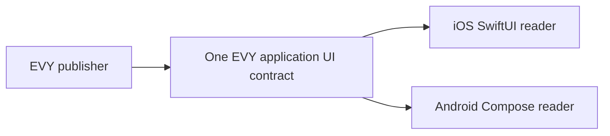

# 2.3 Native SDUI readers

## Repositories

| Repository | Role | Work in this plan |
| --- | --- | --- |
| [evy](https://github.com/EVY-Platform/evy) | Modified | The SwiftUI reader in `ios/` reads the EVY application UI contract. New Compose reader in `android/`. New `scripts/generate-kotlin-sdui.ts`. Shared reader fixtures in `scripts/fixtures/readers/`, and the `reader_parity.yml` and `mobile_builds.yml` workflows |
| [freenet-appkit](https://github.com/glesage/freenet-appkit) | Used | `FreenetAppKit` Swift package and `org.freenet.appkit` Kotlin library from 1.2 Embedded node and mobile SDK |
| [freenet-core](https://github.com/freenet/freenet-core) | Used | Embedded node |

## Purpose

EVY on iOS and Android draws Home, Hello and Marketplace from one complete signed application UI document. SwiftUI and Compose use the same row types, actions and document fixtures. GitHub builds and signs both applications from one source commit.

## Reading the application UI contract

Each build pins `ui.evy` in `types/freenet/contract-keys.json`, under [2.2 EVY UI contracts and publishing](02-ui-contracts.md#the-ui-contract). Both readers ship EVY's internal resource adapters and supported contract codecs from [2.4 SDUI data and actions](04-data-and-actions.md#evy-resource-catalogue).

1. GET the pinned application UI contract and subscribe through the Swift or Kotlin SDK. Before first join, read a retained local copy and queue subscription demand under [1.2 Embedded node and mobile SDK](../1-freenet-mobile-appkit/02-sdk.md#start-stop-and-reconnect).
2. Verify application identity, `service: evy`, signature and canonical encoding before comparing the version/hash tuple.
3. Save the newest verified document and tuple atomically. Save a compatible document as the application's drawable document.
4. Open the Home entry route. Resolve all feature routes within the activated document.
5. On notifications, repeat verification and save the highest observed tuple. Queue a compatible document while a flow has a draft, action or purchase interaction.

| Application state | UI update behavior |
| --- | --- |
| Idle Home entry page | Activate the winning compatible document. |
| Active flow or pending action | Retain its exact signed document, bindings, version, digest and draft. |
| Internal navigation | Resolve the route and arguments in the retained document; keep predecessor flow drafts on the navigation stack. |
| Flow returns to an idle boundary | Activate the highest compatible queued document before starting the next flow. |
| Reader upgrade required | Keep a drawable document and show Update EVY; save the verified newer observation for the next compatible build. |

The application data layer owns one UI subscription and the bounded data-contract set needed by its features. Views read its verified projections; subscription lifetime follows [1.2 Embedded node and mobile SDK](../1-freenet-mobile-appkit/02-sdk.md#ending-subscriptions).

### First open and offline

| Situation | Result |
| --- | --- |
| Previously opened EVY, offline | Draw the saved compatible application document and retained records. |
| Fresh installation, before first network join | Show Connecting to Freenet, then draw the verified application document. |
| Application UI state unavailable | Show EVY is not available right now and Retry. |
| Newest document requires a newer reader | Keep the saved drawable document and show Update EVY. |

Restart verifies saved bytes/tuples and repeats compatibility checks. Diagnostics record application key, version, digest and failed check under [1.3 Single-application host](../1-freenet-mobile-appkit/03-host.md#diagnostics).

### Linked purchase availability

The EVY data layer projects verified listing decisions, purchase states and captured-sale evidence under [2.7 EVY Marketplace](07-marketplace.md#item-availability). Home and Marketplace views consume that same application state. Their actions retain the selected purchase, source feature, participant and application UI release.

## Retained document dependencies

Exact documents and bindings let a draft or pending purchase resume with the UI and signatures it started with. Measure retention against the installation storage budget. Adoption of stronger Core retention follows [1.6 Application protocols, data and operations](../1-freenet-mobile-appkit/06-data-and-operations.md#core-retention-and-offline-delivery).

Keep exact signed document bytes and binding context for every open flow, acknowledged draft, pending signed operation and locally verified purchase. Keep newest verified and newest drawable documents separately. Track dependencies by application key/version/digest in the host inventory; pending delegate records reference the same identity.

Measure cache bytes and use the installation storage budget in [1.11 Cellular data and resource budgets](../1-freenet-mobile-appkit/11-cellular-data-and-resource-budgets.md#resource-budgets). Evict only unreferenced local documents. The durable archive retains referenced historical UI/policy/attribution bytes; refetch verifies exact digest before use. On iOS and Android, evict unrelated documents, restart offline with a pending purchase, then recover an archived dependency and verify the original purchase. Missing verification bytes keep that operation pending with a recovery action.

## Report and Block actions

Both readers implement `report(resource, id)` and `block(resource, id)` with the verified projected target and signing scope. Report opens the feature’s reason form and signs/submits its report contract record. Block records the declared scope in encrypted host storage and refreshes every matching projection. [2.7 EVY Marketplace](07-marketplace.md#moderation-and-seller-admission) owns authority, schemas, consent text, retention and production flow coverage. Add these actions to versioned schemas/grammar and raise the minimum reader version. Shared iOS and Android semantic/action fixtures test restored blocks, target substitution and retained payment/dispute access.

## The SwiftUI reader

The iOS SwiftUI reader and Android Compose reader use the same accepted UI documents. The SwiftUI implementation stores their flow, page and row records in `EVYDataStore` and draws them with `EVYPage` and `EVYRow` ([sdui.md](https://github.com/EVY-Platform/evy/blob/d0fb7e6475f1dfc5c74325e37d4e92aed88d84ed/docs/evy/sdui.md#ios-and-web-sdui-data-flow)).

| Part | SwiftUI implementation |
| --- | --- |
| Flow source | `EVYUIContractSource` reads the UI contract through the `FreenetAppKit` Swift package, following [Reading the application UI contract](#reading-the-application-ui-contract). Wire it into [EVY+Sync.swift](https://github.com/EVY-Platform/evy/blob/d0fb7e6475f1dfc5c74325e37d4e92aed88d84ed/ios/evy/Core/EVY+Sync.swift) and [EVYAPIManager.swift](https://github.com/EVY-Platform/evy/blob/d0fb7e6475f1dfc5c74325e37d4e92aed88d84ed/ios/evy/Data/EVYAPIManager.swift) |
| Stored records | `EVYUIContractSource` splits each accepted document into flat flow, page and row records, then stores them by application document version and activates the compatible generation while retaining records referenced by active flows. `EVYFlowStore`, `EVYPageStore` and `EVYRowStore` read them from `EVYDataStore` ([EVYFlowStore.swift](https://github.com/EVY-Platform/evy/blob/d0fb7e6475f1dfc5c74325e37d4e92aed88d84ed/ios/evy/Core/EVYFlowStore.swift)) |
| Entry point | [ContentView.swift](https://github.com/EVY-Platform/evy/blob/d0fb7e6475f1dfc5c74325e37d4e92aed88d84ed/ios/evy/ContentView.swift) opens the activated EVY document's Home entry route and uses `NavigationStack` for routes |
| Drawing and actions | Use `EVYPage`, `EVYRow`, the row views in [ios/evy/UI/Rows](https://github.com/EVY-Platform/evy/tree/d0fb7e6475f1dfc5c74325e37d4e92aed88d84ed/ios/evy/UI/Rows), [EVYActionRunner.swift](https://github.com/EVY-Platform/evy/blob/d0fb7e6475f1dfc5c74325e37d4e92aed88d84ed/ios/evy/UI/EVYActionRunner.swift) and [interpreter.swift](https://github.com/EVY-Platform/evy/blob/d0fb7e6475f1dfc5c74325e37d4e92aed88d84ed/ios/evy/Utils/interpreter.swift). The SDK delivers node callbacks to the main actor, where `EVYUIContractSource` applies each document ([1.2 Embedded node and mobile SDK](../1-freenet-mobile-appkit/02-sdk.md#what-to-build)) |

## The Compose reader

The Compose reader lives in the Android app from [The EVY app on iOS and Android in 2.1 Hello EVY world](01-hello-evy-world.md#the-evy-app-on-ios-and-android), and opens on the EVY document's Home entry route. It implements the SwiftUI reader's behavior in Kotlin.

| Part | SwiftUI reader | Compose reader |
| --- | --- | --- |
| UI types | `types/generated/swift/` from [generate-swift-sdui.ts](https://github.com/EVY-Platform/evy/blob/d0fb7e6475f1dfc5c74325e37d4e92aed88d84ed/scripts/generate-swift-sdui.ts) | `types/generated/kotlin/` from `generate-kotlin-sdui.ts` |
| Expressions and action parsing | [interpreter.swift](https://github.com/EVY-Platform/evy/blob/d0fb7e6475f1dfc5c74325e37d4e92aed88d84ed/ios/evy/Utils/interpreter.swift), [functions.swift](https://github.com/EVY-Platform/evy/blob/d0fb7e6475f1dfc5c74325e37d4e92aed88d84ed/ios/evy/Utils/functions.swift), [EVYActionParser.swift](https://github.com/EVY-Platform/evy/blob/d0fb7e6475f1dfc5c74325e37d4e92aed88d84ed/ios/evy/UI/EVYActionParser.swift), [EVYObjectLiteral.swift](https://github.com/EVY-Platform/evy/blob/d0fb7e6475f1dfc5c74325e37d4e92aed88d84ed/ios/evy/UI/EVYObjectLiteral.swift) | Kotlin ports |
| Action runner | `EVYActionRunner` | Kotlin port with the same sequencing: a false condition runs its `false` branch and stops the list |
| UI contract source | `EVYUIContractSource` | `EvyUiContractSource`, through the `org.freenet.appkit` Kotlin library |
| Record and draft stores | `EVYDataStore` on SwiftData, and `EVYDraftStore` | A Room database with the same records, and a draft store |
| Pages and sheets | `NavigationStack` and `.sheet` | Navigation Compose and `ModalBottomSheet` |
| UI thread | Main actor | Main dispatcher |
| Inline icons such as `::image-plus::` | [lucide-icons-swift](https://github.com/JakubMazur/lucide-icons-swift) | The same Lucide icons for Compose |
| Font | SF Pro Text, bundled in [ios/evy/UI/Assets](https://github.com/EVY-Platform/evy/tree/d0fb7e6475f1dfc5c74325e37d4e92aed88d84ed/ios/evy/UI/Assets) | Roboto, Android's system font. Apple licenses SF Pro for Apple platforms only |

### Kotlin types

`scripts/generate-kotlin-sdui.ts` sits beside `generate-swift-sdui.ts`. It reads the same `evy.schema.json`, `action.schema.json` and row schemas through `rowSpecFromDefinitions` in [sdui-row-schema-utils.ts](https://github.com/EVY-Platform/evy/blob/d0fb7e6475f1dfc5c74325e37d4e92aed88d84ed/scripts/sdui-row-schema-utils.ts). It writes `UIEnums.kt`, `UIShapes.kt` and `UIRowPayloads.kt`, with kotlinx.serialization annotations, to `types/generated/kotlin/`.

- [generate-types.ts](https://github.com/EVY-Platform/evy/blob/d0fb7e6475f1dfc5c74325e37d4e92aed88d84ed/scripts/generate-types.ts) runs it after the Swift generator, so `bun run types:generate` writes Swift and Kotlin from one set of schemas. Action branches are handwritten, as `EVYActionBranch` in Swift and `EvyActionBranch` in Kotlin.
- The Compose reader's `when` over the generated row payloads has no `else` branch, as the Swift `switch` in [EVYRow.swift](https://github.com/EVY-Platform/evy/blob/d0fb7e6475f1dfc5c74325e37d4e92aed88d84ed/ios/evy/UI/EVYRow.swift) has no `default`. A new row schema fails both builds until each reader draws it.

### Row types

Both readers draw the 21 row types in [types/schema/sdui/definitions](https://github.com/EVY-Platform/evy/tree/d0fb7e6475f1dfc5c74325e37d4e92aed88d84ed/types/schema/sdui/definitions). Triggers come from each schema's `triggers` block.

| Row type | Triggers | SwiftUI view | Compose |
| --- | --- | --- | --- |
| `button` | `tap` | `EVYButtonRow` | `Button`, red for `style: "danger"` |
| `calendar` | `tap`, `tap_row`, `tap_column` | `EVYCalendarRow` | Grid of timeslots with day and time headers |
| `dropdown` | `tap` | `EVYDropdownRow`, a list in a sheet | The same list in a `ModalBottomSheet` |
| `heading` | `tap`, `swipe_left` | `EVYHeadingRow` | Heading text |
| `horizontal_container` | `tap` | `EVYHorizontalContainerRow` | `Row` of its children |
| `inline_picker` | `tap` | `EVYInlinePickerRow` | One toggle button per option |
| `input` | `tap`, `submit`, `swipe_left` | `EVYInputRow` | `OutlinedTextField`. `submit` runs on the keyboard's Done key or when focus leaves |
| `input_list` | `tap` | `EVYInputListRow` | Scrolling list of values |
| `list_item` | `tap`, `swipe_left` | `EVYListItemRow` | `ListItem` with image, title and subtitle |
| `map` | `tap` | `EVYMapRow`, on MapKit | Maps Compose, on the Google Maps SDK for Android |
| `photo_gallery` | `tap` | `EVYPhotoGalleryRow` | `HorizontalPager`, with a full-screen view |
| `search` | `tap` | `EVYSearchRow` | Text field and results, each drawn with the first child variant whose `visible` is true. No placeholder gives a plain list |
| `select_photo` | `tap`, `delete` | `EVYSelectPhotoRow`, with `PhotosPicker` | Photo tiles, with the Android photo picker |
| `tab_container` | `tap` | `EVYTabContainerRow`, a segmented `Picker` | `SingleChoiceSegmentedButtonRow` |
| `text` | `tap`, `swipe_left` | `EVYTextRow` | Text with title and subtitle |
| `text_action` | `tap` | `EVYTextActionRow` | Text with an action label, such as "Change" |
| `text_area` | `tap`, `submit` | `EVYTextAreaRow` | Multi-line `OutlinedTextField` |
| `text_expand` | `tap` | `EVYTextExpandRow` | Text that opens with its `expand_label` |
| `text_select` | `tap` | `EVYTextSelectRow` | Text with a check box |
| `timeslot_picker` | `tap` | `EVYTimeslotPickerRow` | Grid of timeslots |
| `vertical_container` | `tap` | `EVYVerticalContainerRow` | `Column` of its children |

Rows with a `swipe_left` action get a trailing swipe button, from [EVYSwipeableRow.swift](https://github.com/EVY-Platform/evy/blob/d0fb7e6475f1dfc5c74325e37d4e92aed88d84ed/ios/evy/UI/EVYSwipeableRow.swift) on iOS and an `anchoredDraggable` reveal on Android. A `show` action opens a row's `sheet` in a sheet on iOS and a `ModalBottomSheet` on Android ([sdui.md](https://github.com/EVY-Platform/evy/blob/d0fb7e6475f1dfc5c74325e37d4e92aed88d84ed/docs/evy/sdui.md#row-relationships)).

## Keeping both readers the same

Both readers run the same fixtures in evy. Each fixture has an expected result, and both readers must produce it.

| Fixture | What it holds | Expected result |
| --- | --- | --- |
| [types/grammar/conformance.json](https://github.com/EVY-Platform/evy/blob/d0fb7e6475f1dfc5c74325e37d4e92aed88d84ed/types/grammar/conformance.json) | Expression, value-position and action-parsing vectors. Swift ([GrammarConformanceTests.swift](https://github.com/EVY-Platform/evy/blob/d0fb7e6475f1dfc5c74325e37d4e92aed88d84ed/ios/evyTests/GrammarConformanceTests.swift)), Kotlin and TypeScript run these vectors | A new Kotlin test gives the vectors' results |
| `scripts/fixtures/readers/rows/<row type>.json` | One complete application fixture per row type, with every attribute and trigger its schema declares | `<row type>.semantics.json` |
| `scripts/fixtures/readers/evy.json` | Complete EVY application versions with Home, Hello and internal navigation | `evy.semantics.json` |
| Complete EVY application documents incorporating flows from [service_sdui.json](https://github.com/EVY-Platform/evy/blob/d0fb7e6475f1dfc5c74325e37d4e92aed88d84ed/scripts/fixtures/services/service_sdui.json), with records from [service_data.json](https://github.com/EVY-Platform/evy/blob/d0fb7e6475f1dfc5c74325e37d4e92aed88d84ed/scripts/fixtures/services/service_data.json) loaded into the record store | Marketplace's "View Item" and "Create item" flows | `marketplace.semantics.json` |

For each fixture page, an XCTest UI test on iOS and a Compose UI test on Android draw the same document and write two things:

- A semantic snapshot records each row's ID, type, shown texts, value, enabled state and accessibility label. iOS reads it from the accessibility tree and Android from the Compose semantics tree. Each row sets its row ID as its accessibility identifier on iOS and its test tag on Android.
- An action trace. The test taps, types into and swipes each row, then records the actions the runner ran and the draft writes, in order, for example `select(...)`, `show(<row id>)` and `navigate(<flow id>,<page id>)` and `navigate_route(<route>,<arguments>)`.

Both outputs must equal the expected file, so VoiceOver and TalkBack read the same names, roles and values. Layout may differ, because fonts and system controls differ, so each platform keeps its own expected screenshots for review, with swift-snapshot-testing on iOS and Roborazzi on Android.

`.github/workflows/reader_parity.yml` runs both on every pull request that touches `ios/`, `android/`, `types/` or `scripts/fixtures/`: the iOS Simulator on the macOS runner that [e2e_tests.yml](https://github.com/EVY-Platform/evy/blob/d0fb7e6475f1dfc5c74325e37d4e92aed88d84ed/.github/workflows/e2e_tests.yml) uses, and the Android emulator on Linux. A change to either reader's behaviour updates the expected files in the same commit, as [types/grammar/README.md](https://github.com/EVY-Platform/evy/blob/d0fb7e6475f1dfc5c74325e37d4e92aed88d84ed/types/grammar/README.md) asks of the grammar.

## Builds from GitHub

`.github/workflows/mobile_builds.yml` in evy runs only when a maintainer starts it (`workflow_dispatch`). It takes a git ref and a `variant`, `store` or `test`, and builds both apps from that one commit. A `test` build adds a `.preview` suffix to the app IDs, so it installs beside a `store` build.

| Step | iOS job | Android job |
| --- | --- | --- |
| Runner | `blacksmith-6vcpu-macos-26`, as in e2e_tests.yml | Linux |
| Prepare | `bun run types:generate`, then the reader parity tests | The same |
| Build | `xcodebuild archive` of the `evy` scheme in Release. The build number is the workflow run number | `./gradlew bundleRelease`. The `versionCode` is the workflow run number |
| Sign | Distribution certificate and App Store provisioning profile | Upload key |
| Deliver | Upload with an App Store Connect API key Publishes a TestFlight build | Upload with a Play service account Publishes a Play internal testing release |

- Both apps pin the same freenet-appkit release for the Swift package and the Kotlin library, and both read the same `types/freenet/contract-keys.json`.
- The secrets live in the GitHub environment `mobile-builds`, which only maintainers can use: `APP_STORE_CONNECT_KEY_ID`, `APP_STORE_CONNECT_ISSUER_ID` and `APP_STORE_CONNECT_KEY` for TestFlight, `IOS_DISTRIBUTION_P12`, `IOS_DISTRIBUTION_P12_PASSWORD` and `IOS_PROVISIONING_PROFILE` for iOS signing, `ANDROID_UPLOAD_KEYSTORE` and `ANDROID_UPLOAD_KEYSTORE_PASSWORD` for Android signing, `PLAY_SERVICE_ACCOUNT_JSON` for Play internal testing, and `ANDROID_MAPS_API_KEY` for the `map` row on Android.
- The run summary lists the commit, the variant, both build numbers, the freenet-appkit release and the hash of `contract-keys.json`. Testers install from TestFlight on iOS and from the Play internal testing link on Android.

### Build and channel evidence

The workflow invokes [1.9 Testing and release](../1-freenet-mobile-appkit/09-testing-and-release.md#store-build-checks) with application `EVY`, iOS deployment target 17, Android API 28, EVY’s admitted contract/delegate hashes, merge-law checks for every EVY contract and EVY’s declared delegate ciphers. It records signing, packaged-artifact digests, execution-policy digest, reader version and delivery receipt for each platform.

Pilot delivery uses TestFlight on iOS and Play internal testing on Android. Production promotion submits the tested store-variant artifacts to the iOS App Store and Android Google Play production channel after [2.10 Testing and release](10-testing-and-release.md#production-completion) passes. Record both store approvals, production URLs, installed build numbers and fresh-install/update evidence. The workflow owns build/sign/delivery; the release plan owns launch gates.

## Acceptance

- On iOS and Android, start from the one pinned EVY application UI contract and navigate Home, Hello and Marketplace within its complete document.
- A compatible publication reaches both running readers within 30 seconds. Both produce matching semantic snapshots and action traces.
- On iOS and Android, restart offline after a successful read and show the saved compatible document. Fresh offline installation shows Connecting to Freenet until the application becomes available.
- On iOS and Android, start a form or purchase, publish a new application version, navigate within the retained document and return. Drafts, resource context and exact action/purchase UI identity remain intact. An idle boundary activates the queued compatible document.
- Wrong application identity, invalid signature, noncanonical state, stale tuple, malformed route and unsupported adapter leave the accepted document intact and produce redacted diagnostics.
- Equal-version documents arriving in opposite orders converge to the same higher hash. Duplicates and callbacks from superseded connections preserve the winning saved observation.
- A newer reader requirement preserves the drawable document and banner across restart; a compatible reader build draws the saved verified winner.
- Shared row and grammar fixtures pass in Swift, Kotlin and TypeScript. Missing native row support fails the corresponding iOS or Android build.
- One workflow run produces matching signed iOS and Android builds with the same appkit release and contract-key file hash. Test builds use separate application IDs and preview keys.
