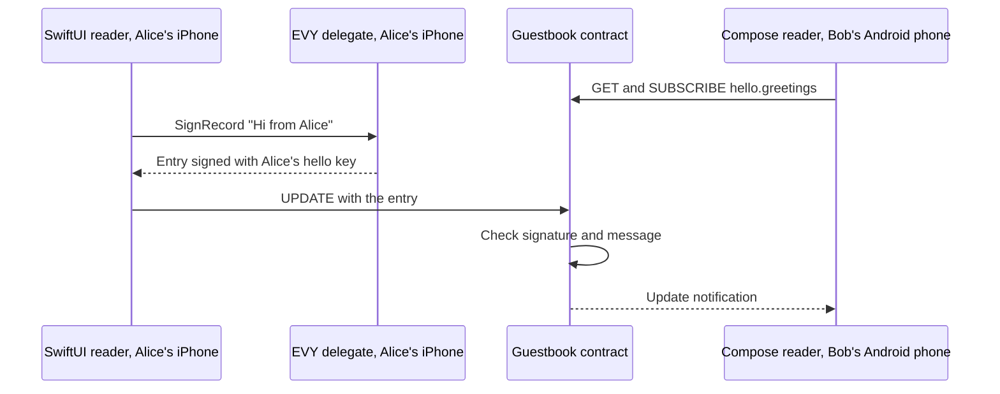

# 2.4 SDUI data and actions

## Repositories

| Repository | Role | Work in this plan |
| --- | --- | --- |
| [evy](https://github.com/EVY-Platform/evy) | Modified | EVY resource catalogue and wire schemas in `freenet/common/`, resource adapters in the SwiftUI and Compose readers, and `resources` checks in `scripts/validate-ui-document.ts`. Guestbook contract in `freenet/contracts/guestbook/`, the EVY delegate in `freenet/delegates/evy/` with its predecessor registry, the Hello guestbook flow in the complete `freenet/ui/evy.json` and `evyctl record remove` |
| [freenet-core](https://github.com/freenet/freenet-core) | Modified | `crates/mobile` runs freenet-migrate's delegate secret move for Swift and Kotlin apps |
| [freenet-appkit](https://github.com/glesage/freenet-appkit) | Used | Swift package and Kotlin library from 1.2 Embedded node and mobile SDK |
| [freenet-stdlib](https://github.com/freenet/freenet-stdlib) | Used | Contract and delegate interfaces |
| [freenet-migrate](https://github.com/freenet/freenet-migrate) | Used | `freenet-migrate-build` registry and `migrate_delegate_secrets` |

## Purpose

EVY on iOS and Android resolves data bindings and actions through Freenet contracts and one local EVY delegate. The Hello development fixture gets a guestbook:

- The EVY publisher publishes EVY application version 4. Its "Hello" page gains a "Guestbook" button, and a new "Guestbook" page binds the resource `hello.greetings`.
- Alice types "Hi from Alice" on her iPhone and taps "Sign". The SwiftUI reader asks the EVY delegate to sign the entry and sends it to the guestbook contract.
- Bob has the guestbook open on his Android phone. The Compose reader shows "Hi from Alice" within 30 seconds.



## Resources and contracts

This plan adds `resources` to [The UI document in 2.2 EVY UI contracts and publishing](02-ui-contracts.md#the-ui-document). It maps each resource reference that rows and actions use, in EVY's `<service>.<resource>` form ([rpc.schema.json](https://github.com/EVY-Platform/evy/blob/d0fb7e6475f1dfc5c74325e37d4e92aed88d84ed/types/schema/common/rpc.schema.json)), to a versioned resource adapter and its contract or delegate context.

### EVY resource catalogue

Separate application and feature labels keep each operation bound to its source data and signing scope. Shared protocol fixtures define feature namespaces, adapter versions and signing domains.

Home, Hello and Marketplace are features inside the EVY application. Its internal resource catalogue defines contract codecs, parameters, signing rules and reader adapters. Each purchase or immutable file has its own data contract; collections use bounded contract state. Views of the same purchase read one projection in EVY's application data store.

The existing `<service>.<resource>` names and delegate `service` fields identify internal feature namespaces such as `hello` and `marketplace`. They preserve data codecs and signing domains. The application UI envelope uses the fixed namespace `evy`.

| Component | EVY interface and storage | Owning plan |
| --- | --- | --- |
| Collections such as `hello.greetings` and `marketplace.items` | `collection/1` decodes signed records. Contract-specific operations handle item purchase references and publisher-signed lookups | This plan and [2.6 Payments](06-payments.md) |
| `evy.purchases` | `purchase/1` exposes purchase rows from the common purchase contract, one instance per sale. Rows retain the originating feature, item reference, participant keys, purchase ID and contract key | [2.12 Listings and purchases](12-listings-and-purchases.md#evy-purchase-interface) |
| `evy.messages` | `purchase-messages/1` exposes the signed messages of a referenced purchase. Message IDs, parents and participant roles retain their purchase context | [2.12 Listings and purchases](12-listings-and-purchases.md#evy-purchase-interface) |
| `evy.addresses` | `address/1` creates and edits the user's private address book in the EVY delegate. It also exposes address copies decrypted from purchase messages for their authorized recipients | [2.7 EVY Marketplace](07-marketplace.md#shared-messages-addresses-and-files) |
| `evy.files` | `file/1` exposes file references and fetches their bytes. The first implementation supports photos, with one immutable contract per content hash | [2.7 EVY Marketplace](07-marketplace.md#shared-messages-addresses-and-files) |
| `evy.delegate` | One delegate per user installation signs and decrypts for every EVY feature, with feature and purchase scopes | [The EVY delegate in 2.11 EVY delegate and private records](11-delegate-and-private-records.md#the-evy-delegate) |
| UI and navigation | Common UI contract code, schemas, formatters and iOS and Android readers; one application document contains Home, Hello and Marketplace flows | [2.2 EVY UI contracts and publishing](02-ui-contracts.md), [2.3 Native SDUI readers](03-readers.md) |
| Payments | Shared payment API, seller onboarding and signed payment records bound to a purchase | [2.6 Payments](06-payments.md) |
| Contributors and attribution | Contributor keys, `ActorId`s, EVY policy, capability reviews, units and archived application releases | [2.8 Attribution](08-attribution.md) |
| Earnings and payouts | Allocations, balances, reversals and payouts, retaining the originating feature, application release and purchase identity | [2.9 Remuneration and payouts](09-remuneration.md) |
| Backup and device sync | Export, restore and synchronization of the EVY delegate's data across its features | [3.1 Automated backup](../3-optional-extensions/01-backup.md), [3.2 Device sync](../3-optional-extensions/02-sync.md) |

The catalogue lives in `freenet/common/resources.json`, with the wire schemas and shared fixtures beside it. It records each adapter's version, supported contract code hashes, parameter codec, operations, signing scopes and minimum reader version. The guestbook uses the collection adapter in this plan. Purchases and purchase messages ship with [2.6 Payments](06-payments.md); addresses and photos ship with [2.7 EVY Marketplace](07-marketplace.md). Reputation, live collaboration and saved payment methods follow [3.3 Peer reputation](../3-optional-extensions/03-reputation.md), [3.4 Live authoring collaboration](../3-optional-extensions/04-collaboration.md) and [3.5 Saved payment methods](../3-optional-extensions/05-payment-methods.md).

### Resource bindings

Exact code and parameter bindings let both readers verify which contract an action reads or changes. Shared identity fixtures and substituted-target tests verify these bindings before resource publication.

```jsonc
{
  "service": "evy",               // complete application envelope from 2.2 EVY UI contracts and publishing
  "version": 4,                   // the EVY application version that adds the guestbook
  "resources": {                  // added by this plan, signed with the rest
    "hello.greetings": {          // resource reference that rows and actions use
      "adapter": "collection/1", // reader implementation from the EVY catalogue
      "contract": "guestbook",    // contract in freenet/contracts/guestbook/
      "code_hash": "8kHn...Qw3",  // base58 BLAKE3 hash of the guestbook Wasm
      "parameters": [             // the parameter bytes, part by part
        { "key": "9xFq...Tz2" },  // 32 bytes: the EVY publisher's verifying key
        { "text": "hello" }       // UTF-8 bytes: the internal feature namespace
      ],
      "private": []               // fields the EVY delegate seals, none here
    }
  }
}
```

The "Guestbook" page has an `input` row with the destination `{hello.greetings.message}`, a "Sign" `button` whose `tap` runs `{create(hello.greetings,submit)}`, and a `search` row with no placeholder whose source `{sort(hello.greetings, desc, created_at)}` lists every entry, newest first. The "Hello" flow declares `"submits": { "resource": "hello.greetings" }`, and the "Guestbook" button on the "Hello" page runs `navigate` to the new page.

- Each `key` part adds 32 bytes and each `text` part adds its UTF-8 bytes. Only the last part may be text, so the bytes split one way. The guestbook codec uses the EVY publisher key and `hello` feature namespace; the application UI codec uses the same publisher key and fixed `evy` namespace. Part values follow EVY's [value-position rules](https://github.com/EVY-Platform/evy/blob/d0fb7e6475f1dfc5c74325e37d4e92aed88d84ed/docs/evy/actions.md#value-position).
- The reader derives the contract key from `code_hash` and the parameter bytes ([Component identity and re-keying in 1.7 Upgrades and migration](../1-freenet-mobile-appkit/07-migration.md#component-identity-and-re-keying)). Fixtures in evy check that Rust, Swift and Kotlin derive the same key.
- `scripts/validate-ui-document.ts`, the validation step of `evyctl ui publish`, checks each binding against the catalogue and checks that every resource reference in the flows has an entry in `resources`. `evyctl` PUTs each new static collection contract with its valid initial state through the EVY operator node, which stays subscribed so a full peer keeps hosting it, as for the hello contract in [2.1 Hello EVY world](01-hello-evy-world.md#publishing-a-new-greeting). Purchase and file adapters create instances when a user creates a purchase or selects a photo.

The complete application document declares these bindings once; Home and Marketplace flows use them when they display Marketplace items:

```jsonc
{
  "evy.purchases": {
    "adapter": "purchase/1",
    "contract": "purchase",
    "code_hash": "7HpQ...",          // supported purchase Wasm
    "items": "marketplace.items"     // listing binding in this document
  },
  "evy.messages": {
    "adapter": "purchase-messages/1",
    "purchases": "evy.purchases"
  },
  "evy.addresses": {
    "adapter": "address/1",
    "purchases": "evy.purchases"
  },
  "evy.files": {
    "adapter": "file/1",
    "contract": "photo",
    "code_hash": "4FtN..."
  }
}
```

The validator resolves binding dependencies, requires their declared types and rejects cycles. Each contract binding names the resource's originating feature and publisher through its static parameters or verified listing and purchase context. Resource names such as `evy.purchases` identify EVY adapters. The source feature controls its signing namespace; the complete EVY document names the agreed application policy. Home displaying a Marketplace purchase retains that feature and participant context.

The readers ship the adapter implementations, schemas and supported contract Wasm in both iOS and Android builds. A signed UI document selects a supported adapter and supplies declarative bindings. The catalogue determines the minimum reader version required by all selected adapters. Unsupported bindings follow [Reader compatibility in 2.2 EVY UI contracts and publishing](02-ui-contracts.md#reader-compatibility).

### Resource operations and permissions

| Adapter | Read projection | Writes and ownership |
| --- | --- | --- |
| `collection/1` | Decodes `records/removed` for author-written collections, or the catalogue's supported lookup schema | `create` and `update` sign author records with the originating feature key. Seller authorization, certified service admission decisions and publisher lookup updates use their contract-specific schemas |
| `purchase/1` | Projects each verified nested purchase state into one row, identified by its contract key, with its purchase ID and participant roles | `create` creates the purchase and its initial buyer message. Participant actions use the transition rules from [2.12 Listings and purchases](12-listings-and-purchases.md#evy-purchase-interface). `owns` matches the feature seller key or the purchase-scoped buyer key |
| `purchase-messages/1` | Projects messages with their purchase contract key, message ID, parent and author role | `create` appends a permitted signed participant message to that purchase. `owns` matches that message's author key |
| `address/1` | Projects the user's delegate-held address book and decrypted purchase-address copies with their source purchase and message IDs | `create` and `update` change the user's private address book. Sharing seals a copy into an authorized purchase message. `owns` reflects private-row access; editable address-book rows belong to the local user |
| `file/1` | Projects file references from owning records and fetches verified content by contract key | Photo selection creates the immutable content contract, then attaches its reference through the owning record's permitted operation. Ownership follows the attachment record's author |

`owns` supplies a UI predicate. Each mutation separately checks the adapter operation, originating feature, target contract and participant role; the contract verifies the signed operation. The trusted native reader supplies the resolved context to the delegate. The delegate checks that context and its signing domain before signing or decrypting. The signed UI binding and submitted fields are inputs to those checks.

Both readers index projections by resource binding and contract context. Updating one purchase replaces that purchase's rows and dependent message and address rows. EVY's data layer owns one subscription per required contract on its connection and bounds that set by the mobile budget. Views observe the resulting application state. Every projected row retains its source identity for routing and verification.

The guestbook is a development proving fixture with a named test operator and isolated test keys. Production commerce uses Marketplace. Retaining a production guestbook requires Marketplace-equivalent Report/Block/removal coverage and a named moderator before release.

### The guestbook contract

The guestbook uses the collection adapter's `records/removed` state shape. `records` maps retained IDs to records, and `removed` maps retained deleted IDs to publisher-signed tombstones. Together they hold at most 1,000 IDs. A delta carries records and tombstones. A guestbook entry:

| Field | Example | Rule |
| --- | --- | --- |
| `id` | `5f0c2a9e-...` | A UUID from the first 16 bytes of BLAKE3 over the canonical `{author, salt, created_at}` identity header; `salt` is 16 random bytes. The author signs this header under `evy.record-birth/1 hello.greetings` |
| `author` | Alice's hello signing key, base58 | From the EVY delegate |
| `revision` | `1` | One higher on each change |
| `created_at` | `2026-10-07T09:30:00.000Z` | Fixed in the signed identity header, as UTC with millisecond precision. Edits retain it |
| `message` | "Hi from Alice" | 1 to 280 characters |
| `signature` | base64 | Ed25519 by `author` over `evy.record/1 hello.greetings`, a newline, and the RFC 8785 canonical JSON of the other fields |

Each record includes its signed identity header. Its immutable rank is `(created_at, id)`, comparing normalized timestamp bytes then unsigned ID bytes. A tombstone includes that original header and the publisher signature over its resource, ID and rank; validation checks both signatures and ID derivation. It occupies the same ranked slot and suppresses the record content.

A record's `record_hash` is the 32-byte BLAKE3 hash of the RFC 8785 canonical JSON of the complete signed record, including `signature`. Peers compute it from the record. For the same ID, compare `(revision, record_hash)`: the higher revision wins, then the lexicographically higher hash bytes at equal revisions.

| Function | Rule |
| --- | --- |
| `validate_state` | Every record and tombstone passes the identity, rank and signature rules. At most 1,000 retained IDs across both maps, because Core sends the whole state with each UPDATE ([Cellular budget contract in 1.11 Cellular data and resource budgets](../1-freenet-mobile-appkit/11-cellular-data-and-resource-budgets.md#cellular-budget-contract)) |
| `update_state` | Union the incoming and local retained IDs. For each ID, a valid tombstone wins; among tombstones keep the highest BLAKE3 hash of their canonical signed bytes. Otherwise keep the higher `(revision, record_hash)`. Retain the 1,000 highest immutable ranks across records and tombstones. Deletion keeps its ranked slot, so it never refills the set with an older record |
| `summarize_state` | Each retained ID and rank, with its record revision/hash or tombstone hash, plus the lowest retained rank when full |
| `get_state_delta` | Sends missing or higher records and tombstones that can enter the peer's retained set. A full peer's minimum rank excludes older IDs. Tombstones take precedence for the same ID, with the same hash tie-break; an up-to-date peer gets an empty delta |

Retained tombstones remain until a higher immutable rank displaces their slot through the same merge. Every full state retains its ranking boundary, so replaying an older discarded record leaves the set unchanged. Clearing history uses a new contract generation with explicit migration.

The EVY publisher removes an entry with `evyctl record remove hello.greetings <id>`, which signs the removal with the EVY publisher key.

## Reads and subscriptions

The EVY application data layer GETs and subscribes to the guestbook when its features need `hello.greetings`, following [Ending subscriptions in 1.2 Embedded node and mobile SDK](../1-freenet-mobile-appkit/02-sdk.md#ending-subscriptions). Views observe that collection in the application store. Before the node's first join, the GET reads the node's stored copy, as for UI contracts in [Reading the application UI contract in 2.3 Native SDUI readers](03-readers.md#reading-the-application-ui-contract). The collection adapter decodes `records` into the resource's collection and writes them to its record store, `EVYDataStore` on iOS and the Room database from [The Compose reader in 2.3 Native SDUI readers](03-readers.md#the-compose-reader) on Android. Other adapters use the projections in [Resource operations and permissions](#resource-operations-and-permissions). Each update notification refreshes the affected source's rows.

| Binding | Reader behavior |
| --- | --- |
| Collections such as `{hello.greetings}` and `{evy.purchases}` | The declared adapter projects verified source state into rows in the reader's store ([EVY+Sync.swift](https://github.com/EVY-Platform/evy/blob/d0fb7e6475f1dfc5c74325e37d4e92aed88d84ed/ios/evy/Core/EVY+Sync.swift)) |
| `$datum`, `sort`, `filter`, `findFirst`, `count` | Run over the projected records ([methods.md](https://github.com/EVY-Platform/evy/blob/d0fb7e6475f1dfc5c74325e37d4e92aed88d84ed/docs/evy/methods.md)) |
| `owns(resource, id)` | Uses the adapter's predicate for the verified source context and service or purchase-scoped keys from `GetPublicKeys` ([EVY+Ownership.swift](https://github.com/EVY-Platform/evy/blob/d0fb7e6475f1dfc5c74325e37d4e92aed88d84ed/ios/evy/Core/EVY+Ownership.swift)) |
| Public and private rows | Contract state is public. The delegate seals fields in the resource's `private` list. Row visibility follows [data.md](https://github.com/EVY-Platform/evy/blob/d0fb7e6475f1dfc5c74325e37d4e92aed88d84ed/docs/evy/data.md#visibility) |

## Actions

The action runner follows EVY's [sequencing rules](https://github.com/EVY-Platform/evy/blob/d0fb7e6475f1dfc5c74325e37d4e92aed88d84ed/docs/evy/sdui.md#sequencing). `create` and `update` write the reader's store immediately and send in the background ([EVY+Mutations.swift](https://github.com/EVY-Platform/evy/blob/d0fb7e6475f1dfc5c74325e37d4e92aed88d84ed/ios/evy/Core/EVY+Mutations.swift)). The next action runs while the write is pending.

| Action ([actions.md](https://github.com/EVY-Platform/evy/blob/d0fb7e6475f1dfc5c74325e37d4e92aed88d84ed/docs/evy/actions.md)) | What it does on Freenet |
| --- | --- |
| `create(resource, submit)`, and the map and path forms | Resolves the adapter and source context, validates the payload and invokes its create operation. For the guestbook, adds `salt`, `id`, `author`, `revision` 1 and `created_at`; `SignRecord` signs it and the SDK sends the record delta. Purchase, message and file operations follow their catalogue schemas. Writes the created row's ID to `idDestination` if given. The row shows as "Sending" until its operation is in the contract's state |
| `update(resource, {filter}, {changes})` | Resolves each matching row's source and checks the adapter's permitted operation. For author-written collections, applies changes, increases `revision`, signs and sends. Purchase transitions use signed messages and payment records. A refused operation shows the contract's reason |
| `update(resource, {}, {changes}, draft)`, `select`, `clear`, `highlight_required` | Page-local drafts and checks on the phone |
| `copy_to_clipboard` | Writes the text with `UIPasteboard` on iOS and `ClipboardManager` on Android. Android 13 and later shows its own confirmation |
| `navigate`, `navigate_route`, `show`, `close`, `select_photo`, `delete_photo`, `expand_photo`, `expand_text` | Inside the reader: `NavigationStack` and sheets on iOS, Navigation Compose and `ModalBottomSheet` on Android |

## Service rules

Contracts enforce record rules. Backend services perform work that needs an external system, such as creating a payment intent ([hooks.md](https://github.com/EVY-Platform/evy/blob/d0fb7e6475f1dfc5c74325e37d4e92aed88d84ed/docs/evy/hooks.md)).

| Work | Implementation |
| --- | --- |
| Validate a record | The resource contract checks every record on every peer in `validate_state` and `update_state`. The guestbook follows [The guestbook contract](#the-guestbook-contract) |
| Report a refused write | The writer's node rejects the UPDATE. The SDK returns a [typed error from 1.2 Embedded node and mobile SDK](../1-freenet-mobile-appkit/02-sdk.md#typed-errors), and the reader shows its reason in EVY's error alert |
| Run external work after a write | The backend service runs its own Freenet node, subscribes to the resource contract with freenet-stdlib's TypeScript client and acts on each new record. It signs result records with its own key. Hello needs record validation only |

## Offline writes

Core merges a local UPDATE into the node's stored copy and sends it to peers when the phone reconnects ([Sending updates in 1.6 Application protocols, data and operations](../1-freenet-mobile-appkit/06-data-and-operations.md#sending-updates)). Before the node's first join, Core answers UPDATE with `PeerNotJoined` and the SDK holds the UPDATE until the join ([Start, stop and reconnect in 1.2 Embedded node and mobile SDK](../1-freenet-mobile-appkit/02-sdk.md#start-stop-and-reconnect)).

This plan uses the pinned Core build's retention and propagation behavior. Reconnect tests retain the contract state within Core's hosting budget. Durable offline delivery across contract eviction belongs to the separate upstream work in [Core retention and offline delivery in 1.6 Application protocols, data and operations](../1-freenet-mobile-appkit/06-data-and-operations.md#core-retention-and-offline-delivery).

| Alice's phone when she taps "Sign" | What happens to "Hi from Alice" |
| --- | --- |
| Joined earlier, offline now | Core merges the entry into its stored guestbook and answers. The entry shows at once. With the guestbook state retained within Core's hosting budget, Bob gets it after Alice reconnects |
| Not joined yet since the app started | The SDK holds the UPDATE. The entry shows as "Sending" until the join |
| EVY closes before the entry reaches the contract | The entry waits in the EVY delegate as `pending/hello/<id>`. On the next start the reader gets it from `ListPending` and sends the same signed bytes again. The contract keeps one copy |
| The contract refuses the entry | The reader removes the entry, calls `ClearPending` and shows the reason |

## Acceptance

- `fdev verify-merge` and shared fixtures cover the 1,001st ID, equal timestamps, record edits, tombstone replay and all update permutations. Starting with 1,000 records, add newer B and remove B in either order: the same 999 visible records and B tombstone remain. Merging repeated full states and deltas retains the same ranked IDs and an empty converged delta. A changed identity header, rank or tombstone signature fails validation.

- Shared fixtures run in the iOS and Android readers for collection, purchase, message, address and file adapters as their owning plans ship. Home and Marketplace project the same referenced purchase, route each operation to the same instance and retain its originating feature and UI attribution identity.
- Fixtures reject unknown adapter versions, unsupported code hashes, missing or cyclic binding dependencies, substituted purchase contexts and signing with another feature or purchase's key. Participant ownership and permission checks agree across iOS and Android.
- Updates to one purchase refresh only its projected rows. The application data layer deduplicates demand for the same instance and releases it under [1.2 Embedded node and mobile SDK](../1-freenet-mobile-appkit/02-sdk.md#application-demand-policy). Views observe projections; pending operations retain their demand after views close. An interrupted dynamic operation resumes with its saved target, parameters, scope and signed bytes.
- On iOS and Android, Alice writes "Hi from Alice" in the guestbook on her iPhone, and Bob's Android phone shows it within 30 seconds. Bob replies "Hi Alice, from Bob", and Alice sees it. Each entry's `author` is the writer's hello key.
- On iOS and Android, Alice edits her entry and Bob sees the new revision. A change to Alice's entry from Bob's phone, an empty message and a 281-character message are each refused on the writer's phone, and the reader shows the reason.
- On iOS and Android, each case in [Offline writes](#offline-writes) passes, and the guestbook holds one copy of each entry. When the EVY publisher removes an entry with `evyctl record remove`, both phones drop it.
- A two-peer contract test starts with different valid signed records for the same ID and revision. Their summaries contain different hashes. Summary and delta exchange converges both peers to the record with the higher hash, with either exchange order. A repeated exchange produces an empty delta. Fixtures also cover a higher revision with a lower hash and a signed removal arriving alongside a record.
- Shared fixtures give the same contract keys, records, `record_hash` bytes and action traces for `create`, `update`, `select`, `copy_to_clipboard`, `navigate`, `navigate_route` and `show` in the SwiftUI and Compose readers.
- Delegate signing, private-record and migration suites from [2.11 EVY delegate and private records](11-delegate-and-private-records.md#acceptance) pass through the adapters in this plan.
