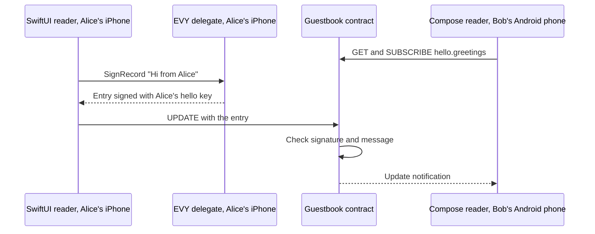

# 2.4 SDUI data and actions

## Repositories

| Repository | Role | Work in this plan |
| --- | --- | --- |
| [evy](https://github.com/EVY-Platform/evy) | Modified | Shared resource catalogue and wire schemas in `freenet/common/`, resource adapters in the SwiftUI and Compose readers, and `resources` checks in `scripts/validate-ui-document.ts`. Guestbook contract in `freenet/contracts/guestbook/`, the EVY delegate in `freenet/delegates/evy/` with its predecessor registry, the guestbook in `freenet/ui/hello.json` and `evyctl record remove` |
| [freenet-core](https://github.com/freenet/freenet-core) | Modified | `crates/mobile` runs freenet-migrate's delegate secret move for Swift and Kotlin apps |
| [freenet-appkit](https://github.com/glesage/freenet-appkit) | Used | Swift package and Kotlin library from 1.2 Embedded node and mobile SDK |
| [freenet-stdlib](https://github.com/freenet/freenet-stdlib) | Used | Contract and delegate interfaces |
| [freenet-migrate](https://github.com/freenet/freenet-migrate) | Used | `freenet-migrate-build` registry and `migrate_delegate_secrets` |

## Purpose

This plan connects EVY's data bindings and actions to Freenet contracts and to one EVY delegate on the phone. The hello service gets a guestbook:

- The EVY publisher publishes hello version 4. Its "Hello" page gains a "Guestbook" button, and a new "Guestbook" page binds the resource `hello.greetings`.
- Alice types "Hi from Alice" on her iPhone and taps "Sign". The SwiftUI reader asks the EVY delegate to sign the entry and sends it to the guestbook contract.
- Bob has the guestbook open on his Android phone. The Compose reader shows "Hi from Alice" within 30 seconds.



## Resources and contracts

This plan adds `resources` to [The UI document in 2.2 EVY UI contracts and publishing](02-ui-contracts.md#the-ui-document). It maps each resource reference that rows and actions use, in EVY's `<service>.<resource>` form ([rpc.schema.json](https://github.com/EVY-Platform/evy/blob/dev/types/schema/common/rpc.schema.json)), to a versioned resource adapter and its contract or delegate context.

### Shared EVY catalogue

Home, Hello and Marketplace use common EVY components. Each shared resource has one wire schema, contract implementation where needed, parameter encoding, signing rules and reader adapter. Contract instances hold individual purchases or files, or bounded collections. Applications reference the same instance when they use the same data.

| Component | Shared interface and storage | Owning plan |
| --- | --- | --- |
| Collections such as `hello.greetings` and `marketplace.items` | `collection/1` decodes signed records. Contract-specific operations handle item purchase references and publisher-signed lookups | This plan and [2.6 Payments](06-payments.md) |
| `evy.purchases` | `purchase/1` exposes purchase rows from the common purchase contract, one instance per sale. Rows retain the originating service, item reference, participant keys, purchase ID and contract key | [2.6 Payments](06-payments.md#shared-purchase-interface) |
| `evy.messages` | `purchase-messages/1` exposes the signed messages of a referenced purchase. Message IDs, parents and participant roles retain their purchase context | [2.6 Payments](06-payments.md#shared-purchase-interface) |
| `evy.addresses` | `address/1` creates and edits the user's private address book in the EVY delegate. It also exposes address copies decrypted from purchase messages for their authorized recipients | [2.7 EVY Marketplace](07-marketplace.md#shared-messages-addresses-and-files) |
| `evy.files` | `file/1` exposes file references and fetches their bytes. The first implementation supports photos, with one immutable contract per content hash | [2.7 EVY Marketplace](07-marketplace.md#shared-messages-addresses-and-files) |
| `evy.delegate` | One delegate per user installation signs and decrypts for every EVY service, with service and purchase scopes | [The EVY delegate](#the-evy-delegate) |
| UI and navigation | Common UI contract code, schemas, formatters and iOS and Android readers; Home lists services and flows open across services | [2.2 EVY UI contracts and publishing](02-ui-contracts.md), [2.3 Native SDUI readers](03-readers.md) |
| Payments | Shared payment API, seller onboarding and signed payment records bound to a purchase | [2.6 Payments](06-payments.md) |
| Contributors and attribution | Contributor keys, `ActorId`s, service policies, reviews, units and archived UI snapshots | [2.8 Attribution](08-attribution.md) |
| Earnings and payouts | Allocations, balances, reversals and payouts, retaining the originating service and purchase identity | [2.9 Remuneration and payouts](09-remuneration.md) |
| Backup and device sync | Export, restore and synchronization of the EVY delegate's data across services | [3.1 Automated backup](../3-optional-extensions/01-backup.md), [3.2 Device sync](../3-optional-extensions/02-sync.md) |

The catalogue lives in `freenet/common/resources.json`, with the wire schemas and shared fixtures beside it. It records each adapter's version, supported contract code hashes, parameter codec, operations, signing scopes and minimum reader version. The guestbook uses the collection adapter in this plan. Purchases and purchase messages ship with [2.6 Payments](06-payments.md); addresses and photos ship with [2.7 EVY Marketplace](07-marketplace.md). Reputation, live collaboration and saved payment methods follow their optional extension plans. Outside applications adopt these interfaces through [3.6 EVY services for Freenet apps](../3-optional-extensions/06-shared-services.md).

### Resource bindings

```jsonc
{
  "service": "hello",             // flows and other fields as in 2.2 EVY UI contracts and publishing
  "version": 4,                   // the hello version that adds the guestbook
  "resources": {                  // added by this plan, signed with the rest
    "hello.greetings": {          // resource reference that rows and actions use
      "adapter": "collection/1", // reader implementation from the shared catalogue
      "contract": "guestbook",    // contract in freenet/contracts/guestbook/
      "code_hash": "8kHn...Qw3",  // base58 BLAKE3 hash of the guestbook Wasm
      "parameters": [             // the parameter bytes, part by part
        { "key": "9xFq...Tz2" },  // 32 bytes: the service publisher's verifying key
        { "text": "hello" }       // UTF-8 bytes: the service ID
      ],
      "private": []               // fields the EVY delegate seals, none here
    }
  }
}
```

The "Guestbook" page has an `input` row with the destination `{hello.greetings.message}`, a "Sign" `button` whose `tap` runs `{create(hello.greetings,submit)}`, and a `search` row with no placeholder whose source `{sort(hello.greetings, desc, created_at)}` lists every entry, newest first. The "Hello" flow declares `"submits": { "resource": "hello.greetings" }`, and the "Guestbook" button on the "Hello" page runs `navigate` to the new page.

- Each `key` part adds 32 bytes and each `text` part adds its UTF-8 bytes. Only the last part may be text, so the bytes split one way. This is the layout of [The UI contract in 2.2 EVY UI contracts and publishing](02-ui-contracts.md#the-ui-contract). Part values follow EVY's [value-position rules](https://github.com/EVY-Platform/evy/blob/dev/docs/evy/actions.md#value-position).
- The reader derives the contract key from `code_hash` and the parameter bytes ([Component identity and re-keying in 1.7 Upgrades and migration](../1-freenet-mobile-appkit/07-migration.md#component-identity-and-re-keying)). Fixtures in evy check that Rust, Swift and Kotlin derive the same key.
- `scripts/validate-ui-document.ts`, the validation step of `evyctl ui publish`, checks each binding against the catalogue and checks that every resource reference in the flows has an entry in `resources`. `evyctl` PUTs each new static collection contract with its valid initial state through the EVY operator node, which stays subscribed so a full peer keeps hosting it, as for the hello contract in [2.1 Hello EVY world](01-hello-evy-world.md#publishing-a-new-greeting). Purchase and file adapters create instances when a user creates a purchase or selects a photo.

Home and Marketplace can both declare these bindings when they display Marketplace items:

```jsonc
{
  "evy.purchases": {
    "adapter": "purchase/1",
    "contract": "purchase",
    "code_hash": "7HpQ...",          // supported purchase Wasm
    "items": "marketplace.items"     // listing binding in this document
  },
  "evy.messages": {
    "adapter": "purchase-messages/1",
    "purchases": "evy.purchases"
  },
  "evy.addresses": {
    "adapter": "address/1",
    "purchases": "evy.purchases"
  },
  "evy.files": {
    "adapter": "file/1",
    "contract": "photo",
    "code_hash": "4FtN..."
  }
}
```

The validator resolves binding dependencies, requires their declared types and rejects cycles. Each contract binding names the resource's originating service and publisher through its static parameters or verified listing and purchase context. Shared names such as `evy.purchases` identify an interface; the originating service controls the signing namespace and attribution policy. Home displaying a Marketplace purchase retains the Marketplace context.

The readers ship the adapter implementations, schemas and supported contract Wasm in both iOS and Android builds. A signed UI document selects a supported adapter and supplies declarative bindings. The catalogue determines the minimum reader version required by all selected adapters. Unsupported bindings follow [Reader compatibility in 2.2 EVY UI contracts and publishing](02-ui-contracts.md#reader-compatibility).

### Resource operations and permissions

| Adapter | Read projection | Writes and ownership |
| --- | --- | --- |
| `collection/1` | Decodes `records/removed` for author-written collections, or the catalogue's supported lookup schema | `create` and `update` sign author records with the originating service key. Item reference operations and publisher lookup updates use their contract-specific schemas |
| `purchase/1` | Projects each verified nested purchase state into one row, identified by its contract key, with its purchase ID and participant roles | `create` creates the purchase and its initial buyer message. Participant actions use the transition rules from [2.6 Payments](06-payments.md#shared-purchase-interface). `owns` matches the service seller key or the purchase-scoped buyer key |
| `purchase-messages/1` | Projects messages with their purchase contract key, message ID, parent and author role | `create` appends a permitted signed participant message to that purchase. `owns` matches that message's author key |
| `address/1` | Projects the user's delegate-held address book and decrypted purchase-address copies with their source purchase and message IDs | `create` and `update` change the user's private address book. Sharing seals a copy into an authorized purchase message. `owns` reflects private-row access; editable address-book rows belong to the local user |
| `file/1` | Projects file references from owning records and fetches verified content by contract key | Photo selection creates the immutable content contract, then attaches its reference through the owning record's permitted operation. Ownership follows the attachment record's author |

`owns` supplies a UI predicate. Each mutation separately checks the adapter operation, originating service, target contract and participant role; the contract verifies the signed operation. The trusted native reader supplies the resolved context to the delegate. The delegate checks that context and its signing domain before signing or decrypting. The signed UI binding and submitted fields are inputs to those checks.

Both readers index projections by resource binding and contract context. Updating one purchase replaces that purchase's rows and dependent message and address rows. Views acquire subscription handles for the instances they display and release them when the views close. Every projected row retains its source identity for routing and verification.

### The guestbook contract

The guestbook uses the collection adapter's `records/removed` state shape. `records` maps each record ID to a record, and `removed` lists removed IDs. A delta carries new or changed records and removals. A guestbook entry:

| Field | Example | Rule |
| --- | --- | --- |
| `id` | `5f0c2a9e-...` | A UUID from the first 16 bytes of BLAKE3 over `author` and `salt`, 16 random bytes the reader picks. Only one author can write under it |
| `author` | Alice's hello signing key, base58 | From the EVY delegate |
| `revision` | `1` | One higher on each change |
| `created_at` | `2026-10-07T09:30:00.000Z` | Set by Alice's phone |
| `message` | "Hi from Alice" | 1 to 280 characters |
| `signature` | base64 | Ed25519 by `author` over `evy.record/1 hello.greetings`, a newline, and the RFC 8785 canonical JSON of the other fields |

A record's `record_hash` is the 32-byte BLAKE3 hash of the RFC 8785 canonical JSON of the complete signed record, including `signature`. Peers compute it from the record. For the same ID, compare `(revision, record_hash)`: the higher revision wins, then the lexicographically higher hash bytes at equal revisions.

| Function | Rule |
| --- | --- |
| `validate_state` | Every record passes the rules above. At most 1,000 records, because Core sends the whole state with each UPDATE ([Cellular budget contract in 1.8 Thin-peer role and cellular data budgets](../1-freenet-mobile-appkit/08-thin-peer.md#cellular-budget-contract)). Each removal carries a signature by the publisher key in the parameters |
| `update_state` | Adds the valid records in the delta. For one ID, the higher `(revision, record_hash)` wins. A removed ID stays removed. Above 1,000 records it drops the oldest by `created_at` |
| `summarize_state` | Each record's ID, revision and `record_hash`, and the removed IDs |
| `get_state_delta` | Sends each record whose ID is absent from the peer's summary or whose `(revision, record_hash)` is higher than the peer's copy. Sends signed removals whose IDs are absent from the peer's removed-ID list. Removals take precedence over records |

The EVY publisher removes an entry with `evyctl record remove hello.greetings <id>`, which signs the removal with the service publisher key.

## The EVY delegate

The EVY delegate, alias `evy.delegate`, holds the user's EVY keys for every EVY service on the phone. It lives in `freenet/delegates/evy/`. Its parameters are empty, so its key is a hash of its code. Both apps carry its Wasm and register it with the node on every start.

| Secret | What it holds |
| --- | --- |
| `root_seed` | 32 random bytes, made on first start from Core's random source for Wasm ([rand.rs](https://github.com/freenet/freenet-stdlib/blob/main/rust/src/rand.rs)) |
| `addresses/<id>` | The user's private address-book record, with its UUID and revision. Shared EVY applications use this local store; a purchase carries its own sealed copy |
| `pending/<service>/<id>` | A signed operation with its adapter, target contract key, exact parameters, signing scope and operation ID, for replay with the same bytes; see [Offline writes](#offline-writes) |

- **Keys.** HKDF-SHA256 over `root_seed` with the info `evy/hello/signing` gives Alice's hello Ed25519 signing key, and `evy/hello/encryption` her hello X25519 key. Each service sees different keys, so two services cannot link Alice by her key. A message may add a `scope`, such as a record ID, for keys used in that scope only, with the info `evy/<service>/<scope>/signing`. Only public keys leave the delegate.
- **Storage.** Core keeps the secrets in the node's encrypted delegate store from [What the key protects in 1.5 Identity, keys and local protection](../1-freenet-mobile-appkit/05-identity.md#what-the-key-protects). The backup file from [App-specific export and import in 1.5 Identity, keys and local protection](../1-freenet-mobile-appkit/05-identity.md#app-specific-export-and-import) carries `root_seed`, so a restore brings back the same keys.
- **Callers.** The delegate answers EVY's own native calls, which arrive over the trusted path in [Trusted calls in 1.3 Single-application host](../1-freenet-mobile-appkit/03-host.md#trusted-calls). It refuses a message whose `MessageOrigin` is a web app or another delegate ([delegate_interface.rs](https://github.com/freenet/freenet-stdlib/blob/main/rust/src/delegate_interface.rs)).
- **Private fields.** A resource's `private` list names fields that only chosen people may read. The reader sends them in `Seal`, and the delegate encrypts them to the author and to each X25519 key in the record's `readers` list, with HPKE ([RFC 9180](https://www.rfc-editor.org/rfc/rfc9180), X25519, HKDF-SHA256 and ChaCha20-Poly1305). The record carries them in `sealed`. On a reader's phone, `Open` decrypts what was sealed to that user.

Messages are JSON, with schemas in `freenet/common/`:

| Message | Reply | Used for |
| --- | --- | --- |
| `GetPublicKeys { service, scope? }` | `signing_key` and `encryption_key`, base58 | `author`, `readers` and `owns()` |
| `SignRecord { service, scope?, resource, context, record }` | The record with `author` and `signature`. The delegate also saves it as pending | Collection `create` and `update` |
| `SignOperation { service, scope?, resource, context, kind, payload }` | The signed operation in the catalogue's schema, saved with its replay context | Purchase creation, participant messages and item purchase references |
| `ListPending {}` | Every pending record | Each start |
| `ClearPending { service, operation_id, evidence }` | Done | The adapter confirms its target state contains the signed operation, or receives a definitive refusal. Purchase creation confirms both the instance and its listing reference |
| `ListAddresses {}`, `PutAddress { id, expected_revision, fields }` | Private rows, or the saved row with its next revision | Address-book reads, creation and edits from the trusted native reader. A conflicting revision keeps the draft for review |
| `Seal { service, scope?, resource, context, fields, readers }` | `sealed` | Private fields bound to the source record or purchase and message, before signing |
| `Open { service, scope?, resource, context, sealed }` | The fields, or `NotSealedForYou` | Drawing private fields in their verified source context |
| `ExportRecords {}`, `ImportRecords { records }`, `DeleteRecords {}` | Records, per-record results, done | [Updating the EVY delegate](#updating-the-evy-delegate) |

`context` carries the adapter version, operation ID, target contract key and exact parameters, plus the verified source item or purchase and actor role. For `SignOperation`, `kind` selects a supported catalogue operation. The handler checks parameter derivation, service and actor binding, required source signatures and the permitted signing domain. Purchase creation returns the signed initial purchase, `pending` message and reference operation under one saved creation context. Message signing returns a delta for that purchase. Operation IDs distinguish pending work across resources; replies retain the same target and scope for transport and retries. `ClearPending` evidence identifies the verified target state and the adapter's completion condition; collection evidence includes the record ID, revision and signed-record hash.

`ExportRecords` and `ImportRecords` include the address book with the root seed and pending operations. Backup, staged restore and delegate migration preserve those records. The address adapter keeps owner-editable rows separate from received purchase copies, so an address-book edit leaves the signed purchase's sealed copy intact.

## Reads and subscriptions

While a page that binds `hello.greetings` is open, the reader holds one subscription handle on the guestbook contract, from a GET with subscribe set ([Ending subscriptions in 1.2 Embedded node and mobile SDK](../1-freenet-mobile-appkit/02-sdk.md#ending-subscriptions)). Before the node's first join, the GET reads the node's stored copy, as for UI contracts in [Reading a UI contract in 2.3 Native SDUI readers](03-readers.md#reading-a-ui-contract). The collection adapter decodes `records` into the resource's collection and writes them to its record store, `EVYDataStore` on iOS and the Room database from [The Compose reader in 2.3 Native SDUI readers](03-readers.md#the-compose-reader) on Android. Other adapters use the projections in [Resource operations and permissions](#resource-operations-and-permissions). Each update notification refreshes the affected source's rows.

| Binding | EVY today | In this plan |
| --- | --- | --- |
| Collections such as `{hello.greetings}` and `{evy.purchases}` | `sync` with a cursor fills the public and private stores ([EVY+Sync.swift](https://github.com/EVY-Platform/evy/blob/dev/ios/evy/Core/EVY+Sync.swift)) | Rows projected by the declared resource adapter from verified source state |
| `$datum`, `sort`, `filter`, `findFirst`, `count` | Run over synced rows ([methods.md](https://github.com/EVY-Platform/evy/blob/dev/docs/evy/methods.md)) | The same code over the decoded records |
| `owns(resource, id)` | The records the device created or holds privately ([EVY+Ownership.swift](https://github.com/EVY-Platform/evy/blob/dev/ios/evy/Core/EVY+Ownership.swift)) | The adapter's ownership predicate for that verified source context, using service or purchase-scoped keys from `GetPublicKeys` |
| Public and private rows | Row `visibility` picks a store ([data.md](https://github.com/EVY-Platform/evy/blob/dev/docs/evy/data.md#visibility)) | Contract state is public. Fields in the resource's `private` list are sealed |

## Actions

The action runner keeps EVY's order rules ([sdui.md](https://github.com/EVY-Platform/evy/blob/dev/docs/evy/sdui.md#sequencing)). As today, `create` and `update` write the reader's store at once and send in the background ([EVY+Mutations.swift](https://github.com/EVY-Platform/evy/blob/dev/ios/evy/Core/EVY+Mutations.swift)), so the next action runs without waiting.

| Action ([actions.md](https://github.com/EVY-Platform/evy/blob/dev/docs/evy/actions.md)) | What it does on Freenet |
| --- | --- |
| `create(resource, submit)`, and the map and path forms | Resolves the adapter and source context, validates the payload and invokes its create operation. For the guestbook, adds `salt`, `id`, `author`, `revision` 1 and `created_at`; `SignRecord` signs it and the SDK sends the record delta. Purchase, message and file operations follow their catalogue schemas. Writes the created row's ID to `idDestination` if given. The row shows as "Sending" until its operation is in the contract's state |
| `update(resource, {filter}, {changes})` | Resolves each matching row's source and checks the adapter's permitted operation. For author-written collections, applies changes, increases `revision`, signs and sends. Purchase transitions use signed messages and payment records. A refused operation shows the contract's reason |
| `update(resource, {}, {changes}, draft)`, `select`, `clear`, `highlight_required` | Page-local drafts and checks on the phone |
| `copy_to_clipboard` | Writes the text with `UIPasteboard` on iOS and `ClipboardManager` on Android. Android 13 and later shows its own confirmation |
| `navigate`, `show`, `close`, `select_photo`, `delete_photo`, `expand_photo`, `expand_text` | Inside the reader: `NavigationStack` and sheets on iOS, Navigation Compose and `ModalBottomSheet` on Android |

## Service rules

Today EVY's API gateway calls a service's `before_create` and `after_create` hooks around each create of an enrolled resource ([hooks.md](https://github.com/EVY-Platform/evy/blob/dev/docs/evy/hooks.md)). On Freenet each rule moves to the place that can enforce it:

| EVY today | In this plan |
| --- | --- |
| `before_create` checks the payload and can veto it with a reason | The resource's contract checks every record on every peer, in `validate_state` and `update_state`. The guestbook's checks are the rules in [The guestbook contract](#the-guestbook-contract) |
| A veto returns the reason, and EVY core writes a `request_failed` message | The writer's own node refuses the UPDATE, and the SDK returns the refusal as a typed error ([Typed errors in 1.2 Embedded node and mobile SDK](../1-freenet-mobile-appkit/02-sdk.md#typed-errors)). The reader shows the reason in EVY's error alert |
| `after_create` runs server work after the write, such as Marketplace calling `payment_intent` | The EVY service that owns the work runs its own Freenet node, subscribes to the resource's contract with freenet-stdlib's TypeScript client and acts on each new record. Results it writes back are records signed by the service's own key. The hello service has no such work |

## Offline writes

Core merges a local UPDATE into the node's stored copy and sends it to peers when the phone reconnects ([Sending updates in 1.6 Application protocols, data and operations](../1-freenet-mobile-appkit/06-data-and-operations.md#sending-updates)). Before the node's first join, Core answers UPDATE with `PeerNotJoined` and the SDK holds the UPDATE until the join ([Start, stop and reconnect in 1.2 Embedded node and mobile SDK](../1-freenet-mobile-appkit/02-sdk.md#start-stop-and-reconnect)).

This plan uses the pinned Core build's retention and propagation behavior. Reconnect tests retain the contract state within Core's hosting budget. Durable offline delivery across contract eviction belongs to the separate upstream work in [Core retention and offline delivery in 1.6 Application protocols, data and operations](../1-freenet-mobile-appkit/06-data-and-operations.md#core-retention-and-offline-delivery).

| Alice's phone when she taps "Sign" | What happens to "Hi from Alice" |
| --- | --- |
| Joined earlier, offline now | Core merges the entry into its stored guestbook and answers. The entry shows at once. With the guestbook state retained within Core's hosting budget, Bob gets it after Alice reconnects |
| Not joined yet since the app started | The SDK holds the UPDATE. The entry shows as "Sending" until the join |
| EVY closes before the entry reaches the contract | The entry waits in the EVY delegate as `pending/hello/<id>`. On the next start the reader gets it from `ListPending` and sends the same signed bytes again. The contract keeps one copy |
| The contract refuses the entry | The reader removes the entry, calls `ClearPending` and shows the reason |

## Updating the EVY delegate

A new build of the EVY delegate has a new key, and Alice's records stay under the old key until the app moves them. EVY follows [1.7 Upgrades and migration](../1-freenet-mobile-appkit/07-migration.md#delegate-secret-export-and-import):

| Step | Who | What happens |
| --- | --- | --- |
| 1. Record | evy CI | `freenet/delegates/evy/legacy.toml` lists every earlier code hash. `freenet-migrate-build` generates the lineage, and CI fails when the Wasm changes without a new row ([Predecessor registry in 1.7 Upgrades and migration](../1-freenet-mobile-appkit/07-migration.md#predecessor-registry)) |
| 2. Move | The app, on the first start of the new build | Registers the new delegate and runs freenet-migrate's `migrate_delegate_secrets` with `NewestSnapshotWins`. It reads each old delegate with `ExportRecords` and writes through `ImportRecords`. The app sends the new delegate no other message until the move ends, so it never makes a second `root_seed`. The app shows a native "Updating EVY" screen meanwhile |
| 3. Verify and retry | The app | Reads back the imported records and verifies the root seed, derived public keys, addresses and pending signed operations. A failed or interrupted move runs again on the next start; predecessor records stay until verification completes |
| 4. Retire | The app | Sends `DeleteRecords` to the old delegate, then unregisters its key ([Retiring the old version in 1.7 Upgrades and migration](../1-freenet-mobile-appkit/07-migration.md#retiring-the-old-version)) |

The application-driven migration has these release requirements:

| Requirement | Work and evidence |
| --- | --- |
| Compatible library versions | [M1 in Upstream issues](../UPSTREAM_ISSUES.md#m1-release-freenet-migrate-on-the-freenet-stdlib-that-core-pins) aligns freenet-migrate with Core's pinned stdlib. The selected dependency set builds together in the SDK. |
| Mobile SDK interface | [C13 in Upstream issues](../UPSTREAM_ISSUES.md#c13-expose-application-driven-delegate-migration-to-mobile-hosts) exposes the Rust runner to Swift and Kotlin with EVY's export, import and verification adapters and host-authorized namespaces. |
| Migration fixtures | iOS and Android tests verify preserved identity, addresses and pending signed operations, retries after interruption or failed imports, skipped supported generations and isolation from other applications. Successor readback completes before retirement. |

During backup restore, these adapters run in the staging store defined by [1.5 Identity, keys and local protection](../1-freenet-mobile-appkit/05-identity.md#staged-restore-transaction). The staged current delegate receives the restored `root_seed` through `ImportRecords` before other app messages. EVY opens services and submits pending records after the complete restored generation becomes active.

[Core RFC #5255](https://github.com/freenet/freenet-core/issues/5255) is tracked as [future Core migration work in Upstream issues](../UPSTREAM_ISSUES.md#future-core-migration-work). EVY will evaluate it when the provenance checks and secret-deposit path are implemented and tested. The application-driven migration above supplies the release path for this plan.

## Acceptance

- Shared fixtures run in the iOS and Android readers for collection, purchase, message, address and file adapters as their owning plans ship. Home and Marketplace project the same referenced purchase, route each operation to the same instance and retain its originating service and UI attribution identity.
- Fixtures reject unknown adapter versions, unsupported code hashes, missing or cyclic binding dependencies, substituted purchase contexts and signing with another service or purchase's key. Participant ownership and permission checks agree across iOS and Android.
- Updates to one purchase refresh only its projected rows. Both readers deduplicate handles for the same instance across views and release them after the last consumer closes. An interrupted dynamic operation resumes with its saved target, parameters, scope and signed bytes.

- On iOS and Android, Alice writes "Hi from Alice" in the guestbook on her iPhone, and Bob's Android phone shows it within 30 seconds. Bob replies "Hi Alice, from Bob", and Alice sees it. Each entry's `author` is the writer's hello key.
- On iOS and Android, Alice edits her entry and Bob sees the new revision. A change to Alice's entry from Bob's phone, an empty message and a 281-character message are each refused on the writer's phone, and the reader shows the reason.
- On iOS and Android, each case in [Offline writes](#offline-writes) passes, and the guestbook holds one copy of each entry. When the EVY publisher removes an entry with `evyctl record remove`, both phones drop it.
- On iOS and Android, the first start makes `root_seed` once. `GetPublicKeys` returns the same keys after a restart and after a restore from the backup file in 1.5 Identity, keys and local protection.
- On iOS and Android, a fixture resource with one private field holds only `sealed` in contract state. Bob's phone opens it, and a third phone gets `NotSealedForYou`.
- On iOS and Android, an EVY build with a new delegate moves `root_seed` and pending records on first start and keeps the same public keys. Closing EVY during the move keeps the old records, and the next start finishes it. The old delegate is then emptied and unregistered.
- Messages to the EVY delegate from a web app or another delegate are refused. Contract tests cover each guestbook rule, including a reused `id` with another `author`, equal revisions, a removed ID sent again and the 1,001st record. `fdev verify-merge` passes on the guestbook contract. CI in evy fails when the delegate Wasm changes without a `legacy.toml` row.
- A two-peer contract test starts with different valid signed records for the same ID and revision. Their summaries contain different hashes. Summary and delta exchange converges both peers to the record with the higher hash, with either exchange order. A repeated exchange produces an empty delta. Fixtures also cover a higher revision with a lower hash and a signed removal arriving alongside a record.
- Shared fixtures give the same contract keys, records, `record_hash` bytes and action traces for `create`, `update`, `select`, `copy_to_clipboard`, `navigate` and `show` in the SwiftUI and Compose readers.
