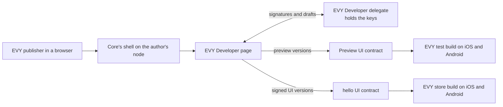

# 2.5 EVY Developer on Freenet

## Repositories

| Repository | Role | Work in this plan |
| --- | --- | --- |
| [evy](https://github.com/EVY-Platform/evy) | Modified | `web/` becomes EVY Developer. EVY Developer delegate in `freenet/delegates/developer/` and `evyctl developer import-key`. EVY test build with a "Scan preview" screen on iOS and Android |
| [freenet-appkit](https://github.com/glesage/freenet-appkit) | Used | Packaging CLI from 1.4 Application bundles |
| [freenet-core](https://github.com/freenet/freenet-core) | Used | Core's shell, website container and fdev |
| [freenet-stdlib](https://github.com/freenet/freenet-stdlib) | Used | TypeScript client and delegate interface |

## Purpose

EVY Developer is EVY's web authoring app, built from the React builder in [`web/`](https://github.com/EVY-Platform/evy/blob/dev/web/README.md). It reads UI contracts through Freenet and saves drafts in its delegate. Update the transport in [wsClient.ts](https://github.com/EVY-Platform/evy/blob/dev/web/app/api/wsClient.ts).

EVY Developer keeps the builder's [canvas](https://github.com/EVY-Platform/evy/blob/dev/web/app/components/CanvasViewport.tsx), [rows panel](https://github.com/EVY-Platform/evy/blob/dev/web/app/components/RowsPanel.tsx) and [configuration panel](https://github.com/EVY-Platform/evy/blob/dev/web/app/components/ConfigurationPanel.tsx). It ships as a website container signed by the EVY publisher. An author runs it in a browser through Core's shell on their own node. There it reads a service's UI contract from [The UI contract in 2.2 EVY UI contracts and publishing](02-ui-contracts.md#the-ui-contract), previews changes on the EVY test build on iOS and Android, and publishes signed UI versions. The signing key stays in a delegate, out of the page's reach.



In this plan's example, the hello UI contract holds version 4, with the guestbook from [2.4 SDUI data and actions](04-data-and-actions.md#resources-and-contracts). The EVY publisher turns the "Guestbook" button on the "Hello" page into a "Sign the guestbook" button below the greeting, previews it on Alice's iPhone and Bob's Android phone, and publishes it as version 5.

## The EVY Developer bundle

`bun run build` in `web/` bundles `app/main.tsx` and copies `index.html` and its assets into `web/dist/` ([build.ts](https://github.com/EVY-Platform/evy/blob/dev/web/dev/build.ts)). The website-container build uses relative asset paths, content hashes, hash navigation and Core's WebSocket endpoint.

| Change | Why |
| --- | --- |
| `index.html` loads its files by relative path, such as `./bundle-<hash>.js` | Core serves the page under `/v1/contract/web/<key>/` and rewrites only paths that start with `/./` ([path_handlers.rs](https://github.com/freenet/freenet-core/blob/main/crates/core/src/server/path_handlers.rs)) |
| The script name carries a content hash | Content hashes prevent reuse of stale assets when Core omits `Cache-Control`, as [Installing a copy in 1.4 Application bundles](../1-freenet-mobile-appkit/04-bundles.md#installing-a-copy) notes |
| The page keeps its place in the URL hash, `#/<flow>/<page>/<row>`, and posts each change to Core's shell as a `hash` message | Update [urlUtils.ts](https://github.com/EVY-Platform/evy/blob/dev/web/app/utils/urlUtils.ts) to use the hash. The shell copies it into the address bar, so a reload opens the same row ([shell_bridge.js](https://github.com/freenet/freenet-core/blob/main/crates/core/src/server/path_handlers/assets/shell_bridge.js)) |
| The page opens its WebSocket at `ws://<page host>/v1/contract/command` | Core's shell carries the socket and adds its token ([websocket_shim.js](https://github.com/freenet/freenet-core/blob/main/crates/core/src/server/path_handlers/assets/websocket_shim.js)), so the build uses the page host for its API endpoint |

```text
index.html                      # EVY Developer page
bundle-<hash>.js, globals.css   # the React app from web/app
logo.svg, favicon.ico           # assets from web/app/public
contracts/
  ui_contract.wasm              # the UI contract, used to create preview contracts
  developer_delegate.wasm       # EVY Developer delegate, built in freenet/
app_definition.json             # format from 1.4 Application bundles
contract-keys.json              # pinned UI contract keys, copied from types/freenet/
```

| Alias in `app_definition.json` | Kind | Setup | Use |
| --- | --- | --- | --- |
| `evy.ui` | contract | `none` | EVY Developer PUTs a preview UI contract the first time an author previews a service |
| `evy.developer` | delegate | `register` | Holds keys and drafts. EVY Developer registers it on first open, as [Setup in 1.4 Application bundles](../1-freenet-mobile-appkit/04-bundles.md#setup) describes |

The EVY publisher releases EVY Developer from an evy commit whose `types/schema/sdui/version.json` matches the newest store build, so its checks and version numbers match what phones can draw ([Reader compatibility in 2.2 EVY UI contracts and publishing](02-ui-contracts.md#reader-compatibility)). The EVY publisher publishes `web/dist/` with the packaging CLI from [Publishing and evidence in 1.4 Application bundles](../1-freenet-mobile-appkit/04-bundles.md#publishing-and-evidence) and `--key evy-publisher`. `evyctl key export-website evy-publisher` writes the key from [The EVY publisher key in 2.1 Hello EVY world](01-hello-evy-world.md#the-evy-publisher-key) to `~/.config/freenet/website-keys/evy-publisher.toml`, the file fdev reads ([website.rs](https://github.com/freenet/freenet-core/blob/main/crates/fdev/src/website.rs)). The pinned container Wasm is committed at `web/published-contract/web_container_contract.wasm`, so every release keeps one container key and one address.

Website releases use one publisher workspace and journal. Prepare and save the signed state, submit it and replay those bytes on retry. Each new website publication reserves a higher version under 1.4 Application bundles; service UI versions follow [Publishing a UI version in 2.2 EVY UI contracts and publishing](02-ui-contracts.md#publishing-a-ui-version).

freenet-stdlib's TypeScript client sends GET, PUT, UPDATE and SUBSCRIBE, and its `sendRequest` is private ([websocket-interface.ts](https://github.com/freenet/freenet-stdlib/blob/main/typescript/src/websocket-interface.ts)). This plan needs a public call in freenet-stdlib that sends `RegisterDelegate` and `ApplicationMessages` and returns the delegate's reply.

### The EVY Developer delegate

The delegate lives in `freenet/delegates/developer/`. Its parameters hold EVY Developer's container ID. Core tells a delegate which web app sent each message, as `MessageOrigin::WebApp(<container ID>)` ([delegate_interface.rs](https://github.com/freenet/freenet-stdlib/blob/main/rust/src/delegate_interface.rs)). The delegate answers page messages only when that ID is EVY Developer's.

| Message | Accepted from | What the delegate does |
| --- | --- | --- |
| `ImportPublisherKey { service, signing_key }` | A local client with no web-app origin, such as `evyctl` | Stores the service publisher key under `publisher:<service>` and replies with its verifying key |
| `ServiceKeys { service }` | EVY Developer | Replies with the publisher verifying key, if imported, and the preview verifying key. Creates the preview key on the first call |
| `SignUiVersion { service, target, document }` | EVY Developer | Checks the service and version, then signs as [The UI document in 2.2 EVY UI contracts and publishing](02-ui-contracts.md#the-ui-document) sets: with the publisher key for `target: store`, or the preview key for `target: preview`. Serializes the complete signed object as RFC 8785 canonical JSON with the canonical standard padded base64 signature, and replies with those exact signed bytes |
| `SaveDraft { service, draft }`, `LoadDraft { service }` | EVY Developer | Stores service drafts and restores them after app restarts ([Browser and native hosts in 1.3 Single-application host](../1-freenet-mobile-appkit/03-host.md#browser-and-native-hosts)) |

- Signing keys stay inside the delegate. Core encrypts its store with the node encryption key on the author's computer ([Keys in Freenet and River today in 1.5 Identity, keys and local protection](../1-freenet-mobile-appkit/05-identity.md#keys-in-freenet-and-river-today)).
- The author imports each service's key once per node, after the first open registers the delegate. `evyctl developer import-key --service hello --key evy-publisher` reads the key file `evyctl` signs with and sends `ImportPublisherKey` over the node's WebSocket API. Core gives a local client with no web-app token no origin ([delegates.rs](https://github.com/freenet/freenet-core/blob/main/crates/core/src/contract/executor/runtime/delegates.rs)), so the local client sends the key directly to the delegate.
- Core issues app tokens to local processes ([Trusted calls in 1.3 Single-application host](../1-freenet-mobile-appkit/03-host.md#trusted-calls)). Until [Session admission #5264](https://github.com/freenet/freenet-core/issues/5264) lands, another program on the author's computer could pose as EVY Developer. For `target: store`, the delegate therefore asks the author to confirm with Core's `RequestUserInput` prompt, which shows the service, the version and the document digest. The open prompt issues are in [1.3 Single-application host](../1-freenet-mobile-appkit/03-host.md#freenet-issues-being-worked-on-that-are-required).
- The delegate keeps the highest version it signed for each service and target, and refuses to sign another document at that version or below.
- A new delegate build gets a new delegate key ([Component identity and re-keying in 1.7 Upgrades and migration](../1-freenet-mobile-appkit/07-migration.md#component-identity-and-re-keying)). EVY Developer moves drafts with freenet-migrate, as [Delegate secret export and import in 1.7 Upgrades and migration](../1-freenet-mobile-appkit/07-migration.md#delegate-secret-export-and-import) describes. The author imports the publisher key again and shares a new preview code.

## Opening a service

The EVY publisher opens `http://127.0.0.1:7509/v1/contract/web/<EVY Developer key>/` in a browser.

1. EVY Developer registers its delegate if needed. While the delegate holds no publisher key, the page shows the `evyctl developer import-key` command.
2. The author picks `hello` from the service list or enters a UI contract key. The list holds `home` and every service in the home document's `services` field, with keys derived from `contract-keys.json` as [The home service in 2.2 EVY UI contracts and publishing](02-ui-contracts.md#the-home-service) describes. A service whose publisher key the delegate lacks opens read-only.
3. The page reads the UI contract with freenet-stdlib's TypeScript client: `get` for the current state, then `subscribe` for later versions.
4. It splits the document's `flows` into flat records with `serverFlowsToCollections` ([flowEntities.ts](https://github.com/EVY-Platform/evy/blob/dev/web/app/utils/flowEntities.ts)) and hands them to the builder's [`AppProvider`](https://github.com/EVY-Platform/evy/blob/dev/web/app/state/AppProvider.tsx). A saved draft for `hello` opens instead when its base UI contract key and `(version, state_hash)` match the verified live document. The page retains the exact signed live bytes and applies the ordering in [The UI contract in 2.2 EVY UI contracts and publishing](02-ui-contracts.md#the-ui-contract) to GETs and subscription notifications.

| Builder input | Source or operation |
| --- | --- |
| Flows, pages and rows | The UI document's `flows`, split into flat records |
| Resources for bindings | The document's `resources` map and the [shared catalogue in 2.4 SDUI data and actions](04-data-and-actions.md#resources-and-contracts). The builder offers supported adapters, fields and operations, and checks source dependencies |
| Formatters | `STANDARD_FORMATTERS` from [standardFormatters.ts](https://github.com/EVY-Platform/evy/blob/dev/types/standardFormatters.ts), built into the bundle |
| Saving | `SaveDraft` to the delegate after each edit, at most once a second |
| Changes by others | Subscription update notifications |

When a higher `(version, state_hash)` arrives from another author or from `evyctl ui publish`, EVY Developer opens it at once if the draft has no edits. An edited draft keeps its base document identity and shows "Hello has changed since this draft", with "Open live document" and "Keep my draft" buttons. A higher hash at the same version follows the same rules. Publishing a kept draft prepares a new version above the verified live version. Saved drafts and pending publications retain their base and signed document identities across reloads.

## Previewing on a phone

Each author previews into their own preview UI contract for each service. It runs the code of [The UI contract in 2.2 EVY UI contracts and publishing](02-ui-contracts.md#the-ui-contract) with the delegate's preview verifying key followed by `hello` as parameters, so its key differs from the hello UI contract's key.

1. The author presses Preview. EVY Developer assembles and validates the document as in steps 1 and 2 of [Publishing from EVY Developer](#publishing-from-evy-developer), at the preview contract's next version.
2. The delegate signs it automatically with the preview key.
3. The first preview PUTs `contracts/ui_contract.wasm` with the preview parameters and the signed state. Later previews send an UPDATE.
4. The page shows a QR code holding `evy-preview://hello/<preview contract key>`. The code stays the same for every later preview of `hello` from this delegate.
5. Alice taps "Scan preview" in the EVY test build on her iPhone, and Bob does the same on his Android phone. The test build opens the key only when the contract's code hash is the UI contract's. It then reads the preview as the store build reads a UI contract ([Reading a UI contract in 2.3 Native SDUI readers](03-readers.md#reading-a-ui-contract)).

The EVY publisher drags the "Guestbook" button below the greeting and relabels it "Sign the guestbook". Its `tap` trigger keeps the [`navigate`](https://github.com/EVY-Platform/evy/blob/dev/docs/evy/actions.md#action-expression-grammar) action that opens the guestbook page. Both phones show the button. The publisher sets the button's `style` to `primary` and presses Preview again. Both phones update without a new scan.

| | EVY store build | EVY test build |
| --- | --- | --- |
| Built by | The workflow in [Builds from GitHub in 2.3 Native SDUI readers](03-readers.md#builds-from-github) | The same workflow, run with `variant: test` |
| App ID | The iOS bundle ID, `evy.evy`, and the Android application ID | The same IDs with a `.preview` suffix, so it installs beside the store build |
| Reaches | EVY users, through the app records for the store IDs | Authors only, through separate TestFlight and Play internal testing app records for the `.preview` IDs |
| Opens | The UI contract keys pinned in the build | Those keys, and preview keys from a scanned code |
| Scanner | None | A native "Scan preview" button above the home page, with AVFoundation on iOS and ML Kit barcode scanning on Android, behind the camera permission on each |

Store builds open only their pinned keys. Test builds also open scanned preview keys. The hello UI contract accepts only the publisher key in its parameters; preview signatures apply only to the preview contract.

- The test build checks a preview's `min_reader_version` and `schema_version` as the store build does ([Reader compatibility in 2.2 EVY UI contracts and publishing](02-ui-contracts.md#reader-compatibility)).
- A preview reads and writes the data contracts named in its own `resources` map. The hello preview keeps the store version's guestbook. For tests that need isolated records, the preview maps resources to test contracts with the preview key in their parameters.
  Shared purchase, message, address and file bindings resolve through those test source bindings. Purchase creation derives test seller and buyer context from the test listing, and payment previews use the test payment service. Validation checks the complete dependency graph before preview publication.

## Publishing from EVY Developer

Publishing runs the same checks as `evyctl ui publish` in [Publishing a UI version in 2.2 EVY UI contracts and publishing](02-ui-contracts.md#publishing-a-ui-version). The EVY publisher presses Publish on the hello flow:

| Step | What EVY Developer does |
| --- | --- |
| 1. Assemble | Rebuilds nested flows from the draft with `assembleFlatFlows`, which moves from [`web/e2e/e2e.pw.ts`](https://github.com/EVY-Platform/evy/blob/dev/web/e2e/e2e.pw.ts) into `web/app/utils/` and keeps each flow's `submits`. Sets `service`, `resources` and a `version` one above the live version. Sets `schema_version` and `min_reader_version` from the bundle's `version.json`.<br>Returns the hello UI document at version 5 |
| 2. Validate | Calls `scripts/validate-ui-document.ts`, the script that step 1 of `evyctl ui publish` runs, built into the bundle from the same commit. It runs `validateUiFlow` in [validators.ts](https://github.com/EVY-Platform/evy/blob/dev/types/validators.ts), resource, action and identifier checks, and the 512 KiB cap. An error blocks publishing and shows on the row at its JSON path |
| 3. Sign | Sends `SignUiVersion` with `target: store`. The author confirms in Core's prompt, and the delegate signs with the EVY publisher key.<br>Returns the signed state for version 5 |
| 4. Archive | For a service using attribution, submits the signed state through the attribution service's archive page and verifies its durable receipt, as [Archiving before publication in 2.8 Attribution](08-attribution.md#archiving-before-publication) specifies. Keeps the pending signed bytes and receipt in the browser's IndexedDB so a reload resumes the same publication |
| 5. Update | Sends the saved signed state as an UPDATE. The hello UI contract validates the signature and selects the higher `(version, state_hash)` |
| 6. Read back | GETs the contract, verifies its identity, service and signature, and compares the exact signed bytes and `(version, state_hash)` with the saved state. An exact match completes publication. A verified absent state or lower tuple allows replay of step 5; a timeout retains the pending publication for readback and retry. A higher tuple, including a higher hash at the same version, stops the attempt and shows that another document won. Keeps the signed bytes and any archive receipt as evidence. For a service using attribution, exact readback permits signing and submitting the publication confirmation through the archive page |

- A retry resends the same signed bytes. This delegate signs one document per service, target and version. Publications signed through another node or `evyctl` converge under the shared `(version, state_hash)` ordering.
- The page reaches the author's node through Core's shell, so step 6 confirms that this node holds version 5. The archive page opens in a separate tab through the service-page route used by [Contributor keys in 2.8 Attribution](08-attribution.md#contributor-keys). Browser messages transfer the signed document and receipt between tabs after checking both origins and the pending publication's identity. The archive page calls its own service. The store builds on Alice's iPhone and Bob's Android phone then show "Sign the guestbook" while both apps keep running.

## Acceptance

- EVY Developer builds from `web/`, publishes through the packaging CLI as a website container signed by the EVY publisher key, and keeps one container key across two releases prepared within the same second. Their website versions increase, and a timeout retry replays the exact prepared signed state.
- In a browser, EVY Developer opens through Core's shell on the author's node, and a reload keeps the open row and the draft.
- `evyctl developer import-key` stores the key. No delegate reply carries a signing key. The delegate refuses `ImportPublisherKey` from any web app and refuses page messages from any app other than EVY Developer.
- A store signature waits for the author's confirmation in Core's prompt. A retried update resends the same bytes, and the delegate refuses a second document at the same version.
- A document published with `evyctl ui publish` shows in EVY Developer without a reload when its tuple is higher. "Keep my draft" keeps the author's edits and base document identity. Equal-version, different-hash fixtures follow the same rules after reload.
- Readback of a higher-hash document at the pending publication's version stops retry and reports the winner. Exact readback completes publication; a lower tuple retries the same signed bytes. Preview and store readers use the same hash-ordering fixtures.
- For a service using attribution, publishing waits for the archive receipt. An archive outage or a reload keeps the pending signed bytes; retry publishes those bytes once the receipt verifies. Archive-page messages with a different origin or document identity fail validation.
- The validation fixtures from [Acceptance in 2.2 EVY UI contracts and publishing](02-ui-contracts.md#acceptance) fail in EVY Developer at the same JSON paths as in `evyctl ui publish`.
- On iOS and Android, the EVY test build opens a preview from its QR code and shows each later preview without a new scan. The store build has no scanner, and a preview signature never updates the hello UI contract.
- On iOS and Android, after the EVY publisher publishes version 5, Alice's iPhone and Bob's Android phone show "Sign the guestbook" while both apps keep running.
- Playwright tests in `web/integration/` cover open, edit, preview and publish against a mock node, using [mockWebSocket.ts](https://github.com/EVY-Platform/evy/blob/dev/web/integration/mockWebSocket.ts) for the mock transport.
