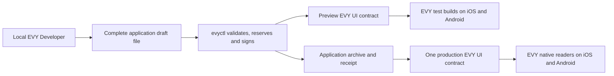

# 2.5 EVY authoring and publishing

## Repositories

| Repository | Role | Work in this plan |
| --- | --- | --- |
| [evy](https://github.com/EVY-Platform/evy) | Modified | Local EVY Developer in `web/`, draft import/export, application document validation, publisher journal in `evyctl`, and matching iOS and Android preview builds |
| [freenet-core](https://github.com/freenet/freenet-core) | Used | Publisher's node and application UI contract |
| [freenet-stdlib](https://github.com/freenet/freenet-stdlib) | Used | Rust client for publication and preview |

## Purpose

Use EVY Developer as a local editor for the complete EVY application document. The author edits Home, Hello and Marketplace flows in one workspace, exports a draft to `evyctl`, previews it on iOS and Android, and publishes a signed EVY application version.

Keep the React builder's [canvas](https://github.com/EVY-Platform/evy/blob/d0fb7e6475f1dfc5c74325e37d4e92aed88d84ed/web/app/components/CanvasViewport.tsx), [rows panel](https://github.com/EVY-Platform/evy/blob/d0fb7e6475f1dfc5c74325e37d4e92aed88d84ed/web/app/components/RowsPanel.tsx) and [configuration panel](https://github.com/EVY-Platform/evy/blob/d0fb7e6475f1dfc5c74325e37d4e92aed88d84ed/web/app/components/ConfigurationPanel.tsx). Run the editor from `web/` on the author's computer. Author workspaces hold contributor keys and drafts. The authorized publisher workspace holds publication authority, its node and the release journal.

## Local editor and draft files

Load a complete application document or a local feature source tree assembled into that document. The editor opens a flow/page/row and preserves the selected location in its local URL. Draft persistence records the base application key, version and digest together with edits.

Use `assembleFlatFlows` to rebuild nested flows and their submits. Save drafts in browser storage with explicit file export/import. The exported file is the durable handoff to the publisher tool. A newer base version is imported as a complete signed document; the author chooses to rebase or retain the current draft and base identity.

Validation uses `scripts/validate-ui-document.ts` and the reader schemas from [2.2 EVY UI contracts and publishing](02-ui-contracts.md#reader-compatibility). Editor and CLI show the same JSON-path errors for rows, actions, internal routes, resource adapters and size.

## Publisher workspace

`evyctl` uses the EVY publisher key from [2.1 Hello EVY world](01-hello-evy-world.md#the-evy-publisher-key). Store it in the author's protected local key storage and use explicit signing commands. The editor exchanges document files and signed public results with the CLI.

A workspace has one application version allocator and publication journal. The journal stores the application key, base tuple, reserved version, exact signed bytes, digest, archive receipt, submission state and readback evidence. Write and sync the journal before sending bytes. Serialize local jobs and reconcile network state before reserving another application version. Protect local key files, journal and draft directories according to their contents and include them in the publisher's recovery procedure.

## Workspace protection and recovery

| Workspace | Credentials and files | Recovery |
| --- | --- | --- |
| Contributor | Contributor signing key, drafts and base release identity; protected OS credential store or encrypted key file. Private draft directories use owner-only access. | Encrypted credential/draft backup; restore key or use the contributor identity-recovery protocol. Proposal mode signs contributor statements. |
| Publisher | Publisher key, exact signed bytes, durable reservation journal, archive receipts and confirmations; one workspace per publication stream. | Encrypted key/journal/prepared-state backup with tested recovery to the same application identity. Transfer the entire workspace when operators move machines. |

Local and CI publication jobs share an exclusive stream lock and one authoritative journal. Reconcile pending attempts and verified network state before reservation after a workspace move. Signer access is explicit; editor files and public receipts carry their declared data. On iOS and Android, preview tests verify separate test identities and permission scopes.

## Opening the application

1. Export the live signed EVY application document through `evyctl ui get` or load its saved verified copy.
2. Import it into the local editor and select Home, Hello or Marketplace from its flow tree.
3. Edit a draft while retaining its base application release identity.
4. Export the complete draft for validation, preview or publication.

A change to the guestbook button inside Hello becomes a new EVY application version containing the updated Hello flow and the retained Home/Marketplace flows.

## Previewing on a phone

Create a preview UI contract with a dedicated preview verifying key and UTF-8 `evy` parameters. It runs the production UI contract code and the complete application document schema. Its identity differs from the production application key.

`evyctl ui preview` validates and signs the complete draft, publishes it under the preview key and exports a QR descriptor containing the contract key, publisher key and schema/reader requirements. Matching iOS and Android preview builds have separate application IDs, node stores and keys. Their explicit Scan preview screen admits the descriptor and checks the supported UI code and parameter identity before reading it.

The preview readers subscribe to that complete application document. Preview resources use declared test keys, test contracts and test payment endpoints. Production builds pin the production application identity.

## Publishing the application

| Step | Publisher tool behavior |
| --- | --- |
| Validate | Validate the complete document against the selected reader/schema version, internal routes, resource context, policy and 512 KiB cap. |
| Reserve | Reconcile the live application tuple and journal, then durably reserve one higher application version. |
| Sign and save | Canonicalize and sign with the production publisher key. Atomically save the exact bytes, version and digest before submission. |
| Archive | For every payment-capable or attributed release, archive the exact signed policy first, then the complete signed document and verify the durable receipt from [2.13 Release archive and policy evidence](13-release-archive-and-policy-evidence.md#archiving-before-publication). |
| Submit | PUT the initial state or UPDATE the one production EVY UI contract with the saved bytes. |
| Read back | Fetch through an independent node and verify identity, signature and exact bytes. |
| Confirm | Save readback evidence and issue and durably journal the signed publication confirmation required by release evidence. |

A storage failure keeps the operation recoverable before dispatch. An archive outage keeps the signed document pending. An uncertain submission retries the saved bytes after readback. A higher competing tuple stops replay and preserves both documents as evidence. A reserved version names one immutable signed document in the local journal.

## Backend requests

The publisher CLI calls the policy-declared HTTPS archive, contributor and payout endpoints directly. It verifies the EVY policy signature, endpoint audience, operation identity and signed response. Sign-in uses a fresh service challenge, exact audience and expiry, consumed once by the receiving backend.

The archive receipt covers the full application UI identity, version, digest and policy reference. Save and verify it before Freenet submission. Interrupted requests resume from the journal using the same signed operation; sign-in retries obtain a fresh authentication challenge.

Contributor keys are protected local author credentials. Contributor statements, proposals, reviews and estimates are signed in that workspace and sent through the protocols in [2.8 Attribution](08-attribution.md). Payout identity follows [2.9 Remuneration and payouts](09-remuneration.md). Credential recovery uses the author's own key backup and the relevant backend's identity-recovery procedure.

## Acceptance

- The local editor imports and exports complete EVY application documents and preserves draft/base identity across reload and file round-trip.
- Editing one feature publishes a new complete EVY version with all internal routes and other flows intact.
- Publisher private keys remain in protected local credential storage. Document and journal outputs contain only their declared signed public material.
- Editor and CLI validation return matching paths for malformed rows, internal routes, adapters and policies.
- On iOS and Android, preview builds verify the explicit test application descriptor and receive later complete preview versions. Production builds use the pinned production identity and resource endpoints.
- Interrupt before signing, after journal persistence, archive receipt, submission and readback. Resume with the saved version/bytes and obtain one verified application publication.
- Concurrent jobs serialize version reservation. A higher network winner stops replay; an exact saved-byte readback completes the operation.
- Archive failure, invalid receipt, altered audience/digest and expired sign-in challenge preserve the journal and fail the affected operation.
- On iOS and Android, both running production readers receive the published guestbook-button change in the complete EVY document.
- Local editor integration fixtures cover import, edit, export and validation. Publisher fixtures use the application contract and an independent readback node.
