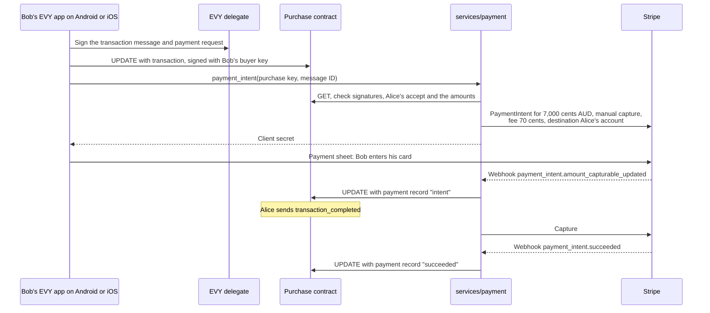

# 2.6 Payments

## Repositories

| Repository | Role | Work in this plan |
| --- | --- | --- |
| [evy](https://github.com/EVY-Platform/evy) | Modified | `services/payment`: EVY's Stripe code, webhooks, seller onboarding and payment records. `evy-txn-sig-v2` in `types/`. Shared purchase and message schemas and adapters for the SwiftUI and Compose readers. The hello test item. The items contract and the common purchase contract in `freenet/contracts/`. The EVY delegate signs purchases, participant messages and payment requests |
| [freenet-appkit](https://github.com/glesage/freenet-appkit) | Used | Swift package and Kotlin library in the EVY app |
| [freenet-core](https://github.com/freenet/freenet-core) | Used | The payment service's node |
| [freenet-stdlib](https://github.com/freenet/freenet-stdlib) | Used | [TypeScript client](https://github.com/freenet/freenet-stdlib/blob/main/typescript/src/websocket-interface.ts) for the payment service's node |
| [stripe-ios](https://github.com/stripe/stripe-ios), [stripe-android](https://github.com/stripe/stripe-android) | Used | Payment sheets on iOS and Android |

## Purpose

EVY on iOS and Android takes Stripe payments for purchases stored in Freenet. Bob pays Alice 70 dollars for her skateboard in Stripe's native payment sheet on iOS and Android. The payment service writes a signed payment record into the purchase contract. Alice receives 69.30 dollars and EVY holds the 1% contributor fee of 0.70 dollars.

Implement `services/payment` as a TypeScript service on Bun with Postgres, using EVY's [payment procedures](https://github.com/EVY-Platform/evy/blob/dev/api/src/procedures/payments.ts) and [payment orchestration](https://github.com/EVY-Platform/evy/blob/dev/docs/services/marketplace/data.md#payment-orchestration). `payment_intent` places a hold, `payment_capture` captures it and `payment_cancel` releases it. Purchase messages trigger these operations, and each purchase has its own contract. The tests use one fixed-price item in the hello service from [2.1 Hello EVY world](01-hello-evy-world.md): Alice's skateboard for 70 dollars (AUD).

## The purchase contract

Hello, Marketplace and Home use the common `evy.purchases` and `evy.messages` interfaces in [Shared EVY catalogue in 2.4 SDUI data and actions](04-data-and-actions.md#shared-evy-catalogue). Each sale has one purchase instance, which every application displaying that sale references. The purchase contract implementation, message schemas, parameter codec and payment rules are shared across EVY services.

| Contract | Parameters | Holds | Writers |
| --- | --- | --- | --- |
| Items contract | The service publisher key and the service ID, for example `hello`, laid out as for the guestbook in 2.4 SDUI data and actions | One entry per item, signed by its seller: EVY's item fields and `purchases`, the keys of the item's purchase contracts | Each seller writes their own items. Buyers add their purchase references. Seller cleanup retains captured and refunded sale references for the listing's lifetime and removes canceled references after terminal cancellation is verified. An item holds at most 32 purchase keys, including retained sale references |
| Purchase contract | Seller key (32 bytes), buyer key (32 bytes) and purchase ID (16 UUID bytes), concatenated in that order | The purchase record below | Alice, Bob and the payment service |

- Hello version 6 adds the test item. Its UI document maps `hello.items` to the items contract ([Resources and contracts in 2.4 SDUI data and actions](04-data-and-actions.md#resources-and-contracts)), and Alice adds the skateboard with a `create` action.
- The seller key is Alice's EVY key for the originating service. Bob's EVY delegate derives a buyer key with that service and `scope = purchase:<purchase ID>`, so each purchase has its own key ([The EVY delegate in 2.4 SDUI data and actions](04-data-and-actions.md#the-evy-delegate)). The iOS and Android apps create purchase IDs as UUIDs, following EVY's message-ID generation ([EVY+Mutations.swift](https://github.com/EVY-Platform/evy/blob/dev/ios/evy/Core/EVY+Mutations.swift)).
- The shared purchase adapter PUTs the purchase contract and adds its key to the skateboard's `purchases` through the signed reference operation below. Alice's app subscribes to her items, so it finds the purchase and subscribes to it. Home can resolve that same reference through its own binding to Marketplace items.
- Readers derive item availability from verified linked purchases, using [Item availability in 2.7 EVY Marketplace](07-marketplace.md#item-availability). The hello test item uses the same rules. The payment service's purchase updates feed this derived status while either participant's app is closed.
- Each signature covers a domain prefix and the RFC 8785 JSON, as in [The hello contract in 2.1 Hello EVY world](01-hello-evy-world.md#the-hello-contract).

```jsonc
{
  "purchase": {                                          // what Bob buys
    "resource": "hello.items",                           // EVY resource ref of the item
    "fk": "4f1c6a0e-2b7d-4c1e-9a55-0d8e3f6b2a91",        // item ID, EVY's fk
    // ui_version and ui_digest are added by 2.9 Remuneration and payouts
    "type": "pickup",                                    // EVY's transfer type
    "amount_cents": 7000,                                // 70.00 dollars, the item's price
    "currency": "AUD",                                   // the one currency EVY's Stripe code takes
    "fee_cents": 70,                                     // 1% contributor fee, rounded half up
    "signature": "pX3a...9Q=="                           // Bob's buyer key, signed under evy.purchase/1
  },
  "messages": [                                          // each written once, with id, parent_message_id,
                                                         // created_at, data and its author's signature
    { "value": "pending", "by": "buyer" },               // Bob asks to buy
    { "value": "accept", "by": "seller" },               // Alice agrees to the purchase above
    { "value": "transaction", "by": "buyer" },           // Bob pays. data.signature holds his payment request
    { "value": "transaction_completed", "by": "seller" } // Alice confirms the handover
  ],
  "payment": { "status": "succeeded", "...": "..." },    // the payment record, see The payment record
  "status": "sold"                                       // available, pickup_pending, sold or refunded
}
```

The contract checks each message's author and requires its parent message first. It computes `status` with EVY's purchase status machine ([purchase.ts](https://github.com/EVY-Platform/evy/blob/dev/services/marketplace/src/purchase.ts)), following [Service rules in 2.4 SDUI data and actions](04-data-and-actions.md#service-rules). The payment service handles purchase messages using EVY's payment orchestration ([payments.ts](https://github.com/EVY-Platform/evy/blob/dev/services/marketplace/src/payments.ts)).

| Message | Author | Status after it | The payment service |
| --- | --- | --- | --- |
| `pending` | Bob | `available` | Does nothing |
| `accept` | Alice | `pickup_pending` | Does nothing |
| `reject` | Alice | `available` | Does nothing |
| `transaction` | Bob | `pickup_pending` | Creates the PaymentIntent when Bob's app calls `payment_intent` |
| `transaction_completed` | Alice | `sold`, once the payment record is `succeeded` | Captures the payment (`payment_capture`) |
| `transaction_rejected` | Alice | `available` | Cancels the PaymentIntent (`payment_cancel`) |
| `cancel` | Alice or Bob, before `sold` | `available` | Cancels the PaymentIntent if there is one |

Captured-payment evidence (`succeeded` or `refunded`) wins over a concurrent `cancel`, and a `cancel` wins over a concurrent `accept`, so every peer merges to the same status. A `failed` payment record reports a failed card attempt; an accepted purchase stays `pickup_pending` while Bob can retry. A `canceled` payment record or a valid purchase cancellation sets `available` again. A partial buyer refund retains the captured payment's `succeeded` status and the completed purchase's `sold` status. A full buyer refund sets both statuses to `refunded`, as in [Refunds](#refunds). Each author writes at most 16 messages per purchase.

### Shared purchase interface

`purchase/1` and `purchase-messages/1` run in the shared iOS and Android reader layer. The signed UI bindings name the supported purchase code hash and source items binding. The adapters expose collections to existing EVY bindings and route actions by each row's retained source identity.

| Operation | Shared behavior |
| --- | --- |
| Discover | Follow the verified listing's bounded purchase reference set. Read each referenced instance and check its code hash, exact parameters, originating resource, item ID, seller and signed purchase. Home and Marketplace resolve the same instances |
| Create purchase | `create(evy.purchases, ...)` takes the source item reference, creates the purchase UUID, obtains the scoped buyer keys and derives the contract key with the common parameter codec. Signs the purchase and initial `pending` message and PUTs the valid initial state. The projected row's `id` is the contract key; it also exposes `purchase_id`, the originating resource and item ID |
| Link purchase | Send a buyer-signed `evy.purchase-ref/1` operation to the items contract, containing the originating resource, item ID, seller and buyer keys, purchase ID, supported purchase code hash and derived contract key. The items contract checks the buyer signature, seller against the item author, parameter derivation and reference cap. It merges the reference set separately from seller-written item fields. Repeating the operation retains one reference |
| Resume creation | Keep the creation and link steps with the pending operation's source context. A retry reuses the same UUID, keys, parameters and signed bytes and completes the remaining step. The row stays "Sending" until the purchase and its reference are visible locally under [Offline writes in 2.4 SDUI data and actions](04-data-and-actions.md#offline-writes) |
| Read purchase | Project `purchase`, participant parameters, derived `status` and the latest verified payment into one purchase row. Keep `ui_version` and `ui_digest` from the signed originating purchase when [2.9 Remuneration and payouts](09-remuneration.md) adds them |
| Read messages | Project each nested message into `evy.messages`, retaining its `purchase_key`, message ID, parent ID, author role, timestamp and data. Subscription updates refresh this purchase's messages |
| Write message | `create(evy.messages, ...)` names `purchase_key` and the message it answers. The adapter validates the permitted transition, resolves the buyer scope or seller service key and asks the delegate to sign under the participant-message domain. It UPDATEs that purchase with the message delta. Messages are immutable once signed |
| Pay | A permitted `transaction` message triggers the payment request and native payment sheet from [Paying on a phone](#paying-on-a-phone). The request retains the same purchase key and authorization message ID when Home and Marketplace display it |
| Update purchase view | Participant changes such as acceptance, cancellation and handover create messages through the message adapter. The contract computes purchase status and verifies payment-service records |

The purchase resource and item reference identify the originating service. Buyer signatures, payment authorization and seller onboarding use that service context even when another application's flow initiates a participant action. Creating a purchase uses the originating service's purchase flow and retained UI document; Home opens that flow before creation. The reader supplies the source context from verified state. Participant messages sign `evy.message/1 <base58 purchase contract key>`, a newline and the RFC 8785 canonical JSON of the other message fields. `SignOperation` from [The EVY delegate in 2.4 SDUI data and actions](04-data-and-actions.md#the-evy-delegate) selects the catalogue's purchase-creation, participant-message or purchase-reference schema, validates the target and actor, and saves the signed bytes with their replay context.

Collection fixtures cover seller item edits interleaved with buyer reference additions, repeated creation and interrupted linking. Parameter and signing fixtures give the same purchase key and payloads in Rust, Swift, Kotlin and the payment service.

## Paying on a phone



- The shared message adapter in the SwiftUI and Compose readers runs this step for a `create(evy.messages, ...)` action whose data holds EVY's `payment_signature(...)` marker ([EVYPaymentSignature.swift](https://github.com/EVY-Platform/evy/blob/dev/ios/evy/Utils/EVYPaymentSignature.swift)). The EVY delegate fills in the message ID and signs in the verified purchase's originating service and buyer scope. The reader calls `payment_intent` over JSON-RPC 2.0 on a WebSocket, using EVY's service transport ([wsServer.ts](https://github.com/EVY-Platform/evy/blob/dev/types/wsServer.ts)), with the call signed by Bob's buyer key.
- Stripe's payment sheet runs card entry and 3-D Secure in native screens. stripe-ios needs iOS 15 or later and stripe-android API 23 or later, within EVY's iOS 17 and Android 9 floors from [The EVY app on iOS and Android in 2.1 Hello EVY world](01-hello-evy-world.md#the-evy-app-on-ios-and-android).
- The service keeps one PaymentIntent per purchase. The purchase key and message ID form Stripe's idempotency key, and Postgres maps the purchase key to the PaymentIntent ID, using the mapping pattern in Marketplace's `item_payment_intents` table ([paymentIntents.ts](https://github.com/EVY-Platform/evy/blob/dev/services/marketplace/src/paymentIntents.ts)). A repeated call returns the same client secret.
- The service subscribes to each purchase it charges and sends each payment record from its own node, so the purchase updates even when Bob closes EVY. Its Freenet client allows one request awaiting a reply per connection across all purchase contracts and request types, as [Matching replies to requests in 1.2 Embedded node and mobile SDK](../1-freenet-mobile-appkit/02-sdk.md#matching-replies-to-requests) requires. Subscription updates flow while the request awaits its reply. Parallel requests require tested request-ID coverage in every success and error reply from the pinned Core and stdlib. A card hold usually lasts 7 days, so if Alice never confirms, Stripe cancels the hold ([place a hold](https://docs.stripe.com/payments/place-a-hold-on-a-payment-method)) and the record becomes `canceled`.

### Retrying a card payment

After a declined card attempt, Stripe returns the PaymentIntent to `requires_payment_method`, so Bob can choose to try again ([PaymentIntent lifecycle](https://docs.stripe.com/payments/paymentintents/lifecycle)). Each card confirmation starts with Bob's action in the native payment sheet on iOS and Android. The purchase keeps Alice's acceptance, the agreed amount and fee, Bob's buyer key and the signed `transaction` message.

| Step | What runs on retry |
| --- | --- |
| 1. Choose | Bob taps "Try again". EVY reopens the payment sheet for the purchase. |
| 2. Resume | The reader calls `payment_intent` with the original purchase key and authorization message ID. The service checks the purchase's current acceptance and cancellation state and Stripe's current PaymentIntent. For an accepted purchase with a retryable PaymentIntent, it returns that intent's client secret. |
| 3. Confirm | Bob enters or selects a card and confirms another attempt on the same PaymentIntent. Stripe runs 3-D Secure when required. |
| 4. Hold | After successful authorization, the service publishes a higher-revision `intent` record. The funds are held and the purchase stays `pickup_pending`. |
| 5. Capture | Alice confirms the handover. The service captures once and publishes a higher-revision `succeeded` record. The purchase becomes `sold`. |

The payment-record sequence is `failed → intent → succeeded`. Repeated declines produce the latest failed-attempt details with increasing revisions when those details change. A retry uses the original transaction message and payment request; it keeps the purchase's message count unchanged. The service offers retry while the purchase remains accepted and the PaymentIntent permits another confirmation. Captured payments follow [Refunds](#refunds), and canceled purchases return to the purchase flow.

## The payment record

Each ledger row retains EVY's transaction signature trail. It hashes the amount, currency, authorizing message, time, provider and card's last 4 digits with SHA-256 ([transaction-signature-trail.md](https://github.com/EVY-Platform/evy/blob/dev/docs/plans/transaction-signature-trail.md), [paymentSignature.ts](https://github.com/EVY-Platform/evy/blob/dev/types/paymentSignature.ts)). This plan adds signed buyer authorization and payment-service evidence:

1. Bob's `transaction` message carries his payment request in `data.signature`, under the scheme `evy-txn-sig-v2`. Its canonical string holds the amount, currency, message ID, `created_at`, provider and purchase contract key. The EVY delegate signs its hash with Bob's buyer key.
2. After a verified Stripe webhook, the payment service reads the current Stripe payment and charge state, writes a changed payment record with the current card's last 4 digits, and signs it with the payment service key under the prefix `evy.payment/1`.
3. The EVY publisher key from [The EVY publisher key in 2.1 Hello EVY world](01-hello-evy-world.md#the-evy-publisher-key) certifies each payment service signing key. The purchase contract's code holds the publisher's verifying key and checks that certificate.

```jsonc
{
  "purchase": "7HqK...",                        // purchase contract key
  "authorization_message_id": "b2e0...",        // Bob's transaction message, EVY's field name
  "request_hash": "3b9e...",                    // hash of Bob's evy-txn-sig-v2 payment request
  "status": "succeeded",                        // intent, succeeded, failed, canceled or refunded
  "amount_cents": 7000,                         // 70.00 dollars
  "currency": "AUD",                            // matches the purchase
  "fee_cents": 70,                              // application fee EVY holds for contributors
  "refunded_cents": 0,                          // cumulative successful buyer refunds
  "fee_refunded_cents": 0,                      // cumulative application fee returned by Stripe
  "payment_method_last_4_characters": "4242",   // from Stripe's charge, EVY's field name
  "revision": 2,                                // rises with each change, the highest wins
  "signer": "Rk9v...",                          // payment service verifying key
  "signer_certificate": "c2ln...",              // EVY publisher key's signature over signer
  "signature": "MEUC..."                        // payment service key over every field above
}
```

The service checks webhooks with EVY's existing handler ([stripeWebhookHttp.ts](https://github.com/EVY-Platform/evy/blob/dev/api/src/shared/stripeWebhookHttp.ts)). It handles `payment_intent.amount_capturable_updated`, `payment_intent.succeeded`, `payment_intent.payment_failed`, `payment_intent.canceled`, `charge.refunded`, `refund.created`, `refund.updated`, `refund.failed`, `application_fee.created`, `application_fee.refunded` and `application_fee.refund.updated` by reading the current PaymentIntent, charge, refunds and application fee from Stripe. Application-fee events map back to the purchase through the saved charge and fee IDs ([Stripe event types](https://docs.stripe.com/api/events/types)). Stripe can deliver duplicate events and events out of order ([webhook delivery](https://docs.stripe.com/webhooks#event-ordering)). Each event starts a reconciliation of current state.

| Current Stripe evidence | Signed payment status |
| --- | --- |
| A declined attempt awaiting another payment method | `failed` |
| Authorized funds awaiting manual capture | `intent` |
| Captured funds, including a partial buyer refund | `succeeded`, with current cumulative `refunded_cents` and `fee_refunded_cents` |
| Canceled PaymentIntent | `canceled` |
| A captured payment whose successful buyer refunds equal `amount_cents` | `refunded`, with current cumulative `refunded_cents` and `fee_refunded_cents` |

The payment service sums successful buyer refund objects for `refunded_cents`. Pending and failed refund requests retain the prior confirmed total. It reads `fee_refunded_cents` from the matching [Application Fee object's `amount_refunded`](https://docs.stripe.com/api/application_fees/object), independently of the buyer total. A separate fee refund can change that field while the buyer total stays unchanged. Changed totals produce a new signed revision even when the status stays `succeeded` or `refunded`.

Both totals are nonnegative integer cents, with `refunded_cents <= amount_cents` and `fee_refunded_cents <= fee_cents`. The purchase contract checks these bounds and the status rules on each signed record. Pre-capture records have zero refund totals. Captured `succeeded` records have `refunded_cents < amount_cents`; `refunded` records have `refunded_cents == amount_cents`. A zero fee has a zero fee-refund total. When a nonzero fee is expected, reconciliation verifies its matching Stripe fee object before publishing totals. Missing objects and failed reads leave reconciliation pending. Current Stripe reads retain confirmed cumulative totals. An inconsistent read leaves reconciliation pending for another read. Older signed revisions remain evidence of capture and earlier totals.

The service processes reconciliation one at a time per purchase, including the Stripe read and record creation. Postgres deduplicates webhook event IDs and assigns a strictly increasing `revision` to each changed record. It saves the signed bytes and their publication outbox entry together, then retries publication with those same bytes. The purchase contract selects the valid record with the highest revision, so `failed → intent → succeeded` converges in either delivery order.

Duplicate events and unchanged state retain the existing revision. A delayed failure event reads the current successful state and preserves its record. Stripe charge, refund, fee and fee-refund IDs stay in the service's Postgres. Each changed captured-payment record queues a remuneration notification, including fee-only changes.

- Bob signs the payment request with his buyer key. The contract checks that key against its `buyer` parameter.
- The payment service verifies the webhook, reads Stripe's current payment state and signs the resulting record.
- The contract checks the signature, certificate, amounts and revision. Support recomputes `request_hash` and asks Bob for his card's last 4 digits, following EVY's support flow ([data.md](https://github.com/EVY-Platform/evy/blob/dev/docs/evy/data.md#data_evy_transaction)).

### Open question: payment signing-key revocation

Payment signing-key revocation is a planned follow-up. That work will define how purchase contracts recognize publisher-authorized key changes, enforce revocation of a compromised key and preserve verified historical payment evidence. The revocation mechanism, versioning rules and recovery checks remain open questions for that work.

## Fees and seller accounts

Each sale is a Stripe [destination charge](https://docs.stripe.com/connect/destination-charges). The PaymentIntent sets `transfer_data.destination` to Alice's connected account and `application_fee_amount` to the fee, 1% of the price in cents, rounded half up. Stripe moves Alice's share when the service captures. Prices are in AUD, the one currency EVY's `toStripeAmount` accepts ([stripeGateway.ts](https://github.com/EVY-Platform/evy/blob/dev/api/src/procedures/stripeGateway.ts)). Alice's account is Australian like EVY's platform account, as destination charges require.

| Party | Skateboard sale |
| --- | --- |
| Bob pays | 70.00 dollars |
| Alice receives | 69.30 dollars |
| EVY holds for contributors | 0.70 dollars |
| Stripe's card fee | About 1.46 dollars, at 1.65% + 0.30 dollars for Australian cards ([Stripe pricing](https://stripe.com/au/pricing), checked 2026-10-07) |
| Stripe's payout fee | About 0.42 dollars, at 0.25% + 0.25 dollars of Alice's 69.30-dollar payout ([Connect pricing](https://stripe.com/au/connect/pricing)) |
| Stripe's active account fee | 2.00 dollars in each month Stripe pays Alice out ([Connect pricing](https://stripe.com/au/connect/pricing)) |
| Who pays Stripe | EVY. Destination charges take Stripe's fees, refunds and chargebacks from EVY's balance, and EVY pays them from its own budget so contributors get the full 0.70 dollars |

Alice links her account once, before she lists her first item:

1. Alice taps "Get paid". Her app calls `seller_onboarding`, signed with her seller key.
2. The service creates a connected account with `controller.fees.payer` and `controller.losses.payments` set to `application` and `controller.stripe_dashboard.type` set to `express`, then an Account Link ([hosted onboarding](https://docs.stripe.com/connect/hosted-onboarding)).
3. EVY opens the link in `SFSafariViewController` on iOS and Custom Tabs on Android, because Stripe-hosted onboarding runs only in a browser.
4. When Stripe's `account.updated` webhook shows the account can take transfers, the service stores Alice's seller key with her account ID.

## Refunds

Before capture, `cancel` and `transaction_rejected` release the hold, and the money stays on Bob's card. After capture, the EVY operator refunds an agreed amount with `payment_refund` or in the Stripe Dashboard.

| Refund path | Rule |
| --- | --- |
| `payment_refund` | Takes the purchase key, a stable refund request ID and a positive `amount_cents` up to the remaining captured amount. Stores the request, uses its ID as the Stripe idempotency key and saves the resulting refund ID. Repeated or uncertain calls reconcile the saved request and Stripe evidence; a changed amount under the same ID fails validation. |
| Stripe request | Sets `reverse_transfer` and `refund_application_fee`. Stripe returns the application fee and reverses the seller transfer in proportion to the refunded charge amount ([Create a refund](https://docs.stripe.com/api/refunds/create)). |
| Dashboard | The operator selects transfer reversal and application-fee refund for the agreed refund. Reconciliation reads the actual buyer and fee totals, including any separately issued fee refund. |
| Partial buyer refund | Successful buyer refunds total less than `amount_cents`. The payment remains `succeeded`, the completed purchase remains `sold`, and participant views show the refunded amount. |
| Full buyer refund | Successful buyer refunds total `amount_cents`. The payment and purchase become `refunded`. |
| Contributor earnings | [2.9 Remuneration and payouts](09-remuneration.md#refunds-after-payout) reverses only the cumulative application fee actually returned, using `fee_refunded_cents`. |

For a 35.00-dollar refund of the skateboard, Bob receives 35.00 dollars, Alice returns 34.65 dollars and EVY returns 0.35 dollars. The signed totals are `refunded_cents: 3500` and `fee_refunded_cents: 35`, and the purchase stays `sold`. A later refund of the remaining 35.00 dollars raises the totals to 7000 and 70 and makes the purchase `refunded`. A full refund in one request returns the same final amounts: Alice 69.30 dollars and EVY 0.70 dollars. Stripe keeps its card fee.

## Store payment rules

EVY takes payment only for physical goods and services used outside the app, such as Alice's skateboard. The hello test item is a real skateboard that Alice hands to Bob. Both stores send these payments outside their own billing, so EVY on iOS and Android takes them through Stripe's payment sheet. EVY's App Store privacy details and Play data safety form list the card details Stripe collects.

| Store | Rule for physical goods |
| --- | --- |
| App Store | [App Review Guidelines](https://developer.apple.com/app-store/review/guidelines/) 3.1.3(e), "Goods and Services Outside of the App", requires methods outside in-app purchase, such as Apple Pay or card entry |
| Google Play | [Payments policy](https://support.google.com/googleplay/android-developer/answer/9858738) section 3 requires payments primarily for physical goods to use a method outside Google Play billing |

## Acceptance

- On iOS and Android, Hello, Home and Marketplace use the same purchase and message adapters. Two service bindings create distinct purchases using the common implementation, and Home and Marketplace display and act on the same Marketplace purchase instance. The purchase retains its source service, item, scoped buyer key and originating UI attribution identity.
- Shared fixtures cover parameter derivation, nested-state projection, role ownership, message routing, replay after interrupted linking and item edits racing with signed reference additions. A buyer can add their purchase reference while seller-written fields retain their valid author signature. A wrong source service, seller, buyer scope, parent or target contract fails validation.
- On iOS and Android in Stripe test mode, Alice links a connected account in the browser and lists the skateboard for 70 dollars on her iPhone. Bob asks to buy it on his Android phone and Alice accepts. Bob pays 70.00 dollars in the payment sheet and Alice confirms the handover. Both phones show `sold`, Alice's account receives 69.30 dollars and EVY's balance holds 0.70 dollars. The run passes again with the platforms swapped.
- On iOS and Android, a 3-D Secure test card completes inside the payment sheet. Closing EVY during the payment and reopening it shows the payment record from the contract.
- `payment_intent` fails before any Stripe call for a bad buyer signature, a purchase Alice has not accepted or has canceled, a wrong amount or fee, or a seller with no connected account. A repeated call returns the same PaymentIntent. Duplicate events and unchanged Stripe state retain the same signed payment record and revision.
- On iOS and Android in Stripe test mode, Bob's first card is declined. He chooses "Try again", enters a valid card and completes 3-D Secure when required. The same purchase, buyer key, authorization message and PaymentIntent produce `failed → intent → succeeded` with increasing revisions. The purchase stays `pickup_pending` through the decline and hold, then becomes `sold` after Alice confirms. Capture produces one successful charge and one contributor fee.
- Deliver duplicate and delayed failure events after successful authorization and capture, and deliver signed record revisions to contract peers in different orders. Every peer converges to the highest valid revision. Concurrent webhook workers serialize reconciliation per purchase, and a restart replays saved signed bytes through the publication outbox.
- `transaction_rejected` before capture releases the hold and the record shows `canceled`. A full refund after capture returns 70.00 dollars to Bob, takes 69.30 dollars from Alice and 0.70 dollars from EVY, and the record shows `refunded` with `refunded_cents` of 7000 and `fee_refunded_cents` of 70.
- On iOS and Android, refund 35.00 dollars after capture. Both phones retain `sold`, display the partial refund and keep the listing closed. The payment record has totals 3500 and 35. Refunding the remainder produces `refunded` with totals 7000 and 70.
- Duplicate, reordered and delayed refund and application-fee events reconcile the current cumulative totals once. A fee-only refund creates a higher revision and remuneration notification while the buyer refund total and purchase status stay unchanged. Pending or failed buyer refunds retain confirmed totals. Invalid refund bounds or status combinations fail contract validation.
- The purchase contract rejects messages from other keys or out of order, and payment records with a bad or uncertified signature, a wrong amount or a lower revision. `fdev verify-merge` passes on the items and purchase contracts.
- `evy-txn-sig-v2` golden vectors give the same results in the EVY delegate, the purchase contract and `services/payment`, using the shared-vector pattern in EVY's TypeScript and Swift tests ([paymentSignature.test.ts](https://github.com/EVY-Platform/evy/blob/dev/api/src/tests/paymentSignature.test.ts), [EVYPaymentSignatureTests.swift](https://github.com/EVY-Platform/evy/blob/dev/ios/evyTests/EVYPaymentSignatureTests.swift)).
