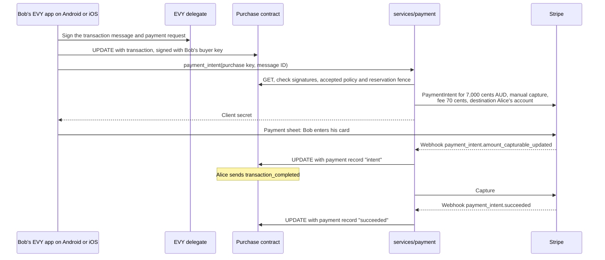

# 2.6 Payments

## Repositories

| Repository | Role | Work in this plan |
| --- | --- | --- |
| [evy](https://github.com/EVY-Platform/evy) | Modified | `services/payment`: EVY's Stripe code, webhooks, seller onboarding and payment records. `evy-txn-sig-v2` in `types/`. Shared purchase and message schemas and adapters for the SwiftUI and Compose readers. The hello test item. The items contract and the common purchase contract in `freenet/contracts/`. The EVY delegate signs purchases, participant messages and payment requests |
| [freenet-appkit](https://github.com/glesage/freenet-appkit) | Used | Swift package and Kotlin library in the EVY app |
| [freenet-core](https://github.com/freenet/freenet-core) | Used | The payment service's node |
| [freenet-stdlib](https://github.com/freenet/freenet-stdlib) | Used | [TypeScript client](https://github.com/freenet/freenet-stdlib/blob/fca0848b78b12942f77422309bb07f76108940d6/typescript/src/websocket-interface.ts) for the payment service's node |
| [stripe-ios](https://github.com/stripe/stripe-ios), [stripe-android](https://github.com/stripe/stripe-android) | Used | Payment sheets on iOS and Android |

## Purpose

EVY on iOS and Android takes Stripe payments for purchases stored in Freenet. Bob pays Alice 70 dollars for her skateboard in Stripe's native payment sheet on iOS and Android. The payment service writes a signed payment record into the purchase contract. Alice receives 69.30 dollars and EVY holds the 1% contributor fee of 0.70 dollars.

Implement `services/payment` as a TypeScript service on Bun with Postgres, using EVY's [payment procedures](https://github.com/EVY-Platform/evy/blob/d0fb7e6475f1dfc5c74325e37d4e92aed88d84ed/api/src/procedures/payments.ts) and [payment orchestration](https://github.com/EVY-Platform/evy/blob/d0fb7e6475f1dfc5c74325e37d4e92aed88d84ed/docs/services/marketplace/data.md#payment-orchestration). `payment_intent` places a hold, `payment_capture` captures it and `payment_cancel` releases it. Purchase messages trigger these operations, and each purchase has its own contract. The shared commerce fixture is Marketplace’s skateboard listing for 70 dollars (AUD), defined by [2.12 Listings and purchases](12-listings-and-purchases.md) and rendered by [2.7 EVY Marketplace](07-marketplace.md).

## Service setup

Deploy the payment service's Postgres database, signing service, operation journal and publication outbox before its first test charge. Configure recoverable backups and restore the admission and listing-coordinator records before enabling Stripe writes after an outage. [Operating the services in 2.14 Backend operations and recovery](14-backend-operations-and-recovery.md#operating-the-services) defines the shared backup configuration; this plan installs its payment portion. Install the purchase portion of [Pilot hosting in 2.7 EVY Marketplace](07-marketplace.md#pilot-hosting) before admission; that plan adds the photo workload. Later services extend the deployment.

## Financial policy identity

Define one EVY policy envelope: `service: "evy"`, application key, publisher identity, `policy_version`, `fee_rate_bp`, `reservation_grace_seconds`, archive endpoint/key, payment key-role certificate references and signature. The signature covers `evy.service-policy/1` followed by RFC 8785 canonical JSON of every other field. Preserve the signing-domain label as a protocol namespace. Encode the signature as canonical padded base64 and the complete state as canonical JSON. `policy_digest` is base58 BLAKE3 of those exact bytes.

Select the higher policy `(version, digest)` by numeric version then unsigned hash bytes. Retain every accepted policy. The initial EVY policy uses a 100-basis-point fee and 3,600-second reservation grace period. [2.8 Attribution](08-attribution.md#application-policy) extends the same envelope with feature capability accounting and payout fields.

The complete EVY UI document carries signed top-level `policy_version` and `policy_digest`. Publisher validation resolves them to the policy for the pinned EVY application and publisher. Purchase creation retains `application_key`, `feature`, `ui_version`, `ui_digest` and both policy fields. Buyer authorization, seller acceptance, reservation and payment evidence bind that same identity.

The payment service verifies the complete archived application document, its EVY policy and the source feature/resource before calculating the agreed fee. Later policies apply to new purchases; an existing purchase retains its signed terms and document evidence. A change to agreed terms requires a new buyer-authorized purchase.

```jsonc
"policy_version": 1,
"policy_digest": "9a2f..." // BLAKE3 of the exact complete signed EVY policy
```

## Paying on a phone



- The shared message adapter in the SwiftUI and Compose readers runs this step for a `create(evy.messages, ...)` action whose data holds EVY's `payment_signature(...)` marker ([EVYPaymentSignature.swift](https://github.com/EVY-Platform/evy/blob/d0fb7e6475f1dfc5c74325e37d4e92aed88d84ed/ios/evy/Utils/EVYPaymentSignature.swift)). The EVY delegate fills in the message ID and signs in the verified purchase's originating feature and buyer scope. The reader calls `payment_intent` over JSON-RPC 2.0 on a WebSocket, using EVY's service transport ([wsServer.ts](https://github.com/EVY-Platform/evy/blob/d0fb7e6475f1dfc5c74325e37d4e92aed88d84ed/types/wsServer.ts)), with the call signed by Bob's buyer key.
- Stripe's payment sheet runs card entry and 3-D Secure in native screens. stripe-ios needs iOS 15 or later and stripe-android API 23 or later, within EVY's iOS 17 and Android 9 floors from [The EVY app on iOS and Android in 2.1 Hello EVY world](01-hello-evy-world.md#the-evy-app-on-ios-and-android).
- The listing coordinator admits one active payment purchase and keeps one PaymentIntent per purchase. The purchase key and message ID form Stripe's idempotency key, and Postgres maps the purchase key to the PaymentIntent ID, using the mapping pattern in Marketplace's `item_payment_intents` table ([paymentIntents.ts](https://github.com/EVY-Platform/evy/blob/d0fb7e6475f1dfc5c74325e37d4e92aed88d84ed/services/marketplace/src/paymentIntents.ts)). A repeated call returns the same client secret.
- The service subscribes to each purchase it charges and sends each payment record from its own node, so the purchase updates even when Bob closes EVY. Its Freenet client allows one request awaiting a reply per connection across all purchase contracts and request types, as [Matching replies to requests in 1.2 Embedded node and mobile SDK](../1-freenet-mobile-appkit/02-sdk.md#matching-replies-to-requests) requires. Subscription updates flow while the request awaits its reply. Parallel requests require tested request-ID coverage in every success and error reply from the pinned Core and stdlib. A card hold usually lasts 7 days, so if Alice never confirms, Stripe cancels the hold ([place a hold](https://docs.stripe.com/payments/place-a-hold-on-a-payment-method)) and the record becomes `canceled`.

### Retrying a card payment

After a declined card attempt, Stripe returns the PaymentIntent to `requires_payment_method`, so Bob can choose to try again ([PaymentIntent lifecycle](https://docs.stripe.com/payments/paymentintents/lifecycle)). Each card confirmation starts with Bob's action in the native payment sheet on iOS and Android. The purchase keeps Alice's acceptance, the agreed amount and fee, Bob's buyer key and the signed `transaction` message.

| Step | What runs on retry |
| --- | --- |
| 1. Choose | Bob taps "Try again". EVY reopens the payment sheet for the purchase. |
| 2. Resume | The reader calls `payment_intent` with the original purchase key and authorization message ID. The service checks the purchase's current acceptance, cancellation, accepted policy and listing reservation fence, then Stripe's current PaymentIntent. For an accepted purchase with a retryable PaymentIntent, it returns that intent's client secret. |
| 3. Confirm | Bob enters or selects a card and confirms another attempt on the same PaymentIntent. Stripe runs 3-D Secure when required. |
| 4. Hold | After successful authorization, the service publishes a higher-revision `intent` record. The funds are held and the purchase stays `pickup_pending`. |
| 5. Capture | Alice confirms the handover. The service captures once and publishes a higher-revision `succeeded` record. The purchase becomes `sold`. |

The payment-record sequence is `failed → intent → succeeded`. Repeated declines produce the latest failed-attempt details with increasing revisions when those details change. A retry uses the original transaction message and payment request; it keeps the purchase's message count unchanged. The service offers retry while the purchase remains accepted and the PaymentIntent permits another confirmation. Captured payments follow [Refunds](#refunds), and canceled purchases return to the purchase flow.

## The payment record

Each ledger row retains EVY's transaction signature trail. It hashes the amount, currency, authorizing message, time, provider and card's last 4 digits with SHA-256 ([transaction-signature-trail.md](https://github.com/EVY-Platform/evy/blob/d0fb7e6475f1dfc5c74325e37d4e92aed88d84ed/docs/plans/transaction-signature-trail.md), [paymentSignature.ts](https://github.com/EVY-Platform/evy/blob/d0fb7e6475f1dfc5c74325e37d4e92aed88d84ed/types/paymentSignature.ts)). This plan adds signed buyer authorization and payment-service evidence:

1. Bob's `transaction` message carries his payment request in `data.signature`, under the scheme `evy-txn-sig-v2`. Its canonical string holds the amount, currency, agreed fee, message ID, `created_at`, provider, purchase contract key, UI version/digest and policy version/digest. The EVY delegate signs its hash with Bob's buyer key.
2. After a verified Stripe webhook, the payment service reads the current Stripe payment and charge state, writes a changed payment record with the current card's last 4 digits, and signs it with the payment service key under the prefix `evy.payment/1`.
3. The EVY publisher key from [The EVY publisher key in 2.1 Hello EVY world](01-hello-evy-world.md#the-evy-publisher-key) certifies each payment service signing key. The purchase contract's code holds the publisher's verifying key and checks that certificate.

```jsonc
{
  "purchase": "7HqK...",                        // purchase contract key
  "authorization_message_id": "b2e0...",        // Bob's transaction message, EVY's field name
  "request_hash": "3b9e...",                    // hash of Bob's evy-txn-sig-v2 payment request
  "status": "succeeded",                        // intent, succeeded, failed, canceled or refunded
  "amount_cents": 7000,                         // 70.00 dollars
  "currency": "AUD",                            // matches the purchase
  "fee_cents": 70,                              // application fee EVY holds for contributors
  "refunded_cents": 0,                          // cumulative successful buyer refunds
  "fee_refunded_cents": 0,                      // cumulative application fee returned by Stripe
  "payment_method_last_4_characters": "4242",   // from Stripe's charge, EVY's field name
  "policy_version": 1,                          // purchase's accepted policy
  "policy_digest": "9a2f...",                   // retained policy bytes
  "reservation_fence": 1,                       // listing coordinator authorization
  "revision": 2,                                // rises with each change, the highest wins
  "signer": "Rk9v...",                          // payment service verifying key
  "signer_certificate": "c2ln...",              // EVY publisher key's signature over signer
  "signature": "MEUC..."                        // payment service key over every field above
}
```

The service checks webhooks with EVY's existing handler ([stripeWebhookHttp.ts](https://github.com/EVY-Platform/evy/blob/d0fb7e6475f1dfc5c74325e37d4e92aed88d84ed/api/src/shared/stripeWebhookHttp.ts)). It handles `payment_intent.amount_capturable_updated`, `payment_intent.succeeded`, `payment_intent.payment_failed`, `payment_intent.canceled`, `charge.refunded`, `refund.created`, `refund.updated`, `refund.failed`, `application_fee.created`, `application_fee.refunded` and `application_fee.refund.updated` by reading the current PaymentIntent, charge, refunds and application fee from Stripe. Application-fee events map back to the purchase through the saved charge and fee IDs ([Stripe event types](https://docs.stripe.com/api/events/types)). Stripe can deliver duplicate events and events out of order ([webhook delivery](https://docs.stripe.com/webhooks#event-ordering)). Each event starts a reconciliation of current state.

| Current Stripe evidence | Signed payment status |
| --- | --- |
| A declined attempt awaiting another payment method | `failed` |
| Authorized funds awaiting manual capture | `intent` |
| Captured funds, including a partial buyer refund | `succeeded`, with current cumulative `refunded_cents` and `fee_refunded_cents` |
| Canceled PaymentIntent | `canceled` |
| A captured payment whose successful buyer refunds equal `amount_cents` | `refunded`, with current cumulative `refunded_cents` and `fee_refunded_cents` |

The payment service sums successful buyer refund objects for `refunded_cents`. Pending and failed refund requests retain the prior confirmed total. It reads `fee_refunded_cents` from the matching [Application Fee object's `amount_refunded`](https://docs.stripe.com/api/application_fees/object), independently of the buyer total. A separate fee refund can change that field while the buyer total stays unchanged. Changed totals produce a new signed revision even when the status stays `succeeded` or `refunded`.

Both totals are nonnegative integer cents, with `refunded_cents <= amount_cents` and `fee_refunded_cents <= fee_cents`. The purchase contract checks these bounds and the status rules on each signed record. Pre-capture records have zero refund totals. Captured `succeeded` records have `refunded_cents < amount_cents`; `refunded` records have `refunded_cents == amount_cents`. A zero fee has a zero fee-refund total. When a nonzero fee is expected, reconciliation verifies its matching Stripe fee object before publishing totals. Missing objects and failed reads leave reconciliation pending. Current Stripe reads retain confirmed cumulative totals. An inconsistent read leaves reconciliation pending for another read. Older signed revisions remain evidence of capture and earlier totals.

The service processes reconciliation one at a time per purchase, including the Stripe read and record creation, within the listing coordinator's fencing rules. Listing capture/cancel decisions serialize across all of its purchases. Postgres deduplicates webhook event IDs and assigns a strictly increasing `revision` to each changed record. It saves the signed bytes and their publication outbox entry together, then retries publication with those same bytes. The purchase contract selects the valid record with the highest `(revision, payment_hash)`, where `payment_hash` is BLAKE3 of its canonical complete signed bytes and hash ties compare unsigned bytes, so `failed → intent → succeeded` converges in either delivery order.

Duplicate events and unchanged state retain the existing revision. A delayed failure event reads the current successful state and preserves its record. Stripe charge, refund, fee and fee-refund IDs stay in the service's Postgres. Each changed captured-payment record queues a remuneration notification, including fee-only changes.

- Bob signs the payment request with his buyer key. The contract checks that key against its `buyer` parameter.
- The payment service verifies the webhook, reads Stripe's current payment state and signs the resulting record.
- The contract checks the signature, certificate, amounts, retained policy identity, reservation fence and revision. Support recomputes `request_hash` and asks Bob for his card's last 4 digits, following EVY's support flow ([data.md](https://github.com/EVY-Platform/evy/blob/d0fb7e6475f1dfc5c74325e37d4e92aed88d84ed/docs/evy/data.md#data_evy_transaction)).

### Payment signing-key revocation

Authority scope, replacement and cutoff rules limit a compromised service key and preserve verifiable payment history. Authority/revocation vectors and the rotation/reconciliation drill below verify those rules before live payments.

Owner: EVY payments lead, with the Core/contract lead. Start before the first live-payment gate. Dependency: release requirement for payment-capable production; test-mode fixtures can establish the interface earlier.

Define a publisher-signed authority record binding application, originating feature, seller/listing scope, operation role, endpoint audience, key ID, authority generation and validity interval. Seller listing authorization and Stripe onboarding must bind that exact verified seller identity and certified role. A certificate authorizes only its declared operations and audience.

Revocation publishes a higher signed authority generation with the revoked key, cutoff evidence, replacement key/roles and recovery-record reference. Payment contracts and backends check authority at new authorization/capture and distinguish preserved verified historical evidence from new writes. Uncertain Stripe operations retain their reservation fences while authority is reconciled.

Completion evidence: shared signed authority/revocation vectors, matching iOS and Android build admission where the contract codec changes, wrong-role/seller/feature/audience rejection, leak-and-rotation drill, historical payment verification and one-charge reconciliation through restart. [2.14 Backend operations and recovery](14-backend-operations-and-recovery.md#signing-key-recovery) owns custody and recovery records.

## Fees and seller accounts

Each sale is a Stripe [destination charge](https://docs.stripe.com/connect/destination-charges). The PaymentIntent sets `transfer_data.destination` to Alice's connected account and `application_fee_amount` to the fee, 1% of the price in cents, rounded half up. Stripe moves Alice's share when the service captures. Prices are in AUD, the one currency EVY's `toStripeAmount` accepts ([stripeGateway.ts](https://github.com/EVY-Platform/evy/blob/d0fb7e6475f1dfc5c74325e37d4e92aed88d84ed/api/src/procedures/stripeGateway.ts)). Alice's account is Australian like EVY's platform account, as destination charges require.

| Party | Skateboard sale |
| --- | --- |
| Bob pays | 70.00 dollars |
| Alice receives | 69.30 dollars |
| EVY holds for contributors | 0.70 dollars |
| Stripe's card fee | About 1.46 dollars, at 1.65% + 0.30 dollars for Australian cards ([Stripe pricing](https://stripe.com/au/pricing), checked 2026-10-07) |
| Stripe's payout fee | About 0.42 dollars, at 0.25% + 0.25 dollars of Alice's 69.30-dollar payout ([Connect pricing](https://stripe.com/au/connect/pricing)) |
| Stripe's active account fee | 2.00 dollars in each month Stripe pays Alice out ([Connect pricing](https://stripe.com/au/connect/pricing)) |
| Who pays Stripe | EVY. Destination charges take Stripe's fees, refunds and chargebacks from EVY's balance, and EVY pays them from its own budget so contributors get the full 0.70 dollars |

Alice links her account once, before she lists her first item:

1. Alice taps "Get paid". Her app calls `seller_onboarding`, signed with her seller key.
2. The service creates a connected account with `controller.fees.payer` and `controller.losses.payments` set to `application` and `controller.stripe_dashboard.type` set to `express`, then an Account Link ([hosted onboarding](https://docs.stripe.com/connect/hosted-onboarding)).
3. EVY opens the link in `SFSafariViewController` on iOS and Custom Tabs on Android, because Stripe-hosted onboarding runs only in a browser.
4. When Stripe's `account.updated` webhook shows the account can take transfers, the service stores Alice's seller key with her account ID.

## Refunds

Before capture, `cancel` and `transaction_rejected` release the hold, and the money stays on Bob's card. After capture, the EVY operator refunds an agreed amount with `payment_refund` or in the Stripe Dashboard.

| Refund path | Rule |
| --- | --- |
| `payment_refund` | Takes the purchase key, a stable refund request ID and a positive `amount_cents` up to the remaining captured amount. Stores the request, uses its ID as the Stripe idempotency key and saves the resulting refund ID. Repeated or uncertain calls reconcile the saved request and Stripe evidence; a changed amount under the same ID fails validation. |
| Stripe request | Sets `reverse_transfer` and `refund_application_fee`. Stripe returns the application fee and reverses the seller transfer in proportion to the refunded charge amount ([Create a refund](https://docs.stripe.com/api/refunds/create)). |
| Dashboard | The operator selects transfer reversal and application-fee refund for the agreed refund. Reconciliation reads the actual buyer and fee totals, including any separately issued fee refund. |
| Partial buyer refund | Successful buyer refunds total less than `amount_cents`. The payment remains `succeeded`, the completed purchase remains `sold`, and participant views show the refunded amount. |
| Full buyer refund | Successful buyer refunds total `amount_cents`. The payment and purchase become `refunded`. |
| Contributor earnings | [2.9 Remuneration and payouts](09-remuneration.md#refunds-after-payout) reverses only the cumulative application fee actually returned, using `fee_refunded_cents`. |

For a 35.00-dollar refund of the skateboard, Bob receives 35.00 dollars, Alice returns 34.65 dollars and EVY returns 0.35 dollars. The signed totals are `refunded_cents: 3500` and `fee_refunded_cents: 35`, and the purchase stays `sold`. A later refund of the remaining 35.00 dollars raises the totals to 7000 and 70 and makes the purchase `refunded`. A full refund in one request returns the same final amounts: Alice 69.30 dollars and EVY 0.70 dollars. Stripe keeps its card fee.

## Store payment rules

EVY takes payment only for physical goods and services used outside the app, such as Alice's skateboard. The Marketplace item is a real skateboard that Alice hands to Bob. Both stores send these payments outside their own billing, so EVY on iOS and Android takes them through Stripe's payment sheet. EVY's App Store privacy details and Play data safety form list the card details Stripe collects.

| Store | Rule for physical goods |
| --- | --- |
| App Store | [App Review Guidelines](https://developer.apple.com/app-store/review/guidelines/) 3.1.3(e), "Goods and Services Outside of the App", requires methods outside in-app purchase, such as Apple Pay or card entry |
| Google Play | [Payments policy](https://support.google.com/googleplay/android-developer/answer/9858738) section 3 requires payments primarily for physical goods to use a method outside Google Play billing |

## Acceptance

- The defining [2.12 Listings and purchases](12-listings-and-purchases.md#acceptance) suite passes; this plan integrates its admission/reservation evidence with provider intent, capture, cancellation and refunds.

- On iOS and Android, submit a reference without purchase bytes, forged admission, 33 live requests and several scoped keys under one pilot enrollment. The service admits only verified hosted purchases within the quota. Pending requests leave availability under the listing decision; capacity shows "Requests full" with the draft intact. Opposite-order listing decisions converge at 32 requests while sale evidence remains separate.
- Cancel and expire a reservation before intent dispatch, after confirmed intent creation and during an uncertain dispatch. The first releases from durable journal evidence; the others remain fenced until reconciliation confirms cancellation or capture.
- Two buyers receive seller acceptances concurrently. Race intent, capture and cancel operations, interrupt the service before and after Stripe responses, then restore it. One listing reservation authorizes one successful sale; an uncertain operation keeps its fence until reconciliation. Refunds retain the completed-sale identity.
- Create a purchase under policy version 1, publish version 2 with a changed fee, then authorize, capture and refund the original purchase. The original policy identity and fee remain in every signed record and ledger input. Wrong policy digests and cross-purchase signature replay fail validation.

- On iOS and Android, Home and Marketplace use the same purchase and message adapters and display/act on the same Marketplace purchase instance. The purchase retains its source feature, item, scoped buyer key and EVY application UI attribution identity.
- Shared fixtures cover parameter derivation, nested-state projection, role ownership, message routing, replay after interrupted admission and item edits racing with signed service decisions. An admitted buyer's reference appears through the seller-authorized service decision while seller-written fields retain their valid author signature. A wrong source feature, seller, buyer scope, parent or target contract fails validation.
- On iOS and Android in Stripe test mode, Alice links a connected account in the browser and lists the skateboard for 70 dollars on her iPhone. Bob asks to buy it on his Android phone and Alice accepts. Bob pays 70.00 dollars in the payment sheet and Alice confirms the handover. Both phones show `sold`, Alice's account receives 69.30 dollars and EVY's balance holds 0.70 dollars. The run passes again with the platforms swapped.
- On iOS and Android, a 3-D Secure test card completes inside the payment sheet. Closing EVY during the payment and reopening it shows the payment record from the contract.
- `payment_intent` fails before any Stripe call for a bad buyer signature, a purchase Alice has not accepted or has canceled, a missing or stale reservation fence, a wrong retained policy, amount or fee, or a seller with no connected account. A repeated call returns the same PaymentIntent. Duplicate events and unchanged Stripe state retain the same signed payment record and revision.
- On iOS and Android in Stripe test mode, Bob's first card is declined. He chooses "Try again", enters a valid card and completes 3-D Secure when required. The same purchase, buyer key, authorization message and PaymentIntent produce `failed → intent → succeeded` with increasing revisions. The purchase stays `pickup_pending` through the decline and hold, then becomes `sold` after Alice confirms. Capture produces one successful charge and one contributor fee.
- Deliver duplicate and delayed failure events after successful authorization and capture, and deliver signed record revisions to contract peers in different orders. Every peer converges to the highest valid revision. Concurrent webhook workers serialize reconciliation per purchase, and a restart replays saved signed bytes through the publication outbox.
- `transaction_rejected` before capture releases the hold and the record shows `canceled`. A full refund after capture returns 70.00 dollars to Bob, takes 69.30 dollars from Alice and 0.70 dollars from EVY, and the record shows `refunded` with `refunded_cents` of 7000 and `fee_refunded_cents` of 70.
- On iOS and Android, refund 35.00 dollars after capture. Both phones retain `sold`, display the partial refund and keep the listing closed. The payment record has totals 3500 and 35. Refunding the remainder produces `refunded` with totals 7000 and 70.
- Duplicate, reordered and delayed refund and application-fee events reconcile the current cumulative totals once. A fee-only refund creates a higher revision and remuneration notification while the buyer refund total and purchase status stay unchanged. Pending or failed buyer refunds retain confirmed totals. Invalid refund bounds or status combinations fail contract validation.
- The purchase contract rejects messages from other keys or out of order, and payment records with a bad or uncertified signature, a wrong amount or a lower revision. `fdev verify-merge` passes on the items and purchase contracts.
- `evy-txn-sig-v2` golden vectors give the same results in the EVY delegate, the purchase contract and `services/payment`, using the shared-vector pattern in EVY's TypeScript and Swift tests ([paymentSignature.test.ts](https://github.com/EVY-Platform/evy/blob/d0fb7e6475f1dfc5c74325e37d4e92aed88d84ed/api/src/tests/paymentSignature.test.ts), [EVYPaymentSignatureTests.swift](https://github.com/EVY-Platform/evy/blob/d0fb7e6475f1dfc5c74325e37d4e92aed88d84ed/ios/evyTests/EVYPaymentSignatureTests.swift)).
