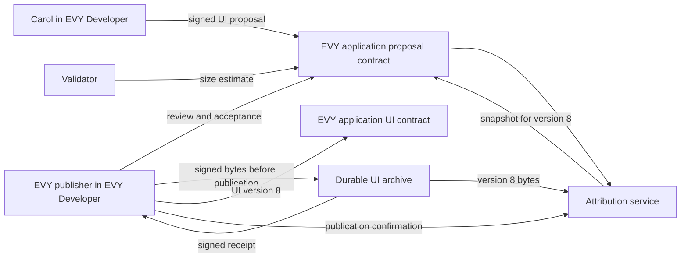

# 2.8 Attribution

## Repositories

| Repository | Role | Work in this plan |
| --- | --- | --- |
| [evy](https://github.com/EVY-Platform/evy) | Modified | `services/attribution` and the EVY GitHub App. Local EVY Developer (`web/`) and `evyctl` from [2.5 EVY authoring and publishing](05-developer.md) gain proposal/review file workflows and protected contributor credentials. `services/payment` uses the EVY application policy. One application UI proposal contract lives in `freenet/contracts/ui_proposal/` |
| [freenet-core](https://github.com/freenet/freenet-core) | Used | Node for the attribution backend and application proposal records |
| [freenet-stdlib](https://github.com/freenet/freenet-stdlib) | Used | TypeScript client for the attribution service |

## Purpose

The attribution service credits accepted UI proposals from EVY Developer and code merged into `evy`. Each acceptance earns units for an EVY feature capability. Implement `services/attribution` in evy with TypeScript on Bun and Postgres, following [`services/marketplace`](https://github.com/EVY-Platform/evy/blob/d0fb7e6475f1dfc5c74325e37d4e92aed88d84ed/services/marketplace/package.json).

- Carol moves the "Listing dimensions" row of Marketplace's "Create item" flow from the "Create listing" page to the "Describe item" page ([service_sdui.json](https://github.com/EVY-Platform/evy/blob/d0fb7e6475f1dfc5c74325e37d4e92aed88d84ed/scripts/fixtures/services/service_sdui.json)). The EVY publisher publishes her proposal as EVY application UI version 8, and Carol earns 6.8 units for `marketplace.item.create`.
- Dan opens a pull request to evy that makes Marketplace's contract accept a pickup request only at a time Alice offered. It merges, and Dan earns 4.25 units for `marketplace.item.buy`.

The transaction's originating feature and retained EVY application UI document and matching attribution snapshot select its capability contribution pool. Accepted UI work and verified merged code add cumulative units to that pool; the units measure accepted feature contributions under the retained policy. A merge becomes eligible for the attribution snapshot of the next published UI document under the rules below.

Units decide each contributor's part of the 1% contributor fee that [Fees and seller accounts in 2.6 Payments](06-payments.md#fees-and-seller-accounts) collects on each sale.

## Contributor keys

Carol keeps an Ed25519 contributor key in her protected local author workspace under [2.5 EVY authoring and publishing](05-developer.md#publisher-workspace). `evyctl` signs contributor operations; the editor exchanges public documents and draft files with the CLI.

| Action | Local author tool | Attribution backend |
| --- | --- | --- |
| Register | Create a contributor key and sign its registration statement. | Verify and assign an `ActorId`. |
| Link GitHub | Complete GitHub sign-in at the declared contributor endpoint. | Bind the GitHub user ID to that `ActorId`. |
| Rotate | Sign an old-to-new key statement using the existing key. | Preserve roles and units under the same `ActorId`. |
| Back up | Export encrypted contributor credentials and drafts; the publisher separately backs up its key and publication journal. | Retain its acknowledged contribution records. |

Sign proposals, reviews, estimates, challenges and sign-in statements with operation-specific domains. Publisher policy, acceptance and publication confirmations use the EVY publisher key. [Backend requests in 2.5 EVY authoring and publishing](05-developer.md#backend-requests) validates the endpoint, audience, challenge, expiry and signed response.

| Recovery | Backend result |
| --- | --- |
| Restore the contributor-key backup | Preserve the key and `ActorId`. |
| Recover through linked GitHub after key loss | Apply a 7-day replacement hold; a valid old-key objection cancels replacement. |
| Register a new identity after loss of all recovery credentials | Assign a new `ActorId`; retain earlier units against their recorded identity. |

## Service setup

Install contributor/proposal state and attribution signing custody after the base release archive in [2.13 Release archive and policy evidence](13-release-archive-and-policy-evidence.md) passes its setup/recovery gate. The first attributed policy authorizes explicit attribution and archive roles. Use the archive and backup configuration in [Operating the services in 2.14 Backend operations and recovery](14-backend-operations-and-recovery.md#operating-the-services) at this stage. Test durable receipt issuance and restore of acknowledged bytes before accepting contributed UI publication. The payment deployment from [Service setup in 2.6 Payments](06-payments.md#service-setup) runs independently; remuneration adds its ledger after archive recovery passes.

## Application policy

Record feature/capability pools, role shares and merged-code eligibility in the retained policy. Contributors can then reproduce why their work receives units and which purchases use those units.

The signed EVY policy extends [Financial policy identity in 2.6 Payments](06-payments.md#financial-policy-identity). Existing policies retain their exact bytes/digests; attribution fields produce a higher application policy version.

Build one EVY UI proposal contract in `freenet/contracts/ui_proposal/` with the EVY publisher's verifying key and UTF-8 `evy` parameters. It holds the application policy, registered contributor keys, proposals, reviews and attribution snapshots. Pin its full identity and code in `types/freenet/contract-keys.json`. The local publisher tool verifies that identity before writes.

The EVY publisher signs each policy and complete application UI publication through `evyctl`. Setup archives the current complete signed EVY document and confirms independent readback before attribution-backed publication and payouts. Capabilities identify internal features and their flow IDs. Each capability entry records its `feature`; allocation selects that feature's eligible capabilities and normalizes their policy weights.

- The contract keeps the higher `(policy_version, policy_digest)` signed by the key in its parameters, using the canonical encoding and byte ordering in [Financial policy identity in 2.6 Payments](06-payments.md#financial-policy-identity). Every referenced policy remains in the archive.
- Each record is signed over its own prefix, such as `evy.ui-proposal/1`, and its RFC 8785 canonical JSON, as hello states are.
- A new version applies to work accepted after it, and each acceptance records the version it used.
- Each attributed UI document names `policy_version` and `policy_digest` for its immutable signed policy. The archive and snapshot verify that identity. The payment service checks the purchase's fee against its retained policy, rounded half up under [Financial policy identity in 2.6 Payments](06-payments.md#financial-policy-identity). New policy versions apply to new purchases created from documents naming them; existing purchases retain their agreed policy. Marketplace purchases use the retained EVY policy and their originating feature.

```jsonc
{
  "service": "evy",                                      // fixed EVY application namespace
  "policy_version": 2,                                   // extends the EVY application financial policy
  "reservation_grace_seconds": 3600,                   // release checks start one hour after agreed pickup end
  "fee_rate_bp": 100,                                    // contributor fee on each sale: 1%, so 0.70 of 70 dollars
  "capabilities": {                                      // credited behavior, by capability ID
    "marketplace.item.create": {                         // internal EVY feature capability
      "feature": "marketplace",
      "weight_bp": 4000,                                 // 40% of each fee. Weights total 10,000 for this feature
      "flows": ["ca47e6c5-da19-4491-8422-adb40d9e8a27"]  // flow IDs in the UI document
    },
    "marketplace.item.buy": {                            // internal EVY feature capability
      "feature": "marketplace",
      "weight_bp": 6000,                                 // 60% of each fee
      "flows": ["74a49d4b-2176-4925-857a-e29e2991f1bd"]  // flow IDs in the UI document
    }
  },
  "sizes": [1, 2, 3, 5, 8, 13, 21],                      // the sizes a piece of work can have
  "role_split_bp": [8500, 1000, 500],                    // units to contributors, reviewer and validators
  "reviewers": ["actor:..."],                            // ActorIds that review for the EVY publisher
  "validators": ["actor:..."],                           // ActorIds that size work
  "attribution_key": "ed25519:...",                      // attribution service key: snapshots and registered keys
  "archive_url": "https://attribution.example/ui-archive", // signed HTTPS archive endpoint
  "contributor_url": "https://attribution.example/contributor", // signed contributor statement endpoint
  "payouts_url": "https://remuneration.example/payouts",     // signed earnings and sign-in endpoint
  "challenge_days": 30,                                  // days after acceptance to open a challenge
  "payout_hold_days": 30,                                // days after a purchase is sold before a share is payable
  "payout_minimum_cents": "...",                         // set by the EVY publisher before launch
  "payout_schedule": "...",                              // set by the EVY publisher before launch
  "signature": "<canonical padded base64 Ed25519 signature>"                             // by the EVY publisher key
}
```

The policy example is a schema template. Published fixtures supply all required base fields, exact canonical signatures and encoded digests under [2.6 Payments](06-payments.md#financial-policy-identity) and [2.13 Release archive and policy evidence](13-release-archive-and-policy-evidence.md).

## Proposing a UI change



| Step | Who | Rule |
| --- | --- | --- |
| 1. Draft | Carol | Opens the Marketplace flow in the complete EVY document as [Opening the application in 2.5 EVY authoring and publishing](05-developer.md#opening-the-application) describes. Without the publisher key, EVY Developer opens it in proposal mode. Carol edits a draft and uses Propose. She moves the "Listing dimensions" row to the "Describe item" page |
| 2. Preview | Carol | Checks the change on the EVY test build on iOS and Android, as [Previewing on a phone in 2.5 EVY authoring and publishing](05-developer.md#previewing-on-a-phone) describes |
| 3. Propose | Carol | Picks `marketplace.item.create` and size 8. EVY Developer assembles and validates the document as [Publishing the application in 2.5 EVY authoring and publishing](05-developer.md#publishing-the-application) does. The local contributor signer signs under `evy.ui-proposal/1`, covering the EVY application key, source feature and the complete changed flows (here "Create item", about 17 KB), base version 7, capability IDs, contributor shares totaling 10,000 and size 8. `evyctl` signs the exported proposal file with Carol's protected local key and submits it as an UPDATE<br>Returns the signed UI proposal |
| 4. Size | Validator | Exports a size estimate from EVY Developer and signs/submits it through `evyctl` |
| 5. Review | EVY publisher | A reviewer from the policy opens the proposal beside version 7, previews it on iOS and Android and signs/submits an approval through `evyctl`. A rejection closes the proposal |
| 6. Publish | EVY publisher | Builds the next complete EVY document from the live version with the proposal's approved flows in place, archives its signed bytes and waits for the receipt, then publishes EVY application UI version 8 and confirms readback, as [Publishing a UI version in 2.2 EVY UI contracts and publishing](02-ui-contracts.md#publishing-a-ui-version) describes. Signs an acceptance record naming the proposal, version 8 and the document's digest |
| 7. Link | Attribution service | Uses version 8's archived bytes, verifies the publication confirmation and acceptance digest, and records the acceptance<br>Records Carol's acceptance and units |

- The contract caps its state at 512 KiB, as the UI contract does. It accepts a proposal only from a registered contributor key, with one open proposal per key. The attribution service writes the registered keys, signed with `attribution_key`.
- It accepts an acceptance record only when the EVY publisher key signed it, and a [snapshot](#attribution-units) only when `attribution_key` signed it.
- A closed proposal keeps its record and drops its flows. The attribution service keeps their bytes.
- The attribution service accepts the work only when the reviewer and validators are on the policy's lists, nobody reviews or sizes their own proposal, the size is in `sizes`, shares total 10,000, every changed flow belongs to a claimed capability and no challenge is open.

### Capacity follow-up

Bounded active state keeps new proposals usable while archived evidence supports historical challenges and payouts. Capacity and recovery fixtures verify the active-record model, checkpoint signatures and pruning rules below.

Owner: EVY attribution lead. Start before enabling attributed publication for production. Dependency: release capacity gate; bootstrap and bounded proposal fixtures establish interfaces earlier.

Keep the 512 KiB proposal-contract bound. Define active registrations, proposals, reviews and challenges separately from immutable archived history. A publisher/service-signed checkpoint commits contributor registrations, authority generation, active records and archived-history digests. Pruning follows durable archive receipts and a verified checkpoint; historical acceptance, challenge and payout evidence stays addressable.

Completion evidence: growing-history fixtures, checkpoint/pruning interruption, concurrent registration/challenge recovery, retained authorization and historical payout reproduction. At capacity, preserve signed pending records and report the required action. Codec or contract identity changes pass exact build admission and migration fixtures on iOS and Android.

## Code contributions

Code reaches attribution through the EVY GitHub App, served by `services/attribution` and installed on `evy`. Dan's pull request description names the internal EVY feature, capability and size. The existing `EVY-Service` field carries that feature namespace:

```text
EVY-Service: marketplace
EVY-Capability: marketplace.item.buy
EVY-Size: 5
```

| Step | Who | Rule |
| --- | --- | --- |
| 1. Check | EVY GitHub App | Checks that the author's GitHub account is linked to a contributor key, the capability is in Marketplace's policy and the size is in `sizes`. Sets the required check "EVY attribution" to pending |
| 2. Review | Reviewer | Approves the pull request on GitHub from a linked account on the policy's `reviewers` list |
| 3. Size | Validator | Comments `/evy size 5` from a linked account on the `validators` list |
| 4. Confirm eligibility | Attribution service | Validates the review, size, contributor shares and policy. Saves an eligibility record for the exact head commit and contribution metadata, and marks the check passed<br>Records eligibility to merge |
| 5. Merge | Maintainer | Merges the eligible head into the configured evy target branch. GitHub branch protection requires the passed check for that head |
| 6. Accept merged work | Attribution service | Verifies the merge through GitHub's API, matches the merged PR's head to the eligible head and checks the contribution against the policy in force at acceptance. Commits the acceptance and units together, recording repository ID, PR number, reviewed head, merge commit, merge time and acceptance time<br>Records Dan's acceptance and units for the first EVY application UI version published after this verified acceptance |

- The author holds all contributor shares. Shared work lists each contributor's share in the description, and each listed contributor confirms with a `/evy confirm` comment from their linked account.
- Reviews, size estimates and share confirmations are bound to the eligible head and contribution metadata. A new commit or a change to that metadata sets the check back to pending until the approvals cover the new values.
- A pull request with no `EVY-Capability` line passes the check at once and merges like any other change.

The EVY GitHub App verifies webhook signatures and uses pull-request events to trigger a check of the current PR through [GitHub's pull request API](https://docs.github.com/en/rest/pulls/pulls#get-a-pull-request). Acceptance requires a verified merge into the configured repository and target branch, the eligible reviewed head and complete attribution checks. GitHub's reviewed head and resulting merge commit are recorded separately, covering merge, squash and rebase workflows.

Postgres allows one initial code acceptance per repository ID and PR number. Repeated or reordered events and a service restart reconcile the PR to that same acceptance. Eligible work awaiting merge stays in the eligibility records; only committed acceptances supply units to snapshots. A merge awaiting complete verification stays pending attribution until the service finishes its checks. Challenge corrections follow [Attribution units](#attribution-units).

## Attribution units

The attribution service splits each accepted size by the policy's `role_split_bp` and stores units as integer ten-thousandths of a size point. If the first validator's estimate differs from the proposed size, a second validator picks one of the two. The validator part goes in equal parts to the validators whose estimate equals the accepted size. In both examples, the same reviewer approves the work and the same validator confirms its proposed size.

| Acceptance | Capability | Size | Contributor | Reviewer | Validator |
| --- | --- | ---: | ---: | ---: | ---: |
| Carol's UI proposal | `marketplace.item.create` | 8 | Carol 6.8 (68,000) | 0.8 (8,000) | 0.4 (4,000) |
| Dan's pull request | `marketplace.item.buy` | 5 | Dan 4.25 (42,500) | 0.5 (5,000) | 0.25 (2,500) |

For each published UI document identity, the attribution service signs an attribution snapshot with `attribution_key`, saves its immutable bucket copy, then writes it to the EVY application UI proposal contract and makes it available to remuneration. EVY Developer shows Carol her units and anyone can check them.

- A snapshot identifies the archived EVY application key, UI version and document digest. It lists the units per capability and `ActorId` of every acceptance that counts in that version, and the exact policy version and digest named by that UI document.
- A UI proposal counts from the version that published it. A pull request counts from the first UI version published after its merge is verified and its acceptance is committed. Snapshots take units from committed acceptances.
- Signed snapshots are immutable. EVY application version 8's Marketplace snapshot includes Carol's UI proposal and Dan's pull request. Dan's merge verification and acceptance committed before version 8. A delayed merge verification contributes to a later version's snapshot.

| Challenge | Opened by | Resolved when |
| --- | --- | --- |
| Omitted author | The person left out | The claimant and every contributor on the work sign a resolution |
| Shares | A contributor on the work | Every contributor on the work signs a resolution |
| Size | A contributor or validator on the work | A validator outside the work picks one of the disputed sizes |

A challenge on a UI proposal is a signed record in the UI proposal contract. A challenge on a pull request is a `/evy challenge` comment from a linked account. An open challenge blocks acceptance. A challenge within `challenge_days` after acceptance marks the acceptance as challenged. A resolution that changes shares or size creates a new acceptance, which counts from the next UI version's snapshot. Older snapshots keep their units.

## Attribution snapshot recovery

Signed attribution snapshots remain immutable. On suspected key compromise, freeze new snapshot/payout use, retain every original snapshot and policy, and classify trust using the publisher-signed recovery record in [2.14 Backend operations and recovery](14-backend-operations-and-recovery.md#signing-key-recovery).

A replacement snapshot has a new identity and names the original digest, recovery record and independently reconstructed acceptance evidence. Preserve original units and historical allocation links; resolve an affected snapshot only through an explicit trusted replacement association. New policy versions authorize replacement signing roles. Fixtures verify cutoff decisions, invalid replacement signatures and recovery of already allocated purchases.

## Acceptance

- Before attributed publication is enabled, restore the archive database/index and immutable bucket objects and verify every acknowledged receipt. The service issues a receipt only after both stores are durable.
- A policy change between purchase creation and payment preserves the earlier purchase's signed policy digest and snapshot. Archive receipts and snapshots with substituted policy identities fail validation.
- A verified merged contribution enters the next eligible application UI document's feature capability pool. The snapshot records that contribution policy explicitly, including when a customer's reader or contract build predates the merge.

- Carol registers and rotates her key through `evyctl`; the private key stays in her protected local contributor workspace. A rotation signed by the old key keeps her `ActorId`. A GitHub recovery links a new key after the 7-day hold, and an old-key signature during the hold cancels it.
- The UI proposal contract refuses a policy with a lower version or another signer, a proposal from an unregistered key, a second open proposal from one key, a state over 512 KiB, an acceptance not signed by the EVY publisher key and a snapshot not signed by `attribution_key`.
- The attribution service refuses self-review, self-sizing, reviewers and validators missing from the policy, sizes outside `sizes`, share totals other than 10,000 and a proposal that changes a flow outside its capabilities.
- On iOS and Android, the Marketplace "Create item" flow shows "Listing dimensions" on the "Describe item" page after the EVY publisher publishes Carol's proposal as version 8.
- Dan's pull request stays pending until the review and size arrive. A changed head or contribution metadata renews the eligibility checks, and GitHub blocks the merge until they pass. A pull request with no EVY lines merges with the check passed.
- An approved PR awaiting merge and a PR closed without merging each retain zero attribution units. A verified merge of the eligible head creates one initial acceptance and the units in the table. Merge, squash and rebase fixtures preserve both the reviewed head and resulting merge commit.
- Duplicate and reordered merge events, two racing workers and a service restart produce the same initial acceptance and units. A merge with a head that differs from the eligibility record stays pending attribution until valid checks cover that head.
- Publish a UI version while Dan's PR is eligible and awaiting merge, then merge and verify it. His units appear in the first UI version published after the acceptance commits. A delayed merge verification uses a later snapshot and preserves existing signed attribution snapshots.
- EVY application version 8's Marketplace snapshot holds exactly the units in the table, recomputing it from stored acceptances reproduces it, and units always sum to the accepted size.
- Publish versions 8 and 9 rapidly while snapshot processing is paused. Each receives a durable archive receipt before its Freenet update. After processing resumes, version 8's archived bytes and publication evidence reproduce its acceptance and signed attribution snapshot even when the live contract holds version 9.
- Archive outages, invalid receipts, interrupted publication and retries preserve the exact pending signed bytes. Prepared entries become snapshot sources after verified publication confirmation. Digest, signature or contract-identity mismatches fail validation.
- Restore the attribution database to a point before an acknowledged archive write. Recover its document, receipt, publication evidence and signed attribution snapshot from the immutable bucket copies, verify their identities and signatures, and rebuild the archive index before remuneration resumes.
- An open challenge blocks acceptance. A resolution after version 8 changes only the snapshots of later versions.
