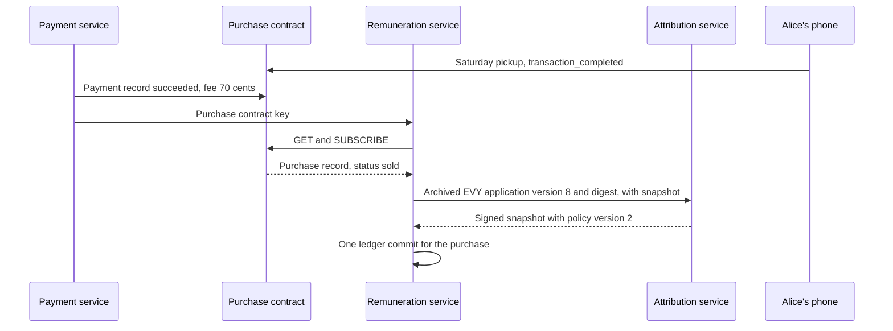
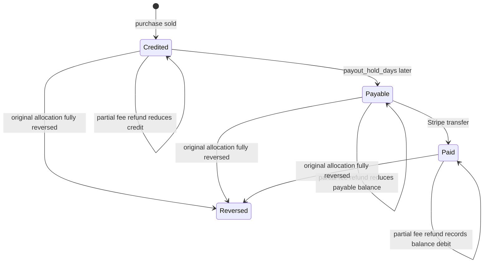

# 2.9 Remuneration and payouts

## Repositories

| Repository | Role | Work in this plan |
| --- | --- | --- |
| [evy](https://github.com/EVY-Platform/evy) | Modified | `services/remuneration`: ledger, balances, Stripe payouts and the payouts page. The SwiftUI and Compose readers in `ios/` and `android/` retain the UI and policy identities defined in 2.6 Payments. `services/payment` reports captures and cumulative buyer and application-fee refunds. Backups and restore drills for `services/payment`, `services/attribution` and `services/remuneration`. The ledger verifies the purchase's UI and policy identities |
| [freenet-core](https://github.com/freenet/freenet-core) | Used | Node for the remuneration service |
| [freenet-stdlib](https://github.com/freenet/freenet-stdlib) | Used | [TypeScript client](https://github.com/freenet/freenet-stdlib/blob/fca0848b78b12942f77422309bb07f76108940d6/typescript/src/websocket-interface.ts) for purchase contract subscriptions |

## Purpose

The remuneration service pays contributors after a completed purchase. Bob buys Alice's skateboard for 70 dollars, and [2.6 Payments](06-payments.md) collects the 1% contributor fee of 0.70 dollars. After handover and capture, the service splits that fee among the accepted contributions in the feature capability pool selected by Bob's retained complete EVY application UI document. It tracks balances and pays contributors through Stripe Connect.

Implement `services/remuneration` in evy with TypeScript on Bun and Postgres. Set up backups, restore drills and key custody for the payment, attribution and remuneration services.

Use `ui_version`, `ui_digest`, `policy_version` and `policy_digest` from [the purchase record in 2.12 Listings and purchases](12-listings-and-purchases.md#the-purchase-contract). When Bob asks to buy, the iOS SwiftUI or Android Compose reader from [2.3 Native SDUI readers](03-readers.md#reading-the-application-ui-contract) records the complete EVY application document it drew:

- `ui_version` is its version, here 8. The contract accepts integers of 1 or more.
- `ui_digest` is the 32-byte BLAKE3 hash of the exact complete signed bytes retained for the flow, encoded in base58.
- `policy_version` and `policy_digest` identify the exact publisher-signed financial policy named by that UI document.
- Bob's buyer key signs all four fields with the rest of `purchase`; seller acceptance and payment evidence retain them.

The EVY purchase interface retains `application_key`, the originating internal `feature` and the complete retained application document under [EVY purchase interface in 2.12 Listings and purchases](12-listings-and-purchases.md#evy-purchase-interface). Home opens Marketplace's internal purchase route. Later EVY views and actions preserve those signed identities for the original allocation.

## Crediting a completed purchase

| Step | Who | Rule |
| --- | --- | --- |
| 1. Learn | Payment service | Sends the purchase contract key when it writes or changes a captured-payment record, including partial, full and fee-only refunds |
| 2. Subscribe | Remuneration service | GETs and SUBSCRIBEs to the purchase contract through its own node |
| 3. Check payment | Remuneration service | Verifies [the payment record in 2.6 Payments](06-payments.md#the-payment-record) and its `signer_certificate` from the EVY publisher key. Checks the original captured amount and fee, current `refunded_cents` and `fee_refunded_cents` against the payment service's reconciled Stripe evidence |
| 4. Check completion | Remuneration service | Verifies Alice's retained `transaction_completed` message and successful capture evidence. A completed purchase can currently be `sold` or fully `refunded`. If a refund is the first observed state, capture history and the payment service's saved Stripe evidence establish completion. The source feature comes from the signed purchase and its `resource`, `marketplace.items`; the application key identifies the pinned EVY publication |
| 5. Find the version | Remuneration service | Uses `application_key`, `ui_version` and `ui_digest` to fetch the archived document, publication evidence and signed attribution snapshot from [Archiving before publication in 2.13 Release archive and policy evidence](13-release-archive-and-policy-evidence.md#archiving-before-publication). Verifies the document signature and digest, the snapshot's matching UI and policy identities and publication before the service's durable purchase-admission time. An unresolved archive or snapshot leaves the allocation pending verification |
| 6. Commit | Remuneration service | Writes the original gross allocations and reversals for the latest verified `fee_refunded_cents` in one database transaction before making any balance payable. A first observation after a refund reconstructs the original allocations from the original fee and archived attribution snapshot, then applies the refund in that same commit. Records one original allocation per capability and recipient, with cumulative reversal entries |

The ledger allows one allocation per purchase, capability and recipient, so repeated notifications and racing workers produce one result. A fake sale between two people who work together pays contributors at most that sale's own fee, and the seller pays that fee.

## Splitting the fee

The signed policy and attribution snapshot retain capability weights, contributor shares, rounding and unassigned-fee handling for each purchase, so recipients can reproduce their credited cents. Verified merged-code eligibility follows [2.8 Attribution](08-attribution.md#code-contributions).

The service works in integer cents and splits the fee in two rounds. It uses the units in the snapshot and the weights of the exact signed policy whose version and digest match the purchase and snapshot, from [Application policy in 2.8 Attribution](08-attribution.md#application-policy).

1. Across capabilities for the purchase's source feature by `weight_bp`. Only that feature's capabilities with units receive a share; their weights divide the fee. If every capability has zero units, EVY holds the fee as unassigned.
2. Within each capability, across recipients by their units.

Both rounds use the largest remainder rule. Each recipient first gets the whole cents of their exact share. The leftover cents then go one each to the largest fractional parts, and the lower `ActorId` breaks a tie.

For Bob's purchase, round 1 gives `marketplace.item.create` 40% of 70, which is 28 cents, and `marketplace.item.buy` 60%, which is 42 cents. Round 2 uses EVY application version 8's snapshot:

| Capability | Recipient | Units | Exact share | Whole cents | Leftover cent | Credited |
| --- | --- | ---: | ---: | ---: | ---: | ---: |
| `marketplace.item.create`, 28 cents | Carol | 6.8 | 23.8 | 23 | 1 | 24 |
| | Reviewer | 0.8 | 2.8 | 2 | 1 | 3 |
| | Validator | 0.4 | 1.4 | 1 | 0 | 1 |
| `marketplace.item.buy`, 42 cents | Dan | 4.25 | 35.7 | 35 | 1 | 36 |
| | Reviewer | 0.5 | 4.2 | 4 | 0 | 4 |
| | Validator | 0.25 | 2.1 | 2 | 0 | 2 |
| Total | | | 70 | 67 | 3 | 70 |

Carol gets 24 cents, Dan 36, the reviewer 7 and the validator 3. The ledger keeps the policy version and digest, archived document identity and digest, the snapshot, the exact shares and the credited cents for every purchase.

## Balances and payouts

- The local author tool uses the EVY policy's signed `payouts_url` through [Backend requests in 2.5 EVY authoring and publishing](05-developer.md#backend-requests). Carol's protected contributor key signs a one-time `payout-sign-in` statement bound to the endpoint audience, backend challenge and expiry. The remuneration service verifies and consumes it once. The page shows her balances by EVY feature, payable dates and payouts.
- Before her first payout, Carol links a Stripe connected account through [Stripe-hosted onboarding](https://docs.stripe.com/connect/hosted-onboarding), with the same account setup Alice uses in [Fees and seller accounts in 2.6 Payments](06-payments.md#fees-and-seller-accounts). Stripe holds her legal identity, bank details and tax forms. Carol signs each new payout account with her contributor key.
- The service pays a payable balance once it reaches the policy's `payout_minimum_cents`, on its `payout_schedule`.
- Each payout is a [transfer](https://docs.stripe.com/api/transfers/create) from EVY's platform balance to Carol's connected account. The payout ID is the [idempotency key](https://docs.stripe.com/api/idempotent_requests), and the service also sets `transfer_group` and `metadata[payout_id]` to it.
- After a timeout, the service retries with the same key within 24 hours, and Stripe returns the first result. Stripe can prune a key after 24 hours. After that the service [lists the transfers](https://docs.stripe.com/api/transfers/list) using the saved destination and `transfer_group`, exhausts pagination and matches `metadata[payout_id]`. The payout reservation stays locked while its outcome is uncertain. A complete successful reconciliation permits a new transfer only when none matches; failed or partial reads keep it pending.
- Stripe then [pays out](https://docs.stripe.com/connect/payouts-connected-accounts) from Carol's connected account to her bank on that account's schedule.

EVY pays Stripe's Connect fees from its own budget, so contributors get their full cents. A 10-dollar payout to Carol costs EVY about 0.28 dollars, at 0.25% plus 0.25 dollars, plus 2.00 dollars in each month her account receives a payout ([Connect pricing](https://stripe.com/au/connect/pricing)). The EVY publisher sets `payout_minimum_cents` and `payout_schedule` with these fees in mind.

## Refunds after payout

The remuneration service uses the verified cumulative `fee_refunded_cents` from [Refunds in 2.6 Payments](06-payments.md#refunds), independently of the purchase's buyer refund status. It reverses only the application fee Stripe has returned. A buyer refund awaiting its fee refund retains the corresponding contributor earnings until fee reconciliation confirms the returned cents. A separately issued fee refund follows the same ledger rule.

### Cumulative reversal calculation

The service keeps the original integer-cent allocations and refund-rounding rule version with the purchase's snapshot and policy. Their total is the original `fee_cents`; an unassigned fee is recorded in an EVY unassigned bucket. Reversals use those original amounts.

| Step | Rule |
| --- | --- |
| 1. Define the order | For each original allocation of `A > 0` cents, its cents have positions `(2k - 1) / (2A)`, for `k = 1..A`. Order all positions from lowest to highest. Compare fractions with exact integer cross-products; ties use the capability ID, then recipient `ActorId`, compared bytewise in UTF-8. The EVY unassigned bucket has its own stable identifier. This fixed order spreads reversals in proportion to the original credited amounts. |
| 2. Select the total | For cumulative refunded fee `R`, reverse the first `R` cents in that order. Each allocation's cumulative reversal stays within its original amount and increases as `R` increases. A full fee refund reverses every original cent. |
| 3. Apply the difference | Subtract each allocation's already recorded reversal from its new cumulative reversal. Commit only these additional cents, with the latest applied `R`, payment revision and links to original allocations, in one transaction under a per-purchase lock. Duplicate or older totals retain the existing ledger. Balance changes and payout reservations use the same recipient locks. |

This prefix rule gives the same final reversals for one refund or several refunds reaching the same total. Zero-cent allocations contribute no positions. If the original fee was unassigned, its refunded cents debit the EVY bucket. Each refund's exact Stripe amounts remain in payment evidence; the ledger's rounding rule distributes the confirmed fee total among the original allocations.

| When the fee refund is confirmed | What the remuneration service does |
| --- | --- |
| Before capture | The uncaptured purchase has no allocation or fee refund. |
| After completion, before payout | Deducts the additional reversed cents from credited or payable balances. The remaining earnings keep their original payable date. |
| After payout | Debits each recipient by the additional reversed cents. Later credits pay off a negative balance before the next payout. |
| Before the original allocation is processed | Reconstructs the original allocation and applies the current cumulative reversal in one transaction before releasing a payable balance. |

A 35.00-dollar refund of Bob's purchase returns 35 cents of its contributor fee: the ledger reverses 35 cents in total and retains 35 cents of earnings. If Bob's remaining 35.00 dollars are later refunded, the final cumulative fee reversal is 70 cents. After payout, the total debits across both refunds are Carol 24 cents, Dan 36, the reviewer 7 and the validator 3, matching a full refund in one step. The ledger links every reversal to the original allocation. EVY carries any negative balance that later earnings never pay off.

## Acceptance

- Change the current service fee policy after purchase admission. Capture, allocation, refund and restore use the original signed policy version and digest. Missing or mismatched historical policy evidence keeps the operation pending verification.
- Restore during concurrent purchases for one listing and during an uncertain Stripe capture or cancel. The coordinator retains its fence until reconciliation and reconstructs one completed sale. Payout reconciliation covers more than one transfer-list page and retains its reservation after a partial read.

- On iOS and Android in Stripe test mode, Bob buys the skateboard from EVY application version 8, once with Alice on iOS and Bob on Android and once the other way round. The purchase record holds `"ui_version": 8` and that document's `ui_digest`. After Alice sends `transaction_completed` and the purchase is `sold`, the ledger credits Carol 24 cents, Dan 36, the reviewer 7 and the validator 3.
- Two archived documents with the same service and version and different digests remain distinguishable. Each purchase resolves its signed digest to the matching document and attribution snapshot. Missing or mismatched archive evidence keeps the allocation pending verification.
- Duplicate notifications, a service restart and two racing workers produce one allocation per purchase, capability and recipient.
- A purchase that stops before capture and handover leaves no credit. A full fee refund before payout removes the original credits; a partial fee refund removes only the confirmed returned cents and keeps the remainder's original payable date.
- A share becomes payable only after `payout_hold_days`, and a balance below `payout_minimum_cents` waits for the next scheduled payout.
- A transfer timeout followed by a retry creates one Stripe transfer, both within 24 hours and after.
- Partial refunds before and after payout reverse only the current fee total. For every `R` from 0 through 70, the cumulative rounding fixture reverses exactly `R` cents, each allocation's reversal increases monotonically and stays within its original credit, and `R = 70` reproduces the original allocations. One refund and several refunds reaching the same total give the same result.
- Duplicate and reordered notifications, a restart and racing workers retain one set of cumulative reversals. A fee-only refund changes the ledger while purchase status stays `sold`. A purchase first observed after a partial or full refund reconstructs its gross allocation and current reversal atomically, including the unassigned-fee case.
- A full refund after payout leaves the total negative balances in the example, and the next credits pay them off.
- The restore drill meets every recovery point and time, reproduces Bob's allocation from the saved version 8 bytes, and replay retains one charge, allocation and payout.
