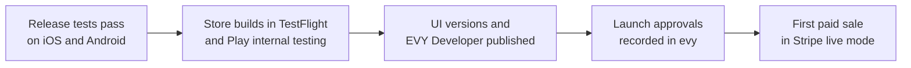
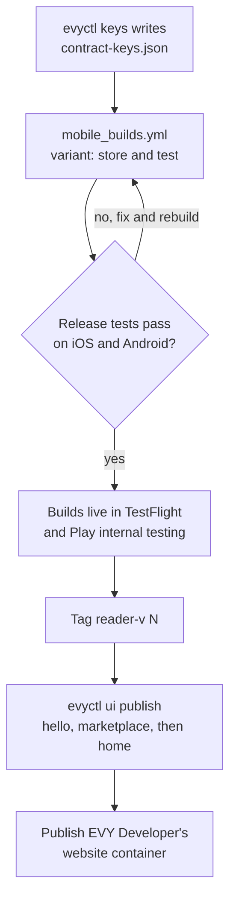

# 2.10 Testing and release

## Repositories

| Repository | Role | Work in this plan |
| --- | --- | --- |
| [evy](https://github.com/EVY-Platform/evy) | Modified | Release tests. The `block` action in the SwiftUI and Compose readers. Store listings and the support page. Launch approvals and pilot results in `docs/launch/`. Reports contract. Report, Block and terms rows in `freenet/ui/marketplace.json`. `evyctl record list` |
| [freenet-appkit](https://github.com/glesage/freenet-appkit) | Used | Swift package, Kotlin library, store build checks and the packaging CLI |
| [freenet-core](https://github.com/freenet/freenet-core) | Used | Pinned Core build, the EVY operator node and `fdev verify-merge` |
| [freenet-test-network](https://github.com/freenet/freenet-test-network) | Used | Isolated test network |
| [stripe-ios](https://github.com/stripe/stripe-ios), [stripe-android](https://github.com/stripe/stripe-android) | Used | Payment sheets in Stripe test mode and live mode |

## Purpose

Test milestone 2 (EVY on Freenet) on real iOS and Android phones using the thin-peer role from [1.8 Thin-peer role and cellular data budgets](../1-freenet-mobile-appkit/08-thin-peer.md). Release EVY to TestFlight and Play internal testing, then enable live payments.

Release requires every [release test](#release-tests) to pass. This includes each earlier plan's acceptance criteria and tests of features that depend on several plans.

## Test setup

Run every test on real phones with the node in network mode to exercise delegate prompts and contract notifications ([River scope in 1.9 Testing and release](../1-freenet-mobile-appkit/09-testing-and-release.md#river-scope)). Simulator and emulator runs are reported apart.

- Alice and Bob use real phones. Alice has an iPhone on iOS 17 and Bob an Android phone on Android 9 (API 28), the minimum versions in [The EVY app on iOS and Android in 2.1 Hello EVY world](01-hello-evy-world.md#the-evy-app-on-ios-and-android). A current iPhone and a current Android phone run every test too. Every phone runs in the thin-peer role.
- Use test UI contracts. A test UI contract runs the UI contract code with a test key and a service ID as parameters. Its `resources` map gives static collections test parameters. Shared resource adapters derive dynamic purchase instances from those test listings and participant keys, and use the test payment service. Preview validation checks the binding dependency graph.
- Build the iOS and Android test apps with `mobile_builds.yml` from [Builds from GitHub in 2.3 Native SDUI readers](03-readers.md#builds-from-github) with `variant: test`. It installs beside the store build and opens any UI contract key from "Scan preview", as [Previewing on a phone in 2.5 EVY Developer on Freenet](05-developer.md#previewing-on-a-phone) describes.

| | Isolated test network | Public network |
| --- | --- | --- |
| Network | freenet-test-network. Each node gets explicit gateways, and each run verifies that all peer connections stay in the isolated network, as River scope in 1.9 Testing and release sets | Freenet's public network through Core's gateways |
| Keys | Every contract built and signed with test keys from `evyctl key new evy-test-publisher`. `evyctl keys` writes a test `contract-keys.json` | The EVY publisher key from [The EVY publisher key in 2.1 Hello EVY world](01-hello-evy-world.md#the-evy-publisher-key) signs `hello` and `marketplace`. Test keys sign test UI contracts |
| EVY builds | Debug builds from Xcode and Android Studio with the test `contract-keys.json` and gateway overrides for the test network | The EVY test build for test UI contracts. The EVY store build for the release |
| Nodes and services | A test EVY operator node, and test deployments of `services/payment`, `services/attribution` and `services/remuneration`, each with its own node | The EVY operator node from 2.1 Hello EVY world and the three services |
| Stripe | Test mode, with Stripe's test cards and test connected accounts | Test mode until every [launch approval](#launch-approvals) is recorded, then live mode |
| Used for | Forged states, serving-peer loss, carrier NAT, a restore drill and refunds after payout with a short payout hold | Release tests on store builds and [the first paid sale](#the-first-paid-sale) |

## Release tests

Run every test on iOS and Android in the thin-peer role. Use the same builds for tests spanning several plans and each plan's acceptance criteria.

| Release test | Passing evidence |
| --- | --- |
| Shared resources across applications | On iOS and Android, create a Marketplace purchase through its flow opened from Home. Home and Marketplace display the same instance, messages and payment state through the common adapters. Two buyers requesting one item retain separate participant views and action targets. The source service, buyer scope, UI version and digest stay bound to each purchase. Address-book records survive restore and migration; only intended recipients open shared address copies. Shared file references resolve to the same verified content. Unknown adapters, substituted contexts and unauthorized writes fail the checks in [Resource operations and permissions in 2.4 SDUI data and actions](04-data-and-actions.md#resource-operations-and-permissions) |
| Equal-version UI documents | Publish two valid signed documents at the same version and deliver them in opposite orders on iOS and Android. Contracts, native readers, preview readers and EVY Developer choose the higher `state_hash`, retain it after restart or reload, and ignore duplicate or lower tuples. An open flow keeps its exact document until exit. A winning document requiring a newer reader keeps the saved drawable document and update banner; a compatible reader update draws the winner. Both publishing tools report a losing attempt on readback |
| UI version during a purchase | Bob asks to buy the skateboard from Marketplace version 2. The EVY publisher publishes version 3 while Bob is inside a flow and again before the Saturday pickup. The new version applies when Bob leaves the flow ([Reading a UI contract in 2.3 Native SDUI readers](03-readers.md#reading-a-ui-contract)), and he pays in version 3. The purchase record keeps `"ui_version": 2` and its `ui_digest` from his request, and the remuneration service uses the matching archived document and snapshot |
| Archive before publication | Publish versions 2 and 3 rapidly with snapshot processing paused. Both publishing tools receive durable archive receipts before their Freenet updates. Resuming processing recovers version 2's exact bytes and snapshot. Archive outages keep publication pending; interrupted publication retries the same bytes. The recovery drill restores acknowledged entries from the immutable bucket copies, as [Archiving before publication in 2.8 Attribution](08-attribution.md#archiving-before-publication) requires |
| Newer reader during a sale | Version 3 needs a `min_reader_version` above Bob's build while his purchase is `pickup_pending`. His phone keeps drawing the saved version 2 with the update banner ([Reader compatibility in 2.2 EVY UI contracts and publishing](02-ui-contracts.md#reader-compatibility)), and he pays and receives the skateboard. After he installs the new store build, his phone draws version 3 and shows the purchase as `sold` |
| EVY delegate update during a purchase | Alice installs an EVY build with a new EVY delegate while her purchase is `pickup_pending`. The move in [Updating the EVY delegate in 2.4 SDUI data and actions](04-data-and-actions.md#updating-the-evy-delegate) keeps her seller key, so she still reads her sealed pickup address and signs `transaction_completed`. Closing EVY during migration preserves the records; the next start completes the move |
| Offline at the pickup | Alice taps "Confirm" with no signal, and Bob closes EVY right after paying. With the purchase state retained within Core's hosting budget, Core merges Alice's message locally and sends it on reconnect ([Offline writes in 2.4 SDUI data and actions](04-data-and-actions.md#offline-writes)). The payment service captures once, and both phones show `sold` |
| Declined card and retry | On iOS and Android, Bob's first card is declined and he chooses to try again with a valid card on the same purchase and PaymentIntent. The payment record follows `failed → intent → succeeded` with increasing revisions, as [Retrying a card payment in 2.6 Payments](06-payments.md#retrying-a-card-payment) specifies. Delayed and duplicate failure events preserve the successful result, and Alice's confirmation produces one successful charge and one contributor fee |
| Seller closes before capture | Alice confirms the handover and closes EVY before capture finishes. The payment service publishes `succeeded`; Bob's reader and a third reader derive `sold` from the purchase and hide the listing from available-item search. The item record's revision stays unchanged. Retained sale references and unknown-availability cases pass [Item availability in 2.7 EVY Marketplace](07-marketplace.md#item-availability) on iOS and Android |
| Code eligibility and verified merge | Publish a Marketplace UI version while Dan's attribution check passes and his PR awaits merge. His units enter the first UI snapshot published after its verified merge and committed acceptance, following [Code contributions in 2.8 Attribution](08-attribution.md#code-contributions). Changed heads renew eligibility; duplicate merge events and a restart preserve one initial acceptance |
| Cellular caps across the sale | Run the whole sale on cellular with a listing with three photos under 1 MiB each, the request, accept, payment and confirm. The node's bytes for each step fit the budgets in [Cellular budget contract in 1.8 Thin-peer role and cellular data budgets](../1-freenet-mobile-appkit/08-thin-peer.md#cellular-budget-contract). Stripe's payment sheet talks to Stripe outside the node, so its bytes are recorded apart. A phone that reaches its cap keeps its drafts and pending records, and the sale finishes with one charge after a new allowance |
| Marketplace reader parity | The home service's "Home" flow and Marketplace's "View Item" and "Create item" flows at versions 1 and 2, with the payment step, Report, Block and terms rows, give the same semantic snapshots and action traces on SwiftUI and Compose, as [Keeping both readers the same in 2.3 Native SDUI readers](03-readers.md#keeping-both-readers-the-same) sets. VoiceOver and TalkBack read the same names |
| Partial and repeated refunds | On iOS and Android, refund 35.00 dollars of the completed skateboard sale. The purchase stays `sold`, both phones show the partial refund and the listing stays closed. Signed totals are `refunded_cents: 3500` and `fee_refunded_cents: 35`; the ledger reverses 35 cents. Refund the remaining 35.00 dollars: totals become 7000 and 70 and the purchase becomes `refunded`. Run before and after payout, with duplicate and reordered buyer and fee-refund events, a fee-only refund, and a restart. Reversal totals match the original allocations and one full refund. First observation after refund applies allocation and reversal together before payout |
| Refund after payout | On the isolated network, a test policy sets `payout_hold_days` to 0. Carol is paid out for the sale, then the EVY operator refunds Bob with `payment_refund`. Bob gets 70.00 dollars back, Alice returns 69.30 and EVY 0.70. The payment record and the purchase show `refunded`, and the ledger holds Carol -24 cents, Dan -36, the reviewer -7 and the validator -3 ([Refunds after payout in 2.9 Remuneration and payouts](09-remuneration.md#refunds-after-payout)). The next credits pay them off |
| Core version | A test peer requires a newer Core than the store builds pin. Both phones show "Update EVY" from [Offline and before the first read in 2.1 Hello EVY world](01-hello-evy-world.md#offline-and-before-the-first-read) and keep drawing saved UI documents. The [Core version rule in 1.9 Testing and release](../1-freenet-mobile-appkit/09-testing-and-release.md#core-version-and-the-network) holds for both builds |
| [Acceptance in 1.8 Thin-peer role and cellular data budgets](../1-freenet-mobile-appkit/08-thin-peer.md#acceptance) | Passes with EVY's workloads on the pinned Core build |
| [Acceptance in 2.1 Hello EVY world](01-hello-evy-world.md#acceptance) | Passes on the store builds |
| [Acceptance in 2.2 EVY UI contracts and publishing](02-ui-contracts.md#acceptance) | Passes for the `hello` and `marketplace` UI contracts |
| [Acceptance in 2.3 Native SDUI readers](03-readers.md#acceptance) | Passes on builds from one `mobile_builds.yml` run |
| [Acceptance in 2.4 SDUI data and actions](04-data-and-actions.md#acceptance) | Passes on the store builds |
| [Acceptance in 2.5 EVY Developer on Freenet](05-developer.md#acceptance) | Passes with EVY Developer from its published container |
| [Acceptance in 2.6 Payments](06-payments.md#acceptance) | Passes in Stripe test mode |
| [Acceptance in 2.7 EVY Marketplace](07-marketplace.md#acceptance) | Passes on the store builds |
| [Acceptance in 2.8 Attribution](08-attribution.md#acceptance) | Passes for Marketplace version 2 |
| [Acceptance in 2.9 Remuneration and payouts](09-remuneration.md#acceptance) | Passes, including the restore drill |
| Distribution | The TestFlight and Play internal testing builds pass review, and every [store requirement](#store-requirements) holds |

## Store requirements

Release EVY through TestFlight on iOS and Play internal testing on Android. Listings and requests must meet both stores' user-generated content rules and the [store requirements in 1.9 Testing and release](../1-freenet-mobile-appkit/09-testing-and-release.md#store-requirements).

| Requirement | What the release does | App Store | Google Play |
| --- | --- | --- | --- |
| Reporting | "Item details" has a Report button. It runs `create(marketplace.reports, submit)` on a reports contract with the state shape of [The guestbook contract in 2.4 SDUI data and actions](04-data-and-actions.md#the-guestbook-contract). A report holds the item ID and one reason, `prohibited`, `scam`, `offensive` or `other`, and is signed with a key scoped to the report, to avoid linking reports by the reporter's service key. The Marketplace moderator reads open reports with `evyctl record list marketplace.reports` and acts on each within the time on EVY's support page | [Guidelines](https://developer.apple.com/app-store/review/guidelines/) 1.2 | [User-generated content](https://support.google.com/googleplay/android-developer/answer/9876937) |
| Blocking | "Item details" and each request have a Block button. The new reader action `block(resource, id)` saves the record's `author` in the phone's block list, in Application Support on iOS and the files directory on Android. Both readers then hide every record and message signed by that key in Marketplace. The action adds 1 to `reader_version`, as Reader compatibility in 2.2 EVY UI contracts and publishing sets | Guidelines 1.2 | User-generated content |
| Content filter | Search shows only items from the [curated seller list](#the-first-paid-sale). The moderator removes a reported item with `evyctl record remove marketplace.items <id>` and removes its seller from the list | Guidelines 1.2 | User-generated content |
| Terms | "Create item" and "Item details" show the seller and buyer terms with a required `text_select` tick box before Alice's listing and Bob's request | – | User-generated content |
| Support URL | EVY publishes a support page with contact details, the report response time and the dispute deadlines. Both store listings link to it | Guidelines 1.2 | User-generated content |
| Privacy details | Declare the card and contact details Stripe's payment sheet collects, the device data Stripe collects against fraud ([Stripe mobile SDK privacy details](https://support.stripe.com/questions/stripe-ios-sdk-privacy-details)), the seller identity and bank details Stripe-hosted onboarding collects, the public item data (title, photos, price, pickup postcode and map point), and the EVY public keys and IP addresses the node sends to peers | [App privacy details](https://developer.apple.com/app-store/app-privacy-details/) | [Data safety](https://support.google.com/googleplay/android-developer/answer/10787469) |
| Physical goods | Bob pays for Alice's skateboard in Stripe's payment sheet, as [Store payment rules in 2.6 Payments](06-payments.md#store-payment-rules) sets | Guidelines 3.1.3(e) | [Payments policy](https://support.google.com/googleplay/android-developer/answer/9858738) section 3 |
| Financial features | Declare in Play Console that EVY takes card payments for physical goods through Stripe | – | [Financial features declaration](https://support.google.com/googleplay/android-developer/answer/13849271) |
| Downloaded code | `contract-keys.json` pins the hello contract key, the home UI contract key and the UI contract's code hash, and the app carries the EVY delegate's Wasm. The readers verify UI documents against the pinned publisher keys. UI documents supply screen data to compiled native readers. Preview scanning and preview keys are restricted to test builds | Guidelines 2.5.2; [DPLA](https://developer.apple.com/support/terms/apple-developer-program-license-agreement/) 3.3.1(B) | [Device and network abuse](https://support.google.com/googleplay/android-developer/answer/16559646) |
| Review notes | The notes explain the embedded node in the thin-peer role and the Pulley interpreter, citing Guideline 2.5.2 and DPLA 3.3.1(B) for EVY's contracts and delegate. They say the readers draw signed screen data, that payments are for physical goods picked up in person, and which test listing to open | Guidelines 2.5.2 and 3.1.3(e); DPLA 3.3.1(B) | – |

- `mobile_builds.yml` runs every [store build check in 1.9 Testing and release](../1-freenet-mobile-appkit/09-testing-and-release.md#store-build-checks) on the store variant, with the iOS 17 deployment target and Android `minSdk` 28 from 2.1 Hello EVY world, and `fdev verify-merge` on each contract in `freenet/contracts/`.
- The EVY delegate seals with X25519, HKDF-SHA256 and ChaCha20-Poly1305, which the encryption export row in 1.9 Testing and release already declares.

## Launch approvals

The EVY operator records each approval in `docs/launch/approvals.md` in evy, with the approver, the date and a link to the evidence. `services/payment` and `services/remuneration` switch to Stripe live mode keys only when every row is approved.

| Approval | Approver | Evidence |
| --- | --- | --- |
| Operators | EVY operator | A named primary and backup operator for the EVY operator node, `services/payment`, `services/attribution` and `services/remuneration` |
| Stripe account and country | Financial operations lead | EVY's Australian platform account approved for Connect in live mode, charging in AUD, and test-mode onboarding of a seller like Alice and a contributor like Carol ([Fees and seller accounts in 2.6 Payments](06-payments.md#fees-and-seller-accounts)) |
| Store payment rules | Financial operations lead | A physical-goods sale paid in Stripe's payment sheet on iOS and Android, under Store payment rules in 2.6 Payments, and both store reviews passed |
| Money rules | Financial operations lead | Marketplace's signed service policy with `fee_rate_bp` 100 ([Service policy in 2.8 Attribution](08-attribution.md#service-policy)). EVY pays Stripe's fees, refunds and chargebacks from its own budget (Fees and seller accounts in 2.6 Payments). Negative balances after a refund after payout, and EVY carrying any that later earnings never pay off (Refunds after payout in 2.9 Remuneration and payouts) |
| Payouts | Financial operations lead | Values for `payout_minimum_cents` and `payout_schedule`, which [Balances and payouts in 2.9 Remuneration and payouts](09-remuneration.md#balances-and-payouts) leaves to the service publisher, signed in a Marketplace policy version with Stripe's Connect fees in mind |
| Retention and recovery | EVY operator | The retention period for the monthly full backups, and a passing restore drill that meets every recovery point and time in [Operating the services in 2.9 Remuneration and payouts](09-remuneration.md#operating-the-services) |
| Key custody | EVY operator | A named holder and tested backup for the EVY publisher key, the payment and attribution service keys, the Stripe restricted keys and webhook secret, the backup key, and the `mobile-builds` secrets from [Builds from GitHub in 2.3 Native SDUI readers](03-readers.md#builds-from-github) |
| Moderation and disputes | Marketplace product owner | A named Marketplace moderator, the report response time, the dispute deadlines (Bob raises a dispute within 14 days of the pickup, and the moderator decides within 7 days) and the moderator's refund access through `payment_refund` or the Stripe Dashboard ([Refunds in 2.6 Payments](06-payments.md#refunds)). Card chargebacks follow [Stripe's dispute flow](https://docs.stripe.com/disputes) |
| Participant terms and privacy notices | Marketplace product owner | The seller and buyer terms. A privacy notice that lists what anyone can read in the items and purchase contracts, the pickup address only Alice and Bob read, and what Stripe holds |

## The first paid sale

The first live sale is a pilot:

- Run the pilot in Sydney, Australia, using AUD. Sydney is the city of Marketplace's fixture addresses in [service_data.json](https://github.com/EVY-Platform/evy/blob/dev/scripts/fixtures/services/service_data.json), and AUD is the one currency of EVY's Stripe code.
- The EVY publisher adds each pilot seller's key to a `sellers` lookup in Marketplace's lookups contract ([What is cloned in 2.7 EVY Marketplace](07-marketplace.md#what-is-cloned)). Search in the "Home" flow shows only their items. Every listed seller has finished Stripe onboarding.
- Invite pilot users to install the store builds from TestFlight and Play internal testing. [TestFlight](https://developer.apple.com/testflight/) takes up to 10,000 external testers after Apple's beta review, and [Play internal testing](https://support.google.com/googleplay/android-developer/answer/9845334) up to 100 testers.

Alice on her iPhone sells her skateboard for 70 dollars to Bob on his Android phone, with Saturday pickup:

| Step | Who | What happens | Owning plan | What is checked |
| --- | --- | --- | --- | --- |
| 1 | Alice | Taps "Get paid" and links her Stripe account | [Fees and seller accounts in 2.6 Payments](06-payments.md#fees-and-seller-accounts) | `account.updated` shows transfers enabled. Her key is on the seller list |
| 2 | Alice | Accepts the seller terms and lists the skateboard in "Create item" for 70 dollars, with photos and Saturday pickup times | [The skateboard sale in 2.7 EVY Marketplace](07-marketplace.md#the-skateboard-sale) | The item is `available` on Bob's phone and on an independent peer |
| 3 | Bob | Accepts the buyer terms and taps "Request 10:00" for Saturday | The skateboard sale in 2.7 EVY Marketplace, with `ui_version` and `ui_digest` from [Purpose in 2.9 Remuneration and payouts](09-remuneration.md#purpose) | The purchase record is signed by Bob's buyer key, with `amount_cents` 7000, `fee_cents` 70 and the version and digest of the UI document his reader drew |
| 4 | Alice | Taps "Accept" in "For you" | The skateboard sale in 2.7 EVY Marketplace | `pickup_pending`. Alice's and Bob's phones open the sealed pickup address |
| 5 | Bob | At the pickup on Saturday, taps "Item received" and pays in Stripe's payment sheet | [Paying on a phone in 2.6 Payments](06-payments.md#paying-on-a-phone) | One PaymentIntent of 7,000 cents AUD with a 70-cent application fee. The payment record is `intent` |
| 6 | Alice | Taps "Confirm" in "Item given" | Paying on a phone in 2.6 Payments | The payment record is `succeeded` and the purchase `sold`. Alice's account receives 69.30 dollars and EVY holds 0.70 |
| 7 | Remuneration service | Credits the 0.70 dollars | [Crediting a completed purchase in 2.9 Remuneration and payouts](09-remuneration.md#crediting-a-completed-purchase) | One allocation per capability and recipient. With Marketplace version 2's snapshot: Carol 24 cents, Dan 36, the reviewer 7 and the validator 3 |
| 8 | Remuneration service | Pays each balance after `payout_hold_days`, once it reaches `payout_minimum_cents`, on `payout_schedule` | Balances and payouts in 2.9 Remuneration and payouts | One Stripe transfer per payout. Carol sees it on her payouts page |

The sale then runs again with the seller on an Android phone and the buyer on an iPhone, with the same checks at each step. The EVY operator writes both runs to `docs/launch/first-sale.md` in evy, with the build numbers, the Marketplace UI version and the purchase contract keys.

## Releasing from GitHub

A maintainer releases EVY from one evy commit. Readers reach the stores before any UI version that needs them, as [Reader compatibility in 2.2 EVY UI contracts and publishing](02-ui-contracts.md#reader-compatibility) requires.

| Step | What happens | Check |
| --- | --- | --- |
| 1. Pin keys | `evyctl keys --out types/freenet/contract-keys.json` runs on the release commit, as [Pinned keys in 2.1 Hello EVY world](01-hello-evy-world.md#pinned-keys) describes, and the file is committed with it | CI in evy passed, including the `legacy.toml` check. Each pinned key reads back on the public network |
| 2. Build | The maintainer runs `mobile_builds.yml` on the commit with `variant: store`, then with `variant: test` Publishes each variant to TestFlight and Play internal testing | The build number and the `versionCode` are the workflow run number. The run summary lists the commit, both build numbers, the freenet-appkit release and the hash of `contract-keys.json`. The release checklist records the pinned Core version and the network's `min-compatible-version` |
| 3. Test | The [release tests](#release-tests) run on these builds. UI versions that need the new reader run as test UI contracts in the EVY test build | Every row passes |
| 4. Tag | Once both store builds are live, evy tags the commit `reader-v<N>`, where N is its `reader_version` | The tag names the reader that store users can install |
| 5. Publish UI versions | `evyctl ui publish --service hello --key evy-publisher freenet/ui/hello.json`, then the same for `marketplace` with `freenet/ui/marketplace.json`, then `home` with `freenet/ui/home.json` last, so its `services` and `navigate` targets name only published documents. Each runs with `--min-reader-version <N>`, as [Publishing a UI version in 2.2 EVY UI contracts and publishing](02-ui-contracts.md#publishing-a-ui-version) describes Publishes the next `hello`, `marketplace` and `home` UI versions | Each readback through a second node returns the signed bytes |
| 6. Publish EVY Developer | The EVY publisher publishes `web/dist/` from the same commit with the packaging CLI, `--key evy-publisher` and the pinned container Wasm, as [The EVY Developer bundle in 2.5 EVY Developer on Freenet](05-developer.md#the-evy-developer-bundle) describes | The prepared signed state is saved before submission, its version increases, and exact readback through a second node produces its `publication_ref`. The container key is unchanged, and `types/schema/sdui/version.json` matches the store builds |

A UI version that needs only a reader already in the stores publishes at any time with step 5 alone. A new service needs only a new home version. A change to the home UI contract key or the UI contract's code ships only in a new store build.
