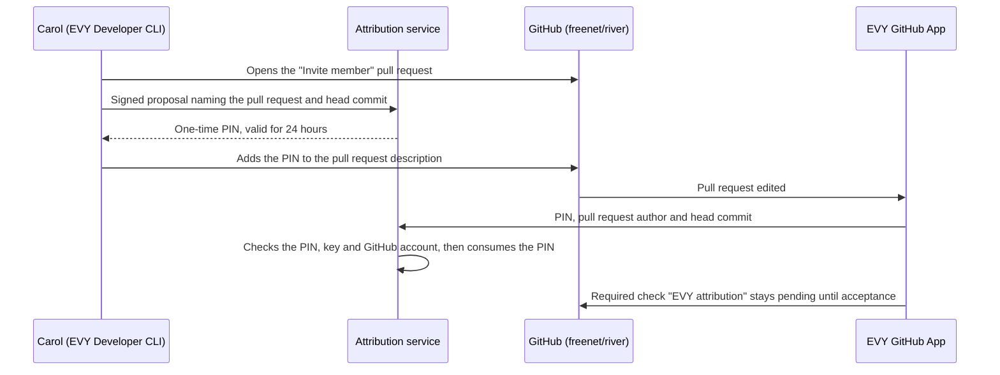

# 3.1 Contributor registration and attribution

## Repositories

| Repository | Role | Work in this plan |
| --- | --- | --- |
| [evy](https://github.com/EVY-Platform/evy) | Modified | Creates `services/attribution` for products, contributor keys, PINs, proposals, reviews, size decisions, challenges, units, product policies and key recovery. Creates the EVY GitHub App, which checks PINs and posts the required merge check. Creates the EVY Developer CLI in `cli/` with its key, registration and proposal commands |
| [river](https://github.com/freenet/river) | Used | Fixture product: its repository, the website container files in [`published-contract/`](https://github.com/freenet/river/tree/main/published-contract) and Carol's "Invite member" pull request |
| [freenet-core](https://github.com/freenet/freenet-core) | Used | `fdev get-contract-id` shows how the service recomputes a website container's contract key |

## Purpose

This plan lets EVY credit contributors for work merged into a product's repository. A product is a GitHub repository plus its website container key. The attribution service registers products and contributor keys, links each pull request to a signed proposal, and turns reviewed, sized work into attribution units. The product owner signs one versioned product policy with the product's fee rate, capability weights, contribution rules and payout terms.

The River publisher registers River. Carol opens a pull request to River that reworks the "Invite member" screen in [`invite_member_modal.rs`](https://github.com/freenet/river/blob/main/ui/src/components/members/invite_member_modal.rs). A reviewer and a validator sign, the service accepts her work at size 8, and Carol earns 6.8 units for the capability `river.member.invite`. River has no paid operations, so her credit stays in units.

## Registering a product

A website container's contract key derives from the container code and the publisher's verifying key, as [1.7 Upgrades and migration](../1-freenet-mobile-appkit/07-migration.md#component-identity-and-re-keying) describes. The service uses that key to confirm that the registrant publishes the container.

| Step | Who | Rule |
| --- | --- | --- |
| 1. Sign | River publisher | Runs `evy product register` with the repository `freenet/river`, the code and parameters from `published-contract/` and a new product owner key. The CLI signs the statement with the key that signs River's releases. |
| 2. Check the container | Attribution service | Recomputes the contract key from the code and parameters, as `fdev get-contract-id` does. Checks the signature against the verifying key in the parameters. |
| 3. Check the repository | EVY GitHub App | The publisher installs the App on `freenet/river`. The service asks the GitHub API whether the registrant has admin rights on the repository. |
| 4. Record | Attribution service | Stores the repository, the contract key `raAqMhMG7KUpXBU2SxgCQ3Vh4PYjttxdSWd9ftV7RLv` and the product owner key. Refuses a second product with the same repository or key, so River and Atlas stay separate products.<br>--> Produces River's product record |

## Contributor keys

Carol runs `evy key create` on her laptop. The CLI writes an Ed25519 key file encrypted with her passphrase and asks her to save a backup copy. `evy register` signs a registration statement with the key and opens GitHub sign-in. The service stores her public key and her GitHub user ID under a new `ActorId`. `evy key rotate` signs a statement with the old key that names the new key, and the new key keeps Carol's `ActorId`, roles and units.

| Carol's situation | What the service does |
| --- | --- |
| She restores her backup key file | Nothing. The key and `ActorId` are unchanged. |
| She lost the key and has no backup | She creates a new key and signs in with the GitHub account recorded at registration. The service links the new key to her `ActorId` after a 7-day hold. A signature from the old key during the hold cancels the link. |
| She lost the key and the GitHub account | The new key gets a new `ActorId` with the contributor role only. Her earlier units stay with the old `ActorId`. |

## Product policy

The product owner signs each policy version with the product owner key. A new version applies to proposals accepted after it is signed, and each acceptance records the version it used.

```jsonc
{
  "product": "raAqMhMG7KUpXBU2SxgCQ3Vh4PYjttxdSWd9ftV7RLv", // River's website container key
  "version": 1,                                             // a new number for every change
  "fee_rate_bp": 100,                                       // 1% of each paid operation. River has none
  "capabilities": {                                         // share of each fee, in basis points
    "river.member.invite": 2000,
    "river.message.send": 8000
  },
  "sizes": [1, 2, 3, 5, 8, 13, 21],                         // the sizes a proposal can have
  "role_split_bp": [8500, 1000, 500],                       // contributors, reviewer and validators
  "challenge_days": 30,                                     // days after acceptance to open a challenge
  "payout_hold_days": 30,                                   // days after completion before a share is payable
  "payout_minimum_cents": 1000,                             // 10 dollars
  "payout_schedule": "monthly",
  "signature": "ed25519:..."                                // by the product owner key
}
```

## Roles

| Role | Signs | Eligible when |
| --- | --- | --- |
| Contributor | Proposals and contributor shares | Has a registered key |
| Reviewer | Approval or rejection of an evidence revision | Has two accepted proposals in the product, or is on its bootstrap list |
| Validator | Size estimates | Has two accepted proposals and two accepted reviews in the product, or is on its bootstrap list |

A new product has no accepted work, so the product owner signs a bootstrap list of first reviewers and validators. Nobody reviews or validates a proposal they contribute to. Eligibility follows the `ActorId`, so a rotated key keeps its roles.

## Proposals and pull requests

A credited capability such as `river.member.invite` names behavior that earns credit. A permission in the [app definition](../1-freenet-mobile-appkit/04-bundles.md#the-archive-and-its-definition), such as notifications, is a separate thing. Carol's proposal names:

- her pull request
- each capability it touches, with shares that total 10,000 basis points (here `river.member.invite` at 10,000)
- each contributor's share, signed by that contributor (here Carol at 10,000)
- a proposed size from the policy's `sizes`

The evidence revision is the pull request's head commit plus the evidence Carol signed with it. A new commit creates a new evidence revision, and the reviewer and validator sign again.



The PIN ties the pull request to one signed proposal, and the author field ties it to Carol's GitHub account. The service stores the GitHub response and the checked revision, so later edits to the description leave that record unchanged.

| Step | Who | Rule |
| --- | --- | --- |
| 1. Review | Reviewer | Signs approval or rejection of the evidence revision. A rejection closes the proposal. To continue, Carol opens a new proposal that links the rejected one. |
| 2. Size | Validator | Signs a size estimate. The size decision table below sets who earns the validator part. |
| 3. Accept | Attribution service | Accepts when the review, size and shares are signed and no challenge is open.<br>--> Produces an acceptance naming the evidence revision, size, shares and policy version |
| 4. Merge | EVY GitHub App | Marks the check passed. GitHub branch protection lets River's maintainers merge only after that. |

| Size decision | Who earns the validator part |
| --- | --- |
| The first validator's estimate equals the proposed size | The first validator, all of it |
| They differ, and a second validator picks the first validator's size | Both validators, half each |
| They differ, and a second validator picks the proposed size | The second validator, all of it |

## Challenges

| Challenge | Opened by | Resolved when |
| --- | --- | --- |
| Omitted author | The person left out | The claimant and every contributor on the proposal sign a resolution |
| Shares | A contributor on the proposal | Every contributor on the proposal signs a resolution |
| Size | A contributor or validator on the proposal | A validator outside the proposal picks one of the disputed sizes |

A challenge opened before acceptance blocks acceptance. A challenge opened within `challenge_days` after acceptance marks the acceptance as challenged. A resolution that changes shares or size creates a new acceptance, and the old one stays in the audit history. The challenger can withdraw a challenge, and a contributor can withdraw a proposal. Both keep their evidence.

## Units

The service splits each accepted size by the policy's `role_split_bp` and stores units as integer ten-thousandths of a size point. Units across all capabilities of a proposal sum to its accepted size. Carol's proposal is accepted at size 8, and the first validator agreed.

| Recipient | Rule | Units | Stored |
| --- | --- | ---: | ---: |
| Carol | 85% of 8, her share 10,000 | 6.8 | 68,000 |
| Reviewer | 10% of 8 | 0.8 | 8,000 |
| Validator | 5% of 8 | 0.4 | 4,000 |
| Total | | 8 | 80,000 |

## Acceptance

- The River publisher registers River. The service recomputes River's contract key and refuses a statement signed by any other key, a registrant without admin rights on `freenet/river`, and a second product that names River's repository or contract key.
- Carol's PIN is accepted once. The service refuses a replayed PIN, a PIN older than 24 hours, a PIN bound to another key and a PIN in another repository's pull request. A later description edit leaves the recorded decision unchanged.
- A new commit on Carol's pull request sets the check back to pending until the reviewer and validator sign again. GitHub blocks the merge until the check passes.
- The service refuses self-review, self-validation, reviewers who are not eligible, sizes outside the policy, share totals other than 10,000 and a product policy not signed by the product owner key.
- Validator units follow the size decision table in all three cases.
- An open challenge blocks acceptance. A challenge after acceptance marks it challenged, and its resolution creates a new acceptance while the old one stays in the history.
- Recomputing units from stored acceptances reproduces Carol's example exactly, and units always sum to the accepted size.
- A rotation signed by Carol's old key keeps her `ActorId`. A GitHub-based recovery links the new key after the 7-day hold, and an old-key signature during the hold cancels it.
