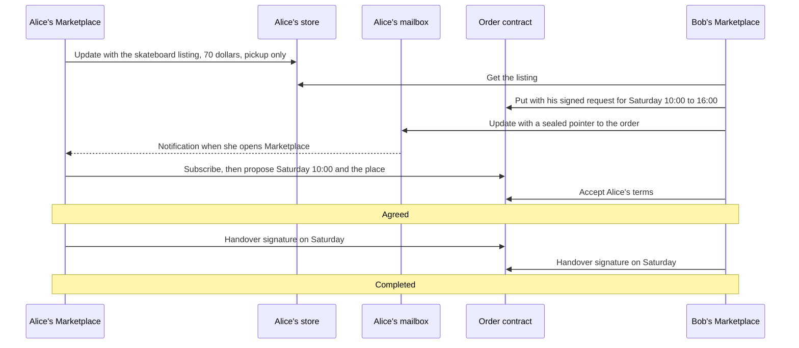

# 3.3 Marketplace pickup protocol

## Repositories

| Repository | Role | Work in this plan |
| --- | --- | --- |
| `evy-marketplace` | Created | Store, mailbox and order contracts, the Marketplace delegate, the web UI with its `app_definition.json`, and codec, merge and migration fixtures |
| [evy](https://github.com/EVY-Platform/evy) | Modified | Marketplace catalogue entry in the internal test release configuration of the iOS and Android apps |
| `freenet-appkit` | Used | Packaging CLI from 1.4 Application bundles and the WebView host |
| [freenet-core](https://github.com/freenet/freenet-core) | Used | Sessions in `crates/mobile` and delegate subscription demand [#5493](https://github.com/freenet/freenet-core/pull/5493) |
| [freenet-migrate](https://github.com/freenet/freenet-migrate) | Used | `migrate_contract` and `migrate_delegate_secrets` on first start, as in 1.7 Upgrades and migration |
| [harvest](https://github.com/freenet/harvest) | Used | Mailbox contract and encryption, request and order IDs from instant checkout [#159](https://github.com/freenet/harvest/pull/159) and merge-law tests, as design sources |

## Purpose

This plan builds Marketplace, an app where Alice sells a skateboard to Bob for pickup. Alice lists it for 70 dollars. Bob asks to pick it up on Saturday, they agree a time and place, and on Saturday they both sign the handover. This plan moves no money. [3.4 Payments and checkout](04-payment.md) adds payment records and a paid state to the same order.

Marketplace is a web app in its own release bundle, packaged with the [packaging CLI in 1.4 Application bundles](../1-freenet-mobile-appkit/04-bundles.md#publishing-and-evidence). EVY's internal test builds for iOS and Android list it in their release configuration. It runs beside River and Atlas in its own session, as [2.1 EVY shell and curated catalogue](../2-evy-mobile-app/01-catalogue.md) and [2.2 Two apps on one node](../2-evy-mobile-app/02-shared-node.md) describe, on the phone's thin peer from [1.8 Thin-peer role and cellular data budgets](../1-freenet-mobile-appkit/08-thin-peer.md). Its `app_definition.json` declares `marketplace.fulfillment.agree` and `marketplace.order.complete` in the `capabilities` list from [3.2 Release certification](02-certification.md).

## Contracts and the delegate

| Component | Key parameters | Writers | Holds |
| --- | --- | --- | --- |
| Store contract | Alice's store verifying key | Alice | Her store profile and her signed listings, such as the skateboard |
| Mailbox contract | Alice's store verifying key | Anyone | Sealed first-contact messages to Alice, one mailbox per store, as in [Harvest's mailbox](https://github.com/freenet/harvest/blob/main/contracts/mailbox-contract/src/lib.rs) |
| Order contract | Alice's store key, Bob's order key and the order ID | Alice and Bob | Every signed record of one order, from Bob's request to the handover |
| Marketplace delegate | Empty | None | Alice's store keys, Bob's per-order keys, drafts, signed records waiting to be sent and the list of open orders |

Bob's delegate makes a fresh signing key for each order, so his orders share no key. Marketplace lists these four components in its `app_definition.json`, as River does in [1.4 Application bundles](../1-freenet-mobile-appkit/04-bundles.md#the-archive-and-its-definition).

## The skateboard sale



First contact follows Harvest. Bob's delegate seals the pointer with Harvest's mailbox encryption, which uses X25519 with Bob's ephemeral key, AES-256-GCM with a key per direction, and every envelope field as associated data ([messaging-privacy.md](https://github.com/freenet/harvest/blob/main/docs/messaging-privacy.md)). The pointer carries a 16-byte nonce, the time of Bob's request and Bob's order key.

IDs follow Harvest's instant checkout ([payment.rs](https://github.com/freenet/harvest/blob/main/common/src/payment.rs)). The request ID is BLAKE3 of Bob's ephemeral routing key and the nonce. The order ID is a hash of the request ID and the request time. Alice's delegate derives the order contract key from the order ID and the two keys, and refuses a pointer whose order contract doesn't match.

Bob's request waits in the mailbox until Alice opens Marketplace, and she answers it herself. Harvest's instant checkout shows how her delegate could accept requests that match a listing's fixed terms while she is away.

Anyone can read Alice's store and listings, the mailbox's message count, padded sizes, arrival times and routing keys, and each order contract's parameters, record kinds, amount and currency. Only Alice and Bob can read the mailbox messages and the `private` part of each order record.

## Order records

Every record in the order contract carries its author's signature, because mailbox encryption proves no authorship. Private terms are encrypted under a key that Alice and Bob both derive from the mailbox conversation. Alice's proposal for the skateboard:

```jsonc
{
  "kind": "propose",                             // propose, accept, decline, cancel or handover
  "order_id": "9f2c...",                         // hash of the request ID and the request time
  "author": "alice-store-key",                   // a writer named in the contract parameters
  "seq": 2,                                      // Alice's 2nd record in this order, at most 16
  "listing": "skateboard, revision 3",           // exact listing revision in Alice's store
  "quantity": 1,
  "amount_minor": 7000,                          // 70.00 dollars
  "currency": "AUD",
  "private": {                                   // encrypted, only Alice and Bob read it
    "pickup_start": "2026-10-03T10:00:00+10:00", // Saturday
    "pickup_end": "2026-10-03T10:30:00+10:00",
    "place": "Brunswick skate park, north entrance"
  },
  "terms_digest": "41ab...",                     // BLAKE3 over every term above, signed by accept and handover
  "signature": "..."                             // Alice's Ed25519 signature over the whole record
}
```

| Record | Who writes it | Effect |
| --- | --- | --- |
| `propose` | Alice or Bob | Sets new terms with their own digest. The author agrees to those terms |
| `accept` | The other party | Signs the digest of the latest proposal. The order is agreed once Alice and Bob have both signed one digest |
| `decline` | Alice | Ends the order before agreement |
| `cancel` | Alice or Bob | Ends the order before handover |
| `handover` | Alice and Bob, one each | Signs the agreed digest at pickup. The order is completed once both exist |

The contract keeps every valid record and each delegate derives the state from them. Both handover records win over any cancel. A cancel wins over a concurrent accept. Two different records with the same author and `seq` make the order conflicted, and the app then offers only cancel. Alice's delegate counts agreed orders against the listing's quantity and refuses to propose or accept past it.

## Bounds

| Contract | Record size | Capacity | Past the limit |
| --- | --- | --- | --- |
| Store | 4 KiB | One profile and 256 listings | The contract rejects the update. Each listing keeps its highest signed revision, and the lower digest wins at an equal revision |
| Mailbox | Padded to 1, 4, 16 or 64 KiB | 512 messages and 4 MiB, as in Harvest | Harvest's ranking evicts messages |
| Order | 4 KiB | 16 records per writer, numbered by `seq` | The contract rejects a record past `seq` 16. For a repeated `seq` it keeps the two lowest digests |

## Sending, lost state and upgrades

- The delegate keeps Bob's draft request and its signed bytes. If the app stops before Core answers, Marketplace resends the same bytes, as in [1.6 Application protocols, data and operations](../1-freenet-mobile-appkit/06-data-and-operations.md#sending-updates). A send is draft, sent or rejected.
- Bob's app resends the same sealed pointer until Alice's first record appears in the order.
- Alice's delegate subscribes to her store and mailbox, and each delegate subscribes to its open orders, so their nodes keep them hosted once [#5493](https://github.com/freenet/freenet-core/pull/5493) lands. If the network loses one, the app PUTs its node's copy back, as in [lost network state in 1.6 Application protocols, data and operations](../1-freenet-mobile-appkit/06-data-and-operations.md#lost-network-state).
- Each contract and the delegate has a [predecessor registry in 1.7 Upgrades and migration](../1-freenet-mobile-appkit/07-migration.md#predecessor-registry). When a new version first starts, Marketplace runs `migrate_contract` for Alice's store, her mailbox and each open order, and `migrate_delegate_secrets` for its delegate. It retries on the next start, as [Harvest](https://github.com/freenet/harvest/blob/main/ui/src/migrate.rs) does. Order parameter bytes stay unchanged, so the app can derive each old order key.
- Before Alice [forgets Marketplace](../1-freenet-mobile-appkit/05-identity.md#forget), the app lists her open orders and warns that forgetting deletes the keys that sign their handover.

## Acceptance

- On iOS and Android, in EVY, Alice lists the skateboard for 70 dollars, Bob requests Saturday pickup while Alice's phone is off, Alice finds the request when she opens Marketplace and proposes 10:00 and the place, Bob accepts, and both sign the handover. Both apps show the order completed, and an independent peer reads the same order state.
- On iOS and Android, Alice cancels one open order and Bob cancels another, and neither app then offers accept. A concurrent cancel and accept merge to cancelled on every replica. Alice's delegate refuses a second agreed order for the sold skateboard.
- Property tests, run like [Harvest's merge laws](https://github.com/freenet/harvest/tree/main/tests/merge-laws), prove associativity, commutativity and idempotence for the store, mailbox and order contracts, and cover every bound in the table.
- ID fixtures match Harvest's derivation, and Alice's delegate refuses a pointer whose order parameters don't derive from Bob's sealed request. Known-answer vectors cover the mailbox encryption, and a changed envelope field, a reflected ciphertext or a replayed nonce fails.
- The order contract rejects a bad signature, a writer not in its parameters, a record past `seq` 16 and an accept for an older digest. A repeated `seq` marks the order conflicted.
- Killing the app on iOS and Android while drafting, signing and sending keeps Bob's draft and signed bytes, and a resend leaves one copy of the record.
- In an isolated test network, an order that loses its network copy is PUT back from Alice's node and an independent peer reads it.
- On iOS and Android, a new version with new order contract code carries an open order forward. A failed migration keeps the old data and runs again on the next start.
- Forgetting Marketplace with an open order shows the warning first.
