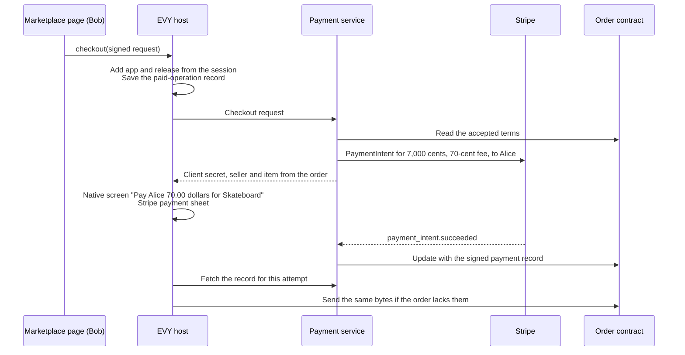

# 3.4 Payments and checkout

## Repositories

| Repository | Role | Work in this plan |
| --- | --- | --- |
| [evy](https://github.com/EVY-Platform/evy) | Modified | New `services/payment` with seller accounts, Stripe destination charges, webhooks, refunds, signed payment records and the service's own Freenet node |
| `evy-marketplace` | Modified | The `propose` record gains `payment_root_key` and `policy_version`. The order contract verifies and keeps signed payment records. Marketplace's delegate signs checkout requests, and its UI shows payment status |
| [freenet-core](https://github.com/freenet/freenet-core) | Modified | `crates/mobile` binds each checkout request to the calling app and release, and keeps the paid-operation record |
| `freenet-appkit` | Modified | The host bridge's `checkout` call, the native confirmation screen and Stripe's payment sheet in the iOS and Android host packages |

## Purpose

This plan lets Bob pay Alice 70 dollars for her skateboard and records the payment in their order. On iOS and Android, Bob pays in native screens with Stripe's payment sheet. In a browser, he pays on Stripe Checkout. Stripe sends Alice the price minus a 1% contributor fee of 0.70 dollars, which EVY holds for contributors.

Bob pays after he and Alice accept the terms in the order contract from [3.3 Marketplace pickup protocol](03-marketplace-protocol.md). The payment service takes the fee rate from Marketplace's product policy in [3.1 Contributor registration and attribution](01-attribution.md), and checks that Bob's release has paid eligibility in [3.2 Release certification](02-certification.md). On phones, EVY binds the request to Marketplace's session through the [trusted calls in 1.3 Single-application host](../1-freenet-mobile-appkit/03-host.md#trusted-calls) and [2.2 Two apps on one node](../2-evy-mobile-app/02-shared-node.md).

## Terms and checkout request

This plan adds `payment_root_key` and `policy_version` to the terms of 3.3 Marketplace pickup protocol's `propose` record, so the terms digest covers both. The root key certifies the payment service's signing keys. The policy version names Marketplace's product policy, so Alice agrees to the fee before Bob pays.

Marketplace's delegate holds Bob's order key. It signs a checkout request naming the order and the terms digest that Alice and Bob both signed.

## Checking out on a phone



- Stripe's payment sheet ([iOS](https://github.com/stripe/stripe-ios) and [Android](https://github.com/stripe/stripe-android) SDKs) runs card entry and 3-D Secure in native screens. A switch to a bank app returns to EVY through Stripe's return URL.
- Phones run their node in the foreground only, so the service's node sends the order update even when Bob closes EVY. Bob's phone sends the same bytes, so the order keeps one copy ([Sending updates in 1.6 Application protocols, data and operations](../1-freenet-mobile-appkit/06-data-and-operations.md#sending-updates)).
- Apple's [App Review Guidelines](https://developer.apple.com/app-store/review/guidelines/) 3.1.3(e) and Google Play's [payments policy](https://support.google.com/googleplay/android-developer/answer/9858738) send physical-goods payments outside in-app purchase.

`crates/mobile` saves the paid-operation record before it calls the payment service. The record holds Bob's request ID, reused on every retry, the order's contract key, the attempt ID the service returned and the `application_content_ref` the host set from the session. After a crash or restart, the host reads it, fetches the signed payment record and sends it to the order. The [backup file in 1.5 Identity, keys and local protection](../1-freenet-mobile-appkit/05-identity.md#the-backup-file) carries it as a host record.

## Checking out in a browser

Core's app frame can reach only the node's origin ([client_api.rs](https://github.com/freenet/freenet-core/blob/main/crates/core/src/server/client_api.rs)), but it opens popups as normal tabs ([#5100](https://github.com/freenet/freenet-core/pull/5100)). Marketplace opens a tab on the payment service's checkout page with Bob's signed request. The service runs the same checks and redirects the tab to a Stripe Checkout Session. It binds the container version its own node reads. The Marketplace tab shows paid when the order update arrives.

## Seller account and fee

Alice links a Stripe connected account once, through [Stripe-hosted onboarding](https://docs.stripe.com/connect/hosted-onboarding) in the system browser. She signs the account ID with her store key, and the service stores the pair.

Each sale is a [destination charge](https://docs.stripe.com/connect/destination-charges) with `application_fee_amount` and `transfer_data.destination` set, on the PaymentIntent or under `payment_intent_data` on a Checkout Session. The fee is 100 basis points of the price in cents, rounded half up.

| Party | Skateboard sale |
| --- | --- |
| Bob pays | 70.00 dollars |
| Alice receives | 69.30 dollars |
| EVY holds for contributors | 0.70 dollars |
| Stripe's fee | About 1.49 dollars at Stripe's [Australian domestic card price](https://stripe.com/au/pricing) on 2026-09-30. Stripe takes it from EVY's balance, and EVY pays it from its own budget so the contributors get the full 0.70 dollars |

## One attempt per order

Before it calls Stripe, the payment service checks Bob's signature against his order key, that Alice and Bob both signed terms with that digest, that Alice's store key has a linked account and that the release has paid eligibility. It then creates one attempt, which fixes the amount, fee, release and policy version. A second request for the same order, from Bob's phone or his browser, gets the open attempt. Each Stripe call uses the attempt ID as its idempotency key. After a timeout, the service reads the PaymentIntent before it retries.

## Payment status

The service follows [Stripe's webhook guide](https://docs.stripe.com/webhooks) and reuses the signature check in evy's [stripeWebhookHttp.ts](https://github.com/EVY-Platform/evy/blob/dev/api/src/shared/stripeWebhookHttp.ts). For each event, one database transaction commits the new status, the fee entry and the outgoing order update, with the payment's next revision number.

| Stripe event | Record status | Marketplace shows |
| --- | --- | --- |
| PaymentIntent created, awaiting card or 3-D Secure | `pending` | "Payment pending" |
| `payment_intent.succeeded` | `paid` | "Paid, pickup Saturday" |
| `payment_intent.canceled`, or Checkout Session expired | `canceled` | "Payment canceled", and Bob can pay again |
| `charge.refunded` | `refunded` | "Refunded 70.00 dollars" |
| `charge.dispute.created`, then `charge.dispute.closed` | `disputed`, then `paid` or `refunded` | "Payment disputed", then the result |

## Refunds and chargebacks

The service's node follows each paid order. When the order holds a cancel record and no handover, the service refunds in full with `reverse_transfer` and `refund_application_fee` set. An operator refund in the Stripe Dashboard reaches the service through the same `charge.refunded` event. The `refunded` record carries the amount returned to Bob in `refunded_minor` and the fee returned in `fee_returned_minor`.

| Case | Bob | Alice | EVY |
| --- | --- | --- | --- |
| Cancellation before handover | Gets 70.00 dollars back | Returns 69.30 dollars | Returns the 0.70-dollar fee. Stripe keeps its 1.49 dollars |
| Chargeback that Bob wins | Gets 70.00 dollars back | The service reverses her transfer, as for a refund | Pays Stripe's dispute fee |

## Signed payment record

The payment service signs one record per payment revision and embeds it in the order update, as Harvest does with its [embedded payment proof](https://github.com/freenet/harvest/blob/main/common/src/payment.rs).

```jsonc
{
  "schema": 1,                                    // record format version
  "order": "7Hq...",                              // contract key of the skateboard order
  "terms_digest": "41ab...",                      // digest Alice and Bob signed in the order
  "attempt_id": "att_91c2",                       // opaque ID. Stripe IDs stay in the service
  "application_content_ref": { "...": "..." },    // Marketplace's release that took the payment
  "policy_version": 1,                            // Marketplace's product policy version from the terms
  "currency": "AUD",                              // the one currency evy's Stripe code supports today
  "amount_minor": 7000,                           // 70.00 dollars
  "fee_minor": 70,                                // 0.70-dollar contributor fee
  "status": "paid",                               // pending, paid, canceled, refunded or disputed
  "refunded_minor": 0,                            // total refunded to Bob
  "fee_returned_minor": 0,                        // fee returned with those refunds
  "revision": 2,                                  // rises with each change to this payment
  "signer": { "key": "...", "root_sig": "..." },  // signing key, certified by payment_root_key
  "signature": "..."                              // signer's signature over every field above
}
```

- The order contract checks the signer's certificate against `payment_root_key` in the terms, then the signature, order, terms digest, amount and currency. It uses only the update and its own state.
- The service rotates its signing key by certifying a new one with the root key. Older records still verify under their own certificate.
- The order keeps up to 32 revisions per payment, dropping the lowest first, and Marketplace shows the highest.
- If two different records share a revision number, the order keeps both. Marketplace shows "Payment under review" and refuses a handover until the service signs a higher revision.
- Stripe IDs, card details and Bob's email stay in the service's database.

## Acceptance

- On iOS and Android in Stripe test mode, Bob pays 70.00 dollars in the payment sheet. The order shows paid, Alice's connected account receives 69.30 dollars and EVY's balance holds the 0.70-dollar fee.
- In a browser, Bob pays on Stripe Checkout in a new tab, and the Marketplace tab shows paid.
- On iOS and Android, a 3-D Secure test card completes inside the payment sheet. Closing EVY mid-payment and reopening it shows the order as paid.
- A request with a wrong signature, another order, changed terms or a release without paid eligibility fails before any Stripe call.
- Requests for one order from a phone and a browser get the same attempt. Duplicate and reordered webhooks produce one revision each.
- A cancellation before handover refunds 70.00 dollars to Bob, takes 69.30 dollars back from Alice and returns the 0.70-dollar fee, and the `refunded` record shows 7,000 and 70. A dispute test card moves the order to disputed, then to the result.
- The order contract rejects a record for another order, with a bad signature or with a wrong amount. It keeps at most 32 revisions per payment, accepts a rotated signing key through the root key and shows a same-revision conflict as under review.
- On iOS and Android, the paid-operation record round-trips through the backup file from 1.5 Identity, keys and local protection.
