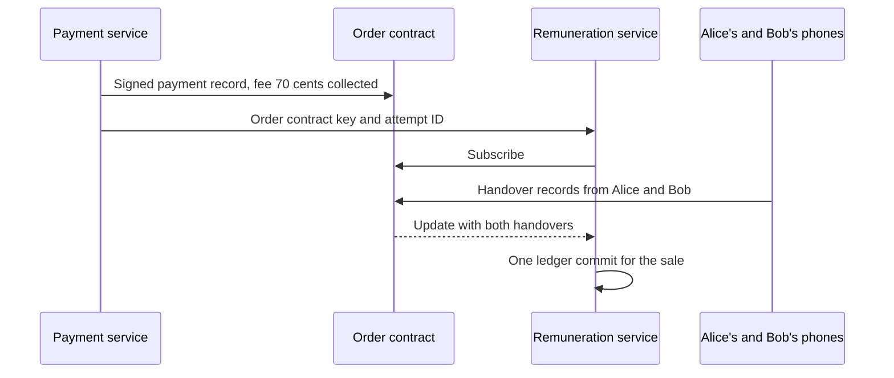
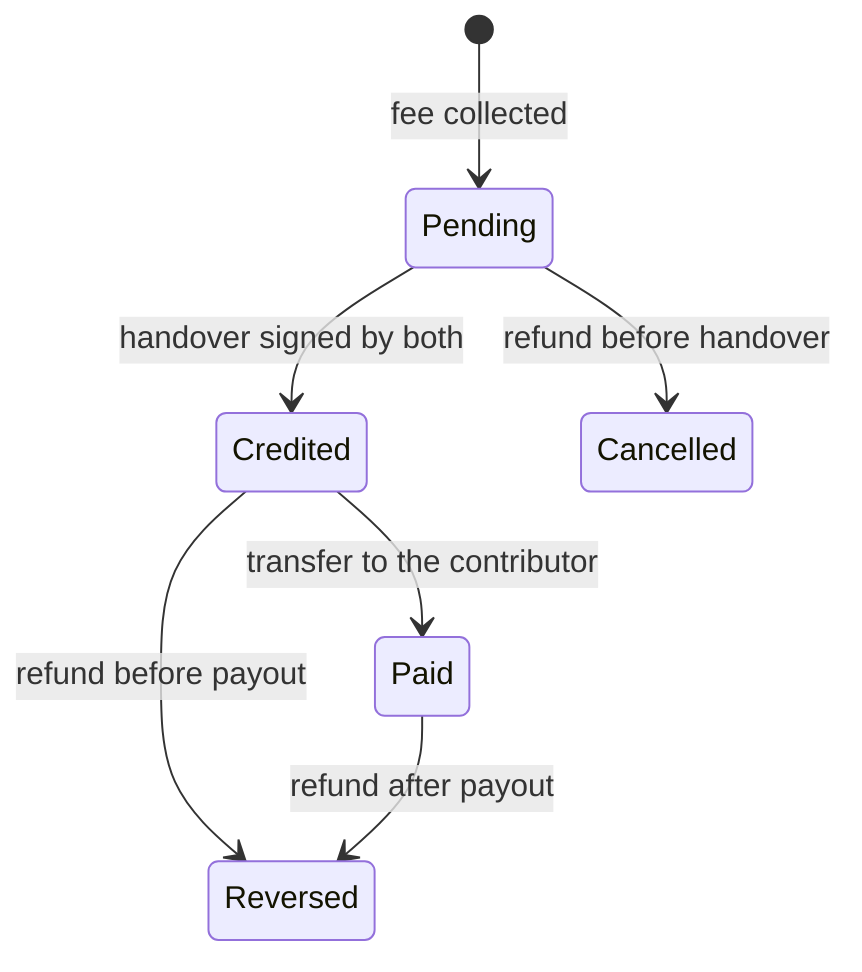

# 3.5 Remuneration and payouts

## Repositories

| Repository | Role | Work in this plan |
| --- | --- | --- |
| [evy](https://github.com/EVY-Platform/evy) | Modified | New `services/remuneration` with order subscriptions, the ledger, fee allocation, balances, Stripe Connect onboarding links, transfers to contributors and reversals |
| `evy-marketplace` | Used | The order contract with its signed payment records and handover |
| [freenet-core](https://github.com/freenet/freenet-core) | Used | A Freenet node inside `services/remuneration` that subscribes to paid order contracts |

## Purpose

This plan pays contributors when a paid sale completes. The remuneration service splits each sale's contributor fee among the people whose accepted work the sale used, keeps their balances and pays them through Stripe Connect.

Bob buys Alice's skateboard for 70 dollars. [3.4 Payments and checkout](04-payment.md) collects the 1% contributor fee of 0.70 dollars and binds one version of Marketplace's product policy from [3.1 Contributor registration and attribution](01-attribution.md). The sale is complete when Alice and Bob both sign the handover in the order contract from [3.3 Marketplace pickup protocol](03-marketplace-protocol.md). The service then splits the 0.70 dollars by the policy's capability weights and the release's contribution snapshot from [3.2 Release certification](02-certification.md).

## Crediting a completed order

The order contract holds both facts the service needs. The payment service writes the signed payment record into it, and Alice and Bob each write a handover record. The service reads completion from the order state alone.

| Step | Who | Rule |
| --- | --- | --- |
| 1. Learn the order | Payment service | Sends the order contract key and attempt ID to the remuneration service when checkout succeeds. |
| 2. Subscribe | Remuneration service | Subscribes to the order contract with the client API's [`ContractRequest::Subscribe`](https://github.com/freenet/freenet-stdlib/blob/main/rust/src/client_api/client_events.rs). |
| 3. Check payment | Remuneration service | Verifies the payment record's signature, and checks that its attempt ID, fee, policy version and release match the payment service's database. |
| 4. Wait for handover | Remuneration service | Keeps the sale's shares pending until the order holds both handover records. |
| 5. Commit | Remuneration service | Writes every allocation for the sale in one database transaction. --> Produces one allocation entry per capability and recipient |

The ledger allows one allocation per payment, capability and recipient, so repeated notifications and racing workers produce one result. A fake sale between two users who work together pays contributors at most that sale's own fee, and the seller pays that fee.

## Splitting the fee

The service works in integer cents and splits the fee in two rounds.

1. It splits the fee across capabilities by the product policy's weights. A capability with no recipients in the snapshot gets no share, and the other capabilities split the fee by their weights.
2. It splits each capability's share across its recipients by the units in the release's snapshot.

Both rounds use the largest remainder rule. Each recipient first gets the whole cents of their exact share. The leftover cents then go one each to the largest fractional parts. The lower contributor key breaks a tie.

For the skateboard sale, the example policy gives `marketplace.fulfillment.agree` 60% and `marketplace.order.complete` 40%. The first round gives 42 and 28 cents. Suppose Carol also built Marketplace's handover screen, accepted at size 8 under `marketplace.order.complete` with the same reviewer and validator split as her River work:

| Recipient | Units | Exact share of 28 cents | Whole cents | Leftover cent | Credited |
| --- | ---: | ---: | ---: | ---: | ---: |
| Carol | 6.8 | 23.8 | 23 | 1 | 24 |
| Reviewer | 0.8 | 2.8 | 2 | 1 | 3 |
| Validator | 0.4 | 1.4 | 1 | 0 | 1 |
| Total | 8 | 28 | 26 | 2 | 28 |

The 42-cent share for `marketplace.fulfillment.agree` splits the same way among its recipients. The ledger keeps the policy version, the snapshot, the exact shares and the credited cents for every sale.

## Units and money

Units measure accepted work, and money comes only from a paid sale's fee. Carol's "Invite member" work for River shows as 6.8 units under `river.member.invite`. River has no paid operations, so no fee exists to split, and her River balance stays at 0 dollars. Her Marketplace work earns cents each time a Marketplace sale completes.

## Share states

## Paying contributors

- Carol links a Stripe connected account once, before her first payout, the same way Alice does in [Seller account and fee in 3.4 Payments and checkout](04-payment.md#seller-account-and-fee). Stripe holds her legal identity, bank details and tax forms.
- Carol signs each new payout account with her contributor key from [3.1 Contributor registration and attribution](01-attribution.md#contributor-keys).
- A credited share becomes payable `payout_hold_days` after the handover. The service pays a balance once it reaches `payout_minimum_cents`, on the policy's `payout_schedule`.
- The service reserves the payable cents and then sends a [transfer](https://docs.stripe.com/api/transfers/create) from EVY's platform balance to Carol's connected account. The payout ID is the [idempotency key](https://docs.stripe.com/api/idempotent_requests), and the service also sets `transfer_group` and `metadata[payout_id]` to it.
- After a timeout, the service retries with the same key within 24 hours, and Stripe returns the first result. Stripe can prune a key after 24 hours and then treats a reused key as a new request. After 24 hours the service [lists the transfers](https://docs.stripe.com/api/transfers/list) to Carol's connected account and matches `metadata[payout_id]`. It sends a new transfer only when none matches, so Carol is paid once.
- Stripe then [pays out](https://docs.stripe.com/connect/payouts-connected-accounts) from her connected account to her bank on that account's schedule.

EVY pays Stripe's Connect fees on each payout from its own budget, at the rates in [Seller account and fee in 3.4 Payments and checkout](04-payment.md#seller-account-and-fee). A 10-dollar payout to Carol costs EVY about 0.28 dollars, plus 2.00 dollars for her active account that month. The product owner sets `payout_minimum_cents` and `payout_schedule` with these fees in mind, in [Product policy in 3.1 Contributor registration and attribution](01-attribution.md#product-policy).

## Refunds

A cancellation refunds Bob through Stripe with `refund_application_fee`, as [Refunds and chargebacks in 3.4 Payments and checkout](04-payment.md#refunds-and-chargebacks) defines, and the 0.70-dollar fee leaves EVY's platform balance. The service reads the returned fee from `fee_returned_minor` in the `refunded` payment record.

| When Bob is refunded | What the remuneration service does |
| --- | --- |
| Before the handover | Cancels the pending shares. Nothing was credited. |
| After the handover, before payout | Reduces each recipient's credited cents by their share of the returned fee. |
| After payout | Reverses each recipient's paid cents with a [transfer reversal](https://docs.stripe.com/api/transfer_reversals/create). The service caps the reversal at Carol's available Stripe balance and records the rest as a negative ledger balance that her next credits pay off. |

The cap keeps Carol's Stripe balance at zero or above. A [negative Stripe balance](https://docs.stripe.com/connect/account-balances#accounting-for-negative-balances) makes Stripe debit her bank (Australia supports `debit_negative_balances`) and block her payouts, and EVY carries that loss on accounts created with `controller.losses.payments=application`.

The ledger links each reversal to the original allocation and keeps both.

## Acceptance

- Alice lists and Bob buys the skateboard, once with Alice on iOS and Bob on Android and once the other way round. After both sign the handover, the ledger credits Carol 24 cents, the reviewer 3 and the validator 1 for `marketplace.order.complete`.
- Duplicate order notifications, a restart of the service and two racing workers produce one allocation per payment, capability and recipient.
- An order without both handover records keeps its shares pending. A refund before the handover leaves no credit, and Stripe returns the 0.70-dollar fee.
- A share becomes payable only after `payout_hold_days`, and a balance below `payout_minimum_cents` waits for the next scheduled payout.
- A transfer timeout followed by a retry creates one Stripe transfer, both for a retry within 24 hours and for one after 24 hours.
- A refund after payout creates transfer reversals capped at each recipient's available Stripe balance, links them to the original allocations and records any shortfall as a negative ledger balance.
- Carol's `river.member.invite` units show 0 dollars, and her Marketplace units show the cents from completed sales.
