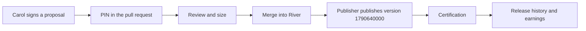

# 3.6 EVY Developer contribution workspace

## Repositories

| Repository | Role | Work in this plan |
| --- | --- | --- |
| [evy](https://github.com/EVY-Platform/evy) | Modified | Developer workspace and CLI |
| [freenet-appkit](https://github.com/glesage/freenet-appkit) | Used | Publication and certification tools |
| [river](https://github.com/freenet/river) | Used | River contribution example |
| [freenet-agent-skills](https://github.com/freenet/freenet-agent-skills) | Used | Dapp builder agent skill |

## Purpose

This plan builds the screens and CLI commands where a contributor follows her work from pull request to certified release and earnings. Carol opens a pull request to River that reworks the "Invite member" screen. She tracks its review in the workspace, sees River version 1790640000 certified with her work in it, and sees the 6.8 units she earned. River has no paid operations, so Carol's River credit stays in units. Carol can write her change with a coding agent and the [dapp-builder skill](https://github.com/freenet/freenet-agent-skills/tree/main/skills/dapp-builder), which follows River's contract, delegate and UI patterns.

The workspace shows records from the services built in [3.1 Contributor registration and attribution](01-attribution.md), [3.2 Release certification](02-certification.md), [3.4 Payments and checkout](04-payment.md) and [3.5 Remuneration and payouts](05-remuneration.md). Releases come from the [packaging CLI in 1.4 Application bundles](../1-freenet-mobile-appkit/04-bundles.md#publishing-and-evidence). The screens use TypeScript and React, built and tested with Bun like the existing [`web/` app](https://github.com/EVY-Platform/evy/blob/dev/web/package.json).

## From pull request to release

| Step | Who | Rules from | What the workspace shows |
| --- | --- | --- | --- |
| 1. Propose | Carol | 3.1 Contributor registration and attribution | The new proposal and its one-time PIN, which Carol pastes into the pull request description. |
| 2. Review | Reviewer and validator | 3.1 Contributor registration and attribution | The PIN check, review, size and any open challenge, each linked to the pull request revision it applies to. |
| 3. Accept | Attribution service | 3.1 Contributor registration and attribution | Capability `river.member.invite`, size 8 and Carol's 6.8 units. |
| 4. Publish | River publisher | 1.4 Application bundles | Nothing yet. The packaging CLI publishes version 1790640000 and reads it back. |
| 5. Certify | Attribution service | 3.2 Release certification | Version 1790640000 as certified in release history, with Carol's acceptance in it. |

## Signing and access

- Carol signs in with `evy login`. The CLI signs a one-time challenge with her key file and opens the workspace in her browser.
- The key file never leaves her laptop. Every signed action runs in the CLI, and the workspace only reads and links.
- The CLI keeps each request's bytes until the service answers. After a timeout it resends the same bytes, and the service returns the existing record.

## Screens

| Screen | What it shows | Carol's example |
| --- | --- | --- |
| Proposals | Each proposal with its pull request, PIN check, review, size, challenges and accepted units | "Invite member", accepted, 6.8 units |
| Release history | For each version, the website container key, version, archive digest, release commit, included acceptances, declared capabilities and certification status | River version 1790640000, certified, includes "Invite member", `["river.member.invite"]` |
| Earnings | Units per product in one column, money per currency in another, each with the time of the last service update. `evy earnings` prints the same | 6.8 River units |
| Payouts | Balance, `payout_minimum_cents` and `payout_schedule` from the product policy, payout history, reversals, and a link to [Stripe-hosted onboarding](https://docs.stripe.com/connect/hosted-onboarding) for Carol's connected account, as in [Paying contributors in 3.5 Remuneration and payouts](05-remuneration.md#paying-contributors) | Opens once Carol earns money from a paid product |

Money appears only after a paid sale completes. For Carol's Marketplace work, the skateboard sale from [3.3 Marketplace pickup protocol](03-marketplace-protocol.md) shows her 24-cent share as pending until Alice and Bob sign the handover, then as payable, then as paid. An allocation the service has not confirmed carries a "preview" label. A refund after payout shows as its own reversal line, linked to the payout it reverses.

## Acceptance

- Carol signs in with `evy login`, and the workspace accepts only a challenge signed with her key file. Her proposal for the "Invite member" pull request to River shows the PIN check, review, size 8 and acceptance with 6.8 units.
- After the River publisher publishes version 1790640000, release history shows it certified, with Carol's acceptance and `river.member.invite`.
- A timed-out CLI request resent with the same bytes creates one record.
- Carol's earnings screen and `evy earnings` show 6.8 River units in the units column and an empty money column.
- Carol's Marketplace share of the 70-dollar skateboard sale moves from pending to paid on her screens. A refund after payout shows as a reversal linked to that payout.
- The payouts screen opens Stripe's hosted onboarding, and the first payout appears in payout history.
- Browser tests with Playwright cover every screen, including keyboard use and screen reader labels.
