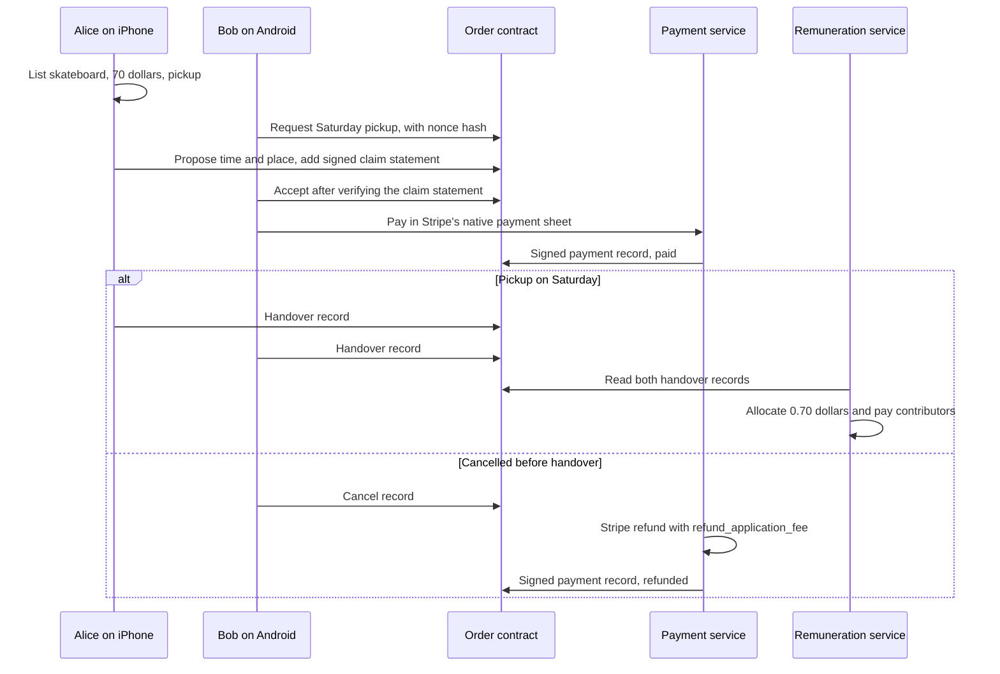

# 3.8 Marketplace pickup pilot

## Repositories

| Repository | Role | Work in this plan |
| --- | --- | --- |
| `evy-marketplace` | Modified | Participant terms, privacy notices, reporting and blocking in Marketplace's UI, the curated seller list, the nonce hash in Bob's request, and `claim` and `dispute` records in the order contract |
| [evy](https://github.com/EVY-Platform/evy) | Modified | Marketplace's catalogue entry moves from the internal test configuration to EVY's release configuration for `ios/` and `android/`. `services/payment` gains the dispute queue |
| [harvest](https://github.com/freenet/harvest) | Used | Pre-signed claim design ([#8](https://github.com/freenet/harvest/issues/8)) and mailbox privacy analysis ([messaging-privacy.md](https://github.com/freenet/harvest/blob/main/docs/messaging-privacy.md)) as references |

## Purpose

This plan runs the first paid sale on phones. Alice lists a skateboard for 70 dollars on her iPhone. Bob buys it on his Android phone with Saturday pickup, and the 0.70-dollar contributor fee reaches the contributors whose code the sale used. The pilot runs again with the platforms swapped, so iOS and Android each play both roles.

Marketplace is the app from [3.3 Marketplace pickup protocol](03-marketplace-protocol.md), certified under [3.2 Release certification](02-certification.md) and listed in EVY by [2.1 EVY shell and curated catalogue](../2-evy-mobile-app/01-catalogue.md). Payment uses [3.4 Payments and checkout](04-payment.md), and remuneration uses [3.5 Remuneration and payouts](05-remuneration.md). This plan adds the approvals, privacy notices, disputes and moderation that a live sale needs.

## Pilot scope and approvals

The pilot sells in one region and one currency. Only stores on a curated seller list appear, and every listed seller has finished Stripe Connect onboarding. Every sale is a fixed-price pickup. The Marketplace product owner gives the approvals below before the pilot opens, and the operator records them beside the launch approvals in [3.7 Operating readiness](07-operations.md).

| Approval | What the product owner checks |
| --- | --- |
| Participant terms | Alice accepts seller terms before her first listing. Bob accepts buyer terms before his first request. Marketplace shows both in its own UI |
| Privacy notices | Marketplace shows what anyone can read before Alice's first listing and Bob's first request. EVY's App Store privacy details and Play data safety form list the payment data Stripe collects |
| Moderation | Reporting and blocking work on iOS and Android, and the reviewer answers reports within the time on Marketplace's support page |
| Disputes | A named reviewer, the dispute deadlines and the reviewer's refund access in the Stripe Dashboard |

## The skateboard sale

Alice shares her store link, and EVY opens it in Marketplace through the link routing in 2.1 EVY shell and curated catalogue. First contact and the order records follow 3.3 Marketplace pickup protocol.



A cancellation refunds Bob and returns the fee as 3.4 Payments and checkout sets, so remuneration allocates nothing. A refund after contributors were paid runs the reversal in 3.5 Remuneration and payouts.

## Privacy

Marketplace's privacy notice lists what anyone can read in the store, mailbox and order contracts, from 3.3 Marketplace pickup protocol, plus the records this plan adds.

| Data | Who can see it |
| --- | --- |
| Signed payment record, with amount and status | Anyone who reads the order contract |
| Claim statement and dispute filing | Anyone who reads the order contract |
| Bob's claim nonce | Bob's Marketplace delegate, until he files |
| Dispute evidence and report details | Alice, Bob and the reviewer, through the report inbox |
| Card details, and Alice's legal identity and bank account | Stripe |

The forget warning from 3.3 Marketplace pickup protocol also names Bob's claim nonce, so he files any dispute before he [forgets Marketplace](../1-freenet-mobile-appkit/05-identity.md#forget).

## Disputes

Disputes follow Harvest's pre-signed claims ([#8](https://github.com/freenet/harvest/issues/8)). Bob's delegate makes a random nonce and puts only its hash in his request. Alice's delegate adds her claim statement with her proposal.

```jsonc
{
  "schema": "marketplace.claim.v1",   // statement format version
  "seller": "<Alice's store key>",    // signs the statement
  "buyer": "<Bob's order key>",       // the only key that can file a dispute
  "order_id": "<order ID>",           // from 3.3 Marketplace pickup protocol
  "terms_digest": "<terms digest>",   // agreed terms, including the Saturday pickup window
  "amount_minor": 7000,               // 70 dollars
  "currency": "AUD",                  // currency of the approved region
  "nonce_hash": "<nonce hash>",       // Bob reveals the nonce only to file
  "signature": "<Alice's signature>"  // over every field above
}
```

- Bob's app accepts the proposal and opens checkout only after it verifies the statement against the proposal's digest and amount.
- Bob files a `dispute` record with the nonce and his signature, and sends his evidence to the report inbox.
- The payment service accepts a filing only when the order is paid, the nonce matches `nonce_hash` and the filer's key matches `buyer`. It then adds the filing to the reviewer's queue.

| Step | Who | Deadline |
| --- | --- | --- |
| File | Bob | Up to 14 days after the pickup window ends |
| Answer | Alice, through the report inbox | 3 days after the filing |
| Decide | The named reviewer | 7 days after the filing |
| Refund | The reviewer, in the Stripe Dashboard | When the reviewer decides to refund |

A refund reaches the order through 3.4 Payments and checkout's `charge.refunded` handling, and the payment record shows `refunded`. A decision against Bob leaves the record at `paid`. Card chargebacks follow Stripe's [dispute flow](https://docs.stripe.com/disputes) in 3.4 Payments and checkout.

## Moderation

Marketplace moderates in its own UI, as River does under the [store requirements in 1.9 Testing and release](../1-freenet-mobile-appkit/09-testing-and-release.md#store-requirements).

- Alice or Bob can report a store, a listing or a request. Reports go to an inbox the reviewer monitors.
- Blocking a key hides its listings and requests on the blocker's phone. Alice's delegate drops mailbox requests from keys she blocked.
- The curated seller list ships in Marketplace's release bundle. The reviewer removes a seller after a confirmed report, and the next version drops that store.

## Acceptance

- The skateboard sale completes with Alice on iOS and Bob on Android, and again with Alice on Android and Bob on iOS. Each run ends with both handover records, 0.70 dollars allocated and the contributors paid.
- On iOS and Android, a cancellation before handover refunds 70 dollars and returns the 0.70-dollar fee, and remuneration allocates nothing.
- A refund after contributors were paid runs the reversal in 3.5 Remuneration and payouts once.
- On iOS and Android, checkout stays closed until Bob's app verifies the claim statement. A statement for another order, buyer or amount fails.
- A filing with the wrong nonce, from another key or on an unpaid order fails. A valid filing reaches the reviewer, and a refund decision shows as `refunded` in the order.
- On iOS and Android, terms and privacy notices appear before the first listing and the first request. Reports reach the reviewer's inbox, and blocked keys' requests stay hidden.
- The restore drill in 3.7 Operating readiness restores the pilot sale's payment, allocation and payout records.
