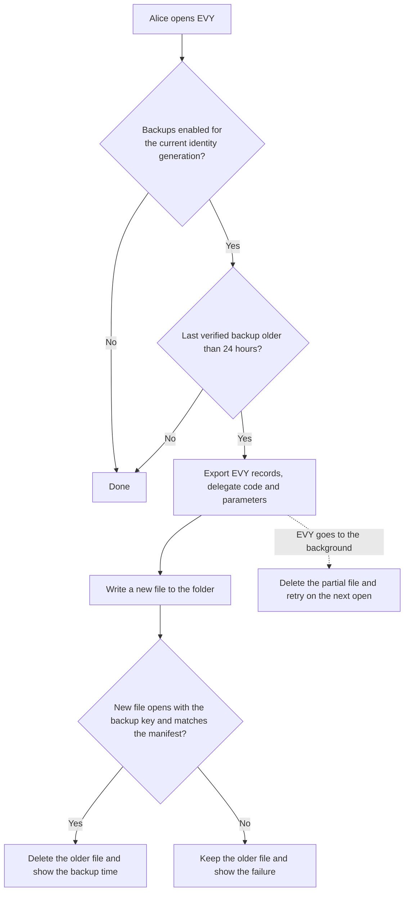

# 3.1 Automated backup

## Repositories

| Repository | Role | Work in this plan |
| --- | --- | --- |
| [evy](https://github.com/EVY-Platform/evy) | Modified | Backup and restore screens in SwiftUI and Compose; folder pickers on iOS and Android |
| [freenet-core](https://github.com/freenet/freenet-core) | Modified | Backup key storage and deletion, daily export and restore in `crates/mobile` |
| [freenet-appkit](https://github.com/glesage/freenet-appkit) | Used | Swift package and Kotlin library that call `crates/mobile` |

## Purpose

This plan backs up the EVY delegate's records once a day on iOS and Android, with no action from the user. [The EVY delegate in 2.4 SDUI data and actions](../2-evy-on-freenet/04-data-and-actions.md#the-evy-delegate) keeps these records in the node's encrypted secret store from [1.5 Identity, keys and local protection](../1-freenet-mobile-appkit/05-identity.md#what-the-key-protects). This plan reuses the recovery code and restore steps from [App-specific export and import in 1.5 Identity, keys and local protection](../1-freenet-mobile-appkit/05-identity.md#app-specific-export-and-import).

Alice turns on backups once and picks a folder in iCloud Drive or Google Drive. Each day EVY writes one file with her EVY records. Alice has accepted Bob's request for her skateboard and the pickup is on Saturday when she loses her iPhone. She installs EVY on a new iPhone or Android phone, restores the file with her recovery code and sees Bob's purchase again.

| Record | Example for Alice | After a restore |
| --- | --- | --- |
| `root_seed` | The seed of her keys for the `hello` and `marketplace` services | From the backup file |
| Pending records, `pending/<service>/<id>` | An edit to her skateboard listing, signed but not yet in the items contract | From the backup file. The reader sends it on the next start, as [Offline writes in 2.4 SDUI data and actions](../2-evy-on-freenet/04-data-and-actions.md#offline-writes) describes |
| Private addresses, `addresses/<id>` | The pickup address Alice saved before listing the skateboard | From the backup file |
| Purchase records, statuses and payment records | Bob's purchase in its [purchase contract from 2.6 Payments](../2-evy-on-freenet/06-payments.md#the-purchase-contract), listed in her skateboard's `purchases` | From the network |
| Listings and UI documents | Her skateboard listing and Marketplace's flows | From the network |

## The backup key

When Alice turns on backups, EVY derives a backup key from her recovery code with Argon2id and a random salt. `crates/mobile` stores it in the iOS Keychain or Android Keystore with the key settings of the [node encryption key in 1.5 Identity, keys and local protection](../1-freenet-mobile-appkit/05-identity.md#node-encryption-key). The daily run uses this key, so Alice never types her code for it. The host registers the backup key as EVY-owned device-local material, separate from the shared node KEK, and binds backup settings and folder access to the active EVY identity generation.

- On iOS, Android 9 to 11 and Android 15 and later, someone with the locked phone reads nothing. On Android 12 to 14 the backup key also works while the phone is locked, as the node encryption key does.
- With the unlocked phone, they can use EVY as Alice would, which the node encryption key already allows. Nobody learns the recovery code from the phone.
- The file in the folder holds her records as of the last backup, including pending records cleared since.
- EVY asks for the phone passcode before it changes the folder or turns backups off.

## The backup file

```text
EVY backup file
├── Header: format version and Argon2id salt
├── Manifest: backup time, EVY build, EVY delegate key and coverage report
└── EVY: Core backup bundle of delegate records, Wasm and exact registration parameters, sealed with the backup key
```

The manifest holds no secrets. `crates/mobile` builds the bundle with Core's [`export_bundle`](https://github.com/freenet/freenet-core/blob/main/crates/core/src/wasm_runtime/secret_export.rs), the call the [export in 1.5 Identity, keys and local protection](../1-freenet-mobile-appkit/05-identity.md#export) uses, while the node runs. It seals the bundle with the stored backup key as Core's `Token` key material ([FNSX format](https://github.com/freenet/freenet-core/blob/main/docs/secrets-at-rest.md#export--import-a-portable-secrets-bundle-4035-p3-of-4381)). The host selects EVY's owned delegate namespaces, including supported predecessors, through [C11 Scope private-data operations on a shared node](../UPSTREAM_ISSUES.md#c11-scope-private-data-operations-on-a-shared-node). All EVY services share this backup scope. Core caps one export at 10,000 secrets and 256 MiB of plain text (`MAX_EXPORT_SECRET_COUNT` and `MAX_EXPORT_TOTAL_PLAINTEXT_BYTES` in [secret_export.rs](https://github.com/freenet/freenet-core/blob/main/crates/core/src/wasm_runtime/secret_export.rs)). The phone keeps only each record's current value ([Storage in 1.2 Embedded node and mobile SDK](../1-freenet-mobile-appkit/02-sdk.md#storage)), and the bundle holds that value.

Alice picks the folder with the iOS document picker, kept as a security-scoped bookmark, or the Android Storage Access Framework, kept as a persistable URI permission. The OS file provider uploads the file, outside the node and the caps in [1.8 Thin-peer role and cellular data budgets](../1-freenet-mobile-appkit/08-thin-peer.md#cellular-budget-contract).

This plan requires Core's executable-inclusive backup capability proposed in [#4035](https://github.com/freenet/freenet-core/issues/4035), as [1.5 Identity, keys and local protection](../1-freenet-mobile-appkit/05-identity.md#the-backup-file) specifies. The authenticated bundle includes the Wasm, code hash, delegate key and exact registration parameters for every EVY delegate whose records it holds. `crates/mobile` exports these alongside the records.

## Running a backup

EVY runs Core only in the foreground ([foreground lifecycle in 1.1 Mobile feasibility and supported profiles](../1-freenet-mobile-appkit/01-feasibility.md#foreground-lifecycle)), so the backup runs while Alice has EVY open, or when she taps "Back up now".



## Forget and backup cleanup

Forget uses the application cleanup rules in [1.5 Identity, keys and local protection](../1-freenet-mobile-appkit/05-identity.md#forget). All EVY services share this identity and backup scope.

| Step | Cleanup |
| --- | --- |
| 1. Stop | Persist cleanup-pending status, disable automatic and manual backup runs and invalidate the EVY identity generation. Cancel active exports and pending backup setup. Old export, folder-picker, verification and post-restore callbacks finish by discarding their results. |
| 2. Clear key material | Delete EVY's separate backup-key entry from Keychain on iOS or Keystore on Android, and wipe cached key material and plaintext export buffers. |
| 3. Clear local backup records | Remove EVY's backup settings, salt, last-backup metadata and temporary export files. Stop security-scoped folder access and delete its bookmark on iOS; release EVY's persistable URI permission on Android. Shared grants retain the access required by their remaining owners. |
| 4. Verify | Verify each deletion and grant release. Keep failures pending for retry after restart. New identity setup and backup enablement wait for cleanup to finish. |

Backup setup, key storage and file publication use the same per-EVY coordinator as Forget and verify the current identity generation before committing. A run that reaches Forget discards its staged file and retains earlier verified backup files. Files already handed to the OS provider remain external copies; the cleanup report includes them. The shared node KEK remains available to other applications.

Previously exported cloud files remain available with their recovery code. A later restore or new identity sets up its device-local backup key and folder access again. Backup keys, bookmarks, URI grants and cleanup-control records are excluded from portable backups.

## Restoring on a new phone

Alice installs EVY on a new iPhone or Android phone and taps "Restore from backup" on the first screen, before she opens any service.

1. She picks the file and types her recovery code. EVY derives the backup key from the code and the salt in the header. A wrong code or a damaged file stops the restore before anything is written.
2. Core verifies the bundled Wasm and registration against the authenticated bundle. EVY checks that its migration adapters and mobile runtime support each restored generation before any restore writes, shows the backup time and coverage report, and asks her to confirm.
3. `crates/mobile` installs and registers the bundled delegates in an encrypted staging store, then imports their records under the recorded keys with Core's `import_bundle`. EVY migrates supported earlier generations and verifies the restored `root_seed` and pending records there, following the [staged restore transaction in 1.5 Identity, keys and local protection](../1-freenet-mobile-appkit/05-identity.md#staged-restore-transaction).
4. `crates/mobile` activates the complete restored generation and opens new sessions. The current EVY delegate uses Alice's restored `root_seed`. EVY opens services, finds each open purchase through her items' `purchases`, reads it from its purchase contract and shows Bob's skateboard purchase with its status.
5. After activation, EVY stores the backup key for the current identity generation and Alice chooses the backup folder again. Daily backups start once both the key and folder access are stored. A setup failure shows a retry on the Backup page while the restored identity stays active. Forget invalidates any pending key-storage or folder-picker result.

A backup from a supported earlier EVY delegate build supplies that build's Wasm and exact parameters. Core registers it in staging and restores the records under the recorded key. EVY moves the records to the current EVY delegate in staging, as [Updating the EVY delegate in 2.4 SDUI data and actions](../2-evy-on-freenet/04-data-and-actions.md#updating-the-evy-delegate) describes, then activates the complete generation. Release of this feature requires this restore path to pass on iOS and Android.

To move from an iPhone to an Android phone, Alice picks a folder both phones can open. Google Drive works on both: iOS shows it in the document picker once the Google Drive app is installed.

## Acceptance

- On iOS and Android, opening EVY more than 24 hours after the last verified backup writes a new file without asking for the recovery code.
- On iOS and Android, a fresh phone restores Alice's EVY keys and pending records from the file, finds Bob's open skateboard purchase through her item, and reads the purchase's status from its purchase contract.
- On iOS and Android, a file written on an iPhone restores on an Android phone, and a file written on an Android phone restores on an iPhone.
- On iOS and Android, a wrong recovery code or a damaged file stops the restore with nothing written.
- On iOS and Android, restoring over an existing EVY identity passes the failure and interruption cases in [1.5 Identity, keys and local protection](../1-freenet-mobile-appkit/05-identity.md#acceptance). Recovery selects either the complete existing identity and pending records or the complete restored identity and pending records. Service signing and pending-record submission start after activation.
- On iOS and Android, failure to store the backup key after activation keeps the restored identity usable and shows a retry. Daily backup starts once the key and folder access are stored for the active identity generation.
- On iOS and Android, backgrounding EVY during an export, a full folder, a removed folder and a damaged new file each keep the last verified file. The Backup page shows the failure until a new file verifies.
- On iOS and Android, the backup key has the key settings of the node encryption key for each OS version and stays out of device backups. A folder change asks for the phone passcode.
- On iOS and Android, Forget during export, file verification, backup setup or post-restore key storage deletes the local backup key, settings and temporary files and releases folder access. Delayed callbacks and restart retain backups disabled. Earlier cloud files restore with the recovery code, and unrelated applications retain their node and backup access.
- On iOS and Android, interruption or failure during backup-key deletion or folder-grant release keeps cleanup pending and retries it before a new identity enables backups. A successful cleanup verifies both OS stores and local files.
- On iOS and Android, a fresh installation containing only the latest EVY release restores a backup from each supported earlier delegate build using the file's Wasm and exact parameters, then moves its root seed and pending records to the current delegate. Fixtures cover skipped releases, code or registration mismatches and unsupported generations; validation failures keep the phone's data intact.
