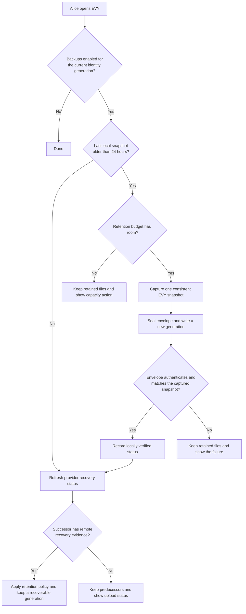

# 3.1 Automated backup

## Repositories

| Repository | Role | Work in this plan |
| --- | --- | --- |
| [evy](https://github.com/EVY-Platform/evy) | Modified | Backup and restore screens in SwiftUI and Compose; folder pickers on iOS and Android |
| [freenet-core](https://github.com/freenet/freenet-core) | Modified | Backup key storage and deletion, daily export and restore in `crates/mobile` |
| [freenet-appkit](https://github.com/glesage/freenet-appkit) | Used | Swift package and Kotlin library that call `crates/mobile` |

## Purpose

On iOS and Android, this plan backs up the EVY delegate's records once a day while EVY is open. [The EVY delegate in 2.11 EVY delegate and private records](../2-evy-on-freenet/11-delegate-and-private-records.md#the-evy-delegate) keeps these records in the node's encrypted secret store from [1.5 Identity, keys and local protection](../1-freenet-mobile-appkit/05-identity.md#what-the-key-protects). This plan reuses the recovery code and restore steps from [Export and import in 1.10 Backup and restore](../1-freenet-mobile-appkit/10-backup-and-restore.md#export-and-import).

Alice turns on backups and picks a folder in iCloud Drive or Google Drive. EVY writes a new backup generation each day she opens the app and shows its local verification and cloud recovery status. She accepts Bob's skateboard purchase for a Saturday pickup, then loses her phone. On a new iOS or Android phone, she installs EVY and restores the file with her recovery code. Bob's purchase appears again.

| Record | Example for Alice | After a restore |
| --- | --- | --- |
| `root_seed` | The seed of her keys for the Hello and Marketplace features | From the backup file |
| Pending records, `pending/<service>/<id>` | A signed edit to her skateboard listing awaiting confirmation in the items contract | From the backup file. The reader sends it on the next start, as [Offline writes in 2.4 SDUI data and actions](../2-evy-on-freenet/04-data-and-actions.md#offline-writes) describes |
| Private addresses, `addresses/<id>` | The pickup address Alice saved before listing the skateboard | From the backup file |
| Purchase records, statuses and payment records | Bob's purchase in its [purchase contract from 2.12 Listings and purchases](../2-evy-on-freenet/12-listings-and-purchases.md#the-purchase-contract), referenced by the listing's admitted live requests or retained sale evidence | From the network and the pilot operator's hosting inventory |
| Listings and UI documents | Her skateboard listing and Marketplace's flows | From the network |
| Sync group data, when enabled | Group manifest, epoch, record schemas, causal contexts and tombstones from [3.2 Device sync](02-sync.md) | From the backup as a recovery snapshot. The new installation joins with fresh device credentials through the current membership authority |

## The backup key

During setup, derive the `application-backup/1` master key from the recovery code using the exact profile and setup salt in [1.10 Backup and restore](../1-freenet-mobile-appkit/10-backup-and-restore.md#the-backup-file). Store that master key in EVY-owned protected device storage, separate from the installation KEK, with the platform settings in [1.5 Identity, keys and local protection](../1-freenet-mobile-appkit/05-identity.md#node-encryption-key). Daily backup derives a fresh envelope key from the stored master key and new envelope salt.

Bind key, setup salt/profile and folder settings to the active EVY identity generation. Confirm the recovery code during setup. Require the phone passcode before folder changes or disabling backups. Files represent their snapshot time, including then-pending records. Forget deletes this master key and folder grants through the global inventory.

## The backup file

Automatic backup uses the approved codec, snapshot barrier and staged activation from [1.10 Backup and restore](../1-freenet-mobile-appkit/10-backup-and-restore.md#the-backup-file). Enable it after that Core implementation and the manual/automatic cross-restore fixtures pass on iOS and Android.

```text
EVY backup file
├── Authenticated header: envelope version, recovery-code derivation settings
│   and salt, plus the envelope salt and nonce
└── One encrypted FNSX envelope
    ├── Manifest: backup ID, snapshot generation, EVY identity and build,
    │   selected namespaces, component and record digests, lengths and coverage
    ├── EVY delegate records, Wasm and exact registration parameters
    └── EVY's declared host records
```

The file uses the consistent application snapshot and authenticated envelope from [The backup file in 1.10 Backup and restore](../1-freenet-mobile-appkit/10-backup-and-restore.md#the-backup-file). The export barrier captures the current and supported predecessor namespaces, delegate code and exact registrations, declared host records, migration state and every acknowledged draft and pending operation from one application generation. It resumes the app after the immutable snapshot is durable. Backup encryption and provider writes consume that snapshot.

The host selects the EVY installation's complete data inventory through [Application data inventory in 1.5 Identity, keys and local protection](../1-freenet-mobile-appkit/05-identity.md#application-data-inventory). The inventory covers every EVY feature and the EVY delegate. The manifest binds the complete selection and its coverage, identity generation and `application_content_ref` to one backup ID and snapshot generation. Core's extended FNSX export seals the manifest, records, Wasm, exact registration parameters and declared host records together; the header is authenticated as associated data. Use the shared `application-backup/1` codec: the stored master key and fresh envelope salt derive the direct sealing key. Manual and automatic exports use identical header, payload and key derivation fixtures. [The export in 1.10 Backup and restore](../1-freenet-mobile-appkit/10-backup-and-restore.md#export) defines the export interface and validation checks.

Device-only sessions, platform grants and sync member credentials follow the exclusions in the coverage report. A sync restore creates fresh device and replica identities under [Recovery and mixed versions in 3.2 Device sync](02-sync.md#recovery-and-mixed-versions).

Core caps one export at 10,000 secrets and 256 MiB of plain text (`MAX_EXPORT_SECRET_COUNT` and `MAX_EXPORT_TOTAL_PLAINTEXT_BYTES` in [secret_export.rs](https://github.com/freenet/freenet-core/blob/e7d0b06c9326f377d250bf8344baaac2ba2658c6/crates/core/src/wasm_runtime/secret_export.rs)). The phone stores each record's current value, and the bundle includes it ([Storage in 1.2 Embedded node and mobile SDK](../1-freenet-mobile-appkit/02-sdk.md#storage)).

Alice picks the folder with the iOS document picker or Android Storage Access Framework. EVY keeps access through a security-scoped bookmark on iOS or a persistable URI permission on Android. The OS file provider uploads the file, under the external-traffic policy in [1.11 Cellular data and resource budgets](../1-freenet-mobile-appkit/11-cellular-data-and-resource-budgets.md#cellular-budget-contract).

Use the executable backup support proposed in [#4035](https://github.com/freenet/freenet-core/issues/4035) through `crates/mobile`. Export each EVY delegate's code with its records and install and register it during restore, following [The backup file in 1.10 Backup and restore](../1-freenet-mobile-appkit/10-backup-and-restore.md#the-backup-file).

## Running a backup

On iOS and Android, EVY runs Core in the foreground ([Foreground lifecycle in 1.1 Mobile feasibility and supported profiles](../1-freenet-mobile-appkit/01-feasibility.md#foreground-lifecycle)). A backup starts while Alice has EVY open or when she taps "Back up now".



### Recovery status and retention

The Backup page shows the snapshot time and each available evidence level separately:

| Status | Evidence | Meaning for Alice |
| --- | --- | --- |
| Locally verified | EVY reopens the provider file, authenticates the complete envelope and checks its backup ID, snapshot generation and digests | The selected provider returns a valid copy on this phone |
| Provider upload confirmed | The supported provider reports completed remote upload for that exact generation; EVY records the provider identity, file ID, digest and confirmation time | The provider reports that this generation reached its cloud storage |
| Independently recovered | A separate iOS or Android installation downloads the generation from the provider and completes a restore check; the restore screen produces a receipt with its backup ID and digest, which Alice scans or confirms in the source phone's Backup page | That generation has passed recovery on another device |

An iCloud adapter can use [upload status](https://developer.apple.com/documentation/foundation/urlresourcekey/ubiquitousitemisuploadedkey). Each supported iOS and Android provider has a tested adapter that states its evidence level. Local readback from a cached document establishes the first level. Providers that expose only file access show "Saved to folder; cloud upload unconfirmed" until independent recovery supplies evidence. Restoring a file remains available at every level. Independent recovery confirmation belongs to the Backup UI: Alice compares the exact backup ID and digest on the two installations. It works before device sync is enabled.

Retain at most seven completed generations per configured folder, within a 1 GiB EVY backup budget. Reserve space for the next complete generation before writing it. A verified remote generation remains protected until a newer generation has provider upload confirmation or independent recovery evidence. Where neither form of evidence is available, retain completed generations until the budget is reached, then pause automatic backups and offer another folder, a larger user-approved budget or an independent recovery check. Capacity cleanup deletes only generations made eligible by a newer evidenced generation; it always keeps that successor and the newest locally verified generation. Setup shows these limits and each provider's evidence level.

Persist the generation index and cleanup decisions before deletion. Recheck the current EVY identity generation before file publication, provider callbacks and cleanup. Interruption resumes verification or cleanup from the index. A failure keeps protected generations and shows the last local and remote recovery times. Incomplete files can be removed after the coordinator verifies that they are outside the retained set. Foreground capture or writes interrupted by backgrounding retry on the next open.

## Forget and backup cleanup

Forget uses the application cleanup rules in [1.5 Identity, keys and local protection](../1-freenet-mobile-appkit/05-identity.md#forget). All EVY features share this identity and backup scope.

| Step | Cleanup |
| --- | --- |
| 1. Stop | Persist cleanup-pending status, disable automatic and manual backup runs and invalidate the EVY identity generation. Cancel active exports and pending backup setup. Export, folder-picker, verification and post-restore callbacks from that generation discard their results. |
| 2. Clear key material | Delete EVY's separate backup-key entry from Keychain on iOS or Keystore on Android, and wipe cached key material and plaintext export buffers. |
| 3. Clear local backup records | Remove EVY's backup settings, salt, last-backup metadata and temporary export files. Stop security-scoped folder access and delete its bookmark on iOS; release EVY's persistable URI permission on Android. Delete the installation's trusted folder-access permission records. |
| 4. Verify | Verify each deletion and grant release. Keep failures pending for retry after restart. New identity setup and backup enablement wait for cleanup to finish. |

Backup setup, key storage, file publication and Forget use one coordinator for EVY. Each operation checks the active identity generation before committing. If Forget interrupts a run, the run discards its staged file and keeps earlier verified backup files.

The cleanup report lists copies handed to the OS provider. Forget erases the installation KEK and completes verified local-store deletion under the same cleanup journal.

Cloud backup files remain available with their recovery code. After a restore or new identity setup, EVY creates the device's backup key and folder access again. Backup keys, bookmarks, URI grants and cleanup-control records stay on the device only.

## Restoring on a new phone

Alice installs EVY on a new iOS or Android phone and taps "Restore from backup" on the first screen, before opening the application.

1. She picks the file and types her recovery code. EVY derives the backup key from the code and the recovery-code derivation settings in the header. It authenticates the complete envelope and header, verifies the manifest, digests, lengths and selected snapshot generation, then allows restore writes.
2. Core verifies the bundled Wasm and registration against the authenticated bundle. Before writing restored data, EVY checks that its migration adapters and mobile runtime support each generation. It shows the backup time and coverage report and asks Alice to confirm.
3. `crates/mobile` installs and registers the bundled delegates in an encrypted staging store, then imports their records under the recorded keys with Core's `import_bundle`. EVY restores the declared host records into that same staging generation, migrates supported earlier generations and verifies the restored `root_seed`, addresses and pending records there, following the [staged restore transaction in 1.10 Backup and restore](../1-freenet-mobile-appkit/10-backup-and-restore.md#staged-restore-transaction).
4. `crates/mobile` activates the complete restored generation and opens new sessions. The current EVY delegate uses Alice's restored `root_seed`. EVY opens its flows and finds purchases through the listings' admitted live references and retained sale evidence. It reads their purchase contracts and shows Bob's skateboard purchase with its status. Network recovery follows the operator's [Pilot hosting in 2.7 EVY Marketplace](../2-evy-on-freenet/07-marketplace.md#pilot-hosting) inventory and retention period.
5. After activation, EVY stores the backup key for the current identity generation. Alice chooses the backup folder again. Daily backups start once EVY has stored the key and folder access. If setup fails, the Backup page offers a retry and the restored identity stays active. Forget invalidates pending key-storage and folder-picker results.

A backup from a supported earlier EVY delegate build supplies that build's Wasm and exact parameters. Core registers it in staging and restores the records under the recorded key. EVY moves the records to the current EVY delegate in staging, as [Updating the EVY delegate in 2.11 EVY delegate and private records](../2-evy-on-freenet/11-delegate-and-private-records.md#updating-the-evy-delegate) describes, then activates the complete generation. Release of this feature requires this restore path to pass on iOS and Android.

To move between iOS and Android phones, Alice picks a provider tested on both platforms. Google Drive is a target provider: release fixtures verify folder selection, persistent access, write/read behavior and recovery from a separate installation through the iOS document picker and Android Storage Access Framework. The provider support table records the tested OS and provider versions and the evidence level each adapter supplies.

## Acceptance

- On iOS and Android, opening EVY more than 24 hours after the last locally verified snapshot writes a new generation using the stored backup key when the retention budget permits it.
- On iOS and Android, a fresh phone restores Alice's EVY keys and pending records from the file, finds Bob's open skateboard purchase through her item, and reads the purchase's status from its purchase contract.
- On iOS and Android, a file written on an iPhone restores on an Android phone, and a file written on an Android phone restores on an iPhone.
- On iOS and Android, EVY validates the recovery code and file before writing restored data. Wrong codes and damaged files leave the phone's data intact.
- On iOS and Android, restoring over an existing EVY identity passes the failure and interruption cases in [1.5 Identity, keys and local protection](../1-freenet-mobile-appkit/05-identity.md#acceptance). Recovery selects either the complete existing identity and pending records or the complete restored identity and pending records. Service signing and pending-record submission start after activation.
- On iOS and Android, failure to store the backup key after activation keeps the restored identity usable and shows a retry. Daily backup starts once the key and folder access are stored for the active identity generation.
- On iOS and Android, backgrounding EVY during an export, a full folder, a removed folder and a damaged new file each keep the last verified file. The Backup page shows the failure until a new file verifies.
- On iOS and Android, the backup key has the key settings of the node encryption key for each OS version and stays out of device backups. A folder change asks for the phone passcode.
- On iOS and Android, Forget during export, file verification, backup setup or post-restore key storage deletes the local backup key, settings and temporary files and releases folder access. Backups stay disabled after delayed callbacks and restart. Earlier cloud files restore with the recovery code, and unrelated applications retain their node and backup access.
- On iOS and Android, interruption or failure during backup-key deletion or folder-grant release keeps cleanup pending and retries it before a new identity enables backups. A successful cleanup verifies both OS stores and local files.
- On iOS and Android, a fresh installation containing only the latest EVY release restores a backup from each supported earlier delegate build using the file's Wasm and exact parameters, then moves its root seed and pending records to the current delegate. Fixtures cover skipped releases, code or registration mismatches and unsupported generations; validation failures keep the phone's data intact.

- On iOS and Android, export races with draft saves, signing, migration and Forget. Every accepted file contains one acknowledged application snapshot and its matching authenticated manifest. Combining bytes from two backup generations fails validation before restore writes.
- On iOS and Android, provider-local readback alone shows locally verified status. Delayed upload, offline operation, quota failure, provider sign-out and process termination retain the known recoverable predecessor. A supported provider's exact-generation upload confirmation or an independently recovered successor makes predecessor cleanup eligible.
- On iOS and Android, a provider without upload evidence retains generations within the configured limits, pauses at capacity and shows the available action. Interrupted cleanup and reordered provider callbacks retain a recoverable generation and respect Forget's identity-generation checks.
- On iOS and Android, a separate installation restores a provider-downloaded generation after the source phone is unavailable. The run records the file identity, digest, provider/OS versions and recovery evidence. Restore tests distinguish private-record recovery from purchase and listing availability on the supported Freenet network.
