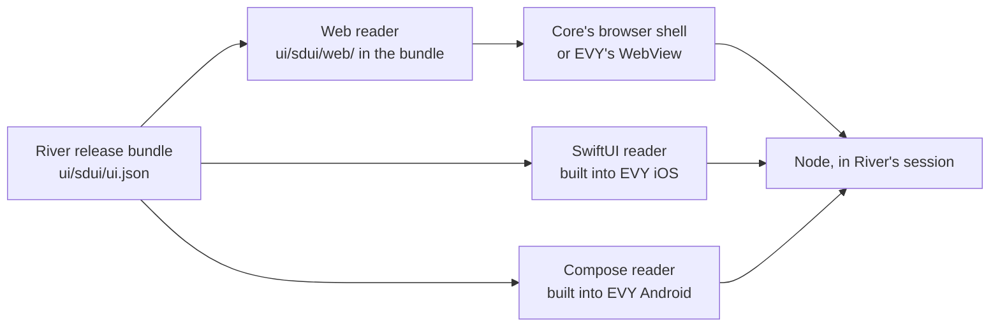

# 4.2 SDUI readers

## Repositories

| Repository | Role | Work in this plan |
| --- | --- | --- |
| [freenet-sdui](https://github.com/EVY-Platform/freenet-sdui) | Modified | Web, SwiftUI and Compose readers |
| [evy](https://github.com/EVY-Platform/evy) | Modified | iOS and Android native readers |
| [freenet-stdlib](https://github.com/freenet/freenet-stdlib) | Used | TypeScript client SDK |
| [freenet-core](https://github.com/freenet/freenet-core) | Used | Browser shell and app sessions |
| [freenet-appkit](https://github.com/glesage/freenet-appkit) | Used | iOS and Android WebView hosts |
| [river](https://github.com/freenet/river) | Used | River screen fixtures |

## Purpose

This plan draws the screens from [4.1 SDUI format](01-format.md) in three readers. The web reader ships in each release bundle and runs in any web page. The SwiftUI reader is built into the EVY iOS app, and the Compose reader is built into the EVY Android app. Readers run no publisher code. They draw the screens in `ui/sdui/ui.json`, send each tap and input to the app's session and show what the host answers.

Alice opens "Skate club" in EVY on her iPhone, and the SwiftUI reader draws the conversation. Bob opens it in EVY on his Android phone, and the Compose reader draws the same screen. Carol opens River in her browser, and the web reader draws it from the same `ui/sdui/ui.json`. All three see Bob's "Skate session Saturday?".

## One screen, three readers

| Reader part | Web reader | SwiftUI reader in EVY iOS | Compose reader in EVY Android |
| --- | --- | --- | --- |
| Controls | Accessible HTML drawn with React | SwiftUI views, starting from EVY's [row views](https://github.com/EVY-Platform/evy/tree/dev/ios/evy/UI/Rows) | Jetpack Compose |
| Node calls | TypeScript SDK over the node's WebSocket | Swift SDK from [1.2 Embedded node and mobile SDK](../1-freenet-mobile-appkit/02-sdk.md#owned-api) | Kotlin SDK from 1.2 Embedded node and mobile SDK |
| Screen updates | Browser event loop | Main actor | Main dispatcher |
| Pages and sheets | Browser history and `<dialog>` | `NavigationStack` and `.sheet` | Navigation Compose and `ModalBottomSheet` |

The SDK hands every node callback to the platform's executor, and the reader applies each change on the UI thread. Each tap or input becomes a typed event that carries the component ID from `ui.json`. A component that fails shows its fallback from 4.1 SDUI format, and the rest of the screen keeps working.

## Web reader

- `freenet-sdui` publishes one npm package. React apps use the `FreenetWeb` component. Any other page uses the `<freenet-web src="ui/sdui/ui.json">` custom element, for example inside River's [Dioxus UI](https://github.com/freenet/river/blob/main/ui/Cargo.toml).
- The package builds to `reader.js` with its CSS, fonts and icons. It loads them by relative paths, so the same build works from `ui/sdui/web/` in any bundle.
- In a browser, the reader runs in Core's sandboxed frame, which has an opaque origin. Service workers, web storage and cookies throw there ([#4945](https://github.com/freenet/freenet-core/issues/4945), [river#219](https://github.com/freenet/river/issues/219)), so the reader uses none of them. Web storage stays with Core's shell, as in [Web storage in 2.2 Two apps on one node](../2-evy-mobile-app/02-shared-node.md#web-storage).
- The reader loads `ui/sdui/ui.json` as a subresource of the website container. Core serves subresources to the sandboxed frame with `Access-Control-Allow-Origin: *`, and fetches them on a cold cache within a time bound ([#5406](https://github.com/freenet/freenet-core/issues/5406), [#3940](https://github.com/freenet/freenet-core/issues/3940)).
- Core serves contract web files with no `Cache-Control` header, as [Installing a copy in 1.4 Application bundles](../1-freenet-mobile-appkit/04-bundles.md#installing-a-copy) notes, so an open browser can keep a superseded release. `reader.js` loads its CSS, fonts and icons under content-hashed names. It fetches `ui/sdui/ui.json` with `cache: "no-cache"`, so the browser fetches a fresh copy.
- Two open TypeScript SDK issues affect the web reader. Contracts of 20 to 50 MB time out on slow links ([freenet-stdlib#127](https://github.com/freenet/freenet-stdlib/issues/127)), and a late GET reply can reach the wrong request ([freenet-stdlib#96](https://github.com/freenet/freenet-stdlib/issues/96)).
- The reader reaches the node only through a host object that the page passes in. In a release, that host is the page's own session, which River's web code also uses in [1.3 Single-application host](../1-freenet-mobile-appkit/03-host.md#browser-and-native-hosts). A test page can pass any host with the same calls.

## Native readers in EVY

- Each reader reads `ui/sdui/ui.json` from the verified bundle. It calls the app's delegates through the Swift or Kotlin SDK, in the session EVY opened for that app in [2.2 Two apps on one node](../2-evy-mobile-app/02-shared-node.md).
- The SwiftUI reader runs on iOS 17 and later and the Compose reader on Android 9 (API 28) and later, the EVY targets in [Web storage in 2.2 Two apps on one node](../2-evy-mobile-app/02-shared-node.md#web-storage).
- EVY uses the native reader when that reader supports every component and format version the screens require. Otherwise EVY opens the bundle's `index.html` in the app's WebView, as it does for every app in milestone 2 (EVY mobile app).
- New components reach the native readers in an EVY update through the App Store and Google Play. Browsers get them when the publisher's next release carries a newer web reader.

## Showing permission results

When a screen needs a permission, the reader asks the host through the bridge or the SDK, under [Asking for a permission in 1.3 Single-application host](../1-freenet-mobile-appkit/03-host.md#asking-for-a-permission). On iOS and Android, the host prompts in its own trusted UI and returns one of the results in [Using a grant](../1-freenet-mobile-appkit/03-host.md#using-a-grant). While the prompt is open, the component that asked waits. The reader then shows the result on that component. The host asks for `notifications` at River's first run, so the Enable button in River's notification modal gets the stored answer with no new prompt.

In a browser, Core's shell answers through the [shell-bridge messages in 1.3 Single-application host](../1-freenet-mobile-appkit/03-host.md#shell-bridge-messages). For `notifications`, the shell asks the browser, keeps per-contract consent ([#4801](https://github.com/freenet/freenet-core/pull/4801)) and replies `notification_status` ([#5094](https://github.com/freenet/freenet-core/pull/5094)). River already shows each value in its modal ([river#510](https://github.com/freenet/river/issues/510), [river#542](https://github.com/freenet/river/pull/542)). The reader maps `granted` to Granted, `denied` to Denied, `dismissed` and `default` to No answer, and `undeliverable` and `unsupported` to Unavailable. Enable does nothing when the browser never settles its permission request ([#4966](https://github.com/freenet/freenet-core/issues/4966)).

| Host result | Enable button in River's [notification modal](https://github.com/freenet/river/blob/main/ui/src/components/room_list/notification_modal.rs) (`notifications`) |
| --- | --- |
| Granted | The modal says notifications are on and hides the button |
| Denied | The modal says notifications are off and names River's settings page in EVY, or the browser's site settings |
| No answer | The modal keeps the Enable button. On iOS and Android, the host asks again the next time Bob runs River |
| Unavailable | The modal says this device cannot show notifications and that unread badges still work |
| Locked | The reader clears the screen, as in the next section |
| Expired session | The reader reloads the modal in the new session and drops the tap |

Copy Link in "Invite member" asks for no permission on any host. Every host writes the link as Core's shell does, after a user tap, at most once per second and at most 2,048 characters ([#3748](https://github.com/freenet/freenet-core/pull/3748), [#4015](https://github.com/freenet/freenet-core/pull/4015)). A write without a tap, or within one second of the last write, fails. On iOS and Android, the host reports the failure, and the reader shows the link as selectable text so Alice can copy it by hand for Bob.

## Clearing private values on lock

A reader holds private values in memory only. On "Skate club" these are the decrypted messages, the text in input fields and the invite link, which carries Bob's new signing key and the room secrets ([invitation_builder.rs](https://github.com/freenet/river/blob/main/ui/src/components/members/invitation_builder.rs)). The reader leaves them out of its component error reports.

When the host reports `Locked` ([Locking and unlocking in 1.5 Identity, keys and local protection](../1-freenet-mobile-appkit/05-identity.md#locking-and-unlocking)) or ends the session, the reader drops all of these values and shows only the app's name. The web reader inside EVY's WebView clears on the same host signals. After Alice unlocks, the reader reloads the screen from the node, and her unsent draft comes back from the chat delegate's store ([Reads and local data in 1.6 Application protocols, data and operations](../1-freenet-mobile-appkit/06-data-and-operations.md#reads-and-local-data)).

## Acceptance

- In a browser, on iOS and on Android, the three readers draw River's room list, conversation, members and "Invite member" screens for "Skate club" from one `ui/sdui/ui.json`, and all three show Bob's "Skate session Saturday?".
- `<freenet-web>` draws "Invite member" inside River's Dioxus UI and `FreenetWeb` draws it inside a React test page, both in Core's browser shell and in EVY's WebView on iOS and Android. A test page draws it against a test host.
- On iOS and Android, EVY opens River's `index.html` in the WebView when the native reader lacks a component the screens require.
- On iOS and Android, reader tests show that every screen change runs on the UI thread and that a failing component shows its fallback while the rest of the screen works. The tests join the [support matrix](https://github.com/glesage/freenet-appkit/blob/main/docs/support-matrix.md) that [1.1 Mobile feasibility and supported profiles](../1-freenet-mobile-appkit/01-feasibility.md#support-matrix) published.
- In the iOS and Android readers, the notification modal shows each host result as in the table, and Enable shows the answer stored at River's first run with no new prompt. In a browser, it shows each result Core's shell returns.
- On iOS and Android, Copy Link copies the link with no prompt. A second tap within one second shows the link as selectable text.
- On iOS and Android, locking the phone clears the invite link, messages and input text from the reader's memory. After unlock the screen reloads and shows Alice's unsent draft.
