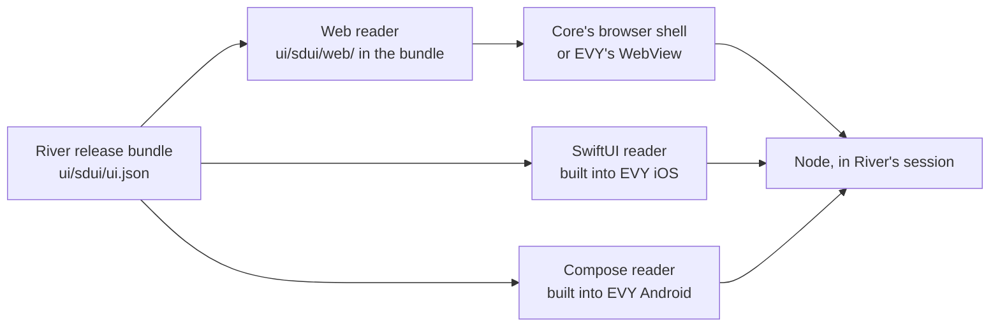

# 4.2 SDUI readers

## Repositories

| Repository | Role | Work in this plan |
| --- | --- | --- |
| `freenet-sdui` | Modified | One web reader package that exports `<freenet-web>` and `FreenetWeb`, the SwiftUI reader, the Compose reader and the reader tests |
| [evy](https://github.com/EVY-Platform/evy) | Modified | `ios/` builds in the SwiftUI reader and `android/` builds in the Compose reader. Both apps pick the native reader or the app's WebView for each release |
| [freenet-stdlib](https://github.com/freenet/freenet-stdlib) | Used | The [TypeScript SDK](https://github.com/freenet/freenet-stdlib/tree/main/typescript) (`@freenetorg/freenet-stdlib`) that the web reader calls |
| [freenet-core](https://github.com/freenet/freenet-core) | Used | Core's browser shell, app sessions in `crates/mobile` and the `Locked` state |
| `freenet-appkit` | Used | The iOS and Android WebView hosts that run the web reader inside EVY |
| [river](https://github.com/freenet/river) | Used | Room list, conversation, members and "Invite member" screens as fixtures, with the Copy Link button and the notification modal |

## Purpose

This plan draws the screens from [4.1 SDUI format](01-format.md) in three readers. The web reader ships in each release bundle and runs in any web page. The SwiftUI reader is built into the EVY iOS app, and the Compose reader is built into the EVY Android app. Readers run no publisher code. They draw the screens in `ui/sdui/ui.json`, send each tap and input to the app's session and show what the host answers.

Alice opens "Skate club" in EVY on her iPhone, and the SwiftUI reader draws the conversation. Bob opens it in EVY on his Android phone, and the Compose reader draws the same screen. Carol opens River in her browser, and the web reader draws it from the same `ui/sdui/ui.json`. All three see Bob's "Skate session Saturday?".

## One screen, three readers

| Reader part | Web reader | SwiftUI reader in EVY iOS | Compose reader in EVY Android |
| --- | --- | --- | --- |
| Controls | Accessible HTML drawn with React | SwiftUI views, starting from EVY's [row views](https://github.com/EVY-Platform/evy/tree/dev/ios/evy/UI/Rows) | Jetpack Compose |
| Node calls | TypeScript SDK over the node's WebSocket | Swift SDK from [1.2 Embedded node and mobile SDK](../1-freenet-mobile-appkit/02-sdk.md#owned-api) | Kotlin SDK from 1.2 Embedded node and mobile SDK |
| Screen updates | Browser event loop | Main actor | Main dispatcher |
| Pages and sheets | Browser history and `<dialog>` | `NavigationStack` and `.sheet` | Navigation Compose and `ModalBottomSheet` |

The SDK hands every node callback to the platform's executor, and the reader applies each change on the UI thread. Each tap or input becomes a typed event that carries the component ID from `ui.json`. A component that fails shows its fallback from 4.1 SDUI format, and the rest of the screen keeps working.

## Web reader

- `freenet-sdui` publishes one npm package. React apps use the `FreenetWeb` component. Any other page uses the `<freenet-web src="ui/sdui/ui.json">` custom element, for example inside River's [Dioxus UI](https://github.com/freenet/river/blob/main/ui/Cargo.toml).
- The package builds to `reader.js` with its CSS, fonts and icons. It loads them by relative paths, so the same build works from `ui/sdui/web/` in any bundle.
- The reader reaches the node only through a host object that the page passes in. In a release, that host is the page's own session, which River's web code also uses in [1.3 Single-application host](../1-freenet-mobile-appkit/03-host.md#browser-and-native-hosts). A test page can pass any host with the same calls.

## Native readers in EVY

- Each reader reads `ui/sdui/ui.json` from the verified bundle. It calls the app's delegates through the Swift or Kotlin SDK, in the session EVY opened for that app in [2.2 Two apps on one node](../2-evy-mobile-app/02-shared-node.md).
- EVY uses the native reader when that reader supports every component and format version the screens require. Otherwise EVY opens the bundle's `index.html` in the app's WebView, as it does for every app in milestone 2 (EVY mobile app).
- New components reach the native readers in an EVY update through the App Store and Google Play. Browsers get them when the publisher's next release carries a newer web reader.

## Showing permission results

When a screen needs a permission, the reader asks the host through the bridge or the SDK, under [Asking for a permission in 1.3 Single-application host](../1-freenet-mobile-appkit/03-host.md#asking-for-a-permission). The host prompts in its own trusted UI and returns one of the results in [Using a grant](../1-freenet-mobile-appkit/03-host.md#using-a-grant). While the prompt is open, the component that asked waits. The reader then shows the result on that component.

| Host result | Copy Link in "Invite member" (`clipboard`) | Enable button in River's [notification modal](https://github.com/freenet/river/blob/main/ui/src/components/room_list/notification_modal.rs) (`notifications`) |
| --- | --- | --- |
| Granted | The link is copied and the button reads "Copied!" | The modal says notifications are on and hides the button |
| Denied | The reader shows the link as selectable text, so Alice can copy it by hand for Bob | The modal says notifications are off and names River's settings page in EVY, or the browser's site settings |
| Unavailable | As for denied | The modal says this device cannot show notifications and that unread badges still work |
| Locked | The reader clears the screen, as in the next section | The reader clears the screen, as in the next section |
| Expired session | The reader reloads the screen in the new session and drops the tap | The reader reloads the modal in the new session and drops the tap |

## Clearing private values on lock

A reader holds private values in memory only. On "Skate club" these are the decrypted messages, the text in input fields and the invite link, which carries Bob's new signing key and the room secrets ([invitation_builder.rs](https://github.com/freenet/river/blob/main/ui/src/components/members/invitation_builder.rs)). The reader leaves them out of its component error reports.

When the host reports `Locked` ([Locking and unlocking in 1.5 Identity, keys and local protection](../1-freenet-mobile-appkit/05-identity.md#locking-and-unlocking)) or ends the session, the reader drops all of these values and shows only the app's name. The web reader inside EVY's WebView clears on the same host signals. After Alice unlocks, the reader reloads the screen from the node, and her unsent draft comes back from the chat delegate's store ([Reads and local data in 1.6 Application protocols, data and operations](../1-freenet-mobile-appkit/06-data-and-operations.md#reads-and-local-data)).

## Acceptance

- In a browser, on iOS and on Android, the three readers draw River's room list, conversation, members and "Invite member" screens for "Skate club" from one `ui/sdui/ui.json`, and all three show Bob's "Skate session Saturday?".
- `<freenet-web>` draws "Invite member" inside River's Dioxus UI and `FreenetWeb` draws it inside a React test page, both in Core's browser shell and in EVY's WebView on iOS and Android. A test page draws it against a test host.
- On iOS and Android, EVY opens River's `index.html` in the WebView when the native reader lacks a component the screens require.
- On iOS and Android, reader tests show that every screen change runs on the UI thread and that a failing component shows its fallback while the rest of the screen works. The tests join the [support matrix in 1.1 Mobile feasibility and supported profiles](../1-freenet-mobile-appkit/01-feasibility.md#support-matrix).
- In a browser and in the iOS and Android readers, Copy Link and the notification modal show each host result as in the table.
- On iOS and Android, locking the phone clears the invite link, messages and input text from the reader's memory. After unlock the screen reloads and shows Alice's unsent draft.
