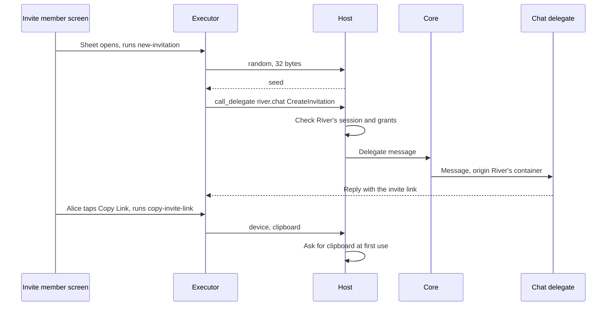

# 4.3 SDUI actions and data

## Repositories

| Repository | Role | Work in this plan |
| --- | --- | --- |
| `freenet-sdui` | Modified | The executor in the web, SwiftUI and Compose readers, its steps and limits, view states, form and draft bindings, send-state display and shared step fixtures |
| [river](https://github.com/freenet/river) | Modified | The chat delegate gains `CreateInvitation` and `PrepareMessage`. Schemas in `ui/sdui/schemas/` describe these and the existing `StoreRequest` and `GetRequest` messages |
| [freenet-core](https://github.com/freenet/freenet-core) | Used | Session and grant checks in `crates/mobile` from 1.3 Single-application host, subscription handles from 1.2 Embedded node and mobile SDK and the delegate secret store |
| `freenet-appkit` | Used | The host bridge from 1.3 Single-application host carries the web reader's delegate calls and permission requests |
| [freenet-migrate](https://github.com/freenet/freenet-migrate) | Used | River moves the chat delegate's secrets to the new delegate key |

## Purpose

This plan makes SDUI screens do work. A view reads contract state, and a form keeps a draft. An action runs a list of steps that call the app's delegate, ask for a permission or send an update. The executor that runs actions is built into the readers from [4.2 SDUI readers](02-readers.md). Actions name routes and values as [4.1 SDUI format](01-format.md) defines them.

Alice opens the "Invite member" sheet that Carol built for "Skate club". The executor gets 32 random bytes from the host and asks River's chat delegate to build an invitation. Alice taps "Copy Link" and the executor copies the link to the clipboard. Bob opens the link, joins, and sends "Skate session Saturday?" from the conversation screen. The screen shows his message as a draft until Core answers, then as sent.

## Views

A view is a named set of outputs in `ui/sdui/ui.json`. Screens read it with `view:` references. A contract view names a component alias from `app_definition.json`, such as `river.room`, and the parameters that pick one contract. For "Skate club" the parameters are `ChatRoomParametersV1 { owner }` with Alice's owner key from `param:room`. An action can also fill a view, as `new-invitation` fills `invitation` below. Each open contract view holds one subscription handle, as [Ending subscriptions in 1.2 Embedded node and mobile SDK](../1-freenet-mobile-appkit/02-sdk.md#ending-subscriptions) counts them. Closing the view releases its handle.

| View state | When | What Bob sees on the "Skate club" conversation |
| --- | --- | --- |
| `loading` | The first read is pending | The declared placeholder |
| `ready` | The node returned the room | Messages, members and the input |
| `offline` | The node has no peer | The phone's copy, with each message's arrival time as [River records it](https://github.com/freenet/river/blob/main/ui/src/components/app/receive_times.rs) |
| `missing` | The node found no room under that key | The declared empty state |
| `error` | The read or decoding failed | The typed error and a Retry button |

## Actions

An action is a named list of steps in `ui/sdui/actions/`. The executor runs the steps in order, passes each result to later steps and stops at the first error. A bundle can add actions. A new step type ships in a new reader release. The executor has no network access and never sees the keys in the delegate's store. It reaches Core only through the app's session, with the [trusted calls in 1.3 Single-application host](../1-freenet-mobile-appkit/03-host.md#trusted-calls), so screen files carry no authority of their own. The executor stops an action that goes over its step, reply size or time limit and reports which limit stopped it. Closing the screen cancels the steps still pending.

| Step | What it does | River example |
| --- | --- | --- |
| `call_delegate` | Sends one message to one of the app's delegates and returns its checked reply | `CreateInvitation` in `new-invitation` |
| `submit` | Sends signed update bytes to a contract through the host | Bob's prepared message in `send-message` |
| `random` | Returns random bytes from the host | 32 bytes for Bob's key seed |
| `time` | Returns the current time from the host | The time field of Bob's message |
| `permission` | Asks the host for a declared permission | `notifications` when Bob sends his first message |
| `device` | Uses a device feature under a declared permission | `copy-invite-link` writes `view:invitation.url` to the clipboard |

Actions add three reference prefixes to those in 4.1 SDUI format. `arg:` reads an argument, `step:` reads an earlier step's result and `host:app_url` reads the app's page URL from the host. An action's `result` fills a view, or sets a `local:` value, as `copy-invite-link` sets `local:copied`. Carol's action for the "Invite member" sheet:

```jsonc
{
  "action": "new-invitation",                         // runs when the sheet opens and on "New Invitation"
  "args": { "room": "string" },                       // base58 owner key of "Skate club", from param:room
  "steps": [                                          // the executor runs these in order
    { "id": "seed", "step": "random", "bytes": 32 },  // the host supplies Bob's key seed
    { "id": "invite", "step": "call_delegate",        // sent in River's session, so Core attests River
      "delegate": "river.chat",                       // component alias from app_definition.json
      "message": "CreateInvitation",                  // new message, schema in ui/sdui/schemas/
      "input": {                                      // the executor adds request_id
        "room_key": { "ref": "arg:room" },            // the schema decodes it to 32 bytes
        "invitee_seed": { "ref": "step:seed" },       // the delegate derives Bob's key from it
        "base_url": { "ref": "host:app_url" }         // River's page URL without its query
      } }                                             // the reply carries url, code and message
  ],
  "result": { "view": "invitation",                   // fills view:invitation.url on the sheet
              "from": { "ref": "step:invite" } }
}
```

Tests replace `random` and `time` with fixed values, as [1.6 Application protocols, data and operations](../1-freenet-mobile-appkit/06-data-and-operations.md#how-a-send-works) requires of River.

## Calling a delegate

The executor calls the app's delegate as the app. Core attests the call as `MessageOrigin::WebApp` with River's container ID, as [Calling a delegate in 1.6 Application protocols, data and operations](../1-freenet-mobile-appkit/06-data-and-operations.md#calling-a-delegate) describes. River's chat delegate [rejects calls from other delegates](https://github.com/freenet/river/blob/main/delegates/chat-delegate/src/lib.rs) and [keys its records by caller origin](https://github.com/freenet/river/blob/main/delegates/chat-delegate/src/utils.rs). The native readers in EVY on iOS and Android therefore call with the same origin as River's web UI, so the delegate finds Alice's signing key for "Skate club".



Each schema in `ui/sdui/schemas/` describes one delegate message and its reply as bytes on the wire. River's messages are CBOR, tagged by variant name, as [chat_delegate.rs](https://github.com/freenet/river/blob/main/common/src/chat_delegate.rs) notes. The executor encodes the request from the schema, adds the request ID and matches the reply by it. It checks the whole reply against the schema before a binding sees any of it. Key generation, CBOR encoding of River's own types, room-secret encryption and signing go into delegate messages, because the executor runs only generic steps. River's chat delegate gains two messages:

| Message | Input | Reply | River code it replaces |
| --- | --- | --- | --- |
| `CreateInvitation` | Room owner key, request ID, 32-byte seed, page URL | The `?invitation=` link, the portable code and the invitation message. The delegate derives Bob's key from the seed, signs his `Member` and adds the room secrets for a private room | [invitation_builder.rs](https://github.com/freenet/river/blob/main/ui/src/components/members/invitation_builder.rs) |
| `PrepareMessage` | Room owner key, request ID, text, time | The signed room update. The delegate encrypts the text with the room secret, signs it and saves the bytes with the draft before it replies | The send path in [conversation.rs](https://github.com/freenet/river/blob/main/ui/src/components/conversation.rs) |

The chat delegate has no random source ([Cargo.toml](https://github.com/freenet/river/blob/main/delegates/chat-delegate/Cargo.toml), [river#241](https://github.com/freenet/river/issues/241)), so the seed comes from the host. River's UI reads room secrets from its own room data today, so River must check that the delegate holds every room secret an invitation or message needs. The new messages change the delegate's key, so River moves its secrets with freenet-migrate, as [Delegate secret export and import in 1.7 Upgrades and migration](../1-freenet-mobile-appkit/07-migration.md#delegate-secret-export-and-import) describes.

## Permissions in actions

A `permission` or `device` step names a permission from the `permissions` field in [1.4 Application bundles](../1-freenet-mobile-appkit/04-bundles.md#the-archive-and-its-definition). The host asks and checks grants under [Asking for a permission in 1.3 Single-application host](../1-freenet-mobile-appkit/03-host.md#asking-for-a-permission). [4.2 SDUI readers](02-readers.md#showing-permission-results) sets what the screen shows. The executor acts on the result.

| Host result | What the executor does |
| --- | --- |
| Granted | Continues, and `copy-invite-link` copies the link |
| Denied or unavailable, optional permission | A `permission` step returns the result and the action continues, so Bob's send goes ahead without alerts. A `device` step stops the action and keeps earlier results |
| Denied or unavailable, required permission | Stops the action. River declares no required permissions |
| Locked or expired session | Stops the action with that result |

## Forms, drafts and send state

A form names its fields, their checks, the action that submits it and the key of its draft. Bob's message input is the form `message` with one field, `text`, checked against the room's `max_message_size` as River's [message_input.rs](https://github.com/freenet/river/blob/main/ui/src/components/conversation/message_input.rs) does. Its submit action is `send-message`. The reader saves the draft in the chat delegate's store with `StoreRequest`, where [Reads and local data in 1.6 Application protocols, data and operations](../1-freenet-mobile-appkit/06-data-and-operations.md#reads-and-local-data) places drafts. It saves on each pause, on backgrounding and when Bob leaves the screen. Each draft records its form ID and schema version. A failed save shows "Not saved" with the error, and the text stays in the input.

`send-message` runs `time`, then `call_delegate` with `PrepareMessage`, then `submit`. The reader shows the send states from [Sending updates in 1.6 Application protocols, data and operations](../1-freenet-mobile-appkit/06-data-and-operations.md#sending-updates). It disables Send while `PrepareMessage` runs, so a double tap signs one message.

| State | What Bob sees | Control |
| --- | --- | --- |
| Draft | The text in the input. "Not sent" once signed bytes are saved, including when River reopens | Send. With saved bytes, Send resends those same bytes |
| Sent | The message in the list, read from the node's copy. The reader clears the draft | None |
| Rejected | The text in the input with Core's error under it | Edit, then Send signs a new update |

## Acceptance

- In the browser and on iOS and Android, Alice's `new-invitation` and `copy-invite-link` copy a link that Bob's River accepts, and Bob joins "Skate club". Bob's "Skate session Saturday?" goes from draft to sent and appears in Alice's room state.
- `CreateInvitation` and `PrepareMessage` bytes match shared fixtures in the TypeScript executor, the Swift executor on iOS and the Kotlin executor on Android. With a fixed seed, `CreateInvitation` builds the same invitation as River's web UI.
- On iOS and Android, native reader calls reach River's chat delegate with the same origin as River's web UI and find Alice's signing key.
- Killing River on iOS and Android after `PrepareMessage` and before Core answers shows "Not sent" on reopen. Send then leaves one copy in room state, and so does a double tap.
- In the browser and on iOS and Android, a denied `clipboard` stops `copy-invite-link` and leaves the link on screen, and a denied `notifications` does not stop a send.
- A malformed delegate reply, an undeclared permission or an action over its limits stops before the next step and reports the reason.
- In the browser and on iOS and Android, the conversation view shows each of its five states from fixtures. Closing one view releases its subscription handle while other views keep theirs.
