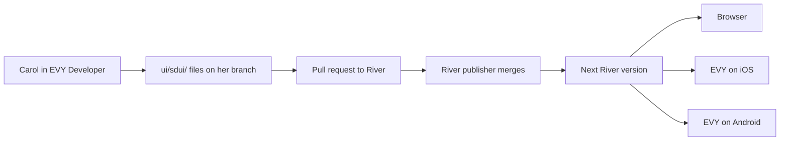

# 4.5 EVY Developer visual authoring

## Repositories

| Repository | Role | Work in this plan |
| --- | --- | --- |
| [evy](https://github.com/EVY-Platform/evy) | Modified | `web/` gains the SDUI editor beside the workspace from 3.6 EVY Developer contribution workspace. It opens an app's repository, edits screens on a canvas, previews them on a memory host, runs the SDUI checks, exports canonical `ui/sdui/` files and opens a pull request |
| `freenet-sdui` | Used | Component schemas, the web reader and the validation library |
| [river](https://github.com/freenet/river) | Used | Worked example. Carol's pull request adds the "Invite member" sheet under `ui/sdui/` |

## Purpose

This plan lets a contributor build SDUI screens by dragging components onto a canvas. The editor saves its work as the ordinary `ui/sdui/` files from [4.4 SDUI bundles and publication](04-bundles.md), and sends them to the app's repository as a pull request. Review, credit and release then follow the normal repository path in [3.6 EVY Developer contribution workspace](../3-attribution-remuneration-payment/06-developer.md) and [3.1 Contributor registration and attribution](../3-attribution-remuneration-payment/01-attribution.md).

Carol builds River's "Invite member" sheet, which River's Rust UI draws today in [invite_member_modal.rs](https://github.com/freenet/river/blob/main/ui/src/components/members/invite_member_modal.rs). The editor uses the components from [4.1 SDUI format](01-format.md), the web reader from [4.2 SDUI readers](02-readers.md) and the actions and delegate schemas from [4.3 SDUI actions and data](03-actions-and-data.md). Delegate and contract code stays in River's own code. The chat delegate's `CreateInvitation` message from 4.3 SDUI actions and data does the invite work. The sheet builds a new one-person link each time it opens and on "New Invitation", as [Purpose in 4.3 SDUI actions and data](03-actions-and-data.md#purpose) sets.

## Building the "Invite member" sheet

| Step | Carol does | The editor does |
| --- | --- | --- |
| 1. Open | Forks River on GitHub and opens her fork in EVY Developer on a new branch | Reads `ui/sdui/ui.json`, `ui/sdui/actions/` and `ui/sdui/schemas/`. Lists the chat delegate's messages, including `CreateInvitation` |
| 2. Lay out | Adds a sheet to the members screen. Drags in a heading "Invite Member", a close button, River's note "No DM yet? Share the link or code below privately, with one person only.", three read-only text fields and the buttons "Copy Link", "Copy Code", "Copy Message" and "New Invitation" | Draws each component with the web reader, so the canvas matches what a browser shows |
| 3. Bind | Points the sheet's open event and "New Invitation" at `new-invitation`. Binds the three text fields to its link, code and message results. Points "Copy Link" at `copy-invite-link`, and each other copy button at a matching copy action | Offers only result fields whose types match the text field. Adds a `device` clipboard step to each copy action |
| 4. Preview | Steps through the states in [Previewing](#previewing) | Answers the `CreateInvitation` call from a fixture |
| 5. Check | Fixes the close button, which has an icon and no `a11y_label` | Shows the finding beside the button and blocks export until it passes |
| 6. Propose | Presses "Open pull request" | Writes canonical JSON, commits to Carol's branch and opens a pull request to `freenet/river` --> Produces the pull request |

## Editing a screen

The editor reuses the [canvas](https://github.com/EVY-Platform/evy/blob/dev/web/app/components/CanvasViewport.tsx), the [component panel](https://github.com/EVY-Platform/evy/blob/dev/web/app/components/RowsPanel.tsx), the [configuration panel](https://github.com/EVY-Platform/evy/blob/dev/web/app/components/ConfigurationPanel.tsx) and the [action editor](https://github.com/EVY-Platform/evy/blob/dev/web/app/components/ActionEditor.tsx) of EVY's builder in `web/`. For a Freenet app, the repository's `ui/sdui/` files are the project. EVY's own flows stay in the EVY API.

- The component panel lists the components from 4.1 SDUI format, read from the `freenet-sdui` schemas.
- The editor builds each property field from the component's JSON Schema.
- The binding picker lists the views and action results the screen can read, with their types from `ui/sdui/schemas/`.
- The action editor lists the actions in `ui/sdui/actions/` and the steps from 4.3 SDUI actions and data. Carol builds actions from those steps.
- Adding a component fills in its required states, such as loading and error text. Undo and redo work for the whole session. The editor autosaves the draft in the browser's IndexedDB until Carol commits.
- The editor opens any valid `ui/sdui/` files, including hand-written ones. Two authors work on separate branches, and git merges their pull requests like any other file.

## Previewing

The preview runs the web reader from 4.2 SDUI readers and passes it a memory host in place of the page's session. The memory host answers delegate calls from fixture files and records each call it gets. Fixtures live in `ui/sdui-preview/`. The packaging CLI copies only `ui/sdui/` into the bundle, so the fixtures stay out of it. The editor checks every fixture value against the delegate's schema in `ui/sdui/schemas/`.

| Preview state | What Carol sees |
| --- | --- |
| Loading | "Generating invitation..." |
| Error | The error text and a "Try Again" button |
| Ready | The one-person note, the link, code and message fields and the four buttons |
| Copied | "Copied!" on the pressed button, and the other buttons reset |
| Clipboard denied | The link as selectable text, as 4.2 SDUI readers shows it |

Carol switches between browser widths and iOS and Android phone frames, light and dark themes, large text and right-to-left text. Phone frames show layout only.

## Checks

The editor runs the `freenet-sdui` validation library on every edit. The packaging CLI in 4.4 SDUI bundles and publication runs the same library, so a screen that passes in the editor passes at packaging. Errors block export. Warnings show beside the component.

| Finding | Example | Level |
| --- | --- | --- |
| Missing accessible label | The close button has an icon and no `a11y_label` | Error |
| Unbound field | The code field has no binding | Error |
| Type mismatch | The message field is bound to a result that is not text | Error |
| Unreachable screen | No route opens the sheet | Warning |
| Undeclared permission | A copy button in an app whose app definition lacks `clipboard` | Error. The editor offers to add the entry to `app_definition.json` in the same change |

## Exporting and proposing

The export writes canonical JSON with sorted keys, two-space indents and stable component IDs. The same project and the same `freenet-sdui` version always give the same bytes. Opening and exporting a project with no edits gives an empty diff, so review shows only Carol's changes.

The editor commits through the repository integration in 3.6 EVY Developer contribution workspace and opens the pull request there. Carol then signs her proposal with the EVY Developer CLI and adds its PIN to the pull request, as in 3.1 Contributor registration and attribution. She earns units like any other River contributor. River's `app_definition.json` lists the `river.member.invite` capability, as [Declaring capabilities in 3.2 Release certification](../3-attribution-remuneration-payment/02-certification.md#declaring-capabilities) sets.

## Acceptance

- Carol opens her River fork, builds the "Invite member" sheet and opens a pull request that changes only `ui/sdui/` files.
- The preview shows each state in the preview table from fixtures. A fixture value that does not match the `CreateInvitation` schema shows an error.
- The missing close-button label blocks export. The editor and the packaging CLI report the same findings for the same files.
- Exporting the same project twice gives identical bytes. Opening and exporting with no edits gives an empty diff.
- A browser crash keeps the autosaved draft, and undo and redo restore each edit.
- Playwright tests in evy `web/integration/` cover open, edit, bind, preview, check, export and pull request against a mock GitHub.
- The editor works by keyboard alone and with a browser screen reader.
- The exported sheet shows River's one-person note, and pressing "New Invitation" in the preview calls `CreateInvitation` again for a new link.
- After the River publisher releases the version with Carol's sheet, Alice opens it in "Skate club" in a browser, in EVY on iOS and in EVY on Android, copies the link, and Bob joins from it.
