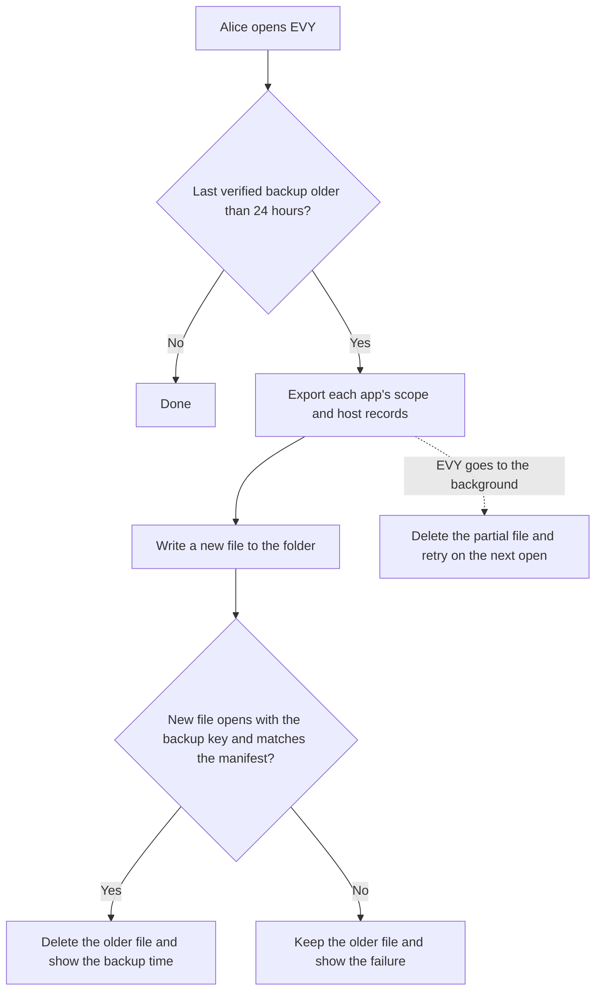

# 5.1 Automated backup

## Repositories

| Repository | Role | Work in this plan |
| --- | --- | --- |
| [freenet-core](https://github.com/freenet/freenet-core) | Modified | `crates/mobile` gains the EVY backup file with one entry per app, the stored backup key, the verified write and the restore of chosen apps |
| [evy](https://github.com/EVY-Platform/evy) | Modified | Backup page and restore screen in the iOS and Android apps, the folder picker and the daily run while EVY is open |
| [river](https://github.com/freenet/river) | Used | Export and restore fixture from 1.5 Identity, keys and local protection |
| [atlas](https://github.com/freenet/atlas) | Used | Second app in the file, with no delegate records |

## Purpose

This plan backs up every app in EVY on iOS and Android once a day, with no action from the user. It reuses the recovery code and restore flow from [1.5 Identity, keys and local protection](../1-freenet-mobile-appkit/05-identity.md#app-specific-export-and-import). Each app's records sit in its own `SecretScope::User` from [Forgetting one app in 2.2 Two apps on one node](../2-evy-mobile-app/02-shared-node.md#forgetting-one-app), and the checks listed there apply to this plan too.

Alice turns on backups once and picks a folder in iCloud Drive or Google Drive. Each day EVY writes one file with her "Skate club" keys and DMs from River, plus an entry for Atlas. If she loses her phone, she restores River on a new iPhone or Android phone with her recovery code.

## The backup key

When Alice turns on backups, EVY derives a backup key from her recovery code with Argon2id and a random salt. `crates/mobile` stores it like the [node encryption key](../1-freenet-mobile-appkit/05-identity.md#node-encryption-key), in the iOS Keychain with `kSecAttrAccessibleWhenUnlockedThisDeviceOnly` or under an Android Keystore key with `setUnlockedDeviceRequired(true)`. The daily run uses this key, so Alice never types her code for it.

An attacker with the locked phone reads nothing. With the unlocked phone, they can use every app as Alice would, which the node encryption key already allows. Code running inside EVY can also read the backup key and open the file in the folder, which may hold DMs Alice deleted since that day. Nobody learns the recovery code from the phone. EVY asks for the phone passcode before it changes the folder or turns backups off.

## The backup file

```text
EVY backup file
├── Header: format version and Argon2id salt
└── Encrypted with the backup key
    ├── Manifest: backup time, and each app's container key, version and coverage report
    ├── River: Core's FNSX bundle of River's secret scope, and River's host records
    └── Atlas: no records, because Atlas has no delegate
```

`crates/mobile` builds each app's bundle with Core's [`export_user_secrets`](https://github.com/freenet/freenet-core/blob/main/crates/core/src/contract/executor/runtime/delegates.rs), which exports one secret scope while the node runs ([FNSX format](https://github.com/freenet/freenet-core/blob/main/docs/secrets-at-rest.md#export--import-a-portable-secrets-bundle-4035-p3-of-4381)). Alice picks the folder with the iOS document picker, kept as a security-scoped bookmark, or the Android Storage Access Framework, kept as a persistable URI permission. The OS file provider uploads the file, outside the node and the caps in [1.8 Thin-peer role and cellular data budgets](../1-freenet-mobile-appkit/08-thin-peer.md).

## Running a backup

EVY runs Core only in the [foreground](../1-freenet-mobile-appkit/01-feasibility.md#foreground-lifecycle), so the backup runs while Alice has EVY open, or when she taps "Back up now".



## Restoring on a new phone

Alice installs EVY on a new iPhone or Android phone, picks the file and types her recovery code. EVY lists the apps in the manifest and she picks River. `crates/mobile` creates River's new secret scope and imports River's bundle into it with Core's `import_secrets`. River then runs steps 4 and 5 of the [restore in 1.5 Identity, keys and local protection](../1-freenet-mobile-appkit/05-identity.md#restore). EVY derives the backup key again from the code she typed and stores it.

## Acceptance

- On iOS and Android, opening EVY more than 24 hours after the last backup writes a new file without asking for the recovery code.
- On iOS and Android, one file holds entries for River and Atlas. A fresh phone restores Alice's "Skate club" keys and DMs from it, and an app she leaves out opens with no restored records.
- On iOS and Android, backgrounding EVY during an export, a full folder, a removed folder and a damaged new file each keep the last verified file. The Backup page shows the failure until a new file verifies.
- On iOS and Android, the backup key is readable only while the phone is unlocked and stays out of device backups. A folder change asks for the phone passcode.
- On iOS and Android, a backup from an older River version restores, and River migrates on first start as in [1.7 Upgrades and migration](../1-freenet-mobile-appkit/07-migration.md#delegate-secret-export-and-import).
